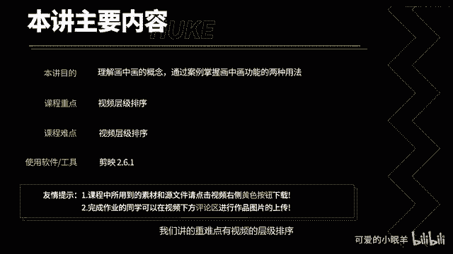
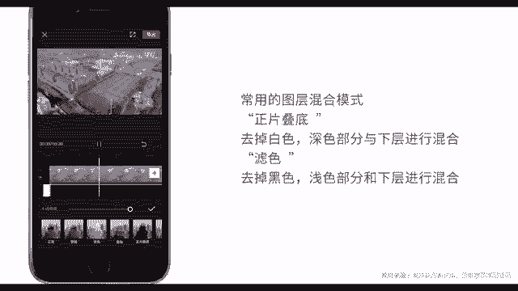

# 剪映教程 从零开始学剪辑教程手机版（适合零基础小白学习）剪映新手剪辑！（2024全套新手入门实用版） - P20：8.画中画功能 - 视频号运营新手 - BV1jK22YEE8y

本讲你将知道什么是画中画。通过两个案例，你会掌握画中画常见的两种用法。本讲的重难点有视频的层级排序，接下来就开始本讲内容。

打开剪映。点击开始创作。导入素材。进入视频编辑界面以后，点击画中画，点击新增画中画。就可在主轨道下方添加视频或者图片。画中画的素材可以在预览窗口任意的缩放。和移动。检验最多支识6个画中画。

分别位于不同轨道上。现在我们添加第二个画中画素材。将它移动到右边。当有多个画中化素材时，后添加的画中化素材层级高，在重叠区域层级高的素材会将低层级的素材覆盖。点击层级。可以更改画中画素材的层结。

点击确定退出。点击切主轨，可以将画中画素材移动到主轨上面。同样你可以将主轨上的素材移动到画中画轨道上面。点击切换成画。好了，关于画中画功能，我们就讲这么多。现在我们来完成一个三分屏案例。点击开始创作。

导入一个素材。点击比例。设置为16比9。点击返回。点击画中画。以及新增画中画。点击添加到项目。同理再添加一个画中画。然后移动画中化素材，让三个视频素材在屏幕上各占3分之1，移动完成后点击预览播放。

🎼再不用。一个简单的三分屏视频就制作好了。之前给大家留过一个关于图层混合模式的作业，不知道大家做了没有。现在我们利用画中化功能，把那个图层混合作业也做一下。退出点击开始创作。导入素材。点击画中画。

点击新增画中画，点击素材库。找到光斑素材。点击添加到项目，将光斑素材放大。点击混合模式。点击绿色。然后就将黑色去除先预览一下。

就会发现光斑出现到我们的视频上方。