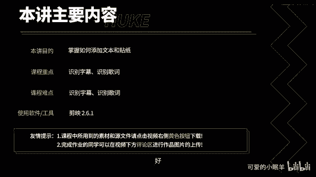
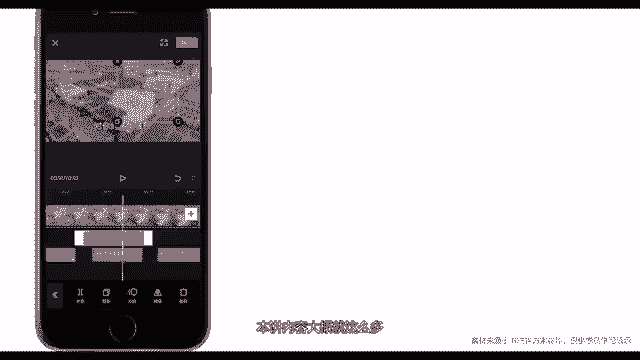

# 剪映教程 从零开始学剪辑教程手机版（适合零基础小白学习）剪映新手剪辑！（2024全套新手入门实用版） - P21：9.如何添加文本和贴纸 - 视频号运营新手 - BV1jK22YEE8y

通过本讲内容，你将学会如何添加文本和贴纸，其中，识别字幕和识别歌词是本讲内容的重难点。

好，现在开始颁讲内容。打开剪映。点击开始创作，导入素材，点击添加到项目，点击文本在文本这里有4个功能，新建文本，识别字幕，识别歌词和添加贴纸，其中添加贴纸和一级工具栏上面的贴纸其实是同一个功能。

点击新建门等。输入文本。点击样式可以对文种样式进行设置，点击这里可以更换字体，点击这里可以快速的使用检验提供的一些文字样式。在这个区域，你可以对文本进行个性化设置。你可以设置文本颜色，描边颜色。

标签颜色。阴影颜色字间距。以及文本对齐方式点击花字可以将文字设置为综艺花字效果，简验提供了很多花字样式。点击气泡可以设置气泡文字，点击动画可以为文本添加动画效果。拖动下方的小箭头可以设置动画的持续长度。

点击确定返回。除了文本样式，你还可以在这里设置文本朗读。文字识别需要一些时间。现在识别结束，点击预览，在预览之前将视频原声关掉。野进预览大家好，欢迎大家。我感觉这个效果还是可以的。好了。

新建文的功能已经介绍完毕，接下来介绍识别字幕和识别歌词。从本质上讲，这两个功能其实是一个功能，就是识别语音的功能。下来我们来演示如何识别歌词，点击返回，点击音频，点击音乐，选择一首中文音乐。点击返回。

点击文本，点击识别歌词，点击开始识别。🎼因为是在线识别，所以说需要一点点时间识别成功。点击预览看一下识别效果。大家好，欢迎大家。🎼你最贴切。🎼拿什么跟你做比较才算特别。我感觉识别效果还是非常不错的。

选中歌词，你可以在预览区域拖动歌词，更改它的位置，也可以双指分开更改它的大小。同样在工具栏你可以设置文本动画。这里有卡拉OK动画，点击卡拉OK点击确定。然后再预览一下。🎼拿什么跟你做比较才算特别。

就这样一个卡拉OK效果也制作好了。下面我们来介绍如何添加贴纸，点击贴加贴纸，检验提供了非常非常多的贴纸。选中贴纸即可添加。🎼将贴纸移动到合适位置，点击确定预览一下嗯。🎼对你的感觉强烈。😔，选中贴纸后。

同样你可以对它进行分割和复制，也可以设置动画，点击动画，可以看到检验对贴纸也内置了丰富的动画。同类移动小接头可以更改它的动画持续时间。点击确定返回，点击镜像，可以将贴纸设置为镜像模式。好了。

本讲内容大概就这么多。

