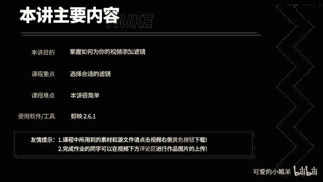
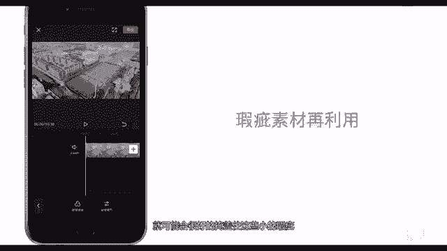

# 剪映教程 从零开始学剪辑教程手机版（适合零基础小白学习）剪映新手剪辑！（2024全套新手入门实用版） - P22：10.如何添加滤镜 - 视频号运营新手 - BV1jK22YEE8y

作鹏讲，你将学会如何添加滤镜，滤镜的出现降低了小白拍摄照片和视频的门槛，会为你的作品带来一种脱离现实的美感。一个视频添加不同的滤镜，可能产生不同的视频效果。

现在我给大家演示如何添加滤镜。打开剪映。点击开始创作导入素材。点击工具栏中的滤镜。简验提供了很多滤镜，大家可以选择适合自己视频风格和内容主题的滤镜。雪中滤镜在这里滑动，可以控制滤镜的强度。点击确定。

拖动滤镜的两端可以调整应用滤镜的范围。仅验知持，同时添加多个滤镜，点击空白处，点击新增滤镜。点击。闻香时人。设置滤镜的强度。点击确定。假如不喜欢滤镜的话，可以将滤镜血中点击删除，继续将日食滤镜血中。

然后点击删除。添加滤镜很简单啊，那么什么时候适合添加滤镜呢？视频制作者们经常会在以下两种情形使用滤镜。第一，回忆片段。通过给回忆内容的视频素材添加滤镜，能很好的和其他视频素材区别开来。第二。

存在瑕疵的视频素材。假如你的视频存在一些瑕疵，那么添加一个滤镜，就可能会很好的掩盖住这些小的瑕疵。好了，本节的内容就到此结束。

