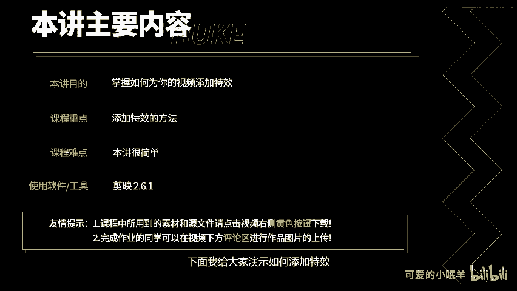
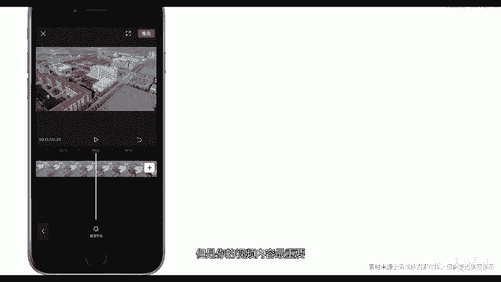

# 剪映教程 从零开始学剪辑教程手机版（适合零基础小白学习）剪映新手剪辑！（2024全套新手入门实用版） - P23：11.如何添加视频特效 - 视频号运营新手 - BV1jK22YEE8y

通过本讲，你将学会如何添加特效特效库的出现，让小白也能轻松的做出各种炫酷的视频效果。下面我给大家演示如何添加特效。

点击检验。点击开始创作，导入素材，点击添加到项目。点击特效。仅因内置了丰富的特效，在基础分类里面有开幕、闭幕以及一些电影画幅等效果，被广泛应用于视频的开头和结尾。梦幻里面有一些非常梦幻的效果。

适合一些小女生使用，动感里面的效果也看起来也非常嗨。复古里面有很多老店式风格的特效。漫画里面有一些漫画窗歌和MG动画特效。分屏里面的特效让你可以快速制作三分屏、四分屏。俩瓶6瓶、9瓶、9瓶跑马灯等效果。

自然里面有一些大自然的效果。边框里面有很多网红视频边框，我个人也经常使用点击对号即可添加特效。我们在这里尝试添加第二个特效，会发现它提示当前位置已有特效。所以说剪映在同一时间点仅支持一个特效。

选中特效拖动特效两侧，可以更改特效的持续时间。点击删除可以删除特效，特效的出现，降低了大众制作视频的门槛。但是，特效视频的海量涌现，也让大众对很多视频特效产生了审美疲劳。

所以说任何脱离视频内容的特效都是耍流氓。虽然特效很炫酷，但是你的视频内容最重要。

