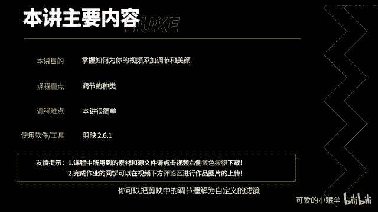
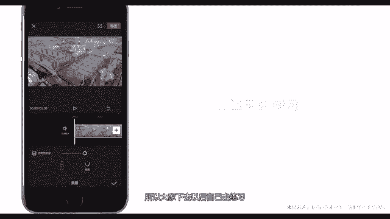

# 剪映教程 从零开始学剪辑教程手机版（适合零基础小白学习）剪映新手剪辑！（2024全套新手入门实用版） - P24：12.如何添加视频调节美颜 - 视频号运营新手 - BV1jK22YEE8y

不门讲，你将学会如何为视频添加调节和美颜，你可以把剪映中的调节理解为自定义的滤镜，也可以理解为视频调色。好的调色应该符合视频主题，不夸张，不血迹，恰到好处才行。

下面给大家演示如何添加调节。打开剪映，点击开始创作，选择素材，点击添加到项目，在一级工具栏中点击调节。点击二级工具栏中的任意一个选项，调节层就出现在视频下方。拖动这里可以调节视频的对比度。

对比度调整完成以后，你可以继续点击其他选项进行调节。全部参数调节完成以后，点击对号即可保存退出和滤镜相同，检验知识同时添加多个调节层，点击空白处，点击新增调节。雪中调节层可以点击删除。

想要完成一个好的视频调色，只能多学习，多练习。下面我给大家演示如何为视频添加美颜，选中视频。点击美颜。检验知识，两种美颜方式，磨皮和瘦脸，拖动小球可以调节美颜强度。因为我的视频素材里面没有人物。

所以大家下去以后自己去练习。好了，本讲内容就到这里。

