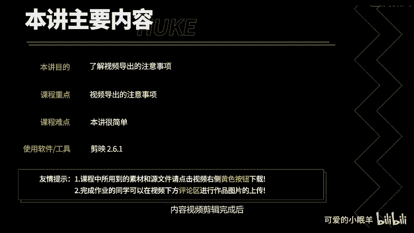
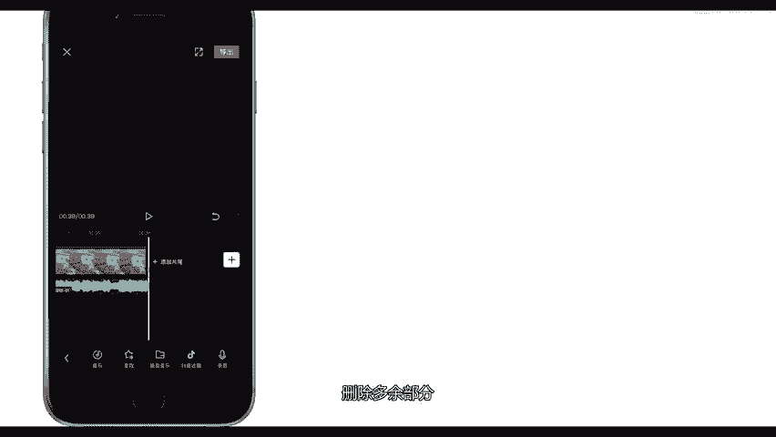

# 剪映教程 从零开始学剪辑教程手机版（适合零基础小白学习）剪映新手剪辑！（2024全套新手入门实用版） - P25：13.视频导出 - 视频号运营新手 - BV1jK22YEE8y

本讲你将了解视频导出的注意事项，下面开始本讲内容。

视频剪辑完成后，点击导出即可导出视频。导出过程中不可以锁屏或者切换程序。导出完成后，你可以选择是否一键分享到抖音，或者点击完成并保存草稿，结束本次剪辑。假如导出的视频存在清晰度低，有水印，有偏尾的情况。

你需要点击设置，检查项目设置是否正确。点击退出。假如你导出的视频后半段是黑屏，那么你需要检查主轨道下方的其他轨道是否过长，剪辑掉多余部分就可以了。雪中音频点击分割。删除多余部分。好了。

本讲内容就到此结束。

