# 剪映教程 从零开始学剪辑教程手机版（适合零基础小白学习）剪映新手剪辑！（2024全套新手入门实用版） - P3：1.剪映界面 - 视频号运营新手 - BV1jK22YEE8y

界面打开我们的剪映啊，在手机上我们可以在客户端里面都可以下载啊。剪映是这样的啊，简简单打开剪映，然后。

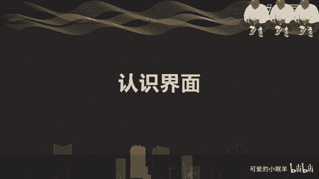

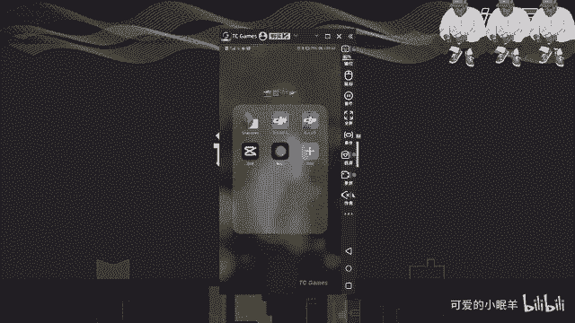

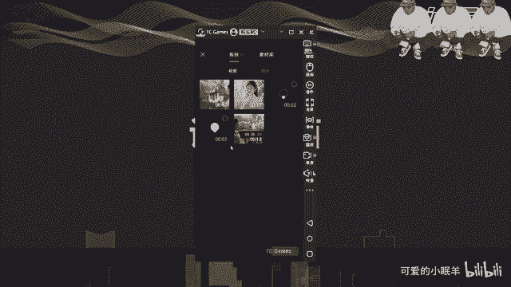

插入一个素材对吧？视频也行，这里是视频也可以加入图片啊，你拍摄的图片都是OK的啊。在我们我这个文件夹里面没有图片啊，只有视频啊，这里有添加，对吧？添加进去你会发现我们的整个界面是这样的对吧？

这是预览框啊，我们视频的预览框在这里下面这一块是我们的时间啊，前面是我们这个这条竖杠啊，这条竖杠就是我们的一个。

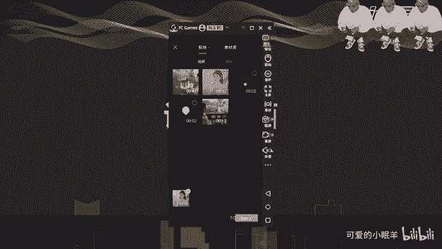

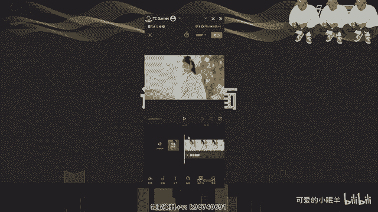

时间轴啊，前面这段时间是我们时间轴现在所在的时间，然后后面这段时间是我们整个素材啊，就是我们拍摄的这个视频的一个完整时间啊，17秒，这是然后这里是预览。

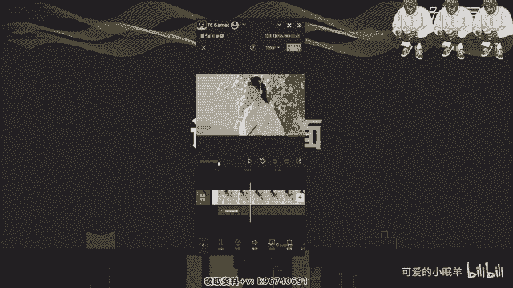

啊，暂停，然后这个是加关键帧啊，一个按钮在这里。

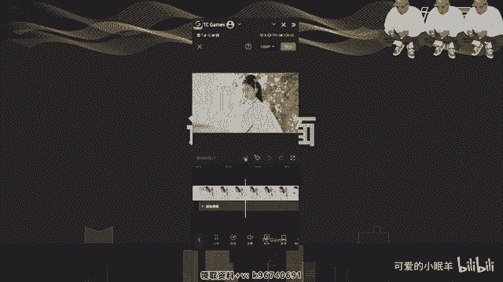

嗯，不做多介绍了啊，我们后期会详细讲解这个关键帧。然后这里如果我们做了操作以后，想返回可以撤回，对吧？然后撤回了以后又后悔了，可以恢复啊，然后这个是全屏去预览啊啊退出okK啊，这样的一个过程。

然后下面这是我们的时间线啊，时间线。

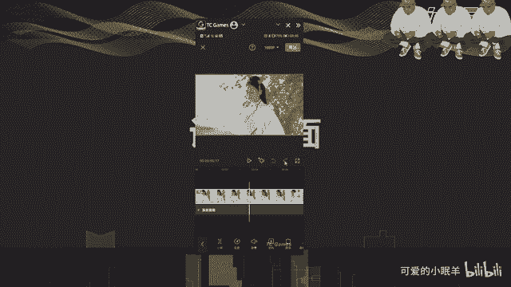

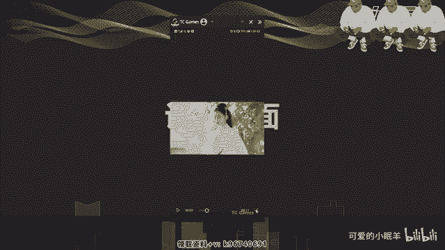

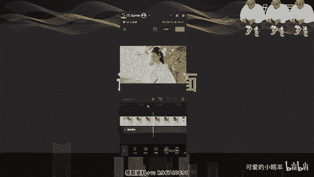

可以看到在这里面啊，这是我们的一个素材的轨道啊，这叫轨道。素材的轨道，下面是添加音频轨道，对吧？啊，再再往下是我们的这个菜单栏啊，这是一级菜单，就是在没有选择任何情况下，这是一级菜单。

然后点一下我们的选择视频，这是进入二级菜单，就是针对于视频的编辑的一个二级菜单，下面看到了吗？啊，这是二级菜单，然后。

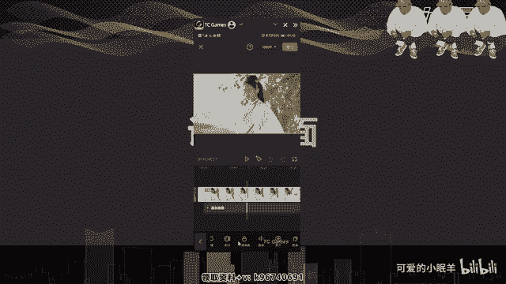

也添加音频，这是进入第二级菜单，看到吗？啊，进入了二级菜单，就是添加音频录音啊，声音、提取音乐这块啊，然后。点击一下文字，进入也是二级菜单，这就是一级菜单，二级菜单，对吧？

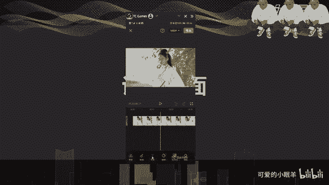

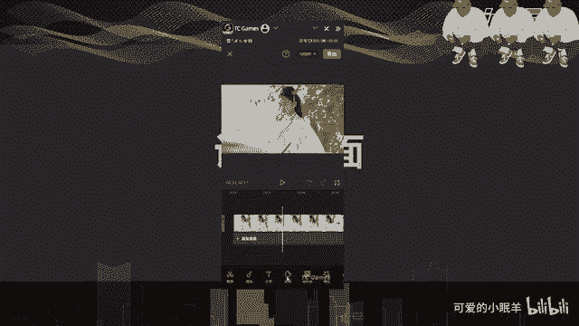

贴纸啊进入了一个贴纸的二级菜单里面，可以在这里面选择需要的贴纸啊，贴纸动画。

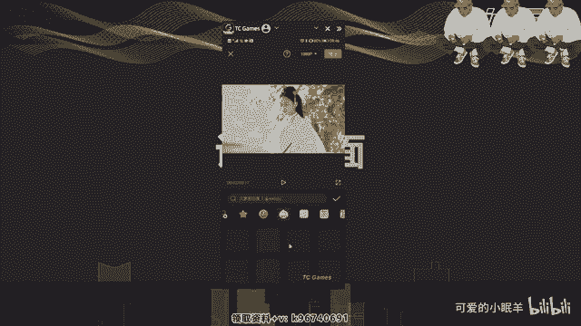

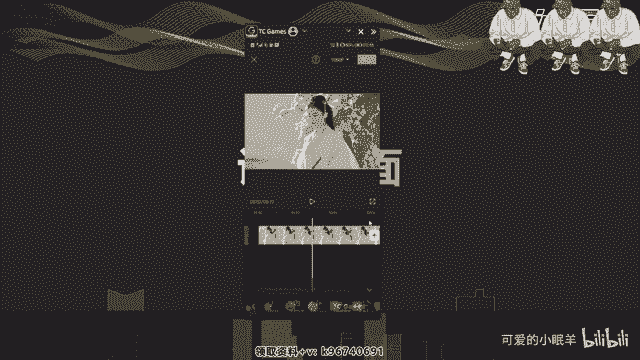

来，推出二级菜单，然后再看一下画中画啊，是我们的一个。

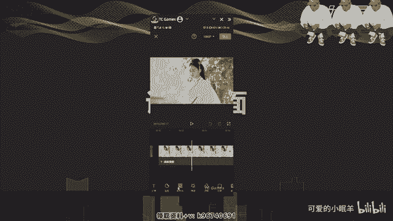

新添加一个相应的视频的一个功能。

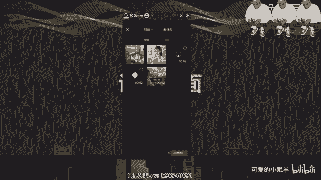

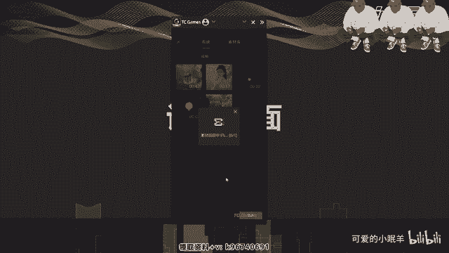

啊，这个稍微有点长，就压缩的有点慢一些啊，这是看我们手机的。

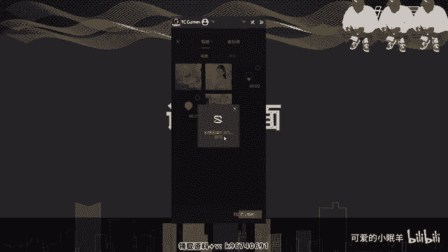

程度了添加进来了啊，也就是说我们在我们的画面的上面又加了一个新的画面，看了吗？对吧？啊，这就是我们的画中画啊。

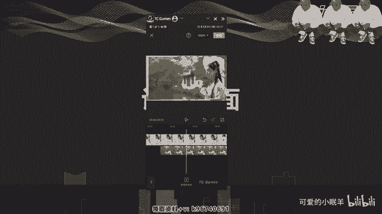

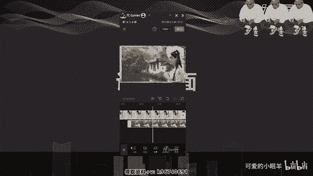

啊。然后下面就是特效滤镜比例背景，然后我们会详细的去介绍。当我们画做完了以后，我们就会发现我们上面啊有一个红色的导出，就是我们制作完成以后导出啊，就用这个。然后呢，在这里有1个1080P看了吗？

这是我们设置我们的清晰度。

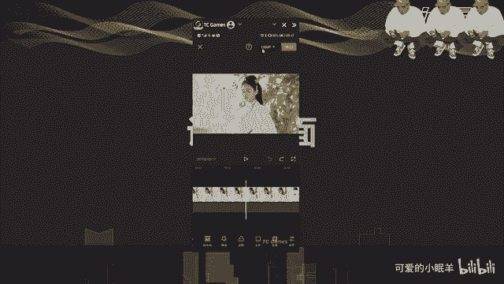

🤧Yeah。我们视频的一个分辨率对吧？有480P啊，480P720P啊，1080P对吧？只是越往这边数值越大啊，我们的清晰度就越好看到吗？啊，清晰度小对吧？这样的。还有帧数啊。

帧率24帧、25帧、30帧、60帧啊，50帧、60帧。嗯。默认30帧啊，因为我们的。很多自媒体平台基本上都现在都是默认30帧啊。当然有一些像百度系的，他们还是默认25帧的啊，然后就可以去设置这一块。

这是我们的一个界面设置。

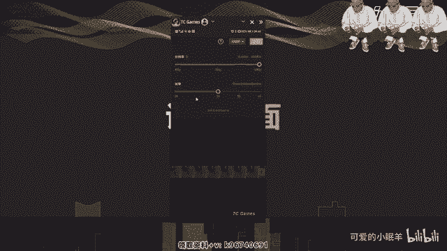

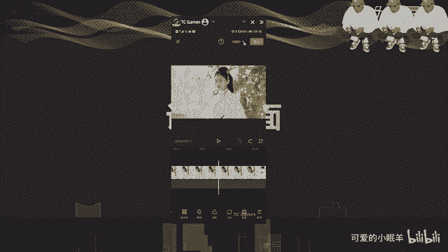

啊，界面的一个。

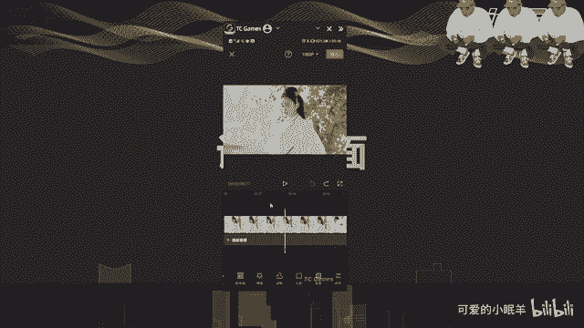

简单的介绍啊。