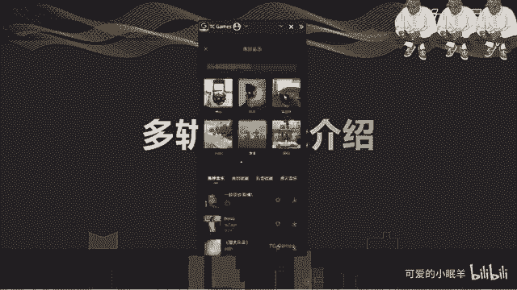
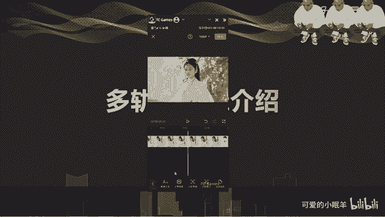
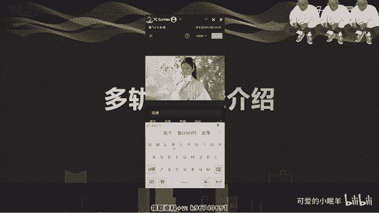
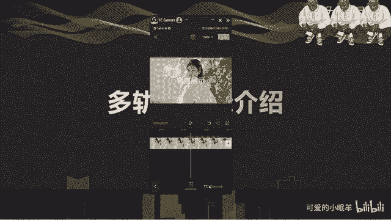
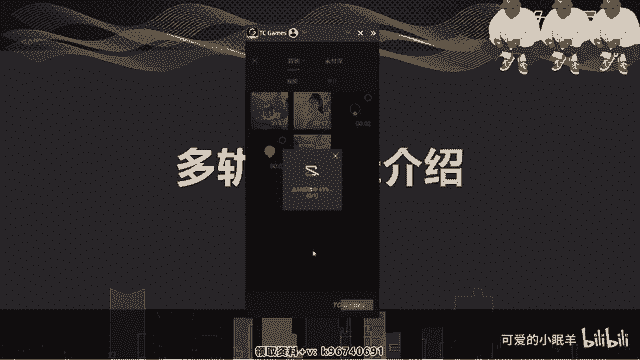
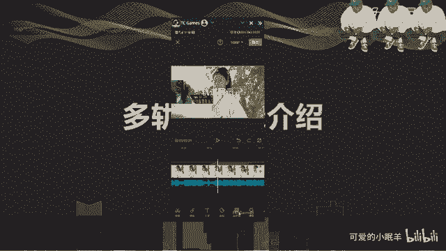
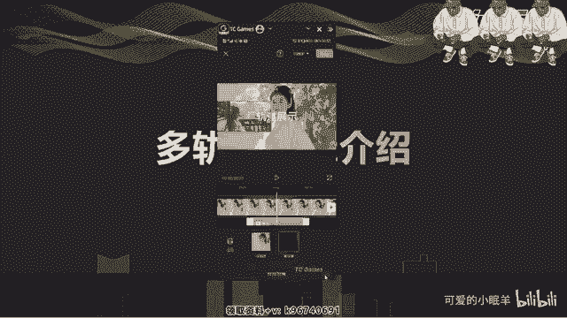
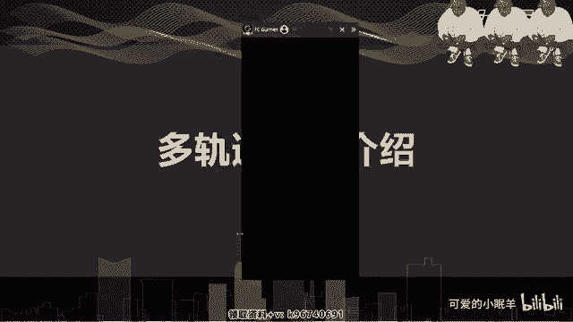
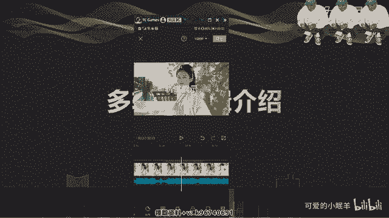
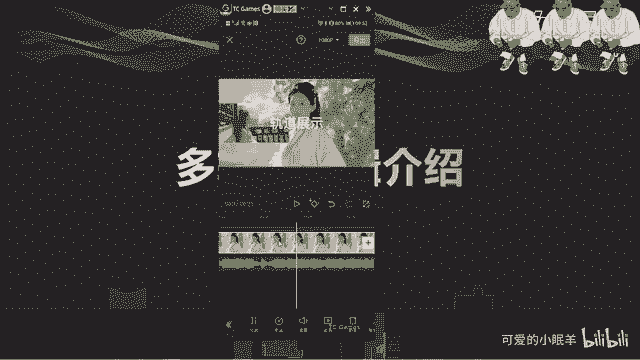

# 剪映教程 从零开始学剪辑教程手机版（适合零基础小白学习）剪映新手剪辑！（2024全套新手入门实用版） - P4：2.轨道逻辑 - 视频号运营新手 - BV1jK22YEE8y

多轨道逻辑的一个介绍啊，看一下我们。多轨道意思就是说，除了视频轨道，还有音频轨道，对吧？啊，有音频轨道，可以加一个音乐啊，添加一个音乐。

嗯，那。

随便了啊，我看。好，行，这就是我们的。音频轨道对吧？音频轨道有一个特点，就是你的时间线在哪，它就从哪开始啊啊时间线在哪就在哪开始。啊，这音频轨道，然后我们。还有文字轨道。啊。

文字轨道就是一层一层的往上加啊，文字轨道。

比如说嗯。

嗯。O啊。这加上一个文字轨道，对吧？然后再后面还可以再加一个。贴纸轨道啊贴纸轨道就加一个漫画，小小动画对吧？确定这是音频。

啊，长按就可以拖动它啊，长按住它就可以拖动它。嗯，然后呢。还可以加画中画轨道，就是我们新建一个新的一个视频轨道。

在我们的视频上方再加上一个视频，就是两个视频。有时候我们会比如说介绍东西啊啊，就会出现这样的一个情况，对吧？啊，需要两个画面。

然后放大缩小这里面啊我们可以简单的说一下，两只手指摁着。放大缩小啊。然后拖拖动就是方向位置的拖动，对吧？这是然后。再一再一个就是特效轨道啊特效轨道。

画面特效。可以随便加一个。う。随便加一个吧啊。🎼啊，都是需要下载下来才能下啊，然后你可以点击一下，就是做你的强度啊啊一个设定，对吧？来。确电影啊，你看。曝光这是一个曝光的。轨道啊。

在这里面如果你有双画中画的话，你可以做一些呃。作用于哪个比较好？

好，这是我们的一个轨道。

啊，特效轨道，当然你可以不停的往上加啊，这就是我们。所有的一个。事情一个轨道对吧？一层一层的去加很简单的一些呃操作。我们。

在做的时候啊，轨道的时候还可以是。在后面就不是加轨道的事情了啊，这就是。只有这些是轨道啊，轨道的意思就是说我们的画面啊可以假设是成一一张张的纸，每一个画面都是一一层纸，这样不层不同的往上罗加啊。

叠加这些纸张，而这些纸张呢啊都是属于像玻璃一样，是透明的啊，除了我们这纸张上面的画面，对吧？就是一层一层的往上罗加啊，这就是我们的轨道的一个介绍。

