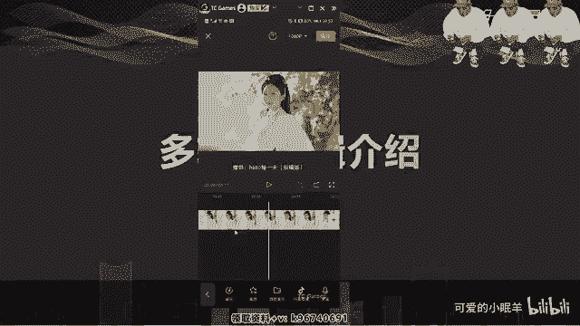
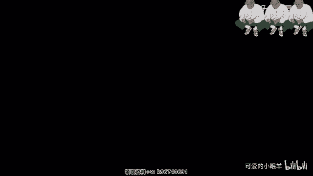
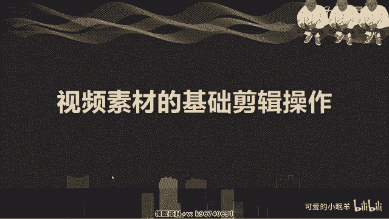

# 剪映教程 从零开始学剪辑教程手机版（适合零基础小白学习）剪映新手剪辑！（2024全套新手入门实用版） - P5：3.操作轨道 - 视频号运营新手 - BV1jK22YEE8y

手机剪辑软件简映的使用技巧。就是我们刚开始接触短视频啊，或者说我们。进入短视频啊，跨行进来以后啊，首先面临的就是一个制作问题，对吧？拍完视频以后啊，用手机也好，还是用专业设备也好啊，去拍完视频以后。

我们去做剪辑，如何去做剪辑。成了新手们的一个很大的难题啊，不知道该去如何做啊，学很多复杂的软件又时间很长，对吧呃。操作起来特别的难嗯，不太适合我们新手去做，尤其是。我们之前没有接触过这样的一些事情。

对吧？没嗯，今天就给大家介绍一款啊功能非常强大的一个手机剪辑软件，而且非常容易上手。啊。嗯在现在来说啊，很多。包括一些MCN公司啊，他们的一些剪辑，后期剪辑也是通过剪手机的剪辑软件来做的啊。

因为做用手机剪辑完以后可以快速的去上传啊，尤其是跟热点这一块，我们可以很快的去制作完成啊，加字幕啊，加特效啊，我们的这个软件啊，就非常的简单啊，基本上说大家如果要是从来没有接触过啊。

可以去简单的了解一下我们这个这节课这节课给大家带来。剪映。嗯，很容易上手，新手去。操作啊也非常的简单啊，今天我们这个课程呢嗯会详细的把整个手机剪辑软件这个操作啊，实操的一个。所有的啊技能都讲解清楚。

只要能跟得上，基本上都能学会这个剪辑软件啊，为后期学专业的剪辑软件也打下一个非常好的基础啊。因为理剪辑的整个的理论逻辑啊啊，包括操作啊，其实都是大同小异的啊，学会这个软件以后学专业性的剪辑软件的时候啊。

也比较容易上手。大家好。今天我们学习的内容是手机剪辑软件剪映的使用技巧。这一章节我们会详细的介绍啊，比较容易操作上手的手机剪辑软件啊，一个剪映。之所以去介绍剪映的使用方法。首先它是跟我们的抖音。

跟我们的呃头条。这些他们是一家母公司，都是自节跳动旗下的啊，而且剪映本身啊它也会带一些变现的能力。所以我们简单的啊去把整个的剪辑这一块去讲解一下，后期我们课程会。

简单的介绍一些它如何去变现呀这样的一些方式方法啊。那么首先我们去了解一下剪映的一个。界面打开我们的剪映啊，在手机上我们可以在客户端里面都可以下载啊。剪映是这样的啊，简简单打开剪映，然后。

插入一个素材对吧？视频也行，这里是视频也可以加入图片啊，你拍摄的图片都是OK的啊，在我们我这个文件夹里面没有图片啊，只有视频啊，这里有添加，对吧？添加进去，你会发现我们的整个界面是这样的对吧？

这是预览框啊，我们视频的预览框在这里下面这一块是我们的时间啊，前面是我们这个这条竖杠啊，这条竖杠就是我们的一个。时间轴啊，前面这段时间是我们时间轴现在所在的时间，然后后面这段时间是我们整个素材啊。

就是我们拍摄的这个视频的一个完整时间啊，17秒，这是然后这里是预览。啊，暂停，然后这个是加关键帧啊，一个按钮在这里。嗯，不做多介绍了啊，我们后期会详细讲解这个关键帧。然后这里如果我们做了操作以后。

想返回可以撤回，对吧？然后撤回了以后又后悔了，可以恢复啊，然后这个是全屏去预览啊啊退出okK啊，这样的一个过程，然后下面这是我们的时间线啊，时间线。可以看到在这里面啊，这是我们的一个素材的轨道啊。

这叫轨道。素材的轨道，下面是添加音频轨道，对吧？啊，再再往下是我们的这个菜单栏啊，这是一级菜单，就是在没有选择任何情况下，这是一级菜单。然后点一下我们的选择视频，就是进入二级菜单。

就是针对于视频的编辑的一个二级菜单，下面看到了吗？啊，这是二级菜单，然后。点添加音频，这是进入第二级菜单，看到吗？啊，进入了二级菜单，就是添加音频录音啊，声音、提取音乐这块啊，然后。点击一下文字。

进入也是二级菜单，这就是一级菜单，二级菜单，对吧？贴纸啊进入了一个贴纸的二级菜单里面，可以在这里面选择需要的贴纸啊，贴纸动画。来推出二级菜单，然后再看一下画中画啊，是我们的一个。

新添加一个相应的视频的一个功能。啊，这个稍微有点长，就压缩的有点慢一些啊，这是看我们手机的。程度了。添加进来了啊，也就是说我们在我们的画面的上面又加了一个新的画面，看了吗？对吧？啊。

这就是我们的画中画啊。好。然后下面就是特效滤镜比例背景，然后我们会详细的去介绍。当我们画做完了以后，我们就会发现我们上面啊有一个红色的导出，就是我们制作完成以后导出啊，就用这个。然后呢。

在这里有1个1080P看了吗？这是我们设置我们的清晰度。🤧嗯。我们视频的一个分辨率对吧？有480P啊，480P720P啊，1080P对吧？只是越往这边数值越大啊，我们的清晰度就越好看到吗？啊。

清晰度小对吧？这样的。还有帧数啊帧率24帧、25帧、30帧、60帧啊，50帧60帧嗯。默认30帧啊，因为我们的。很多自媒体平台基本上都现在都是默认30帧啊。当然有一些像百度系的，他们还是默认25帧的啊。

然后就可以去设置这一块，这是我们的一个界面设置。啊，界面的一个。简单的介绍，嗯，大家可以回去以后可以看一下啊。嗯，针对这个界面，我们后面会详细的讲解。嗯，界面结束以后，我们会详细讲解我们的整个。

其他的内容。下面我们了解一下多轨道逻辑的一个介绍啊，看一下我们。多轨道意思就是说，除了视频轨道，还有音频轨道，对吧？啊，有音频轨道，可以加一个音乐啊，添加一个音乐。那。随便了啊，我看。好，行。

这就是我们的。音频轨道对吧？音频轨道有一个特点，就是你的时间线在哪，它就从哪开始啊啊时间线在哪就在哪开始。啊，这音频轨道，然后我们。还有文字轨道。啊，文字轨道就是一层一层的往上加啊，文字轨道。比如说嗯。

嗯。O啊。这加上一个文字轨道，对吧？然后再后面还可以再加一个。贴纸轨道啊贴纸轨道就加一个漫画，小小动画对吧？确定这是音频。啊，长按就可以拖动它啊，长按住它就可以拖动它。嗯，然后呢。还可以加画中画轨道。

就是我们新建一个新的一个视频轨道。在我们的视频上方再加上一个视频，就是两个视频。有时候我们会比如说介绍东西啊啊，就会出现这样的一个情况，对吧？啊，需要两个画面。然后放大缩小这里面啊我们可以简单的说一下。

两只手指摁着放大缩小啊。然后拖拖动就是方向位置的拖动，对吧？这是然后。再再一个就是特效轨道啊特效轨道。画面特效。可以随便加一个。随便加一个吧啊。🎼啊，都是需要下载下来才能下啊。然后你可以点击一下。

就是做你的强度啊啊一个设定，对吧？来。确定啊，你看。曝光这是一个曝光的。轨道啊在这里面，如果你有双画妆画的话，你可以做一些呃。作用于哪个轨道上？好，这是我们的一个轨道。啊，特效轨道。

当然你可以不停的往上加啊，这就是我们。所有的一个。事情一个轨道对吧？一层一层的去加很简单的一些呃操作。我们。在做的时候啊，轨道的时候还可以是。在后面就不是加轨道的事情了啊，这就是。只有这些是轨道啊。

轨道的意思就是说我们的画面啊可以假设是成一一张张的纸，每一个画面都是一一层纸，这样不层不同的往上挪加啊，叠加这些纸张，而这些纸张呢啊都是属于像玻璃一样是透明的啊，除了我们这纸张上面的画面，对吧？

就是一层一层的往上挪加啊，这就是我们的轨道的一个介绍。啊，这是我们后期会啊用的非常多的一个。工具啊就是轨道。

我们视频素材的基础剪辑操作啊，就是我们进入素材，加入素材以后，我们会面临着很多问题。第一个就是如何分割素材。

对吧。视频的动画。怎么做定格功能啊。这个视频里面有一个定格，就是我需要把这个。😡，かり。我需我需要把这个视频上某一帧啊某一个画面。去拿出来啊，做成图片啊，照片的形式这样的一个功能。然后放大移动视频。

刚才我们简单说了一下，对吧？如何给视频静音啊，嗯如何给。视频添加转场对吧？每一个视频之间啊，视频镜头跟镜头之间。是有转场的啊，如何转场？就是我如何过渡到另外一个镜头上去啊，解决视频黑场的问题。

就是我们呃新手很多新手会发现一个问题，就是我导出了视频以后，我的视频后面啊或者前面啊有一大片的转黑场。对黑的那如何去解决。那么我们去简单的看一下我们的这个操作啊，先把我们的音乐删掉。放一边啊。

这样就可以看得清楚了，对吧？讲解的内容第一个就是如何分割素材，点一下选择我们的素材。到下面的啊文件里面。哎，二级菜单里面就会有一个分割，对吧？当我们拖动我们的视频啊，拖动我们的视频轨道的时候。

你就会发现我们的这个视时间轴对吧？也会移动。哎，当我们移动到我们想要剪辑的地方。比如说像这里啊，得慢慢的慢慢的我不想要这么长，对吧？我需要把它切开，哎，我就想要这后面这段。

然后我们就可以在这里点一下分割，然后就出看了吗？就变成两段视频了啊，我们就可以相应的把前面不想要的哎，点一下删除删除掉。对吧然后剩下的就是这一这一段啊，对吧？这就是我们的分割啊。

在这里面我们有有的同学就会呃去做一个操作啊，是这样的。啊，来我们这就是没有分割完，没有分割出来了，对吧？已经不分割了啊，也可以做一个事情就是。在两只手啊两两个手指头在我们的时间轨道上。缩放啊。

就是我们的时间轨道时间的一个缩放，看了吗？啊，缩的时候我们会是这样的对吧？越来越小，我们中间。0到10，然后放大啊，两个手指往后。扩张就会出现这样，这样会让我们更加精准的找到我们需要剪的视频的方向。

你看比如说到了帧上了，对吧？10F就是帧上了啊，我们需要非常精准的去剪辑的时候啊，就可以这样放大缩小啊，去分割。比如说我只需要剪到这个。这里对吧我们就可以。分割一下就okK了。啊，然后呢，还有一种情况。

就是我们需要到到这里以后，那么。我们。先缩放一下啊，缩缩缩ok好，到这里以后，我们可以点住这个看了吗？视频的最结尾数啊，最开头数我们也可以去唉。这样这样这样这样。去。滑动它。

这样就调整了我们的时间的时这个长度，你看到吗？啊，我们的时间轴就会显示出我们已经调整过我们的视频长度了，也相应的就是把我们不想要的一个片段去剪裁剪掉了，对吧？也okK的啊，这是两种两种方法。

一个就是我们直接用分割，对吧？直接用分割形式去剪一下，另外一种形式呢，就是我们把我们的开头啊，往后往后拉或者是我们的结尾，对吧？我们的结尾啊也可以往这拉，就调整了我们的时间，你看。对吧本来是39秒。

现在变成30秒了啊，这是我们的一个调整的方向。哎，对，比如说像这哎倒这再往这，我觉得。对吧美女的表情不太好了，啊，我也不希望看到正脸，那么我们就往后。缩短一下就OK了，对吧？这是一种情况。

然后就像我说的似的，还可以分割啊，到这里哎，低头就OK了。那么我们就可以分割一下，把我们不想要的地方选中删除就OK了啊。然后再一个视频动画怎么做啊。😊，点选中我们的视频以后，二级菜单出来以后。

你看这里有一个动画，看了吗？啊，有一个动画，然后点一下我们的动画会出来入场动画啊，出场动画组合动画啊。先说入场动画就是在我们的这一个端上啊，在我们的开头端上有这样的动画，有几个，对吧啊。有显现放大啊。

逐渐放大缩小这些啊有很多很多的动画我们可以去做做一个选择，比如说建议对吧？在后面呢，我们在上面有个进度条，可以去选择我们的时间啊，比如说你看哎这样的时间，对吧？这里会显示出我们的时间线来，看吗？

变蓝了啊。然后选择。好，那么我们看一下效果。哎，可以对吧？就这样一个呃视频动画。然后出场动画呢就是在我们的结尾处啊做一个出场动画。第一个也是一样的建议，慢慢的没有，上面也是一样，同样啊选择我们的时间。

然后你看选择上了对吧？红色了变成的嗯，我们预览下。啊，我们我的素材是没有声音的啊。😡，然后组合动画呢。看一下啊，我们看一下，直接了解一下过程来。旋转降落啊，看一下，就看第一个吧啊。

ok我们也可以控制时长，对吧？好，来。对吧。组合动画。来，我们也可以放到这里哎。动画组合动画哎。市常。嗯。可以吧？啊，实际上我们组合动画就是说是只给我们的视频加了一个比较复杂一性的动画。

就比如说像现在这种对吧？旋又带着旋转，又带着放大的这种动画啊。这是三级页面。🤧菜单上了对吧？好，这是我们的动画功能啊，怎么去做？然后下一个我们去看一下我们的定格功能啊，选择我们的视频以后。

下面有一个菜单，对吧？二级菜单看到了吗？这是两个括小括号，就是二级菜单，然后往前拖啊，然后来看一下啊，这里有很多选项，对吧？啊，我们因为。设计没有特别大，所以我们暂时先不讲解哎，来定格。

就是我们比如说哎我觉着。这美女唉，这个这个场景特别好看，我想做一个。给他拍照片的效果来点一下定格啊，就OK了啊，点一下定格。然后呢，这个定格。一点出来以后啊，就会是3秒钟啊，这里有一个小三看到吗？啊。

这里有个小三，就代表的是个3秒钟的一个动一个场景啊。L。看一下。对吧定格了是吧啊，3秒钟，然后下去继续啊，对吧？所以我们在这里就可以做一个啊给他拍照的这么一个。画面啊就O了，对不对？😊，好，那么。

做特效，一会儿我们讲啊，不着急，然后放大缩小移动啊，就是在我们的。预览上啊选择我们的视频，点一下我们的视频，哎来这里点一下视频，选上我们的视频看了吗？选上以后我们的视频就是有红色的框框住了，看了吗？啊。

同样的选择视频以后，我们的两用两个手指头放到我们的视频上去，一左一右啊，放大呢就是手指头的距离越来越大啊，缩小就是我们手指头距离越来越小，就是缩小对吧？移动就是一个手指头摁住啊，来回移就okK了啊。

想要什么样效果都可以。比如说放大以后，我想要一个啊比较好的特写的脸庞的镜头啊，这样的就OK了，对吧？那么我们的整个视频就变成了。这么大小的一个视频了，看到了吗？对不对啊，放大了。ok对吧。

我们也可以去把它选择。以后恢复它啊。来恢复的。啊，当我们跟我们的这个视频的比例相等的时候啊，比例相等的时候，我们的画面会出现这样的啊。上下左右会出现各出现一根蓝色的线，看到了吗？然后呢。

我们的手机会自动的震动一下啊，就提醒你已经放大缩小的ok了啊，距离是尺寸是没问题的啊这样的一个。效果哎。好，那么然后我们再看一下，我们这是缩小放大，对吧？然后如何给视频静音啊。

当然我们这个视频是本身是一个没有声声音的啊，没有音音频的就是说一个素材，对吧？然后呢呃简单说一下，就是第一个方法就点关闭原声，就是我们这个素材里面所有的素材啊，所有的声音这个。轨道上啊。

这个视频轨道上所有的声音都关闭了。比如像现在我们这种已经剪辑过的对吧？我只需要我只想要这一段没有声音，那么我们就可以选择我们这一段视频素材，点击下面的音量啊，把我们的音量拉到最低。

然后点确定这就是没有声音了，看到吗？这里显示没有声音了，对吧？有一个小喇叭，在这显示没有声音，然后这边哎选一下这个你看一下哎，不好意思啊，选错了啊，选选一下这个。放大一点啊放大一点好选。选下这个。

你看这里就没有说声音没有的一个功能，对吧？啊，这是两种情况啊两种情况，两种选择的方式都可以的啊都是可以的。然后。再一个就是如何给视频加转场啊，这就是我们刚刚说的这个事情了啊，我们剪辑完以后看到吗？

中间会出现一个这样的啊，这就转场啊，有这几个功能。第一个就是基础转场，就叠画闪光灯啊、泛白啊这些啊，有很多选项可以去选择相应的我们喜欢的，或者说啊镜头需要到的啊。运进转场对吧？

推拉啊这样的一个啊旋转上下上上上左上右这样的一个转场。然后特效转场对吧？光束你看哎这样的对吧？啊，分割。有很多种对吧？还有MG就是MG动画的，看有这样的对吧？

幻灯片说白了就是我们的PPT用的常用的一些呃照片，这是比较适合我们做电子相册，对吧？啊，折照转场啊，有云朵，有圆形。还有心型的，还有啊一个折纸类型的对吧？水墨啊这种一些比较好看的一些特效。

就比如说像我们这种比较像中国风的对吧？我们可以用一下水墨形式的转场啊，点击选择以后，下面还有一个时间啊，最长是1。5秒，我们可以选择一下我们啊一秒钟。那么我们看一下效果啊。啊，是吧那不太明显啊。

因为我们用的这个素材。来重新换一个素材我们。让显得。更加强烈一些，选这个。把这个素色稍微的往这拉下，来在这里选一下。转场。选遮罩转场对吧？然后选一下水墨转场。好，那么我们看一下。预览一下效果啊，如何来。

哎美女啊，然后哎对不对？有有感觉了吧，是不是有水墨这种感觉，对吧？啊，特别像特别有效果，对吧？好。这就是我们的转场啊作用。如解决视频黑场的问题啊，这里是我在经常遇到的一个问题。

就是我们呃在做的时候经常会发现哎。我的视频。导出以后有一个后面有这么一个大转场，是为什么？其实就是现在我们看到的这种效果啊，就是因为我们在其他轨道上出现了多于我们视频轨道上的时间段啊。

这样就是说我们可以去啊一种办法就是我们把时间缩回来，对吧？啊，另外一种办法呢，就是我们到时间线底部啊，去做一个分割啊。做一个分割，所有的素材都可以分割啊，都可以分割的，然后删除啊。

这样就没有问题了啊就不会出现转场了。🎼Do we go let。ありて？🎼哒ただ。对吧停了，如果要是不是这样呢，比如说啊哎。🎼选一下我们的时间线啊，来。如果要是不是这样，我们去做的时候。🎼哒哒だ。

我们的视频就不会停止，是这样的，所以就会出现一个黑场的情况啊，我们这是经常遇到的一个问题啊，大家。后期啊制作的时候一定要注意看一下我们的整体轨道是不是时间线是一致的啊，一致的才是okK的啊。好。

