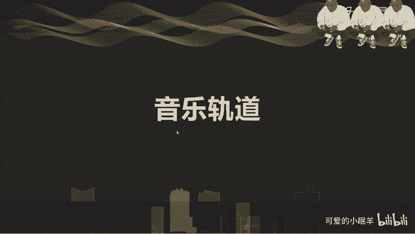
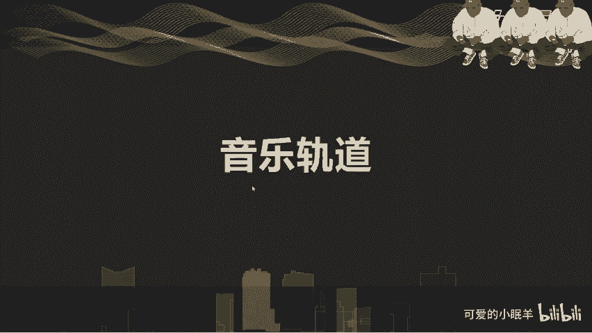

# 剪映教程 从零开始学剪辑教程手机版（适合零基础小白学习）剪映新手剪辑！（2024全套新手入门实用版） - P6：4.音频轨道 - 视频号运营新手 - BV1jK22YEE8y

刚才我看给大家看了啊，我们刚刚做了一个音乐对吧？音乐轨道好，那么我们看一下，首先第一个添加音乐，刚才大家也看基本上也看过这个过程了，对吧？嗯，了解一下，首先就是在这里面添加音乐，可以点击这个添加音乐啊。

音频也可以直接在。

第一菜单啊。低级菜单里面点择音频就可以出现这种这个了啊，二级页面里面添加一个音乐，添加音效，对吧？然后提取音乐、抖音、收藏、录音这几种功能啊。看一下啊，首先我们看一下我们这个添加音乐。来，音乐点开以后。

我们详细介绍一下音乐菜单啊，详细介绍一下音乐菜单。添加音乐里面点进去以后，其实啊在这个二级菜单里面的啊音效提取音乐音抖音收藏其实有很多就已经重合了啊来。

他们这个大菜单里面就是包括卡点音乐、抖音、纯音乐啊，vlog常用的浪漫的旅行的。然后后面有各种啊分类的，我们可以去。选择我们比较适合的对吧？这就是为我们很多说对音乐。掌握的不是特别好啊，没什么感觉的。

我们可以就比如说我们去拍了一段vlog的，就可以去选择vlog的对吧？啊，如果要是我们选择。比如说我们。啊，给我们的萌宠啊，拍了美食，对吧？美妆儿歌你看啊都有相应的。然后呢，推荐音乐就是根据我们的。

视频或者是热度，我们去给我们推荐的一部分音乐，我们也可以去选择，然后收藏这个收藏呢是我们在这里面啊经常做的事情。就比如说刚才我我。看这里是有收藏的啊，这里是指的是我们这个收藏啊。

这个收藏在我们的剪映里面收藏的一个音乐素材。然后抖音收藏需要登录我们抖音号，对吧？啊，点击登录就okK了啊，可以授权啊，在这里先就不说了，然后导入音乐导入音乐有两有三种形式，一种就是链接，对吧？

粘贴抖音或者其他平台分享来的视频音乐的一个速那个。链接就可以去直接下载下来了啊，再一个提取音乐，就是我们可以从我们的。呃，时间里面啊，视频里面去提取一些音乐啊，比如说像我们之前我提取过一些啊音效。

都不是音乐啊，然后本地音乐就找我们的本地上啊一些音乐啊，我平时是不看不听歌的，所以我的手机上没有音乐素材啊，然后我们可以自己去找我们的素材，对吧？啊，当然导入音乐的时候一定要注意一点版权啊。

共享音乐才行啊。好，再一个就添加音效。我们先添加一个音乐进去，对吧？使用就添加进去了。然后刚才说了时间轴在哪，我们的音乐开始点就在哪。所以我们在这个时候要长按住我们的音乐轨道往前拖一下啊。

让时间轴从开始就是出来。嗯，然后。在这里面我们注意一下音量，我们可以调整啊。比如说我们平时如果要是呃视频本身有音乐，有声音的话。我们。如果有声音的话，我们一般都会是20左右啊，就可以了，就够了。然后。

音量淡化啊一个入场淡化，一个出场淡化，明白吗？就是呃让它慢慢的变声音变小，慢慢的声音变大啊，淡入就是我们开头看到吗？在这里就能看得出来啊，慢慢的变声音变大。然后呢。

淡出就是我们在结尾处啊慢慢的变小声音啊慢慢的变小啊，这当然人家这个音乐本身是剪辑过的啊，有带入淡出的效果了。O。啊分割就不说了啊，然后。啊，删除就不用说了。来。啊，降噪说一下啊，降噪也说一下。

就是一般不会是给我们这个音乐进行降噪，一般都是对我们的原声进行降噪。就比如说我们出去玩，去拍vlog呀，拍探电呀，拍这日常记录的视频的时候。我们的啊采集的声音啊不是特别好，有杂声。

就是旁边有很多很嘈杂的声音啊，就可以去点击一下我们的这个降噪啊功能。当然在视频里面也有降噪啊，点一下，你看一下啊，在这里往下往下往下啊，看到吗？有降噪也有降噪OK啊，这是我们的声音音效啊，点一下。

我们可以在这里面选择综艺啊，笑声机器BGM对吧。嗯。那我们先把这个声音的音量调小一点啊，音乐音量太大。🎼小朋友。🎼在个开。🎼在雪花汪。对吧这就是这就属于音效啊。

还有比如说鼓掌啊、大笑啊啊这样的一些效果O。嗯，然后再一个。就是我们的。提取音乐刚才说过了，是通过我们选择我们的一个。音频啊导入视频的音乐看了吗？对吧啊这就是我们视频里面原来的音乐，可以只是导入音乐啊。

再一个就是抖音收藏，就通过我们抖音里面平时收藏的音乐，对吧？啊，这样的导入，然后录音这个是我们经常要用得到的啊，就比如说我们。拍完素材以后啊，需要我们解说啊，比如说。摁住2021年。

我们进行了视频剪辑软件的操作教学。好，按住了就讲完了，来看一下。摁住2021年。我们进行了视频剪辑软件的操作教学。对吧啊，这就是我们的一个。录音啊录音一样的啊，我们可以去做一些啊降噪啊。

比如说先是打开降噪开关，打开以后就会这样。鲁2021对吧？声音就变成这样了。然后再一个就是变声效果啊，这里是有一个变声，看了吗？变声它分成了大叔萝莉女生男生啊，怪物对吧？

然后我们可以去给我们的声音变一下大叔姐。21年。萝莉哦。I。嗯，女生。电 know。2021年啊，我的声音太粗了啊。鱼对吧这是我们的变声效果啊，可以去做。相应的不一样的东西啊，如何制作卡点音乐啊。

如何制作卡点音乐，我们可以。看一下。当我们去做。这个。嗯。看一下啊，我们的音乐里面先把把音量稍微调出一点来。な。这里有一个彩点看了吗？我们选择我们的。选择了我们的这个音乐以后啊，选择了我们音乐以后。

下面二级菜单里面有一个踩点，点一下踩点啊。第一第一个就是添加踩点，就是我们对这个音乐非常熟啊，可以去。给我们自己加一个点哎。有。啊，选择嗯。自己加点对吧？然后你也可以去把这些点都删除掉。当选择点的时候。

我们就可以看到啊这点变大了，可以选。删除掉，然后再一个就是自动啊自动。来。打开。确定。啊，就会出现这么多看了吗？这音乐上就有点了啊，踩节拍踩节拍一踩节拍2啊，踩节拍一。这就是。哎哎哎哎，有这些点。

做上这些点以后，就是告诉你我的音乐的节拍在这里，这也是制作卡点音乐视频的一个非常好用的一个办法啊，点击确定，然后在我们的菜上面也会有的，看到吗？最下面。我们的音频轨道下面有啊一个黄点儿，然后我们就可以。

通过我们的视频，然后把我们这个视频去。做一个。我们的动画呢把我们的动画都取消掉，因为有动画了。嗯后面有个 ok好。然后我们就可以在我们的音乐这个地方去剪辑我们的视频。到了一个点上。稍微。等我回复说一下。

峰哥。再稍微移动一下。让它跨度大一些。能看得出来也要不看不出来啊，然后在第二个点上对吧？然后分割。啊，你可以去换不同的视频啊，可以换不同的视频，不一定说非得是呃一个视频去做，就是说肯定是要很多视频的啊。

今因为我就偷点懒啊，不那么多视频去做了啊，然后。把这里再分割一下。Okay。啊，到这里对吧？然后我再加个视频吧啊，这视频还不够呢啊，再加个视频。然后在这里。到了分割这里对吧？然后分割一下啊。

我们可以我们做完以后是要有不同的素材去做的啊。比如说你去找一些照片也好啊啊，去做一些。分哥。稍微的过来OK好，这样的时候我们。把我们的转场也可以做的好一点，对吧？当然你也可以去做其他的转场，无所谓的啊。

转场这个都是你自己去喜欢的啊，这是你自己喜欢的事情。好，那么我们看一下整个的效果啊。Here we go。🎼は。🎼每一天。啊，就会有一定的会带有一定的节奏感来，让我们对不对？你看。是有节奏感的。

这样如果要是我们啊去做卡点视频的话，我们可以用这种效果去做OK啊，那么我们讲到这里以后，给大家简单的布置一个小作业啊，回去以后自己用。几个素材啊，去找一个节奏快一点的音乐啊。

一些照片也OK去制作一个啊自己的卡点视频。