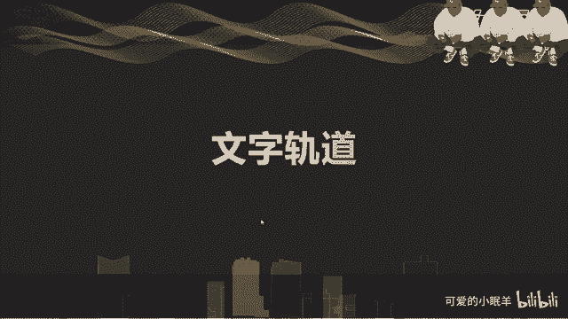
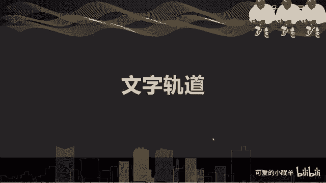

# 剪映教程 从零开始学剪辑教程手机版（适合零基础小白学习）剪映新手剪辑！（2024全套新手入门实用版） - P7：5.添加字幕轨道 - 视频号运营新手 - BV1jK22YEE8y

啊，文字轨道在我们的视频里面，文字如何加，加上文字以后有什么样的效果啊，去讲讲一下我们添加文字的一个。

操作。啊，首先第一个就是我们的识别字幕。点击打开检验。点击开始创作。嗯，然后。选择一个素材是吧？选择一个素材。我们因为我们这里面是。没有声音的啊，识别字幕是无法识别的。

所以我利用上节课我们学到的一个录音的功能啊，先去录上一段话，咱们再做。好吧，这是录音功能啊。点开录音，按住录音，对吧？松开就结束了。江南合彩莲。下。来看一下啊。江南合采莲。好嗯，然后我们。

去降一下噪对吧？有噪音，我们可以去降一下噪，就是我们上周上一节小节去学到的江南。来，把声音。说的那些前面的不需要。那么就到这里了。好。一级菜单栏，我们进入啊，这里面有一个文字，对吧？

点开这里面有新建文本，文字模板，识别字幕，识别歌词啊，添加贴纸这几项。二级菜单栏里面的几项新建文文本，就点击以后，我们这里会有一个文本可以去输入，对吧？比如说。咱们一个一个讲啊。Jianonnan。😔。

啊，烟语。老。嗯，好，就先这样。嗯，可以嗯在这里面我们可以就可以选择样式，对吧？文案的一个长相。然后有很多字体对吧？都有很多字体哎，综艺体梦想家。然后我们讲一个书写题吧。找一个书写题。哎。

这有毛毛笔体啊，这样就好看一些，是不是哎？放大缩小啊，移动哎。这是复制啊，这是关闭，这是编辑。这是我们的一个添加文本的一个方法啊，这是。添加文本啊，然后我们再看一下我们的。文字模板啊文字模板。

这就是说白了就是我们。可以去添加一个我们自己觉得啊比较ok好看的这种模板啊。把我们的文字可以去。写上。别如说美女。啊。来确定。缩小一点。不要转啊，缩小一点。哎，好。挪到一边去。嗯，好，这样就。

你当然要选择一个合适的啊，不要选择一些像我似的，一看就不太合适啊这样的一个效果。ok。好，嗯，然后我们可以去做一个事情，就是把我们的识别字幕对吧？刚才我们刚刚说了啊，要识别字幕嗯，在我们的音乐。

文字里面有一个识别字幕，对吧？点击一下，这里会出现啊，仅视频仅录音全部对吧？我们可能只有录音，那么我们就去仅录音就OK了啊，仅视频也行，就是看我们的一个情况的啊啊因为。啊，我们在自动识别字幕啊。

会选择仅视频啊，仅录音啊，全部这样的两个三全部啊这三种选择。当然嗯我们看我们的情况，视频识别视频。因为有时候我们的是需要录音的啊，当然还有音乐啊。所以我们要选择我们的一个情况。

就比如说我们音乐里面有歌词啊，就可以不用识别了，对吧？仅字幕，然后同时清空已有字幕，就是我们编辑的这些字幕都能取消掉啊。打开的话，所以一般是关着的啊，就不要让我们新建的这些文本都消失了，对吧？

所以就开始识别。看了吗？字幕识别中啊，就看我们的网速快不快了。识别失败嗯，再重新来一遍，那就再重新来一遍。识别字幕。仅录音啊，刚才我们选的好像仅视频是吧？嗯。识别成功那么？江南合彩莲对吧？

这样的一个字幕对吧？啊，就识别成功了啊，如果要是我们不想用这个字呢，我们可以点击一下编辑啊进去。去改一下我们的字嗯，改一下我们的字。嗯。比如说我刚才说的是核彩联，对吧？应该是可彩采联，对吧？嗯。

我们改一下，然后。哎，确定就OK了。然后添加文字贴纸动画啊，首先我们看一下动画啊，就是在点选择我们的轨道以后，文字轨道以后啊，我们可以去在二级菜单里面选择一个。最后拖到最后，这里有一个动画，看到吗？

有个动画。有入场的话，出场的话，循环动话就跟我们的视频动话是一样的，对不对？哎，只不可能啊这是时间啊，这是时间，这下面是时间，然后哎。这样就江南。诶，声音我的声音为什么？啊，一降噪没了可彩莲了。

那么我们就这样的话，我们可以去把我们的降噪的声音去把降噪关掉啊，把降噪关掉。啊，对吧讲讲到了观点，可能我的江南和采莲，对吧？然后。文本朗读啊功能我们要讲一下这个来进入这个。江南烟雨楼，我们就朗读这个吧。

好吧，选择上我们的字幕，下面二级菜单里面有一个文本朗读啊，点一下文本朗读说唱小哥啊，有几个啊，东北老铁对。重庆小伙啊，小新萌娃阳光男生啊，这越来越多了，以前就几个啊。重庆小火试下江南烟雨楼。嗯。小姐姐。

江南烟雨楼。东北老铁江南烟雨楼就看我们喜欢哪一个了。觉得还这个可以啊，对吧？下载中。好，就多了。来看一下啊，我们的音频里面。嗯。诶。看嗯嗯。对吧啊就出来了啊，江南烟雨楼看到吗？这里有一个标志。

写着我们有是有朗读，对吧？有音频朗读啊，我们朗读的这个功能。然后如何设置花字啊，就是刚才我们也看到了样式里面。选择我们的想要的花。做花字的一个。文本啊，然后我们点开样式，这里有个花字，对吧？

就是选择可以往下拖动，可以选择啊，这就是我们经常看到的。那些。做综艺节目里面经常出现的一些花字，就可以在这里面可以去选择啊，然后呢呃也可以选择气泡，气泡就是再做一个边框给他啊。你看比如说这样对吧？啊。

还可以做成这样的。还可以做成这样的。还可以做成这样的。这就是看我们的需求了啊。如果要是没有不需要，我们就不用选啊。好。咁么。动画刚才说了对吧？还有一个就是贴纸啊，给我们的做一个贴纸。来。我们。

文本的二级页面里面对吧？二级页面里面有一个添加贴纸，哎，点一下贴纸。有各种贴纸出来。有动画。就是就像我们刚才我用的这个哎。给美女一颗小心心。看一下嗯。啊，这是我们的一个小心心的一个动画，对吧？

一样的可以放大缩小，也可以给它添加一个动画啊，出场动画入场动画。对吧循环动画循环的话就是不停的在动，哎闪烁来看一下。快慢慢点哎别太慢，太慢，看不出效果啊。就可以了。对不对？

他就不停的在这里哎忽大忽小的闪烁，对吧？好。这是我们的一个。呃，文本的这么一个操作方法啊嗯。也没有太难的啊，主要就是看大家。喜的喜不喜欢对吧？那么。

