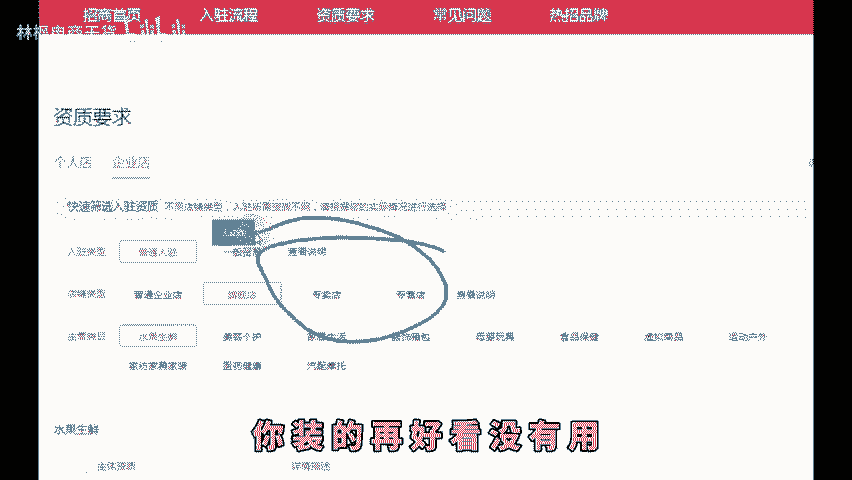
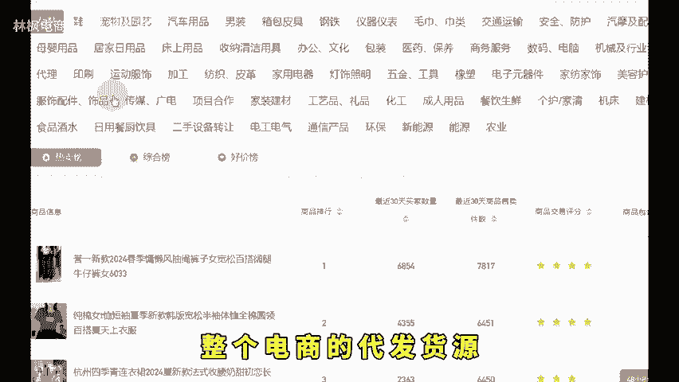
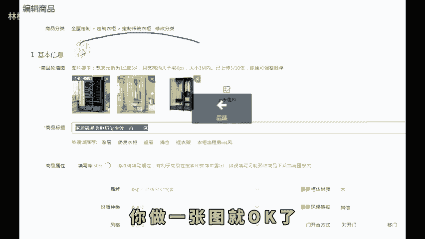
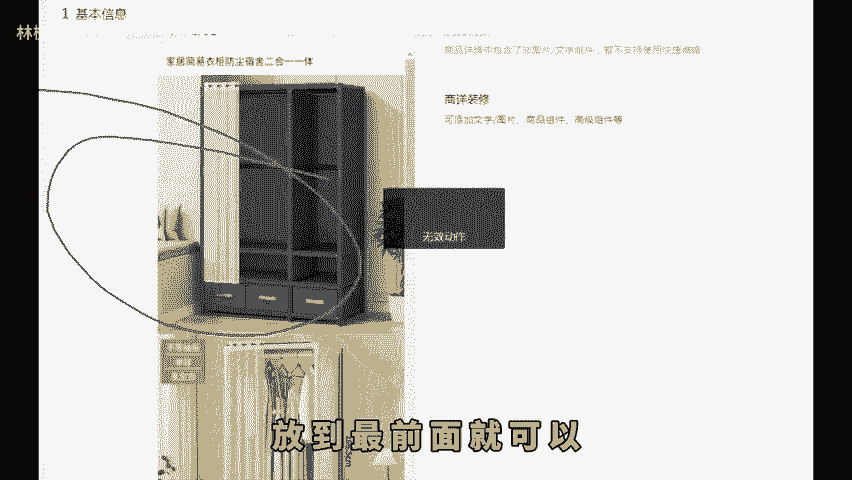
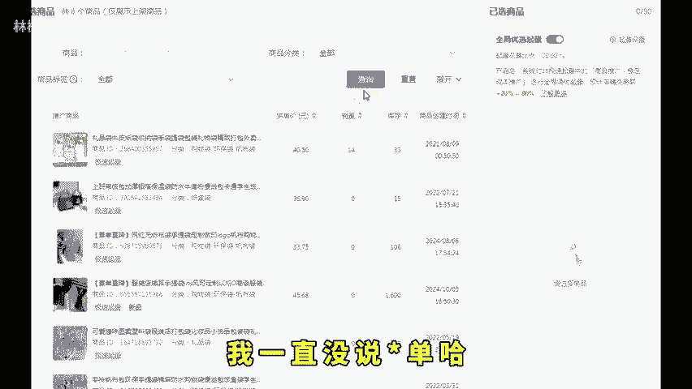
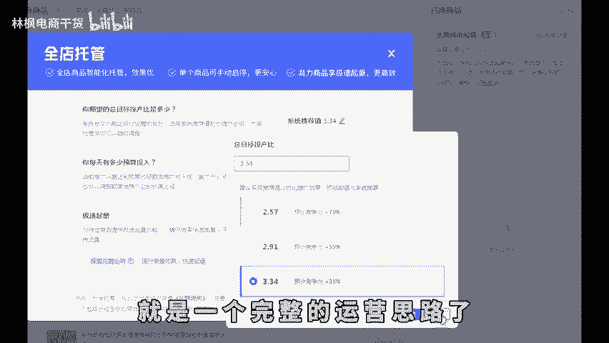
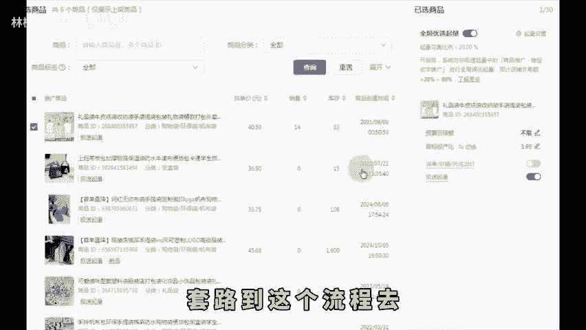

# 十月做拼多多从0开店到运营起店全流程步骤！ - P1 - 林枫电商干货 - BV1WC2uYtEf6

想开拼多多店铺，不知道如何下手的就收藏这个视频，反复观看的十0遍，那你基本就不会再迷茫。首先第一步先把店铺开起来，打开度娘搜索拼多多商家后台，点击立即注册，然后跟着操作填写资料就可以。

是个人就做个人店铺，公司就做企业店，有商标的就做旗舰店，但别听那些大师讲的什么旗舰店，有扶持啊，你是什么身份就做什么店铺，同时呢也不需要去装修店铺，这也不是线下店，你装的再好看没有用，开店这一步。

你要是都做不下来，劝你电商还是先不要做了。第二个确定卖什么产品，不要一上来就是服饰鞋包这种类目，大利润不多的，根本干不过，你要学会去看市场数据，再去筛选产品，新手要搞呢，就搞一些竞争小的产品。

第三步货源怎么找。如果你自己有工厂，有货源，有好的产品，恭喜你你卡赢了，实在没有的呢，1688去找一件代发，这里基本已经涵盖了整个电商的代发货源，或者是你有其他的一些代发网站都可以。

想找靠谱的就选发货地址，是产品产地的那些第四步规划产品怎么去卖，最简单的方式啊，就是去看同行人家的定价。

多少包装品质怎么样，是不是买一发二，有没有赠品，要么你做的比它更好，要么你就打出差异化。第五步，确定好了就上架产品。首先确认好产品所属类目，放错了，不仅限流还不精准，其次标题满60个字符。

也就是30个字，拼多多更多的还是推荐流量。所以关键词跟产品有关联就可以了。主图对标同行销量好的店铺啊，参考他们主图上的元素角度结构信息，网上找个20万的美工，你做一张图就ok了。

详情页呢把你产品最重要的一些想要展示给买家的放到最前面就可以。因为详情越往后越没人看。再者呢就是S的设置呢，还是一样参考同行定价以及低价引流的详细操作呢，可以看一下往期实操视频操作。

最后这里还有一个非常重要的商品属性。很多人他不重视产品是什么材质，就填什么材质。每品牌千万不要去瞎填，填错了官方抽检发到，你怀疑人生。而且这个东西呢我已经替你们体验过了。第六步提高产品转化率。

改销量已经是最基本的这个基本不用讲了，批发触屏，那更不用说了，这个你们自己去操作就可以了。没有。😡。

固定的数值不会的去网上找教程多的是。最难的其实就是第七步推广。这里说的推广的不是让你去朋友圈发发广告，是系统化的产品运作方案。你需要根据市场的反馈来做持续的优化的。现在拼多多权重比较高的。

基本就是开车了。我一直没说补单哈，是因为现在补单其实权重也不高活动呢小的报了没流量，大的呢你也报不上，所以直接放弃这两个选择。开车的话，直接上全店托管，绝对比你瞎开效果要好一些。

开之前用衣除以毛利率得出投产平衡点，把目标投产设置在这个之上就可以了。这个相当于平台是在帮你开搜索和场景。到这儿啊就是一个完整的运营思路了。售后客服连带销售那些我就不讲了。

你们可以把自己的店铺套路到这个流程去检索一下，哪一步有问题就优化哪里，千万不要再瞎去瞎干，听懂的抓紧时间去落地实操。如果说你不懂的，这边也整理了综合运营包。😊。

