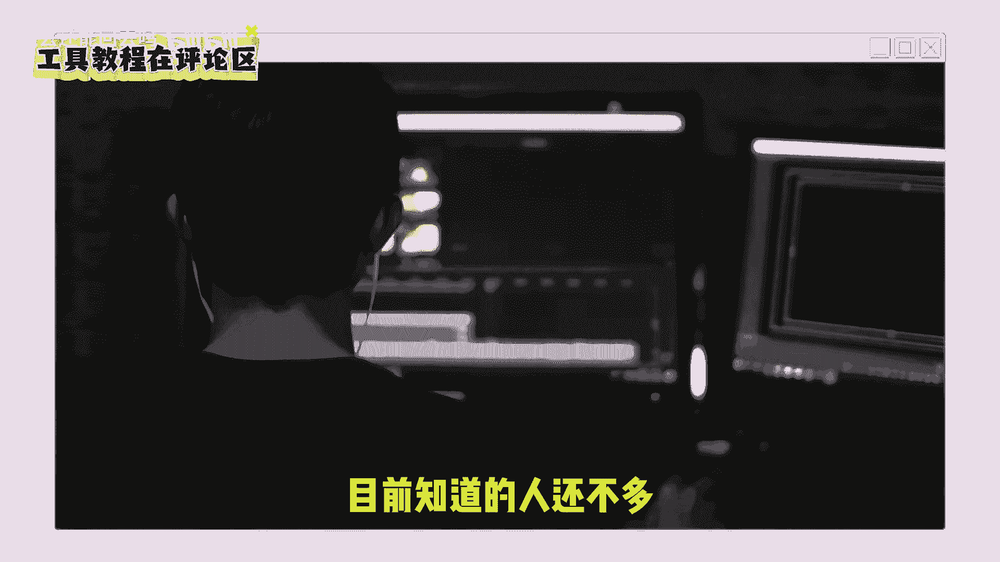
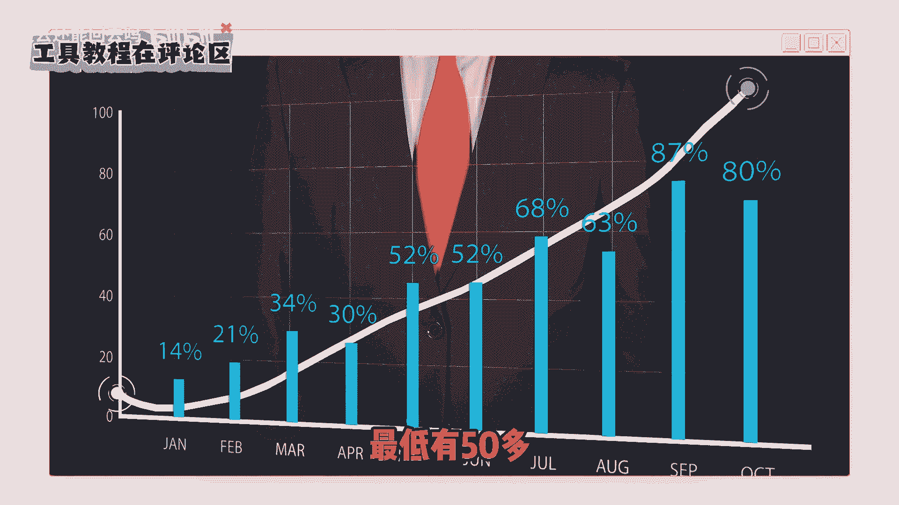
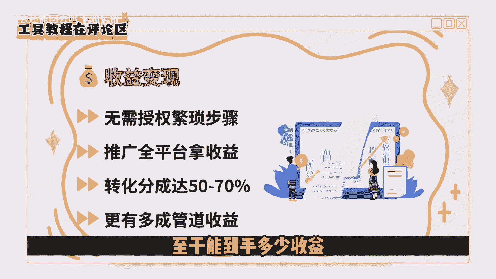

# 千万不要傻傻做短剧推广，短剧推广要变天了！0粉丝起号过程分享 - P1 - 过去还能回去吗 - BV1eT421e7CE

短剧推广又火起来了，不仅收益上涨，并且新玩法非常简单。

不需要你去精细化剪辑，也不要二创解说，目前知道的人还不多。

感兴趣的一定要抓住这波机会，短剧推广也算是个老项目，在早期参与的伙伴中。

的确有很多人赚到钱，不过随着入局的人越来越多，对短剧二创的要求也越来越高。

不再是简单的去虫解说，还要加上更多与影视解说类似的创作手法。

影视解说大家也都知道有多卷，所以呢现在再来做传统的短剧推广就特别困难，一方面剪辑跟不上，另一方面呢收益又提不起来，这个项目也就沦落成看似很香，但就是吃不到嘴里，不过今天给大家分享的玩法则完全不一样。

就比如这个4000多粉丝的账号只有13条视频，其中就有两条大爆款，而一条视频的收益就超过了五位数，我们也立即去拉了一帮伙伴测试，结果呢也出奇的好，所以我就第一时间分享给大家。

其实在年前就已经有人在操作了，加上春节期间短剧的又一次爆火，这波热度到现在依然不减，而整个新的玩法很简单，就是把近期比较火，观看人数比较多的短剧下载下来，进行二次加工，然后去重新发布。

这个并不是说让你做一条全新的短剧视频，而是在这些爆款短剧的基础上做点稍微的调整，基本上5分钟就能做出一条，发出去之后呢，依然还会有大流量，你想啊在现在短剧这么卷的情况下。

能够火起来，抛开短剧本身的内容有吸引力之外。

精细化剪辑以及有意思的解说也很关键，而我们在它基础上去做加工，那火起来吃到新流量也会相对容易很多，同时呢，现在的短剧推广不再是原来那种，拿授权下载原片素材，还要去剪辑解说，并且只有授权的平台才能去发布。

等等一些繁琐的过程，而是你注册推广了短剧的平台，就可以直接推广所有的剧，并且这些短剧还能发到所有的平台上面，赚取多个平台的转化收益，如果你有私域积累的话，还可以通过私域的方式去推广。

另外收益分成要比传统的推广形式更高，最低有50多。

最高能拿到70多，这比原来的要多出镜30%，多，出来的部分呢也不少，另外你还可以免费邀请朋友一块去推广，这样还有它的分成收益，也就是我们俗称的管道收益，其实呢大头也都是在这个地方。

不过综合我们测试的结果呢，这个玩法目前非常可以，并且非常暴力，操作又简单，并且还有多重收益可拿，包括我多个朋友已经准备大力去做这个项目了，感兴趣的你们也可以尽早做起来，至于能到手多少收益。

就只能看你自己的努力了，因为你去做任何一个项目都等同一时创业，在与已经拿到结果的人去竞争，至于结果，那就看你付出的努力是不是超过了其他同行，所以才会有同一个项目，结果天差地别的区别。

因为啊你不知道你的竞争对手有多拼命。

好啦，今天的分享就到这里，我这边准备了短剧推广的实操资料，都是非常详细的，看一遍就能动手去做的完整步骤。

