# 单人操作，月利润2万，小红书私域引流变现全套案例拆解。 - P1 - 可行思维 - BV1RbYievEWX

🎼在小红书打粉，卖跟月子相关的私域产品，单人一个月能做到两个W的利润。这个项目就是我朋友年初自己在家操作的小项目。他在微信上卖的产品是月子康复汤，一个月的利润也确实做到了2万。前两天我跟他说。

想把你这个项目拆解一下，他很大方的同意了，顺便还给我发了一张他当时进货的截图，这期视频呢就给大伙来拆解一下，在小红书平台搞私域引流，到微信上卖产品应该怎么去做。如果你正好有自己的产品。

也想在小红书上进行引流货客。那么这期视频相信对你应该会有很大的帮助，还是以月子产品变现来举例，可以分为4个步骤，分析市场找到货源笔记制作私域引流。首先，市场怎么样。

小红书平台本来就是以女性为主的种草平台。那么相对应的母婴群体同样也是庞大的市场需求这块是没有问题的。货源怎么找找货源的方法，我依旧推荐去阿里巴巴，几乎所有的货源，阿里巴巴都有源头工厂。

我朋友的货源也是在阿里巴巴找的这个。

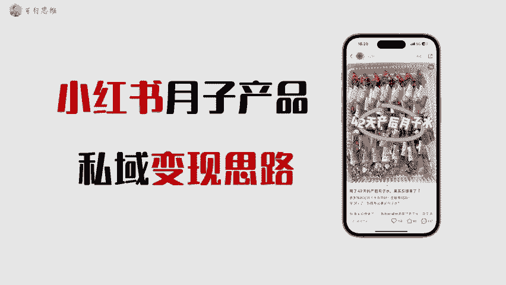

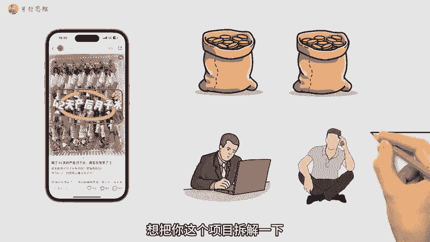

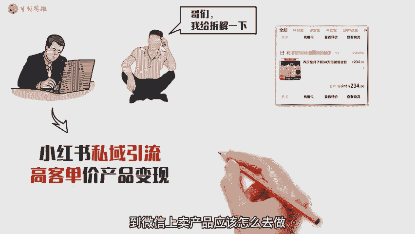

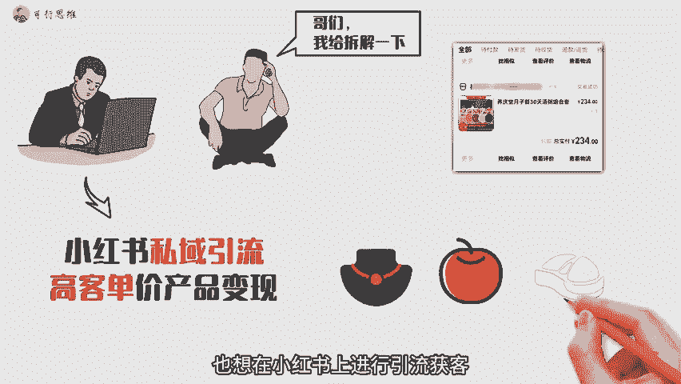

🎼他一件代发的进货截图，200多的进货成本。他在微信上销售的客单价是598，利润可想而知，笔记怎么做？小红书平台笔记大部分是以图片形式展现为主。图片笔记的特点就是制作简单，可以批量制作。

再加上小红书账号也是非常容易注册。所以多账号矩阵引流在合适不过了。批量生产图文笔记，加上多账号矩阵发布，再加上小号截留的引流思路，已然成为了各行各业在互联网上获客的基本操作了。

我给大伙找了一个案例的笔记封面，这种笔记的制作思路并不难，把产品买回来，拍摄这些汤包药材的照片素材不断的组合排版，就是小红书笔记的图片素材了。那么笔记的文案跟包题素材如何批量生产呢？操作如下。

直接在小红书上搜月子汤之类的关键词，就可以找到非常多的关于这个领域的笔记文案了，甚至还能找到很多优秀的同行，直接抄作业即可。这里给大家一个建议，正好是自己建立一个跟月子相关的内容库。

然后不断的去搜集包题跟文案进行拆分跟组合，这样。

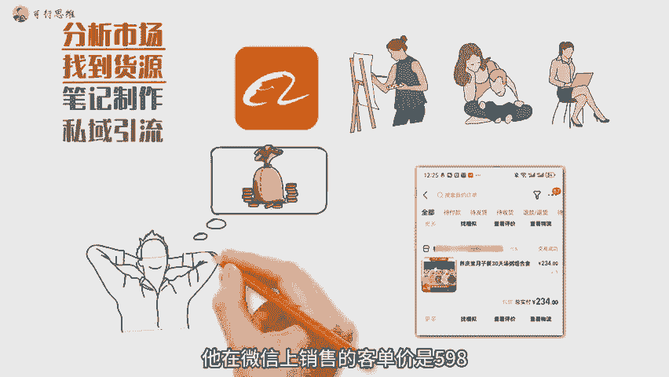

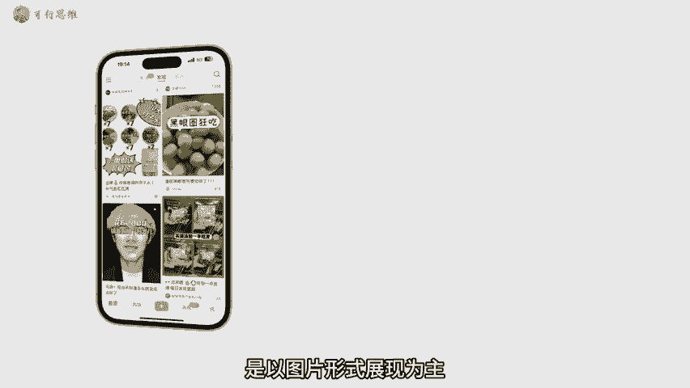

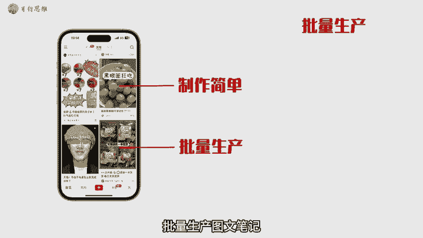

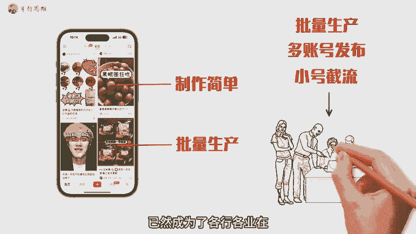

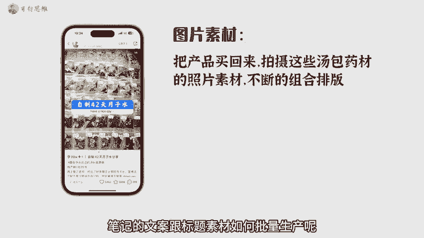

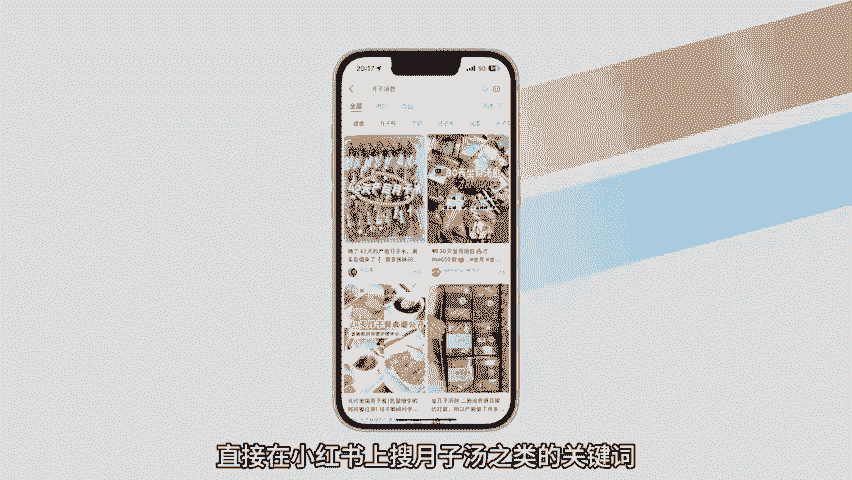

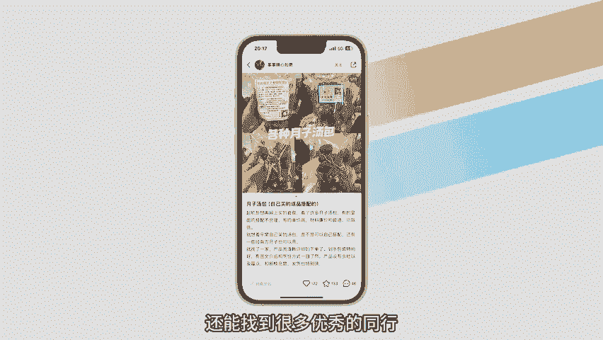

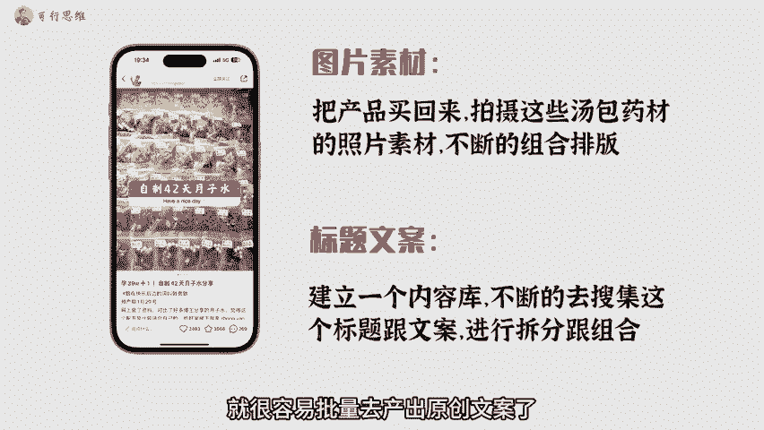

🎼就很容易批量剧闪出原创文案了。甚至你还可以使用一些关键词挖掘工具，把跟月子相关的词全部挖出来，把这些用户经常搜索的词组合到小红书笔记的包题跟内容里，长此以往，当你有足够多的笔记被平台收录之后。

每天就会有源源不断的搜索流量。要知道，小红书已经成为女生心目中的小百度了。市场有了货源有了，笔记也布局好了，不出意外的话，评论区就会有人开始询问你产品怎么买了，这些都是价值连城的精准客户。

所以我们需要引流到思域里，到我们的朋友圈里进行成交，值得注意的是，小红书平台对于站外引流打压的很厉害。如何将小红书平台的客户丝滑的引流到思域，我会在下格视频进行详细的拆解跟分享。

以上就是关于小红书打粉引流，思域变现的整理玩法思路。最后，我也整理了一份详细获客手册。大家可以在我。

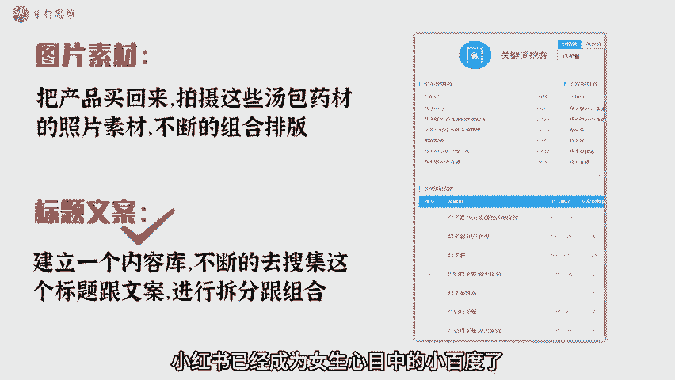

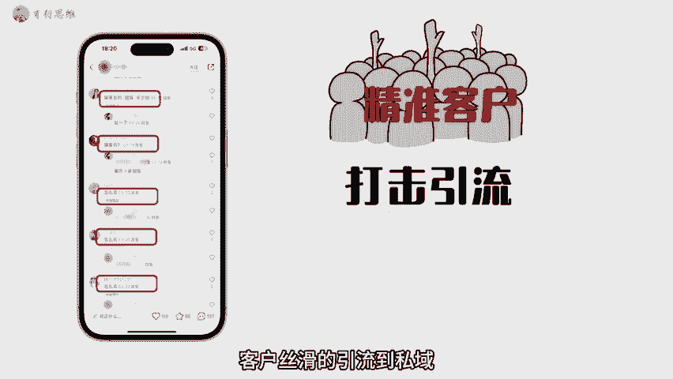

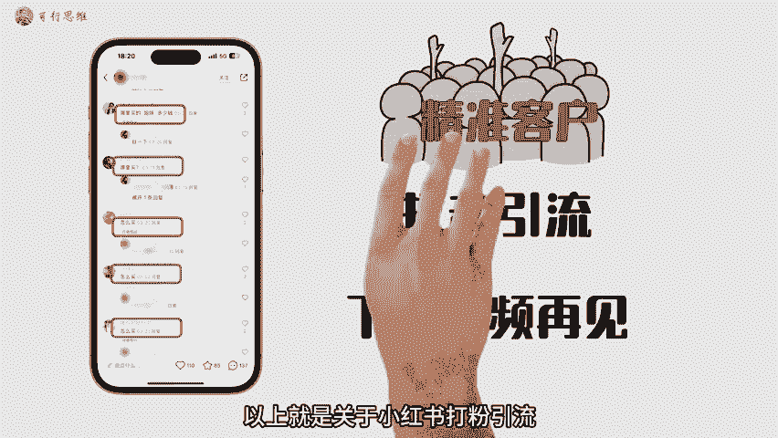

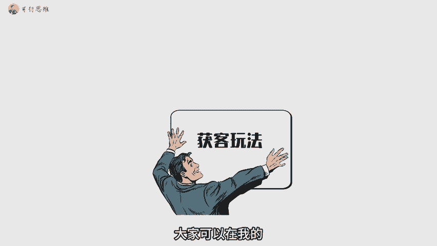

🎼可行思维，回复霍克来学习。好了，我们下期再见。