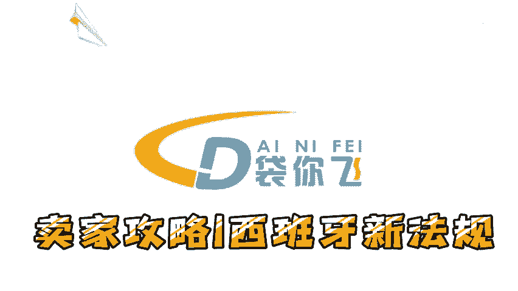
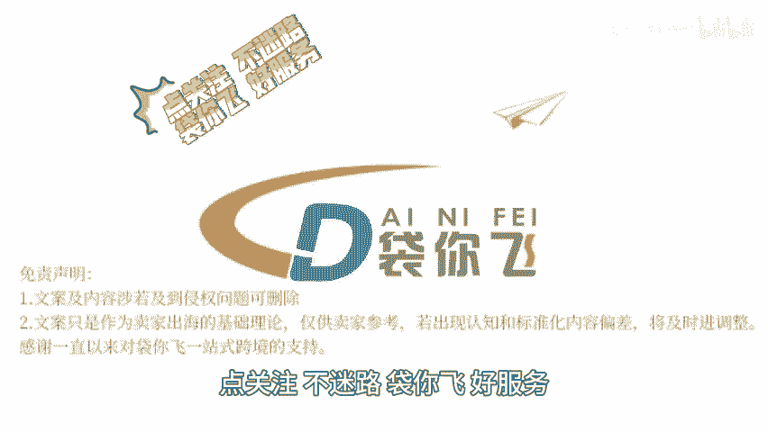

# 卖家攻略｜西班牙新法规 - P1 - 袋你飞进亚马逊课堂 - BV1FWycYpEdd

🎼欢迎收看带你飞电商小课堂。今天我们来了解一下西班牙最近发布的新法规。根据西班牙皇家法令2022分之1055的最新规定，从2025年1月1日起，所有在西班牙销售的家用包装产品。

必须在包装上注明应投放至哪个分类容器中，这意味着包装回收标志将成为强制规定。为了确保卖家的业务不受干扰，卖家应该立即行动。由于合规性要求即将生效。建议您尽快开始注册流程。

以确保在截止日期前完成所有必要的合规步骤，熟悉西班牙包装法的具体要求，包括但不限于包装的分类回收标志的印刷标准等。您可以在西班牙官方公报网站上查看相关法规要求，生产者需要加入一个生产者责任组织。

以确保您的包装废弃物得到妥善处理。这通常涉及到报告和支付环保款项。如果还未在西班牙开设业务需要获取你，并可能。😊。

🎼要指定一名位于西班牙的授权代表来履行您的法律义务。包装上的环保标志，确保您的包装符合西班牙包装法的制造设计标记和信息要求。这可能包括在包装上印刷环保标志，以及在发票上包含包装注册好盒。

支付给生产者责任组织的环保款项，为遵守这些新规定，可能会导致产品无法在西班牙市场上销售，为确保您的商品能够顺利上架。建议卖家尽早对商品进行自查，点关注不迷路带你飞好服务，点赞关注，带你了解更多跨境资讯。

😊。

