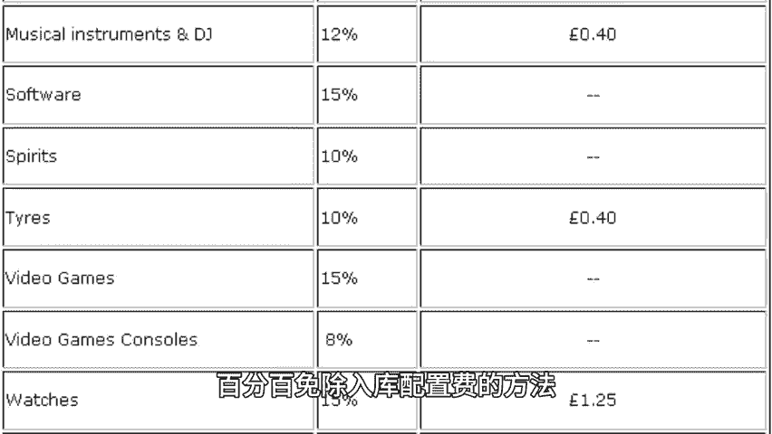
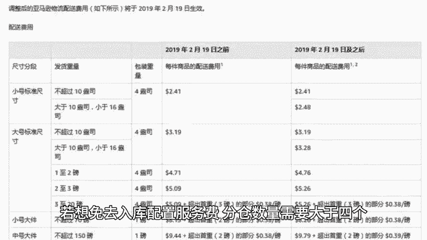
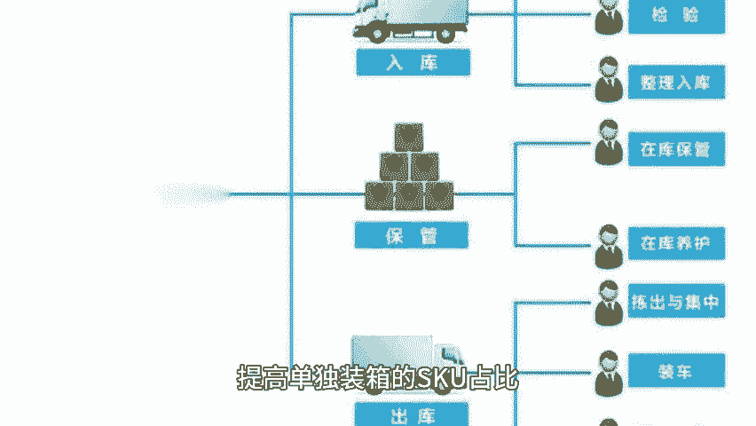
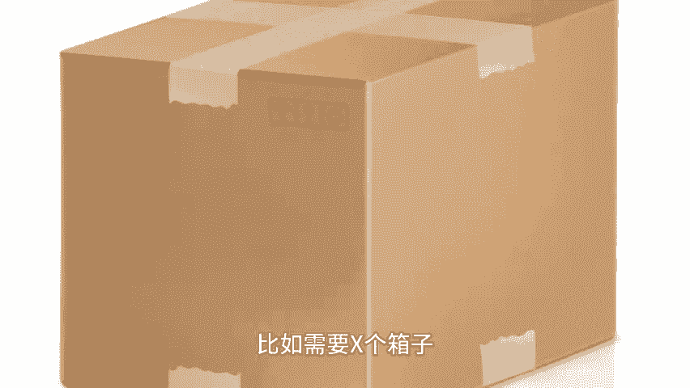
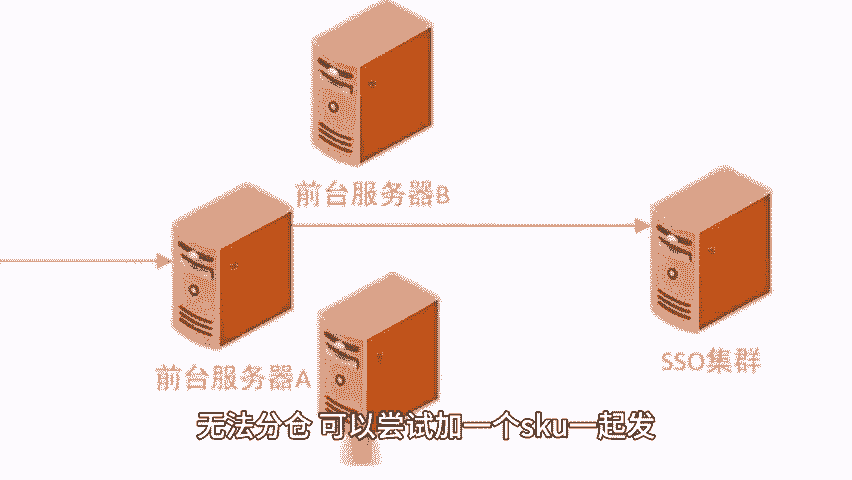
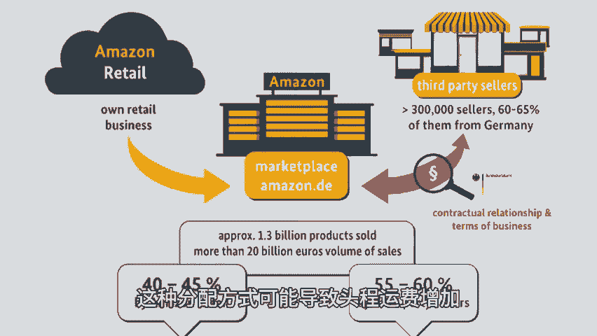
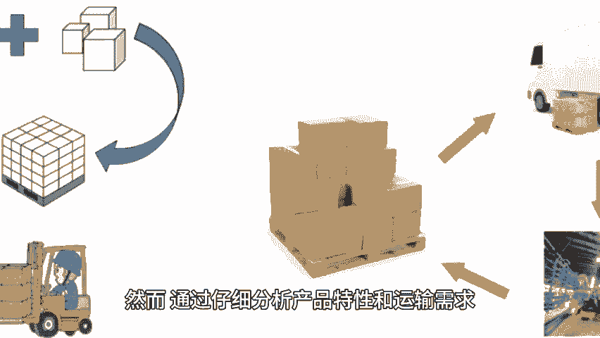

# 卖家这样操作！百分百免除入库配置费！ - P1 - 小猛龙跨境俱乐部 - BV1WVmHYbEfg

🎼自2024亚马逊入库配置费更新后，不少卖家都为此头疼。本期小猛龙给大家带来亚马逊百分百免除入库配置费的方法，同时为大家准备了亚马逊分仓具体实操流程，老规矩回复分仓来安排，可以直接免除入库配置费。

根据亚马逊入库配置服务费的规则，若想免去入库配置服务费，分仓数量需要大于4个。如果不给分仓，意味着要交高额的费用。亚马逊分仓规则，需要保证一件产品在每个仓库都有，保证产品离客户近，具体有以下几点。

如果卖家发的货量少于4箱，那基本不会被分仓，配置费少不了，发的货大于4箱或者很多，但是货物为同一产品，那么可能被分仓箱数越多，分仓可能性越大。

🎼发的货大于4箱或者很多，例如发了5箱货，是5个不同的产品，大多情况下不会被分仓。对于做标准件的卖家，如果分4到5个仓是比较划算的那我们肯定是会想避免被收入库配置费的，免入库费用的三种发货方式。

注意混装的箱子基本只会分配一个仓，强制只能选择最小货件拆分的入库配置方式，提高单独装箱的SKU占比。

🎼就有可能会被分配到亚马逊优化后的货件拆分方法一，SKU数量2个以上。其中一个SKU要满足4箱，另加混装一箱即可5个仓库。2、混装SKU每个SKU平均到5个箱子，每箱数量都得一致。

3、亚马逊官方发布百分百免除的方法如下，只要您的货件同时满足以下两个条件，即可获得亚马逊优化的入库选，两无入库配置服务费。每件商品SKU至少包含5个相同的纸箱或托拍。

每个纸箱或托拍中必须包含相同的商品组合，且每件商品在每个纸箱或托拍中的数量也必须相同。举个例子，卖家要发产品A100PCS产品B100PCS如果想要免除配置费，可以设置装箱单。具体模板可以私信领取。

如果不止两个产品，或者数量。🎼不一致，需要先计算下大概需要多少个箱子。🎼比如需要X个箱子。

🎼那就把每个产品的数量除以X就可以了，无法分仓，可以尝试加一个scoe启发就能实现分仓了。尝试在每一箱里塞一个小件产品。

🎼这样就是混装了，可以分仓，如何看要不要分仓，具体要看不同的情况，根据产品大小轻重进行合理计算，有些产品轻且多，总美息是亏的，因为配置费按照数量收取。🎼相反重，但是少的话走美西会比较划算。

看卖家发货是否着急。

🎼不急的话，走美东慢慢走，没关系。🎼从运费成本方面考虑如何分仓。如果不支付配置费，FBA系统通常会将货物分配至美东和美中地区的仓库，这种分配方式可能导致头程运费增加。

因为从这两个地区向全国配送的成本相对较高。然而，通过仔细分析产品特性和运输需求。一些卖家发现，在某些情况下，选择分仓并支付配置费反而更加划算。当该卖家选择将货物分发至三个美西仓库，并支付相应的配置费。

这样做的好处在于，美西地区与主要市场之间的距离较近，运输成本相对较低，同时，通过卡车派送卡派的方式，可以进一步降低运输成本，并提高物流效率。经过计算，这种分仓策略在运费成本上更加划算。

在选择FBA分仓策略时，卖家需要综合考虑产品特性。运输需求以。

🎼及运费成本等因素，不同的产品可能需要不同的分仓策略，以达到最优的物流效果和成本效益，篇幅有限，获取分仓实操技巧以及更多亚马逊运营小技巧，点赞关注评论，带你出海不迷路。

