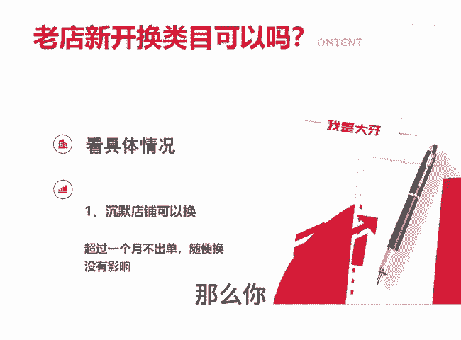

# 卖菜刀的店改成卖袜子可以吗 - P1 - 千优电商教育 - BV1DoC2YYEpY

我的店铺原来是卖菜刀的，我现在改成卖袜子可以吗？就是有粉丝朋友问吗？他我这个老店新开换一个新类目可以吗？这个呢要看具体的情况。如果你的店铺一直是沉默店铺，甚至几个月不出单或者超过一个月不出单。

那么你随便换类目，没有任何影响。如果是偶尔出单的店铺可以换吗？换的话呢，影响不大，就你订单量本来比较少啊，一天一单两单，这时候你换类目问题也不是很大。那么如果我的店铺出单量比较多，一天100单50单。

我换类目可以吗？这个呢要看情况了。如果你换成和你原来的标签基本一致的商品，这没问题。比如说你本来是卖T恤衫，女装的T恤衫，现在你换成女装的羽绒服，这个问题也不大，就怕的是呢，原来你出单量比较多。

你换了和你毫不相关的类目，这样影响就比较大。我是讲师大牙，欢迎大家扫码添加我的微信，不方便扫码的朋友可以添加我的微信号，80221430。在这里。😊。

给大家准备到了一套新手运营入门的大礼包，希望能够帮助大家。

