# 古木鱼塘玩法3.0第一部分 - P1 - 古木-鱼塘玩法 - BV1T7WXe1EGR

好不好，帮我呃帮忙扣一下，一周年呃，诶怎么说社群一周年，社群一周年好不好啊，社群一周年啊，社群一周年，OK啊，感谢大家，感谢大家，感谢大家，真的是跟大家认识有一年了，其实我们是五去年5月份认识的啊。

去年5月份跟社群里好多小伙伴认识的，然后前前后后后面又进来了很多小伙伴，对一周年了，然后我觉得社群其实应该没有让大家很失望，对不对，然后包括我们去做这个社群的初衷，然后我觉得一直都还可以。

然后呃也帮助到其实挺多的小伙伴，有可能我自己因为我自己个人性格的原因，我可能比较内向，所以有一些方面，我不是一个特别擅长去沟通的人，所以有时候社群我可能有一些说话呀，氛围呀，可能调动的不太够。

但是你们会在社群里面帮我调动的很好，嘿嘿这个也是我特别感谢大家的一个点啊，因为我很内向呃，所以会有这样一个情况，呃哈启蒙群是吗，哈哈干货满满是吧，哎呀感谢感谢大家认可，呃。

哎呀你们这样弄我还有点不好意思嘞，反正嗯我我我我看我，我觉得我还是要把摄像头弄出来，我放在摄像头，摄像头放在上面一点好吧，我把摄像头我看一下，因为好久没弄视频号了，我我放在这边吧，我放在这边吧。

应该不太会挡，不太会挡这个视线对吧，你们整个画面能看见吗，整个画面能不能看见我现在那个嘶额哎，我看下互动消息，就是这个x man的脑图，脑图能不能看见，兄弟们脑图能看见吗，诶啊能看见啊，脑图能看见。

OKOK因为其实我觉得嗯我准备了一点东西，准备了一点东西，可能有一些方面我怕不够，所以我准备了一下，但是有可能我又觉得，今天晚上讲很多东西有可能会超标啊，嗯所以今天作为社群一周年呢，然后我在社群里面。

会给大家去准备一些这样的东西，比方说像小不点这样的那个弹窗软件，包括哮天犬这样弹窗软件，这两个我们是把这两个然后给结合了，然后是免费给大家用的，就是什么时候收费呢，我我也不确定啊，就是因为我们自己在用。

这个如果大家呃需要的话，我一会缩小啊，我一会缩小诶，你们看不全吗，诶你们画面看的全吗，如果有什么问题，你们可以跟我讲一下，好不好哦，我的微信哦，微信一直弹声音，OK微信微信我看一下啊，哎哟我看下微信。

我把声音怎么关掉，消息通知，OK这样吧，这样可以吧，我把消息先关掉，这个里面嗯，嗯能不能看全，兄弟们能不能看全，我现在脑图是从我鼠标的位置，左边到右边的这个位置能不能看全啊，如果你们能看全。

然后跟我说一下，看全好不好，嗯差不多我们就开始了，我确定跟大家确定一下各个方面的问题啊，有没有什么问题斯可以啊，OK然后我最后再最后的时候社群，然后会来给大家赠送那个无实名的直播技术，就是不用实名。

然后可以开播的技术，因为我们自己一直在用，然后非常好用，然后还有卡口微分技术，也是社群里的小伙伴，这两天刚跟我分享了一个技术，然后特别特别好，就是大家以后可能不会受口碑分的，这个影响了啊。

这个是后面在社群里面。

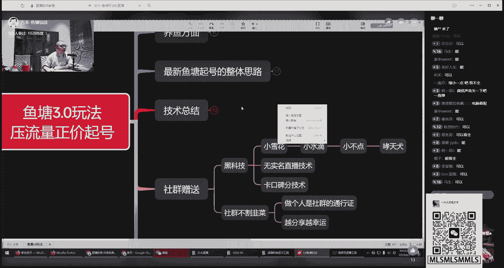

我们一周年的社群，会给大家做这样的一些福利在里面啊。

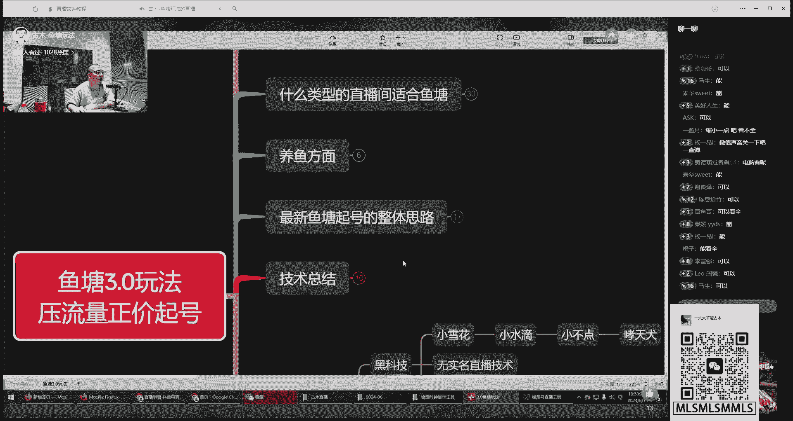

所以呢今天嗯我们正式开始吧，我们正式开始吧。

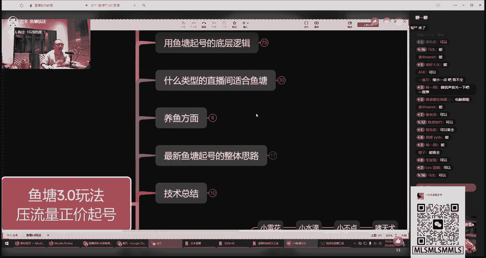

马上到八点钟了嗯，我看还有25秒好不好，再有25秒。

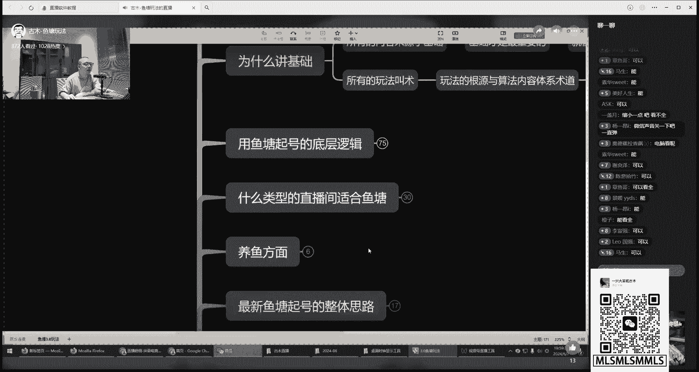

我们八点钟正式开始，我今天其实准备东西有点蛮多的，我再看一下嗯，我其实是还准备了一些东西，我怕你们怕你们那个怕你们看不懂，所以我有一些东西我其实我是自己弄的，然后但是没放在里面。

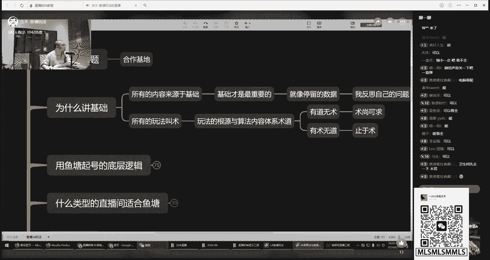

你包括包括像这个东西，卫生间去一下啊，哎呀不行啊，我我要去一下，我怕掉人，现在直播间这么多人，你看那个因为我自己有在整理他的算法，算法的东西，其实我呃在整理的非常非常多，但是好多东西可能对大家来讲。

就是可能是有一些关键词，或者有一点重点的词，是大家可能可能不是特别去理解的，就是机器算法的一些内容的东西，呃，我整理这套东西，全网应该是应该是没有人做的比我更细致了，在这个方面就是他的机器学习。

具体是一个什么样的内容，然后是我我其实是非常非常多的，呃这个后面有机会嗯，如果你们对抖音的底层算法，跟那个机器学习的内容，如果大家有兴趣，然后你们到时候可以跟我讲，然后如果行的话。

嗯嗯我到时候再跟大家去分享底层的这个东西，因为它其实要分享的东西特别多。

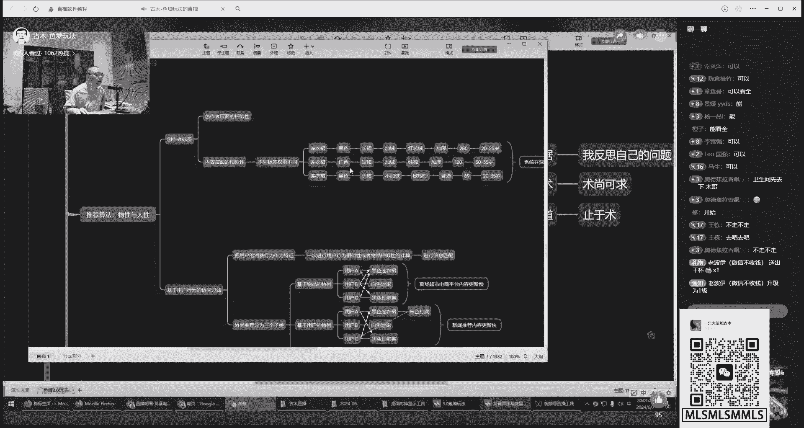

特别特别多，你看我随便给给你们刷一下，他都特别多啊，呃所以就是哼扬声器嗯，OK我们正式开始啊，OK我们正式开始哦，就是我是把鱼塘的玩法，然后在今年是把它变成了一个3。0的玩法，大家在这群里面最开始进来。

我去年的时候给你们讲的那个鱼塘玩法，那个时候算一代的，就一代的玩法，可能就是我们要准备20条鱼的，现在到3。0的玩法，就是可能我们准备两三条鱼，其实就能把这个做起来啊，我我一会儿给大家去看数据啊。

就是我们怎么通过两三条鱼把它做起来的，就是嗯因为我们现在我不只是在群里面发起了。

这个视频的这个内容，就是还有很多可能是外面的人进来。

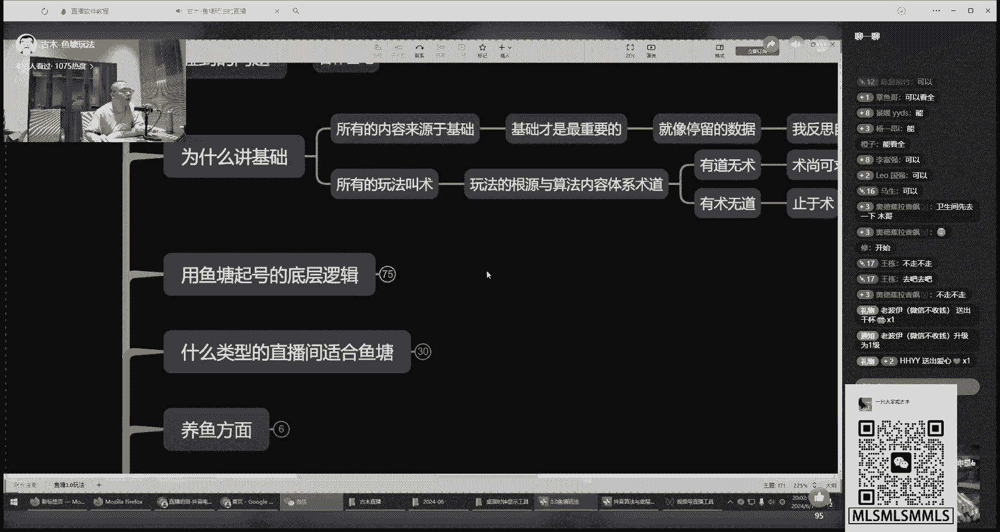

可能好多人可能不太知道这个什么叫，鱼塘的玩法，然后还有这个都3。0了对吧，还有一个压流量，正价起号有可能根本很多人可能就没听过。

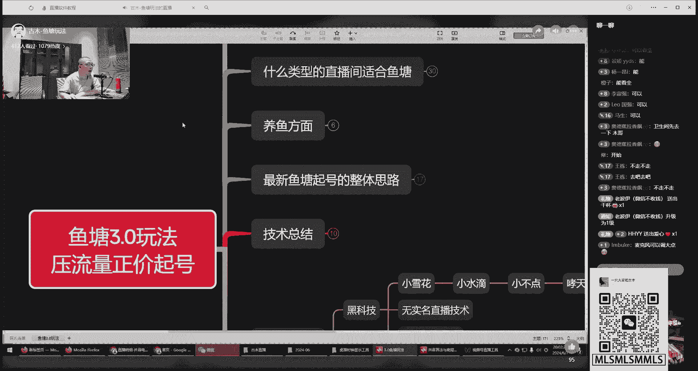

但是我在跟大家讲的时候，我会跟你们讲基础，我我麦克风还要调大吗，我尽可能把它对的那个那个一点好不好啊，我麦克风我看一下能不能再调大一点。

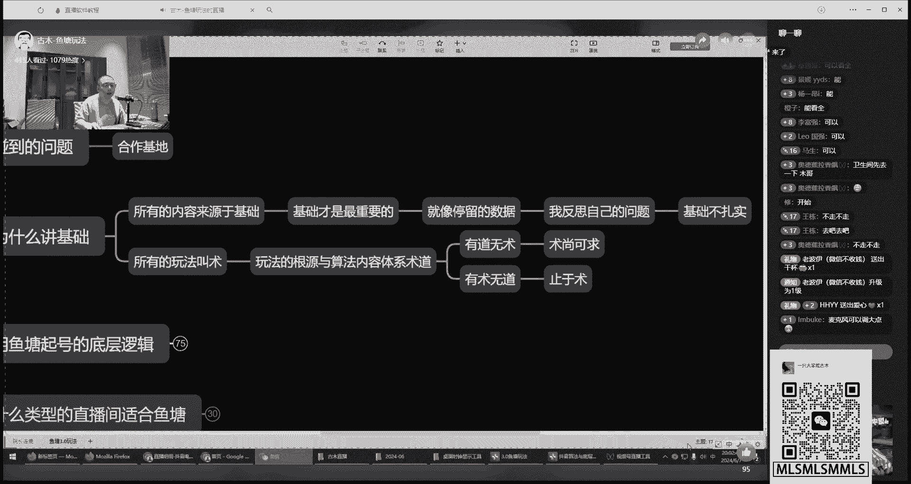

麦克风啊。

先不调了吧，应该大部分都可以啊，然后我们不影响其他人的，好吧，呃跟大家讲一下，就是我为什么这里我写的为什么要讲基础，就是我们所有的直播体系啊，所有的直播体系其实是会在基础上面去讲啊。

就是我们包括我们自己，也是因为我自己一直在反思一个问题，就是为什么有的时候我的数据或者其他的方面，然后做的不好的，我觉得还是我自己的基础不够扎实，嗯我这个不是谦虚的说法，因为我知道嗯，大家来听的可能。

绝大部分人基基础可能还没我扎实对吧，但是我自己还是误会，认为自己基础不够扎实，所以它会影响到的很多点，就是我们怎么样去理解它的算法内容，然后因为为什么要讲底层逻辑，就是呃可能别人也有人讲底层逻辑。

但是我敢肯定的是，现在全网讲底层逻辑，不会有人像我给你们讲的这么细，这么干，这么到位啊啊我我必须要跟你们强调两个字哈，到位啊，到位啊，很重要的两个字，就是可能也有人讲，但是我自己可能会讲的比较多，呃。

你们有看过星球的文章吗，有看过星球文章吗，我星球文章可以，其实讲了很多的底层逻辑呃，看过我星球文章的扣个扣个八吧，好不好嗯，看过星球文章的扣个八好不好，扣个八嗯，看过我星球文章的嗯，呃是嗯是这样的。

兄弟们，就是我，我今天来给大家讲的，包括我星球上所所分享的所有底层逻辑，我把它叫成数的这个内容，就是我们所有的玩法都会归结于这个内容，都会归结于这个内容呃，啧呃我我应该少看一点评论。

因为你们评论有时候会影响我，哈哈哈啊，就是我们讲的所有的那个底层逻辑，它都是书的内容，你包括玩法，我包括跟大家讲的鱼塘起号也好，或者我们是那个引流品，福利品这种利润品旗号也好。

包括我们有很多的呃其他的玩法啊，集合链接也好，这些东西它都是玩法，它都是一个道的东西啊，他都是道啊，然后我们就是通过数，然后来回归到道的这个方面呃，就是为什么这么讲呢，就是我我会讲基础不扎实。

是因为我们在整个的术的层面，就是对底层理解不够扎实，所以就是呃我给给大家去讲所有的那个玩法，包括鱼塘的玩法，包括那个其他的玩法，一定会回归到底层逻辑上面，然后来给大家讲这个事情。

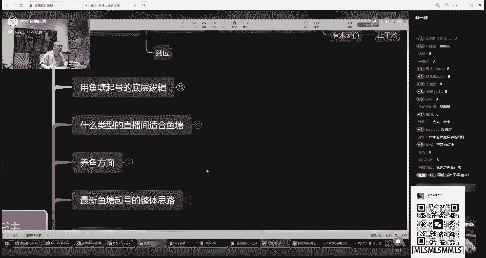

嗯OK吧嗯然后我们继续啊。

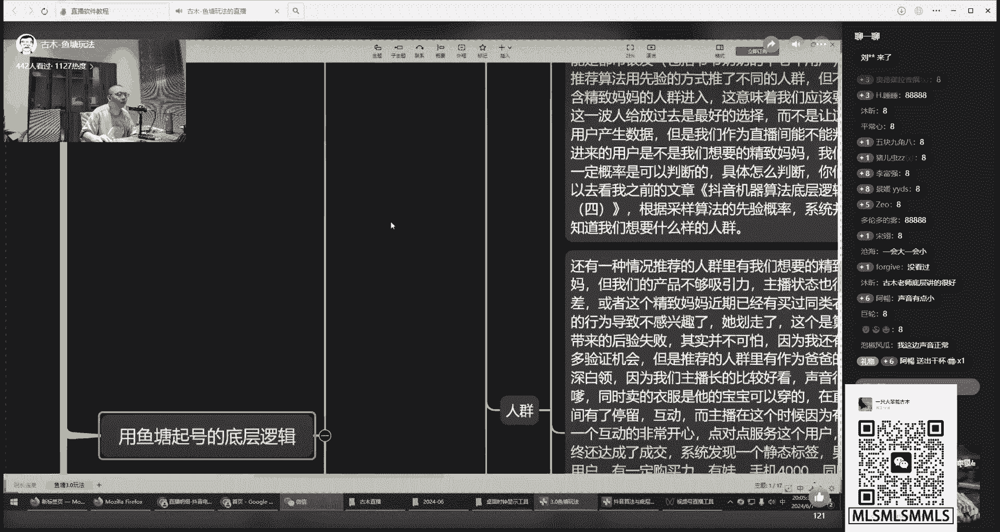

呃我的这个字的大小呃，大家觉得怎么样。

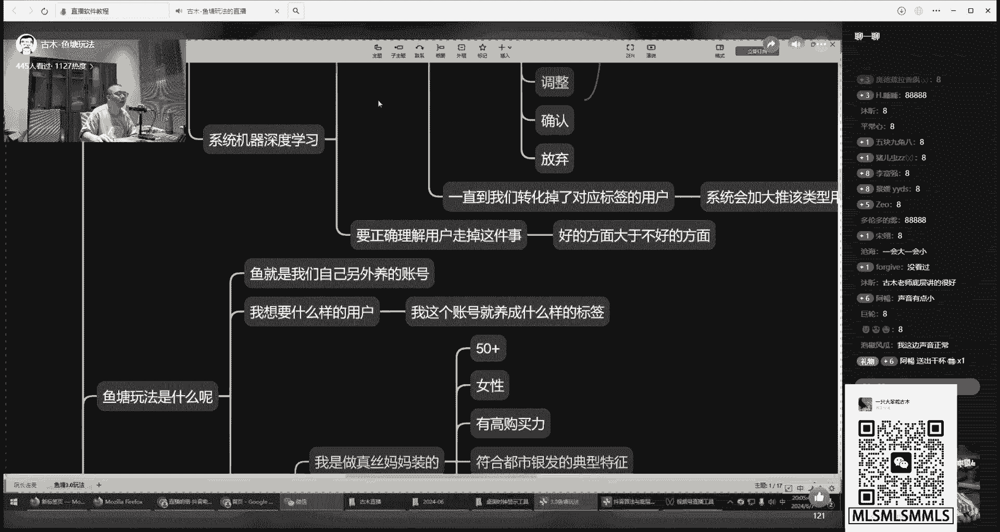

我自己现在放在这里是有一点大的，然后你们觉得这个字的大小看着还可以吗，可以的话，扣个一吧，好不好，我们就开始正常开始来讲了，可以的，OKOK这是昨天在跟院长连线的过程当中，其实我有在讲一些这个底层逻辑。

但是因为昨天为什么那个讲的不透呢，有一些点不透，是因为时间可能比较嗯比较不够，所以呢我是想在我自己的一个直播里面，然后给大家把这个东西能讲的透一点，因为讲透了这个东西，你会发现所有做抖音的嗯内容。

然后全部来源于我，我讲的这些东西是全部来源于这些东西，不管它是用什么样的方式在起号，它的玩法是怎么样的，全部来源于这些东西，呃OK吧，嗯因为讲这个东西我必须要讲一下呃。

冷启动就是好多人可能嗯都听过冷启动。

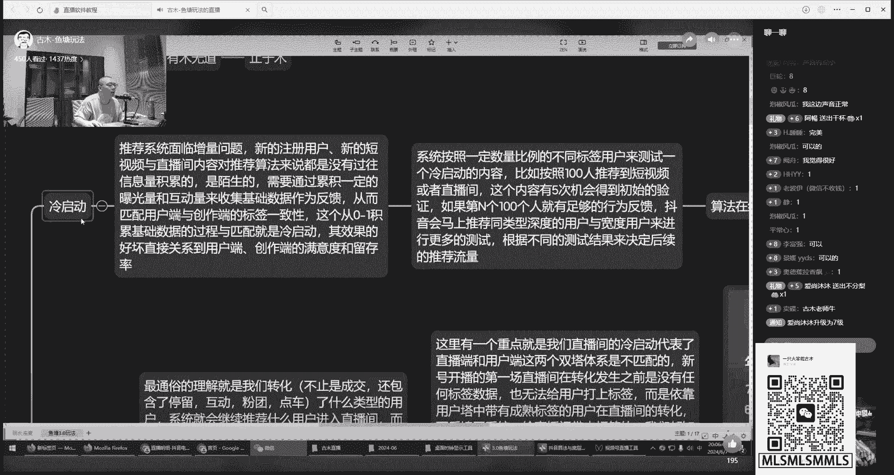

但是冷启动究竟是一个什么东西，它就非常简单的一个点，就是当我们新开一个号，或者你是一个新人，然后打开抖音的时候，注册抖音的时候，因为抖音没有你之前的任何数据，所以你通过你在直播间里也好。

或者你在刷视频也好，你形成的一个曝光量和互动量，然后抖音它来收集你的这些基础数据作为反馈，然后从而把你的直播间和你的那个用户，然后来匹配起来，然后它的这一个匹配，它要达到这个标签的一致性。

那只有达到了一致性，然后他才能叫零杠一，然后去启动成功，那这个过程就是从0~1的这个过程，然后就是冷启动的一个过程，我们如果从直播间来讲，什么是零杠一，我不是去看这个卖了多少钱，而是看这个用户的精准度。

是不是我们直播间里面，用户已经达到了非常精准的一个状态，如果是精准了，我就认为他是一个零杠一，已经已经OK了，但如果说是不精准，那我觉得零杠一可能还没有做好啊，这是我们直播间的一个情况。

那另外一个就是他的一个逻辑是什么呢。

它能启动的一个逻辑，就是比方说呃我们系统然后会按有一定比例，然后他把不同的标签，用户推到我们直播间里面来，因为我们直播间新开播是没有任何标签的，没有任何标签，系统是不知道你是一个需要什么样的用户。

所以他可能会比方说假设他按100个人，然后推到你的直播间里面，然后在我们再假设有五次机会，然后得到初始的一个验证，那就说明我们一分钟的时间，我们一分钟的时间，我们在两个小时能得到500的一个曝光的。

一个情况下，不能讲曝光啊，就是场关500个场关的一个情况下，那他有一个点就是我41分钟会有四个人，平均四个人进到我的直播间，那我直播间里面一定就是三个人左右，甚至可能不超过三个人，0~3个人之间。

然后这是一个非常正常的一个在线状态，一定是这样子的，所以就是我们在线人少，然后没有关系，但你只要在线的人是正常的，然后是一个正常在线的，那他就会呃是一个你可以把他的人，然后去拿过来。

去作为一个打标签的一个过程，就是你的在线人越少，反而推过来的人，然后又越可能学习到你直播间的一个内容点，就是抖音会给你非常多的机会，可能100个100个，然后类似于这样来给的。

就你这100个转化没有成功，然后没有关系，抖音还会再给你100个，然后是这样一次一次的不停的给你机会，然后来学习说你直播间需要什么样的用户，进到你的直播间，你需要什么样的标签。

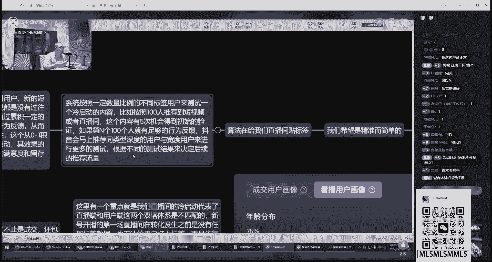

所以他从算法的层面就是，算法是在给我们直播间贴标签的，这个是算法一定要做的事情，这是算法的本职工作，也是他的基础工作，所以我们希望就是说我们希望这个用推进来的，所有的用户是精准而简单的，不能犯。

为什么说叫精准而简单呢，精准是一定是我们想要的用户，简单就是我不需要太复杂的。

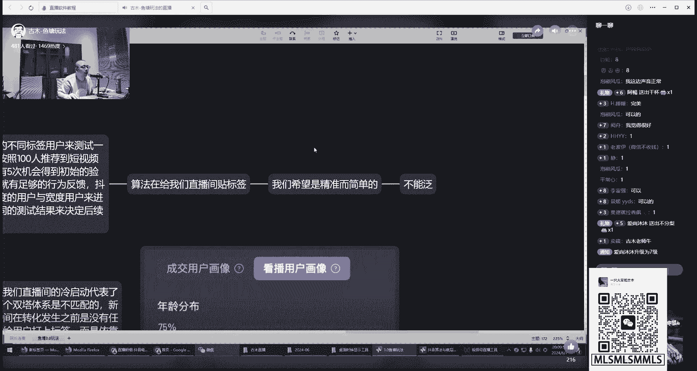

然后太多的用户这个时候是这些东西，是我们再去做鱼塘起号的一个底层逻辑，包括我们不用鱼塘起号，我们现在在起号的过程中也是这样的一个逻辑，就是为什么这里叫啊，我的标题叫啊压流量，压流量正价起号。

而不是我去放大流量，用引流品或者用其他的品，然后这样来做呢，就是逻辑上一个核心的一个逻辑。

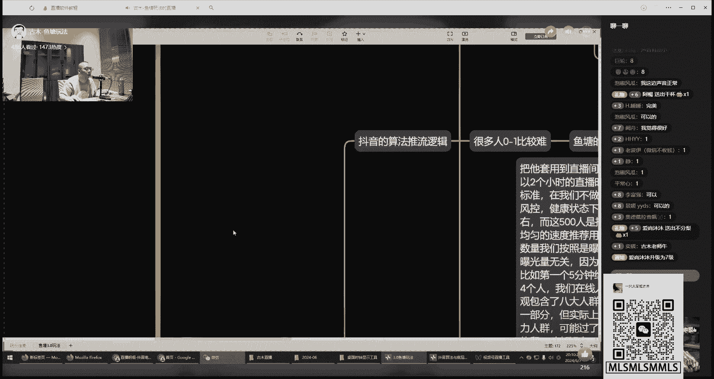

就是在这里啊，就是我会把人压得比较低，然后我是正价品，我不需要靠其他的东西或者去吸引，然后把我的那个场关扩大，把我的在线拉高，一定不是这样的，我希望我的直播间在线人越少越好。

但是他必须得保证一个基础的在线，你不能说我今天播了两个小时，我就一共30个场关，那一定是不正常的啊，就是我们现在播下来，绝大部分账号我们会保证一个小时，大概会在那200多个场馆，这是两个小时。

500个场馆，这是我们测试了非常多的号。

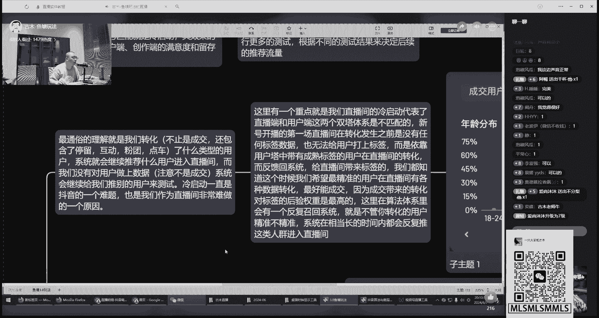

这是一个基础的一个场关量啊，因为我也碰到好多小伙伴，就是说呃我好像现在很难碰到500的厂官，包括我们自己在做纯付费的直播间，然后有一些时候，我们可能不去看基础的自然流的场馆。

但是如果你是做自然流的一个直播间，有一个500的基础场关，我觉得这个才是正常的，哪怕说呃最少最少我觉得应该是200往上，如果你只有两个小时，只有80个场关，你可能更多的你要去反思，就是说去调整额。

我们的场关低，然后一定是有一定限流原因，这个限流的风控的点在哪里，先去解决这个问题，很多时候我们如果是80个或者30个，这种场关两个小时，你会发现你数据做的再好，你可能号拉不起来。

就会有一个这样的一个情况，所以先去排除这个风控的点，排除风控的点好不好，嗯那是一个，那第二个呢就是我把上面的这个东西。

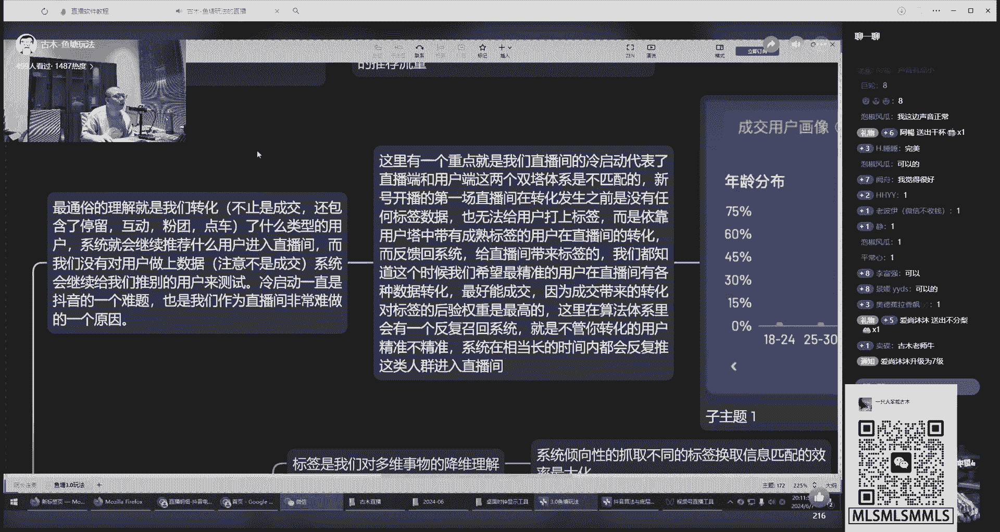

然后去做了一个呃，更让大家去理解的一个内容，就是你们可以先看一看，就是看一看是一个什么样的东西，就是这个本来这部分我是写在星球上的，然后我今天偷懒呢，我就把我写在星球上的文字，然后就直接摘过来了。

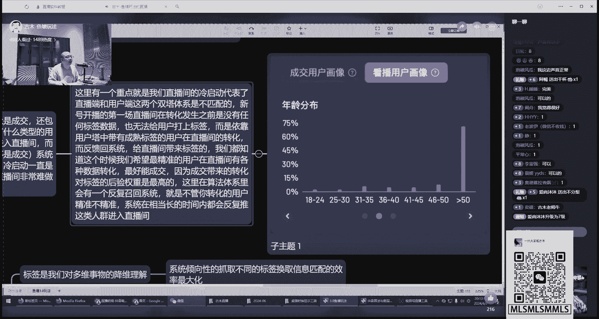

因为星球我已经写的非常非常细了，其实你们在看我这个文字内容的时候，就已经是能看得懂，然后我已经解释的非常非常清楚了，然后就是这个还是在说我直播间的内容，和用户的一个标签关系，所以你不不用管那个。

我在这里写的算法的一个召回系统，召回是什么东西，你不用去管这个，你只要知道的是，我想要做的，就是我直播间跟匹配的一个用户。

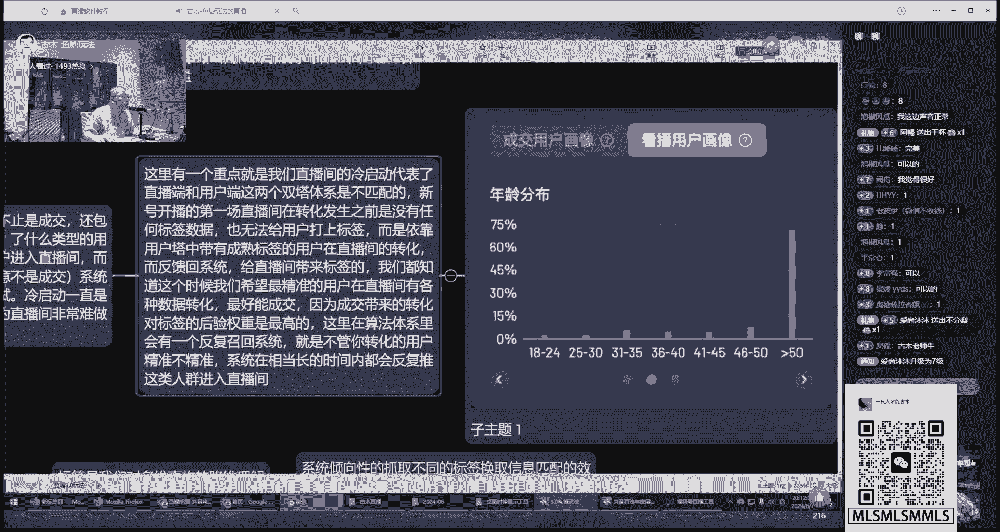

一定是有相关性的，好不好。

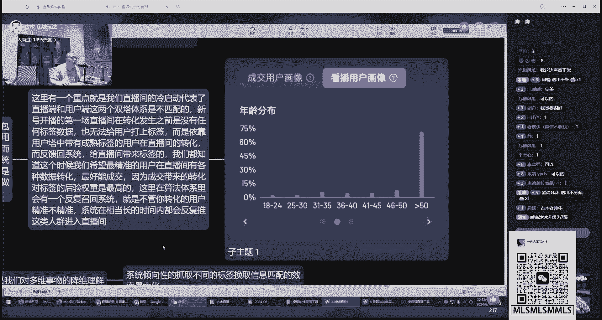

然后然后就是我为什么压流量来起，就是压了流量，我在前面找的这个用户。

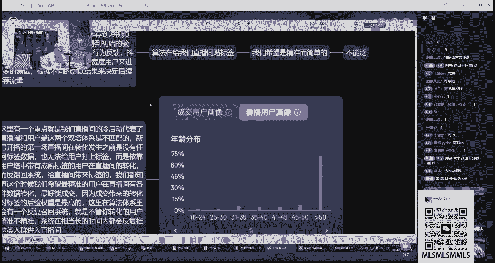

然后一定是找极度精准的用户，极度精准的用户，他的代表性是什么，就是我会把用户的看播画下，你看看播画像跟成交画像一定是一样的，就是我是一枝独秀的一个关系，一枝独秀的一个关系，就是我的我的主力成交人群。

我一定是让他成交的特别特别高的，然后我有可能会第二成交人群，第二成交人群我有可能是40~45岁，然后第三人成交人群可能是30~35岁，这个时候我在起号的过程中，然后我用极度精准的流量。

然后我去洗的用户也好，或者我抓住的精准用户也好，我就是抓住的是一枝独秀的，一个主力的成交人群，这个时候我的直播间的人群的一个精准度。

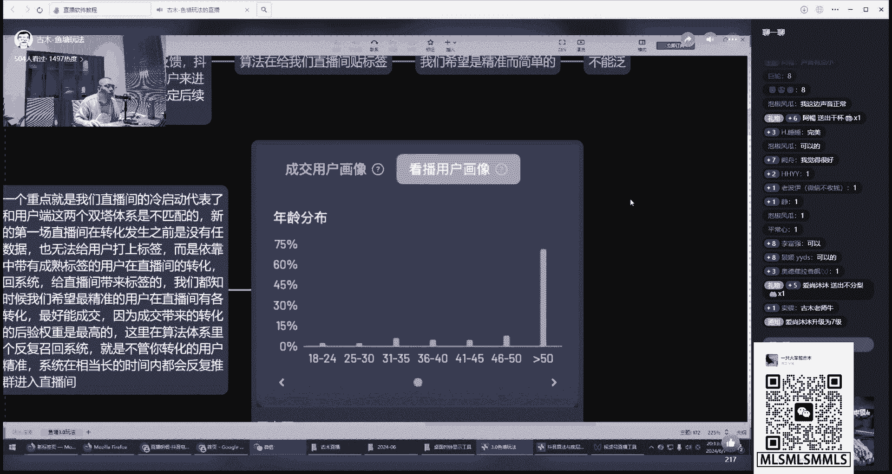

应该是最高的，嗯这样OK吧，这这样来讲。

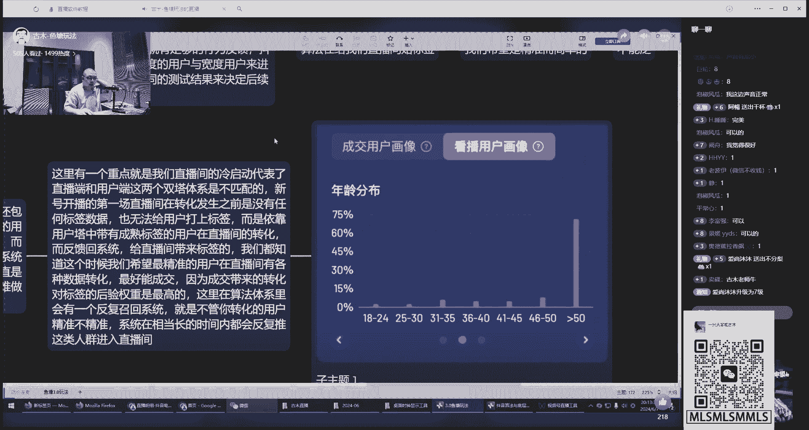

哎呀我觉得可能今天讲的还是有一点紧张啊，还有一点紧张呃，要一个潜能数据吧，好不好，兄弟们就是呵还OK的是吧，这大家没有关注我这个视频号的。

那能不能现在点一下关注，然后我们继续来讲一下啊，呃十秒钟十秒钟，然后大家没有点关注的，因为我也不知道在哪里点关注啊，你们自己看一下，没有点关注的，然后然后那个点一下关注好不好。

呵呵写的已经写的已经很清楚了是吧。

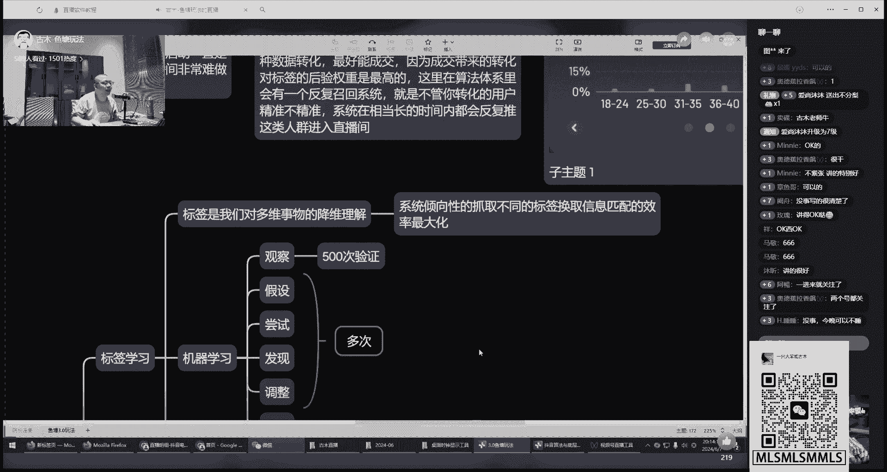

OK啦嗯嗯一进来就关注了是吧，好OKOK嗯，我再跟大家讲一下啊，就是我们讲系统的一个学习，他在抖音上面它是一个深度的一个学习，他的深度学习，就是我希望是嗯你们很多人可能明白这个东西，我为什么还要再去讲。

就是我们自己啊，我们自己也会也会有一个这样的点，我们就是还是会回归到我们现在做号，还是会回归到这一步，就是大家一定要记住标签是什么东西，标签是我们对于多维事物的一个降维理解。

多维事物的一个降维理解，那这个他在算法层面，它是一个英文缩写，叫什么，就是叫呃MBMBDING的一个一个算法体系，就是什么把多维事物的一个降维理解呢，就是可能是我们这边是一个人，然后一个用户怎么样呢。

但是我们把这个用户变成一串数字，这个过程就叫embedding，就是它的算法体系里的一个内容，就是我把很复杂的三维的一个事物，我通过二维数字化的一个表现，然后把它集中到我的这个算法体系里面。

比方说我的用户是一个什么样的用户对吧，我的女性用户，我刚才在在这里给大家看了。

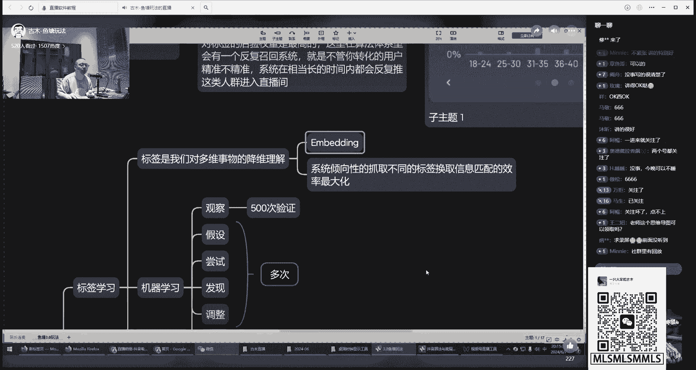

我要的女性用户，是一个五十五十加以上的年龄的一个用户，她的购买力是怎么样的，她那个呃他现在的生活状态是怎么样的，他的动态标签是怎么样的，他的现在兴趣爱好是怎么样的，所有的这些都可以变成一个数字。

然后来形容这个用户，那这个过程呢就是我们讲就是标签。

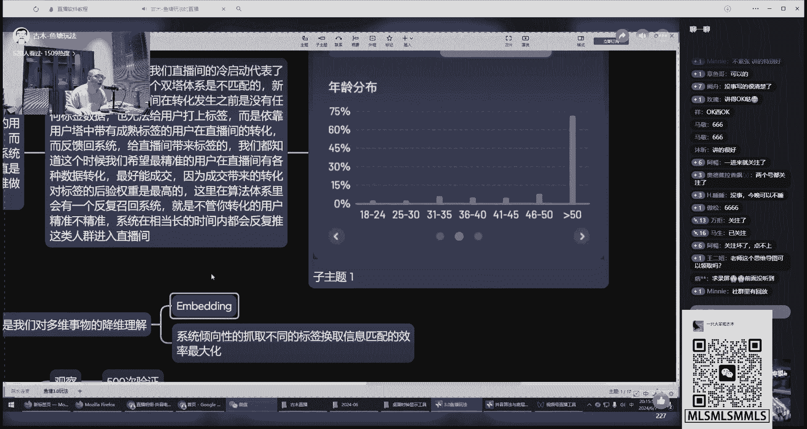

就是我们对多维事物的一个降维降维理解。

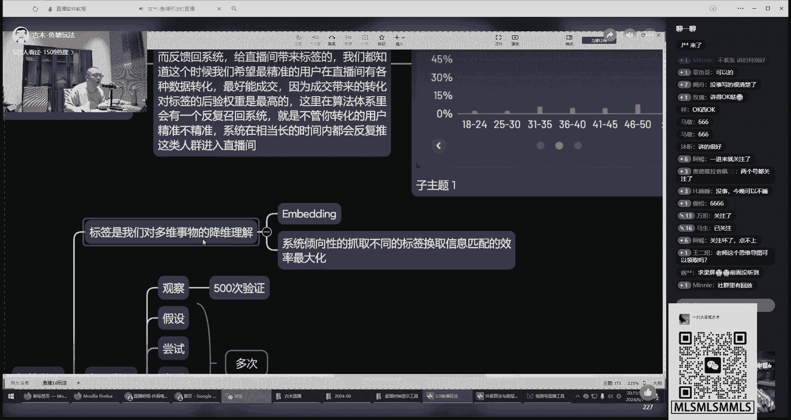

所以它叫MBEDDING，然后系统呢是它会倾向性的抓取不同的标签，来换取这个信息匹配的效率最大化，那这句话是什么意思呢，就是为什么讲他要效率最大化呢，呃就是这样子就是这样这样去理解啊。

就是比方说我的直播间里面。

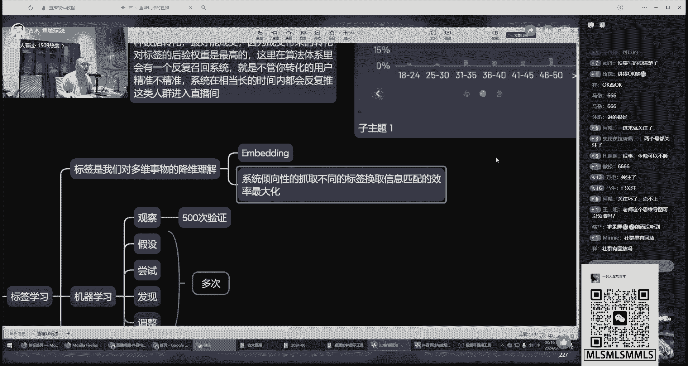

然后我今天是卖一个妈妈装的，如果他推荐的用户，是28岁到30岁的用户进来，他可能不会去买这个妈妈装对吧，但是他推荐的50岁以上的用户，他是妈妈的这个用户，他进来就有可能买这个衣服。

那所以就是你就会发现系统就会发现，他推了50岁以上进来的，这部分用户的转化非常高，而18~30岁的这部分用户，他的转化效率就会非常低啊。

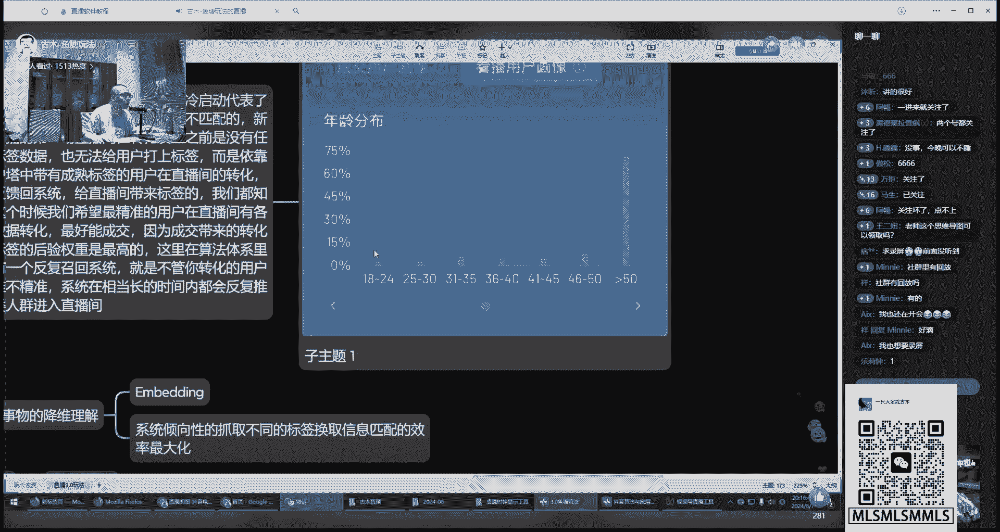

这就会有这样的一个情况，那这个就是效率的一个最大化问题。

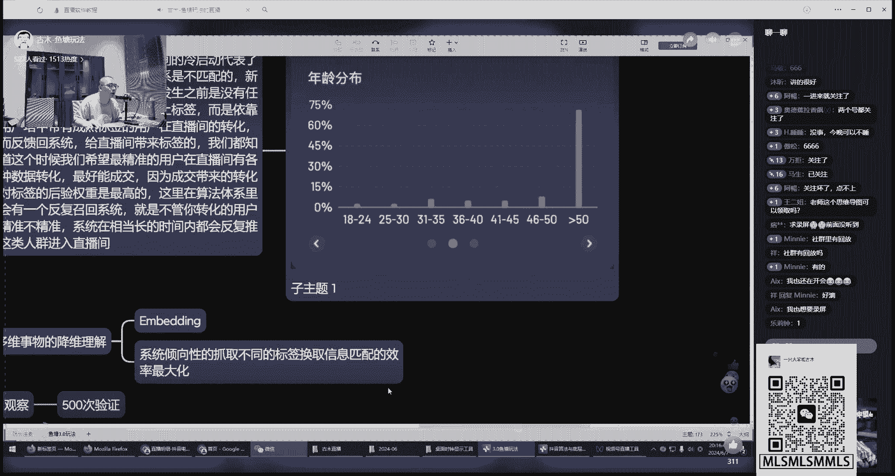

所以他在系统的那个算法里面就有这个点，那这个点呢，然后他到机器学习上面，它就会出现一个，我刚才跟大家说的一个500次的验证，500次验证是什么意思呢，就是我开播的两个小时。

抖音会给我500左右的一个场关，那他可能随着我的曝光呃，曝光人数这些点来的，然后他可能就是曝光进入率这些可能不一样，但是他多多少少，多多少少会有一个这样的一个情况，有的直播间可能300多人闯关。

有的直播间可能400多，有可能也有500多，甚至200多的也都有，所以他在给我们500的一个验证，他可能在两个小时拆分了多长的时间，然后不停的来进到我们直播间里面来。

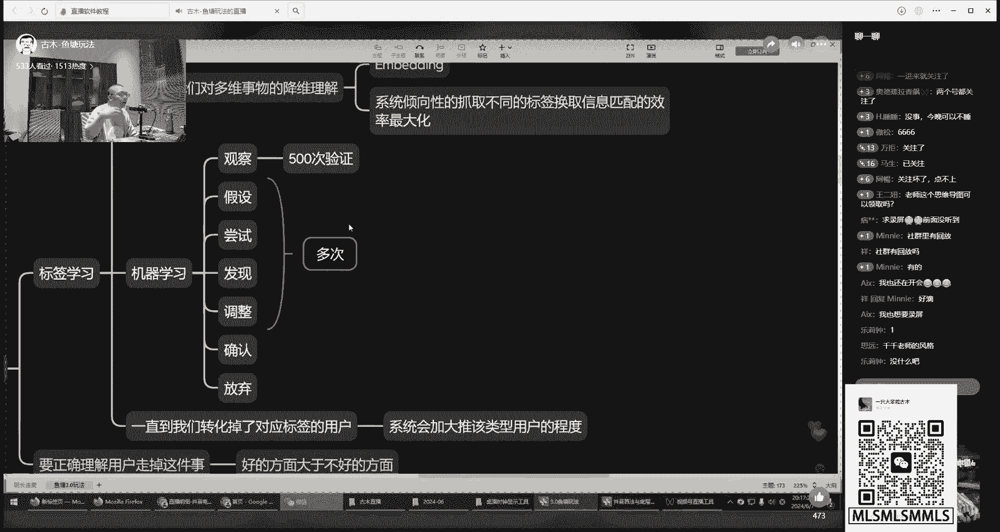

然后不停的，比方说我直播间是要50家以上的，他有20家的，40家的，30家的男性女性的，然后呃各个兴趣的爱好的，然后都会推到我的直播间里面来，但最后发现我直播间只要50家以上的用户。

那OK系统就会这个时候他就会很快的学习到，就是我的直播间，是要50家以上的用户才能停留下来，然后来做互动也好，或者说那个来做那个其他的呃转化也好，然后它是这样的一个内容。

那为什么就是我在前面起号信号开播的时候，能有这样的一个情况呢，就是因为我信号开播，我直播间没有任何的标签，然后我让50岁的人开始给我打上标签的时候，这个时候打的标签力度是非常重的。

所以我在这个直播的过程中，然后我就很容易继续拿到50岁以上的。

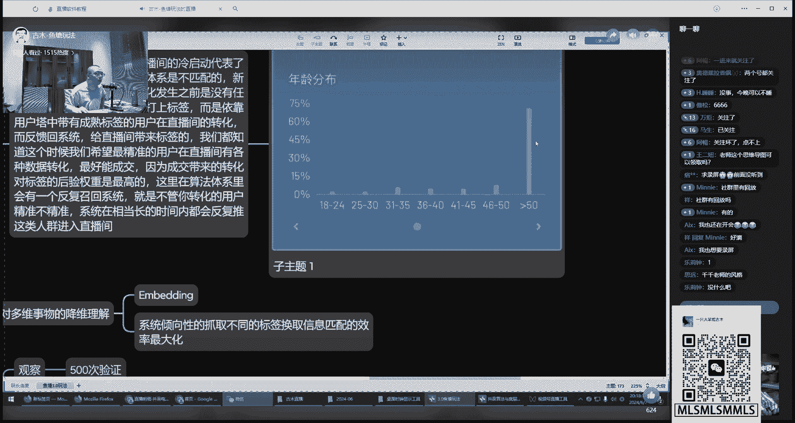

这个人群标签，那这个就是算法的一个逻辑，就是500字的一个验证，一直到某一次，然后我们转化掉了对应标签的用户，系统就会加大去推该类类型用户的一个程度，好OK吧，所以就是这部分用户啊。

他走掉其实也没有关系，大家要去理解，就是说我直播间，我不是要把所有人都留到直播间的，然后我希望有一些用户他其实是可以走掉，然后这个跟我没有关系，就是没有关系的人，我要让他走掉，那这个方面就是让用户走掉。

这件事情它可能好的方面会大于不好的方面呃，我见过很多的运营，包括我们最初始的时候在做抖音的时候，我们都希望说我们要去做好留住用户这件事情，这件事情其实它不完全对，就是我们要去留住用户，但有一个点就是。

我们一定要去留住的是精准用户，而不是普通的用户，如果我们发现我们去留住普通用户，可能没有效果，然后而且可能会起到反的效果。

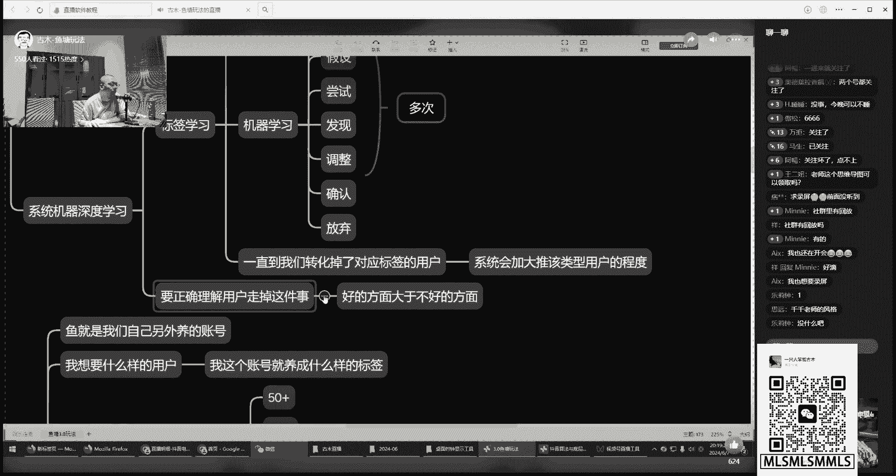

所以呃这个3。0的算法，这个3。0的算法，就是在基于这么一个逻辑的基础上面。

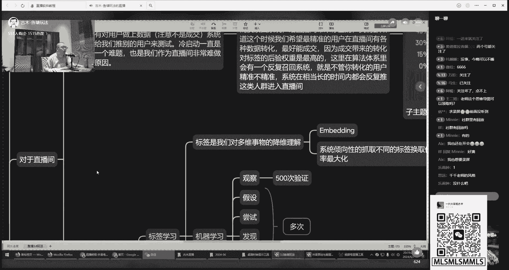

就是我要我的直播间里面，然后没有任何标签的时候。

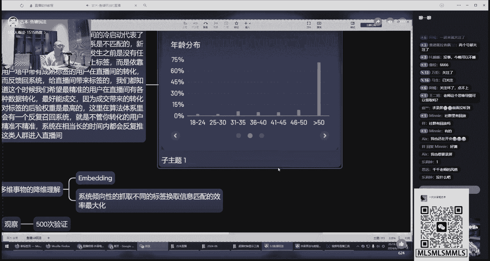

我希望的就是我能快速的去转化，我想要的一个标签。

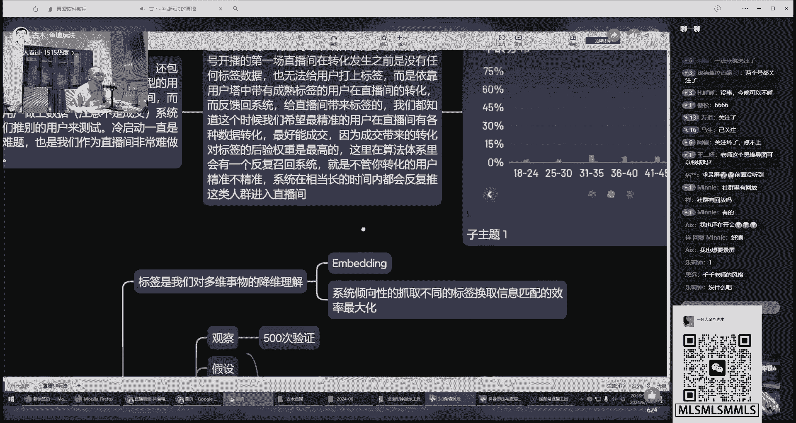

那鱼塘鱼塘玩法是什么呢，鱼塘就是我们养的一个另外养的一个账号，那你可以理解为水军，或者理解为我们自己养的另外的一个账号，就是我把这个账号养成什么样呢，我想要什么样的用户，比方说我做妈妈装的。

我非常明确，我想要50岁以以上的女性用户对吧。

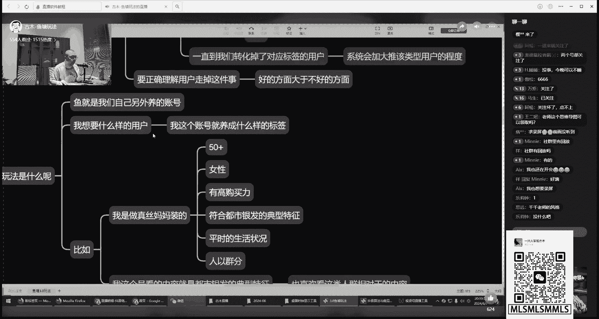

50岁以上的女性用户，她有高购买力，然后它符合都市银发的一个典型特征，然后他的平时的生活状况，可能是属于那种比较安逸的美好的，然后或者他平时刷的这个视频内容，都是属于这一类的啊。

因为你在做这些内容的时候，这个是抖音的一个嗯兴趣标签，然后这些东西是抖音的一个静态标签，因为你的静态标签其实是不太容易变的，就是你的静态标签不变之后，你的动态标签在变。

但是抖音会把很多静态标签跟动态标签的人，然后放到一起，这个叫人以群分，然后就放在一起之后就会发现诶，我今天把其中一个，这个真是妈妈的这个女性用户，然后她在我直播间下了单了。

那抖音就会在这个人以群分的基础上，然后去继续去把同类型的用户，然后拉到我的直播间里面来，这样我就能去转化更多的这个用户啊，这个时候我就要排除掉一些什么样的，就是年龄低的，然后男性用户。

或者说那个其他的一些不够优质的一些用户，购买力不够的一些用户，就会有一个这样的一个情况呃。

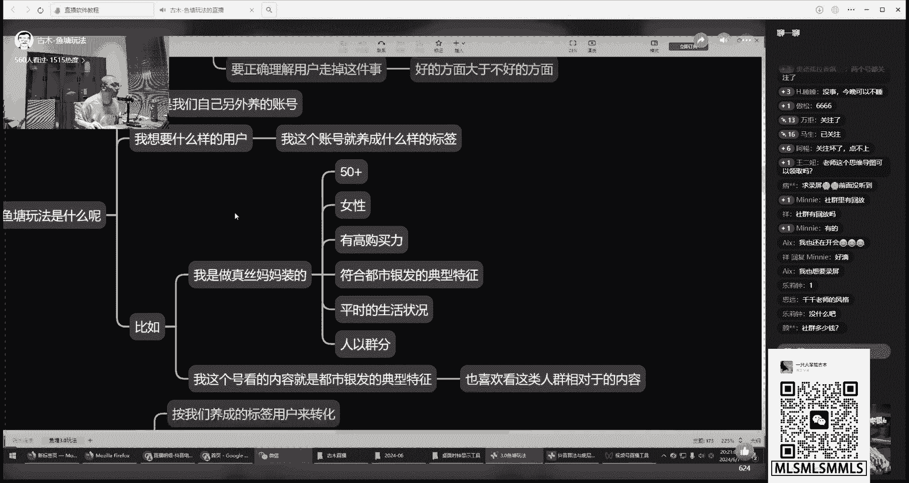

所以就是鱼塘，鱼塘就是我们可以把我们手里的这个号。

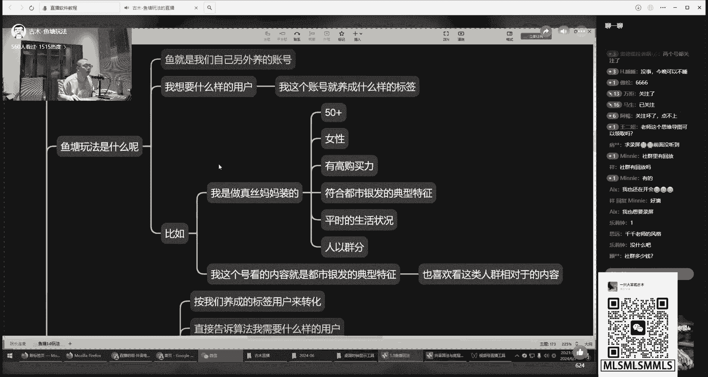

就养成一个这样的一个用户类型，然后我再去看其他直播间的时候，或者我在刷的时候，让系统辨别到我是一个这样的一个用户，我用鱼进到我的直播间里面，然后用这样的账号进到我自己直播间里面，来下单的时候。

我就会发现这个我的标签，在最一开始是不具备的时候，但是他进到我直播间里面来，他在第一时间能给我的整个抖音，然后直播间，然后第一场的时候快速的打出来这个标签，快速的打出来这个标签。

那它就会有一个什么样的情况，就是我会发现我的直播间，这个时候其他标签不够，但是我女性的这部分的标签她特别符合，然后抖音会继续加大，去推这部分用户的一个标签，那我就非常非常的适合。

非常快速的把这个用户的一个群体给它打出来，抖音给抖音是会给我们推这部分人的，同时，他还会继续再推一些测试的人群，会有一个这样的一个情况，OK吧，然后我们直播间里面你就会看到有精准的用户。

也有不精准的用户，但是他会同时存在于直播间，然后我们要做的是什么，我们要不精准的用户，我们让他走掉，然后留下的都是精准的用户，就会形成一个这样的一个情况。

嗯OK吧嗯OK吧，这样这样讲大家还清晰吗，可以吗，如果觉得还可以的话，扣个二好不好，然后我们来稍微做一下互动，因为我自己一个劲在这讲，我怕我会把整个氛围讲破坏掉，破坏讲破坏讲破坏掉嗯。

额因为我今天讲的这个东西。

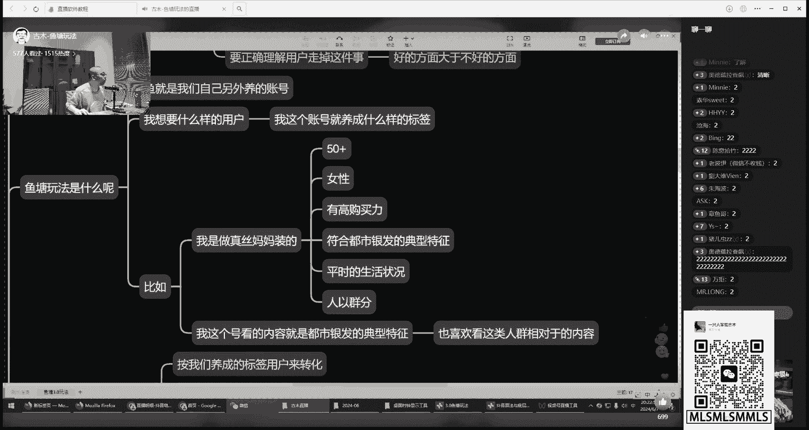

它可能会在后面有可能会呃被盗版课的，然后给盗版掉，所以我在这个地方先插一下，我自己的个人微信号，好不好，插一下我个人的微信号，因为这个差微信号放放在这里，就是说，就是如果说后面有小伙伴是看到盗版课。

进来的话，然后你们要知道这个是我个人的微信号啊。

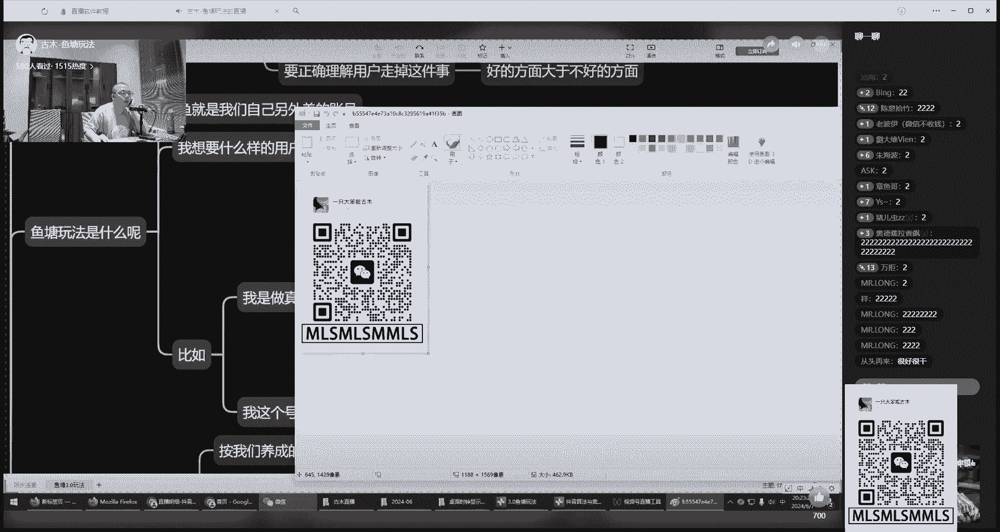

跟他们盗版课的微信号没有关，没有关系啊，因为之前有的人加过来说加过来，然后加错了，然后加到那个盗版课的一些那个人上面。

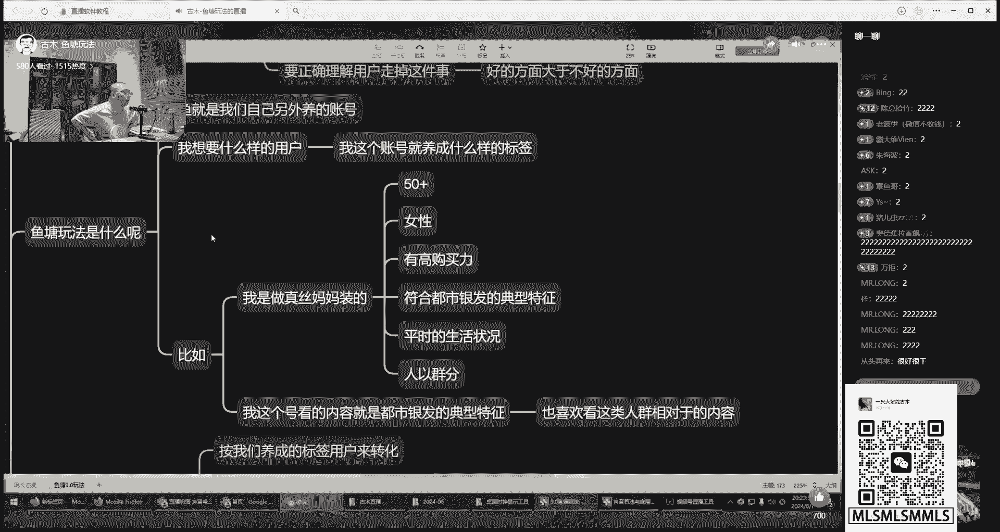

其实就是呃呃刚才那个啊。

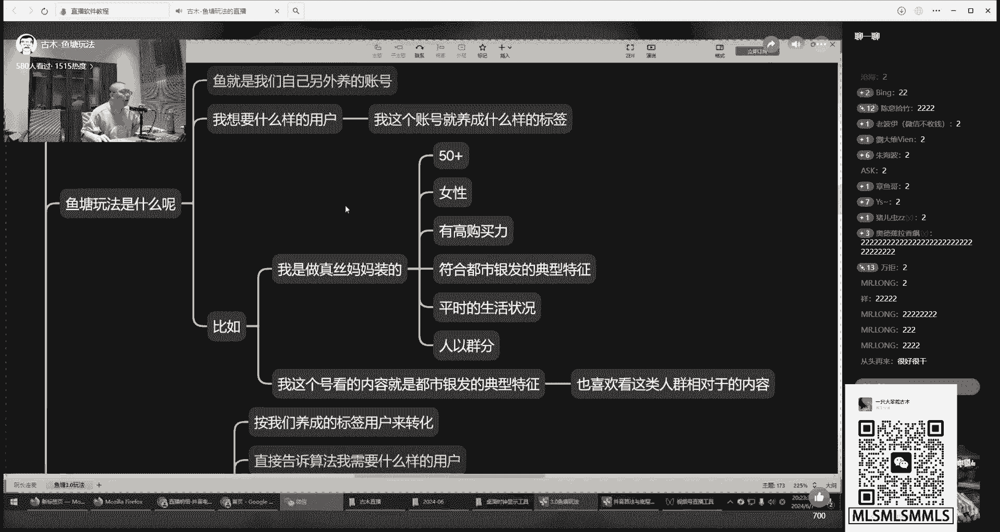

刚才那个微信那个是我个人的一个微信号，好，OK我继续来讲啊，继续来讲，然后就是因为我们涉及到，就是说好多用好多小伙伴，然后在群里面问，就是说我的鱼是要什么时候进入直播间，我鱼什么时候进入直播间。

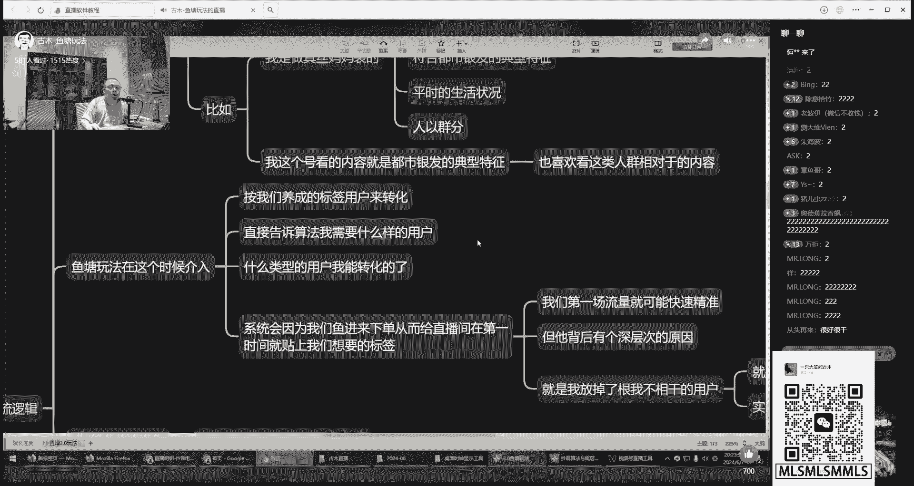

我什么时候打鱼，对吧，嗯你们你们这个中间有一些问题的。

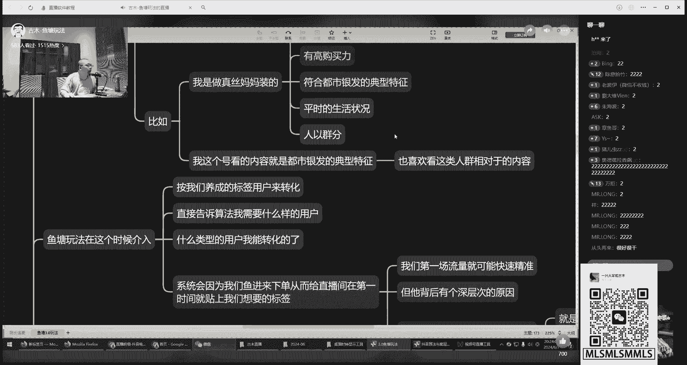

然后也可以问哈，也可以问，这是鱼塘玩法，在这个时候介入，就是第一个，就是我们把我们要的一个精准标签的一个用户，然后进来这个用户进来之后，我们的鱼进来之后来做浅层数据停留数据，互动数据加粉数据。

然后包括那个转化的下单的一个数据，这些数据然后都给他做足做齐，然后就等于是告诉了算法。

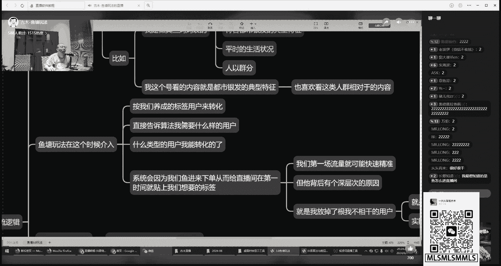

我需要什么样的用户对吧，什么类型的用户我能转化，那这个时候呃。

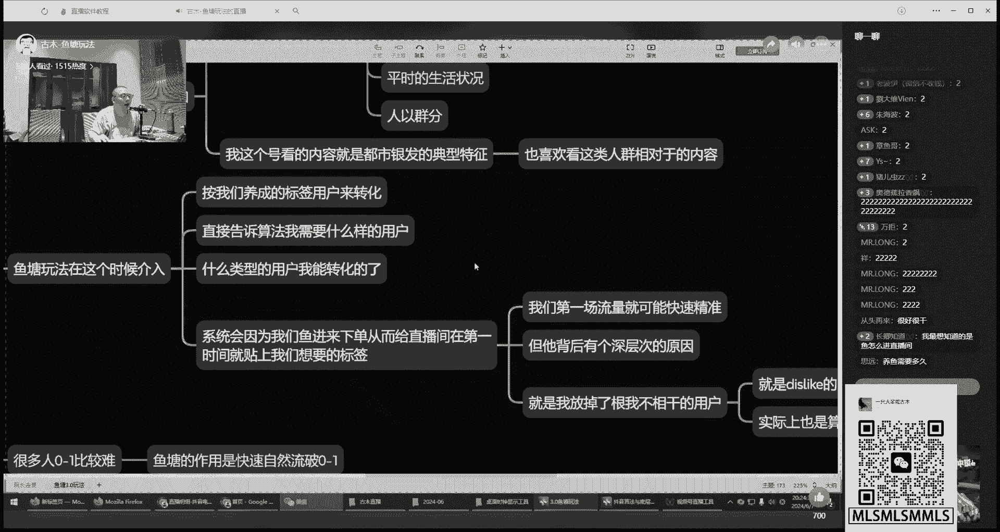

这个时候刚才那个去讲过了啊。

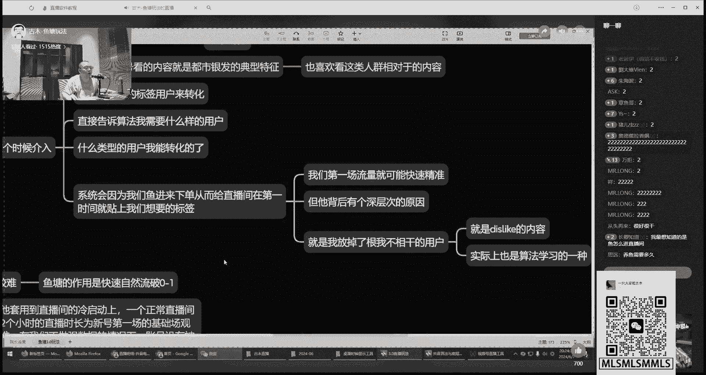

这个时候就是我们去做了这个动作，你就会发现呃你成交的第一单用户，你成交了之后，你会发现接下来的10分钟左右，10分钟左右啊，大家就是就特别记住啊，接下来的10分钟左右，抖音会根据我成交的第一单用户。

成交第一单用户，然后来给我推，跟第一单用户相关的这个用户群体进来，你就会发现如果前面你是用鱼来成交的，你的鱼是标签特别特别精准的一个用户，你就会发现抖音继续给你推的，还有一部分会是这样的一个用户。

那这样的一个用户就会有一个什么特点呢，就是你会发现这一类的用户，你点对点，然后去抓住他了，然后你就会发现他特别好成交，明白这个逻辑吗，就是我有一些用户进来犯的时候，我不用去理他，我不要去成交他。

我也不要去点对点，他一定是我抓住精准的用户去啊，成交精准的用户啊，因为我看到你们好多人在问这个问这个东西，然后是不知道是怎么样的啊，嗯不知道怎么样的。

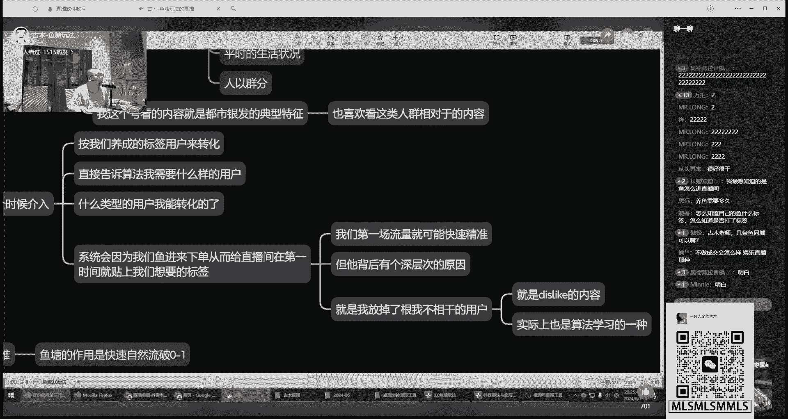

我我我给你们去看一下啊，给你们去看一下，那个我原来在星球里分享的，这个底层逻辑算法四。

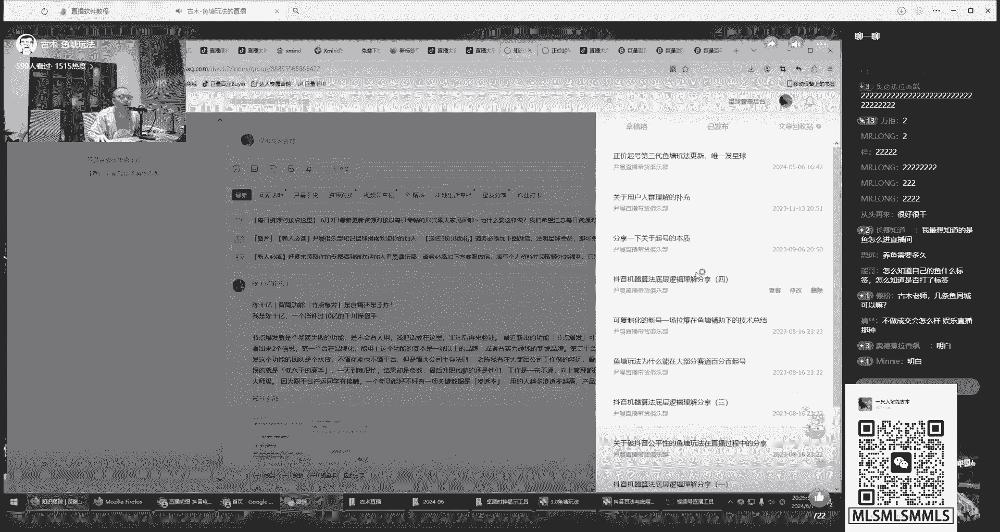

这个四上面有一个内容，就是怎么去看精准的用户对吧，因为我我其实这篇文章我是在讲用户的人，货场的这个人的这个点上面。

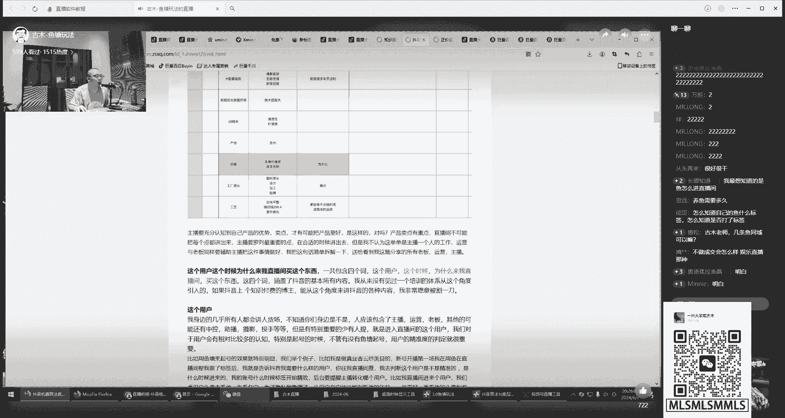

人这个点我又在讲用户，在讲用户的时候，就是我们怎么去判定呃，这个用户是不是我想要的，用用户我把它放大一点啊，放大一点，就是说那个我们的运营跟主播，你直播间里面一般来讲都会至少有两个人对吧，有一个主播。

另外一个是中控也好，是运营也好，那那个人是帮主播在直播间里面去找，这个用户是不是精准用户，就比方说我现在是卖真丝的，真丝的，香云纱的，真丝的衣服，那我新号开播第一场，就是你看我这里写的非常清楚啊。

鱼在直播间帮我做了标签之后，我就告诉抖音，我需要什么样用户，你往着我直播间就推这样的用户，那这个用户是不是精准的，然后就是我们来判断的，就比方说我们拿了一个用户，我们去点开了他的头像，然后去看他包。

这是我们之前做的，做号的时候，我们去看的一个用户，然后先去看他的名字，然后看他的头像对吧，你看他的头像是两只猫两只猫，然后我在这里已经写的非常清晰了啊，就是我把他名字给隐藏了。

然后名字他也能看出一些端倪，包括他的整个背景也会看出一些端倪，为什么是植物呢，然后他的背景为什么是植物呢，它的这个地方为什么包含植物跟猫呢，呃有一个非常有意思的一个点啊。

啊然后就是呃那个能不能说我不知道啊，能不能说我不知道我，我我跟你们分享一下，就是，怎么样去看名字，然后来找这个这个点，我看一下啊，哦在这里找到了，哎我把它整理到哪了，标签哦，我看一下我好像是不是整理到。

我看下我这个脑图里有没有，就是有一个额讲怎么样根据用户的一个头像，然后他的是什么内容来判断，那个用户是一个什么样的用户，就是比方说他是动物的还是自拍的，还是那个呃他是风景的。

还有这些东西他是在诈骗的这个人群里面，他有一个对于用户人群的一个判断，那这个判断其实我们有一些点，我们不要去搞诈骗啊，但是我们可以去学到他的一些点的一个内容啊。

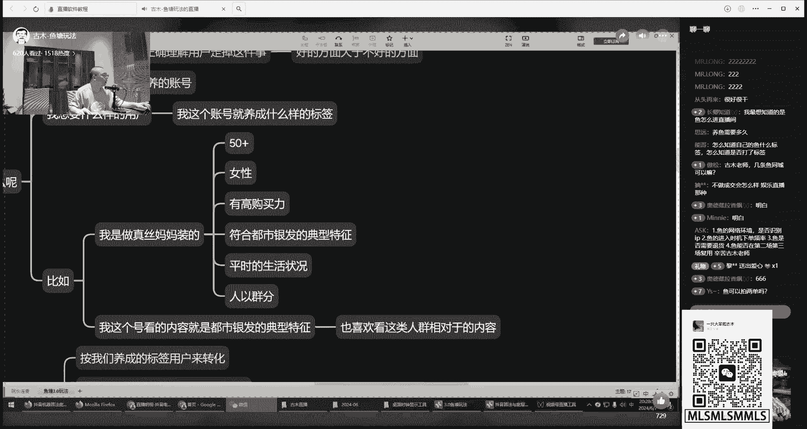

他其实这个也是一样的，就是比方说我们看到我看到这个背景，然后包括这个头像，然后我们再去看他的一个拍的一个视频内容，我们就会发现一些什么端倪呢，就是第一他养了很多猫，第二个他家里的一个生活状态是什么样的。

你比方说他的家里会摆这样的植物，然后他这边还有这样的阳台，他有闲情逸致去养花，而且最重要的他养的猫是两只，而且这两只应该是一个品种的，正常来讲，一般的人他养不到，他养不到两只一样品种的猫。

那就说明它的经济能力应该是还可以的，然后我们再去看，我们再去看它的那个呃，他平时爱拍一些植物呀，花呀，那就说明这个用户是一个有点岁月静好的，这种性格呃，就是他的生活是一个这样的，包括你看他穿的衣服。

他穿的衣服你可能能看到有一些缎面的，有些缎面的，而且他带一点中式风格的，那可能他穿的衣服的风格，跟我们的卖的衣服风格就比较匹配，然后比方说我们再往下看，他的一个平时是一个啊，比方说爱旅游啊。

然后甚至他爱看这个展览的这一个，那就说明他的条件都还可以啊，你看我之前跟大家分析的，就用户的头像是两只猫，然后在视频里看到很多拍摄猫的，说明这个用户的时间是比较充裕的对吧。

然后我虽然不知道这个猫是什么品种啊，但是它一定是如果是两只一样的话，他一定是有益，而养不是说那种领养的，他的经济条件应该是还可以的，然后他的背景头像是荷花，那就说明他的心态应该不是很卷的。

我这里写了带一点岁月静好，然后又能撸猫，然后他是能享受生活的，就说他的生活经济条件是可以的，然后他是能购买我们高客单的一个品种的，那个衣服的，然后他又有时间去旅游。

然后他的这个第六个视频里的这个桌子是红色，木质的，还有茶壶，那就说明他有时间，然后来去喝喝茶呀，泡茶呀，那就说明他的时间是非常充裕，然后一般来讲，如果经济条件很差的人，他很可能他没有这么精致的这个呃。

这么充裕的一个生活状态，然后又回过衣服，又回过衣服上面，因为我们之前卖的是真丝的，然后带一点中式风格的这个衣服，然后这样一看，然后而且他是在年龄看了一下，可能在30~40岁，家庭条件还可以。

然后我们就会得出一个，这个用户画像的一个感知，这个感知可能在十秒钟之内，我们脑子里可能就能形成了一个，他就是一个年龄在30~40岁，家里条件不错，喜欢中式风格，岁月静好的女生，她喜欢穿连衣裙。

因为他的定位是工程学院，所以他有可能是个老师，也有可能是个种花的小老板娘，所以根据这个情况，就是我已经知道他想要它符合我想要的人群了，那这个时候我觉得发现这个用户非常精准，那如果我作为一个中控。

或者我作为一个运营，我就要提醒主播，然后无论如何都要去转化它，无论如何，这就去转化它，这个时候我点对点就变得特别特别的重要，所以主播在这个时候，然后嗯要准备好自己的话术内容，就是我这个时候我找到一个呃。

非常那个精准的一个用户，我怎么样去转化它对吧，嗯你们在群里你都知道我在群里给大家发过，就是那个叫什么内容啊，就是强转化的一个强成交话术对吧，强成交话术根据不同的层级，你们可以去试探这个用户。

因为他很精准之后，他可能进来不会立刻就走，所以你用几秒钟或者十几秒几十秒的时间，然后去跟他聊天，这个时候你必须在第一时间，然后去触动他，如果他跟你有互动，那基本上80%的可能性都会成交。

所以就当你打了鱼之后，进来的一些用户，然后比较精准了之后，你就会发现，你接下来的成交会变得非常非常的容易，而不是之前的一个泛泛人群的状态，OK吧，这样这样来讲还可以吧。

就是你们觉得我这样来去给你们去分析一下，我们怎么去找这个用户的点，然后怎么样去找一个精准用户的点。

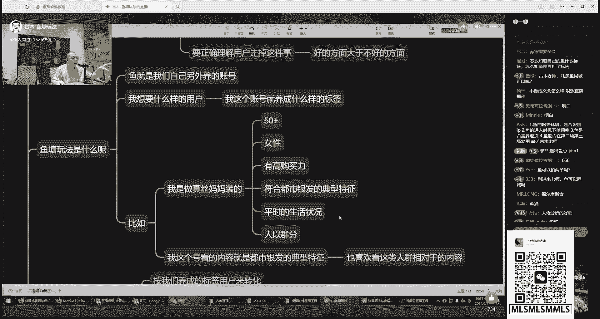

还可以吗，你们觉得像这样去去分析还可以吗。

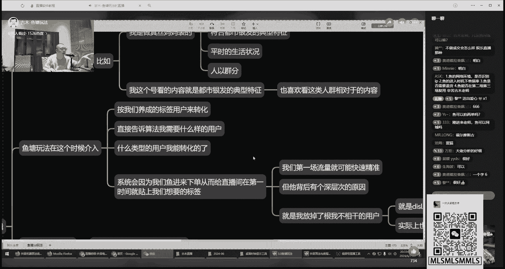

可以的话，扣个一好不好，可以扣个一好不好，OK吧，不知道会不会讲的太枯燥了，你我因为掉了一点点人，然后我不知道会不会讲的太枯燥，如果你们觉得我讲枯燥了，然后也可以跟我讲一下呃，我讲的枯燥了呃。

如果你们有什么问题，你们也可以问一下，我有时候可能看到你们问题，我我我又不好去回答。

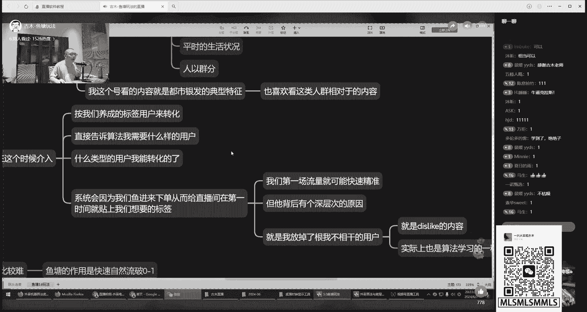

因为我怕打断我的思路啊，好不好，如果你们觉得枯燥了，你们不喜欢这样的内容，那也没有关系，然后你们可以走这个这个没有关系。

因为我在跟你们讲鱼塘起号这个玩法的时候，因为它是最符合底层逻辑的这样的一个玩法啊，OK吧。

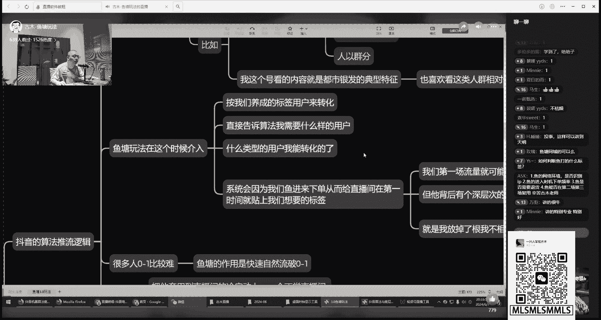

然后包括我们不管是在用什么起什么方式，在做号的时候，他一定会涉及到这些内容啊。

只是说我觉得鱼塘玩法是最，最符合它算法特征的一个内容，因为我自己平时会看很多算法的一些内容，然后根据这个算法，然后来决定我们要做什么事情，OK吧，而且我今天讲的很多东西。

可能会跟你们平时听到的一些关于知识，付费的一些内容点是不一样的，就是可能会改变一些嗯大家的一些认知点啊，因为我不割韭菜，我也我目前也没有做培训，所以我给你们上的这些东西都是呃非常干货的。

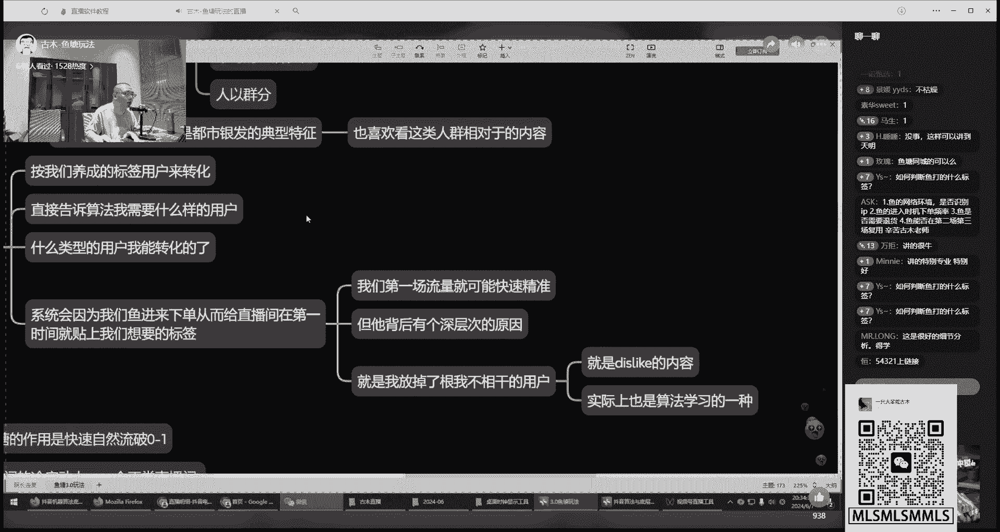

这个点，有可能这个东西你们在别的地方花3万块钱，都未必会学得到的一些内容点嗯，所以我自己觉得他还是蛮蛮值钱的哈啊，但是因为为什么去分享这些东西呢，真的从建立这个社群开始到现在，我一直觉得是社群。

我在社群里面的这种分享，给我带来了非常大的一个帮助，然后也给我改编了很多东西，所以就是我在社群里面去做这样，分享内容的时候，也希望你们在社群里面也可以多多的分享，好不好啊，OK吗。

你们你们觉得愿意在社群里面，然后去分享你们认为肝的一些东西，像我一样，然后愿意真的去分享的扣个六吧，好不好啊，因为当每一个人都去分享一些好的一些点，然后牛逼的一些东西的时候。

真的我们的社群价值会变得非常非常的高，然后好多人也会因为这个情况，然后去找到你，然后你就会发现好多人能跟你建联，然后你有一些好的想法或点子的时候，社群对大家的价值真的是会非常非常大啊。

然后因为我以前在杭州的时候，我当时也算是比较OK的啦，然后就是我身边的很多运营都是属于嗯，讲是什么样呢，就是大家有一点东西，然后就会藏着掖着，很多的运营都是从中控，然后直接说我我好像带了一个什么号。

然后啊这个号播起来了，然后我播了一个月，播了500万，播了1000万，好像是非常牛逼的样子，实际上很多时候它其实不是，我们绝大部分的运营在在讲这些东西的时候，他根本就没有触及到底层的一些内容点。

包括现在绝大部分市面上的运营，还是这样的一个情况，我为什么来给大家去讲底层的这个东西，就是我希望的是能帮助大家，嗯嗯在那个抖音的下限上面，然后能做一个提升的，而且我提升的上限的幅度也非常大。

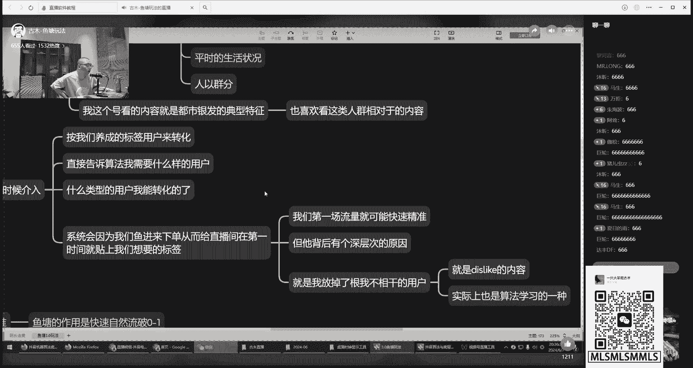

因为我在讲这些底层逻辑的时候，我可以肯定的是，全网任何收费的这种收几千块钱，几万块钱的一个知识博主，然后他讲的一定不会有我系啊，所以就是大家如果现在在直播间还在听的，那我觉得其实我也非常感谢。

因为从我刚我刚开刚开始看，从开播到现在，其实人数掉了一点点啊。

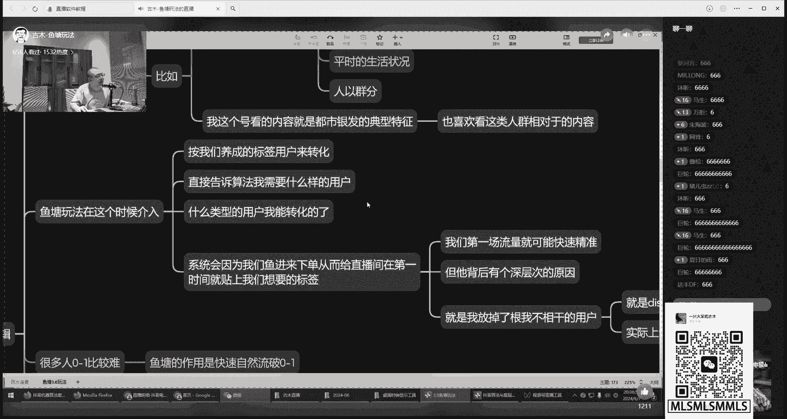

就掉了一点点，但是我是非常开心的，那就说明我讲的东西，其实还是有挺多人愿意听的。

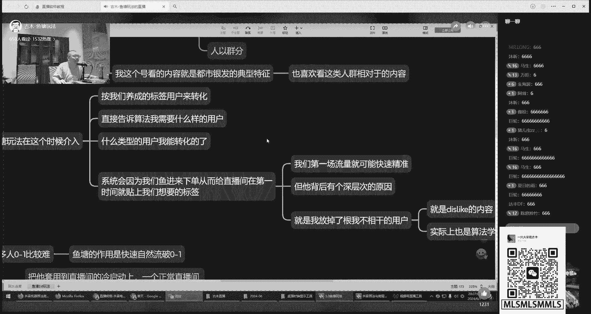

呵呵嗯还可以吧啊，然后还有一个就是我再跟大家讲一下，就是额因为我要给大家去看一个数据了，就看一个数据，就是嗯你们允许我把这个东西给弹出来哈，嗯哎弹到了这里，因为我我要遮盖掉，我们最近做的数据的一些内容。

就是嗯我我看一下昨天吧，昨天我不是在跟院长连线吗，昨天不是在跟院长连线吗，跟院长连线的过程中，然后我们有一个号也爆了，然后我来跟大家去分享一下，就我们最近打的打的号比较爆的，有一个点就是就什么内容呢。

我把它发出来拖过来一下，天之星爱雁，云随月开伤痕，昨天在跟院长连线的过程中，然后那个号，看山海信号，哎我怎么能把它调的更清楚，爱雁云随月海，山海额，就到这里吧，这里应该清晰度应该比较高了。

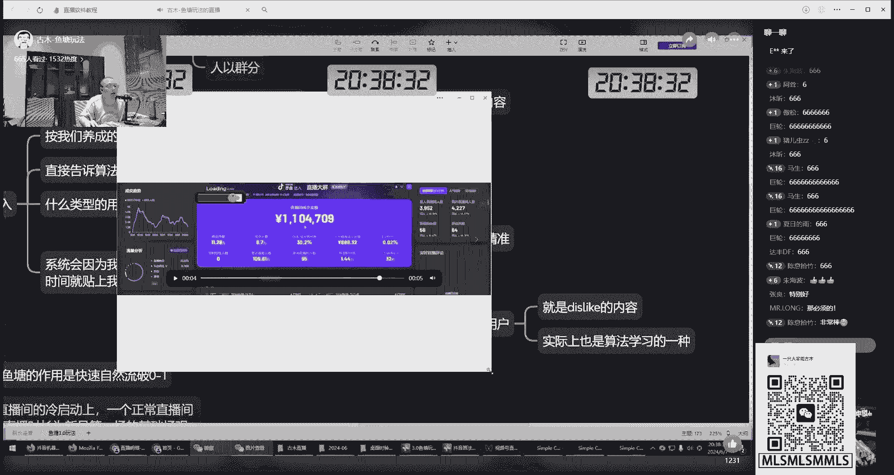

啧昨天晚上的时候啊，你看大家可以看一下直播推荐，然后是一个纯免费的一个自然流量，然后是播了九个小时，播了九个小时，我们在最一开的最一开始的时候，就在这个阶段，然后就把整个的流量，然后搞得很精准。

然后非常非常精准，所以我就是从很精准的这个点，然后去放大的，那这个是属于第一场可能就拉爆的，那也有的号是属于第二场才拉包的，或者后面才拉包的，但可以看一下，就是呃所有拉爆的一个号的一个点。

一定是在整体的一个流量，精准度偏高的一个情况下才可能做得到的，呃，包括如果说像我们是去做那个先放大流量，然后再去做精准流量的这种，一般在这个时间点，就是这个时间小时内，第一场基本上做不到这样的一个情况。

有可能我需要洗到很多的人群，然后才有可能能做到这个这个点，所以就是现在自然流量第一场拉爆到100万的，这个情况，已经全网已经不多了，已经不多，现在比较少见，现在比较少见，然后嗯嗯这是昨天晚上一个情况嗯。

到今天中午到今天中午后面有一点问题。

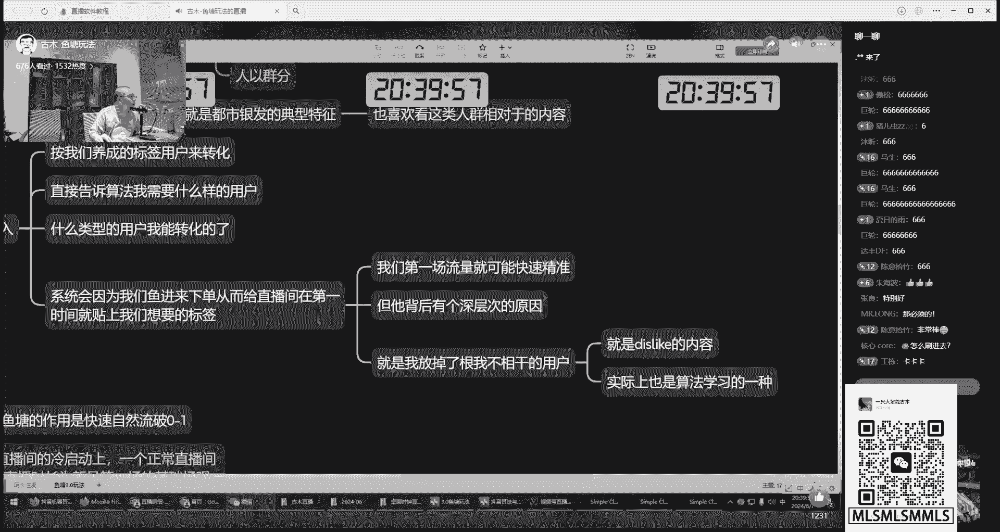

然后给大家去看的另外一个数据是什么呢，我把他拉下面一点，就是我看一下这个号这边有一个号，这个号是诶嘿嘿嘿，好像没挡住啊，这个号是我们上个月，因为我们这个月搞了挺多号的。

就是大概也起了十几个这种一场拉爆的号吧，那这个号也是属于一场拉爆的，因为我这边很多数据呃，是没有放在我这台电脑上，这台电脑上，我刚才来准备开播的时候，其实就有两个号在这个上面。

所以我就拿这两个号数据来跟大家去分析一下，因为我不知道，一会儿我去分析抖音的这个这个点，不知道会不会被抬走啊，如果被抬走，你们你们记得，如果被抬走，比方说抬了10分钟或者要重新开播的话。

一会你们要记得进来，我是冒着生命危险在给你们去分享这个内容，点啦哈，我看一下，这个是5月份的新号第一场啊。

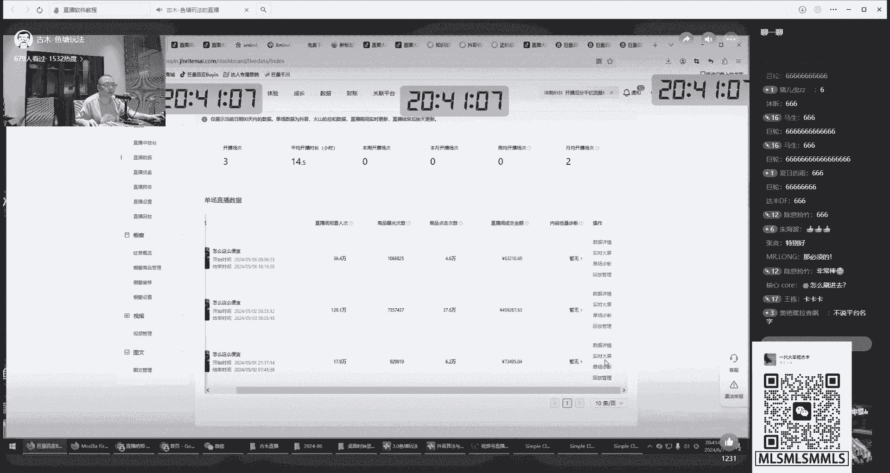

哎哎哎又没挡住我去。

额因为他前面的时间有一点长啊，前面时间有一点长哦，好的好的，谢谢你们提醒，就是我们从它的呃核心里，核心数据里面可以看到最初始的一个流量情况，就是嗯离开人数就不看了，然后实时在线人数和成交人数。

我们把它拉回到最开始的一个数据情况，然后你们其实可以看到，看到一个信号开播的时候呃，因为这个品哈哈哈这个品，因为这个品其实是很有很有吸引力的一个品，所以品是OK的，我为什么来跟大家讲，就是我们的直播。

我们会花八80%的时间在品上面，然后其他的20%，然后可能是在主播话术方面，然后就是这样的一个逻辑，就是我在开始在开始打的时候，我的品就已经能帮我直播间里里面，去塑造一些用户的一些精准度了。

所以你会发现，其实这个时候在前面时候没有成交，这个时候有两单成交可以看啊，有两单成交，那鱼的作用在这里是什么呢，然后能看到吗，很多时候这个时候会有鱼的作用，然后到这个时候他可能都没有成交的。

那这个时候就又有开始又有陆续成交了，这个时候又有陆续的人人数成交了，你就会发现这边你比方说你这边打了鱼，然后过一会儿，然后这个过程中可能会有一些精准流量，然后但是你要直播间人，因为比较少的。

你这个时候成交比较难，成交比较难，但是到了这个时候，到这个时候你继续去嗯，继续去成交它的时候，你继续去打鱼，或者你继续去成交这部分用户的时候，你就会发现你的后面的这个时间点，就会越来越多的精准流量。

然后给你推荐进来到这里啊，OK到这里，包括到这里，都会有一些越来越精准的用户给你推荐进来，这个时候我们主播要去做的一个什么事情，就是我要去成交这部分流量，成交了这部分流量你就会发现，然后到后面呢。

就是这个时候的数据应该其实还可以了，就是因为我在线其实也并不高，这个时候我从个位数的在线，从个位数的在线，然后很快在这个阶段，然后大概20多分钟吧，然后他会跳到半个小时左右，他会跳到这个人数基础上面。

然后这个时候开始推流啊，开始推流，然后到后面你看，然后流量会流量在线会持续升高，然后持续有转化持续升高，然后就变得你就会发现，为什么这个时候相对来讲会越来越好做，是因为人群越来越精准。

人群精准比例会越来越高，然后但是他这里有一个点是什么呢，就是就是我会把这个点你们去看一下，我为什么来给大家去拆分这个曲线，这个曲线就是这个绿色的线，是进入直播间的人数，而这个蓝色的线是直播间的停留人数。

你就会发现呃，在前面的时候，你把流量拉起来之前，把流量拉起来之前，然后你的流量是不精准的，为什么，这么说呢，因为你会发现你这个绿线在上，绿线在上，那个这个时候就是说推流的人数是其实是呃。

这条曲线在上的时候，就说明你直播间的那个哈哈，你直播间的一些内容点，然后就是用户的精准度其实是不太够的，是不太够的，但是到了这个时候，你的直播间的精准度就会放大到所有用户，绝大部分的用户。

然后就会很精准，这个时候抖音还在洗你的人群，因为你在前面已经告诉抖音，我要什么样的人群了，但是抖音在这个过程中，他会给你要的人群，然后同时呢他还会给你另外的人群，这个在算法里面它就有很多种。

就是它其实一直会给你不同的算法，推到人群在里面，因为它不仅仅单单会给你一种人群，哪怕我们认为说我们这个时候已经去做的，非常精准的这个人群了，非常精准的一个成交了，但是你会发现算法它一定是要多方面的人群。

来测试你的，O，这个时候我们在只有我们想要的人群，成交的越来越多的一个情况下，越来越多的一个情况下，然后抖音就知道你直播间要的是什么人群，他这个时候就会快速的去放大，从这个时候已经开始放大了啊。

已经放大了，然后来测试你要的直播间人群，但是他测试来测试去，就是你的主力人群，你成交的越好，然后他会越来越多，而且这个推流里面他除了小时推流，它还包含了那个其他的推流，这个里面包含了实时的推流一些内容。

你就会发现这个在线它是它不是一下包起来了，在这个时候，然后到这个时候到这个时候，它包含了小时推流的那个因素在里面，同时在这个时候也包含了小时的推流因素，这个这个这种的都是小时的推流。

然后在这里它就会出现，然后这部分也是你可以把它理解为极速流，但他这个极速流跟这边的极速流是不一样的，这边的极速流是属于比较差的，然后这边的极速流的用户精准度是比较高的，所以从这个时候开始。

整个的直播间的成交订单量，然后才会增加，OK吗，这样讲这样讲能理解吗，就是你想快速去打爆一个直播间的时候，你快速去打包一个直播间的时候，包括你一场去拉爆的时候，因为我们其实是已经拉爆了很多的号。

这是其中的其中的一。

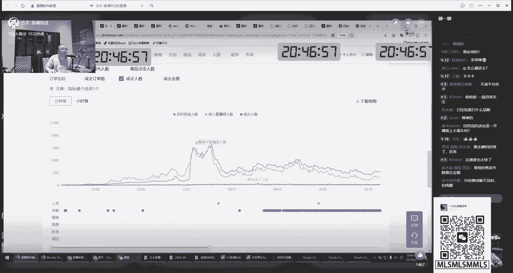

其中的一个吧，然后包括看一下。

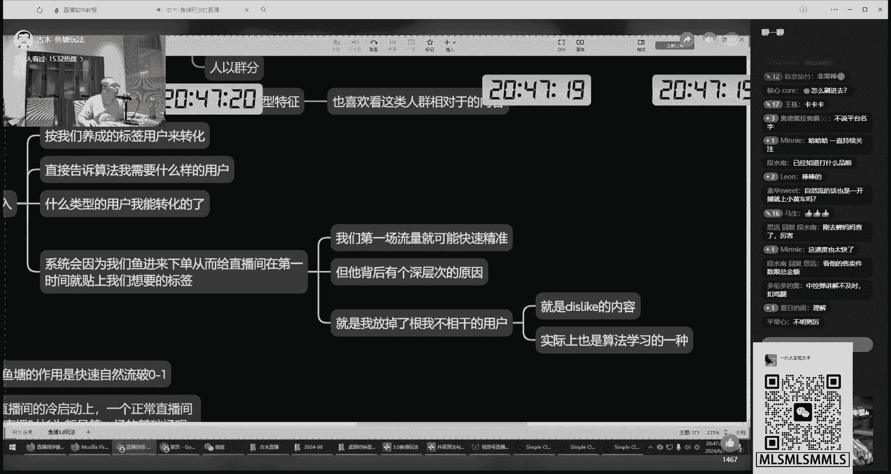

啊看一下嗯，这个我看是几号的啊，这个就是前几天的一个号啊，前几天的一个号呃，他就是，第一场开播，然后就卖了200多块钱，然后第二场开播，然后就是40多万，第三场开播也是40多万，呃，其实还可以吧。

我觉得还是还是挺香的一个账号，就这种号做出来，他的佣金大概是佣金大概是哎，看一下佣金，哎呀佣金我这边没截图，我又怕有些东西展示太多了，反正嘿嘿嘿，你们你们看看就好了，好不好，然后我给你们看一下。

就是怎么去理解去理解这个内容点，就是在线的人数人数情况，我靠这边还有图片诶，那这个不给你们看了。

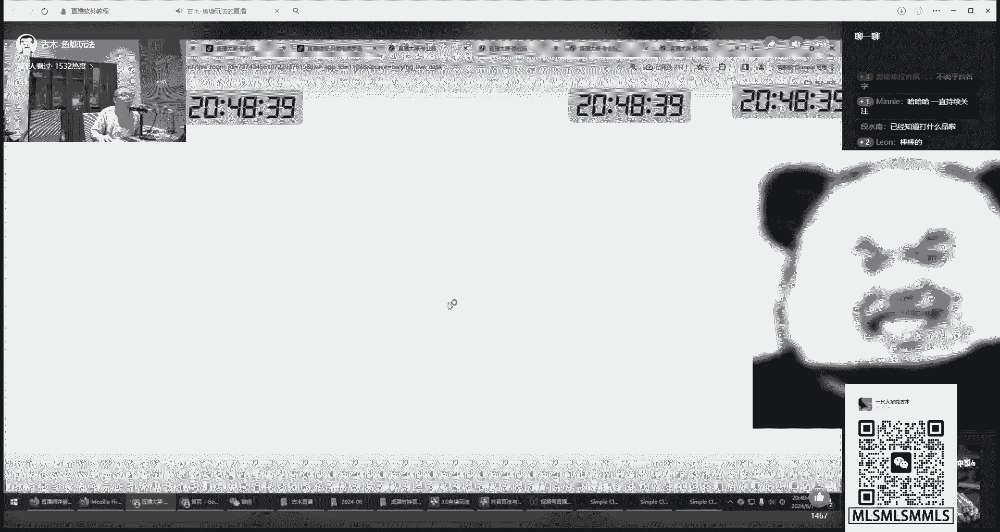

所以我们在社群里面，然后我们去给大家去做了这些软件的一个赠送，因为这个软件赠送这个小不点啊，哮天犬在某宝上面大概是40多块钱，50块钱左右一张一个月，一个是50，这个这个是45，这个是50左右。

然后这个技术在外面，如果你找人去学一下，可能要2000多块钱吧，可能可能是至少2000多块钱啊，然后包括卡口碑分的技术，外面比方说卡一个分，我目前知道的是比较便宜的，包括我自己找人卡过的是700分啊。

然后呃700块钱，然后就是把口碑分卡没，然后就是你该投放可以投放，然后你也不会受口碑分低的影响啊，小不点是有什么功能，就是自动弹窗的，自动弹窗的就是你后台，然后自动回复，自动弹窗，然后自动发言。

然后还有好多的一些功能，哮天犬是什么呢，就是把你设置的一些用户，然后啊拉呃那个你不喜欢的用户，然后拉黑掉，然后包括有一些用户去分享你直播间的，或者通过搜索进来的，或者在你直播间里面，然后发了什么样言。

然后你不你不想要的一些关键字的一些用户，给你踢掉啊，就是帮你直播间里面去肃清这样内容的嗯，111个一一个软件啊，如果没有用过的，你你本身也不用，那你就不要用，因为这个是我们经常要做很多号。

然后要要用到的一些点。

然后就是呃呃我个人的一个微信，你们你们大部分都是有我微信的吧，然后有没有没有我微信的，是不是通过视频号本身进来的，如果是这样的话，你们可以加我一个微信，我为什么把微信放大到这个大。

因为这个今天讲的这个东西，到时候肯定会被盗版科的一些人，然后给盗版去，所以就是我也跟大家讲一下，如果你是后面听了我的盗版课，然后内容你觉得我们社群还比较干的，你想加我的，然后你可以扫我这个社群呃。

扫我这个号，然后这个是我的一个号，然后到时候然后联系我，然后就可以了，然后也非常欢迎大家加我们的社群，我就是我，我先我先问大家一下，我们现在社群里面的人有多少是我们社群里的，过不去。

有有多少是社群里的小伙伴，给大家扣个八吧，好不好，来证实一下我，你们觉得我我们这个社群是不割韭菜的，然后氛围还可以的，然后你们觉得性价比非常高的，有价值的扣个八吧，好不好。

我们给所有没有加到社群里面的人看一下啊，然后你们把八扣起来，然后确定我们不是那种去割韭菜的，然后确定是有价值的，然后能帮助到大家的，大家把八扣一下好不好，嗯也欢迎，就是我们现在所有没有在社群里的小伙伴。

然后有机会，然后能加入到社群，我们一起玩，然后包括我后面有一些评九分屏，然后我可能也会分享给你们，然后大家一起去打，然后今年在这样的一个环境状态下，然后可能好多好多人可能赚不到钱，或者好多玩法。

然后在已经失效了，包括B站的一些玩法，然后很难做的情况下，我如果我能知道的一些点，然后我尽可能的在社群里面去帮助大家，在今年的这个氛围下，然后去赚到钱好不好，那这就是我去做社群的一个初衷。

包括我们鱼塘这个社群也是我们想做的，我社群最开始就是希望说是。

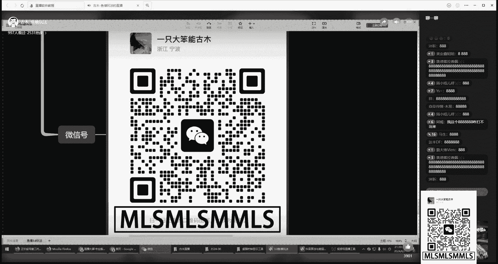

能帮助到我们所有人，然后进到直播呃，进到社群里面来，自己没有鱼的，然后我们去帮大家去打鱼，就是比方说你只有三条鱼，你只有五条鱼，但是社群里面好多小伙伴，是跟你做同一个赛道的，那大家的鱼就可以互相共享。

你就有很多很多条，然后差不多的鱼，大家的鱼就可以共用了，这是我做社群的一个目的，然后还有就是在社群里面，我会我分享了很多很多的内容，包括这个是之前的我好久没更新了，包括后面，然后现在更新到呃。

算那个鱼塘玩法3。0的，然后也希望大家说是，因为这些内容都是无偿分享的，就是我希望说我的社群，是一个非常有价值的社群，社群虽然运营一年了，但是我到目前为止没有收到一个差评，就是总体上啊在这种情况。

因为昨天院长问我嘛，说我最讨厌什么样的人，其实我当时有点回答不出来，因为我可能是我的性格的原因，就是我跟很多人其实是没有冲突的，然后不管加到社群里，还是没有加到社群里的人。

然后啊我觉得都还是我都能接受啊，然后如果你能加到社群里面来，我就希望我们可以一起玩，如果你没有加到社群呢，然后有些问一些问题，我可能也会回答。

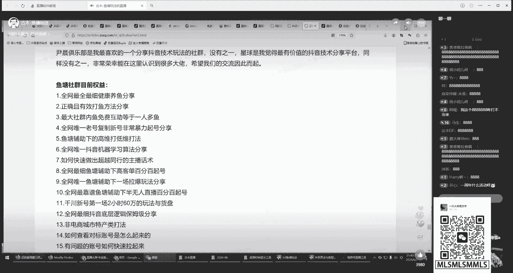

但是但是我要必须要说一下，我就是最不喜欢的一个点就是什么。

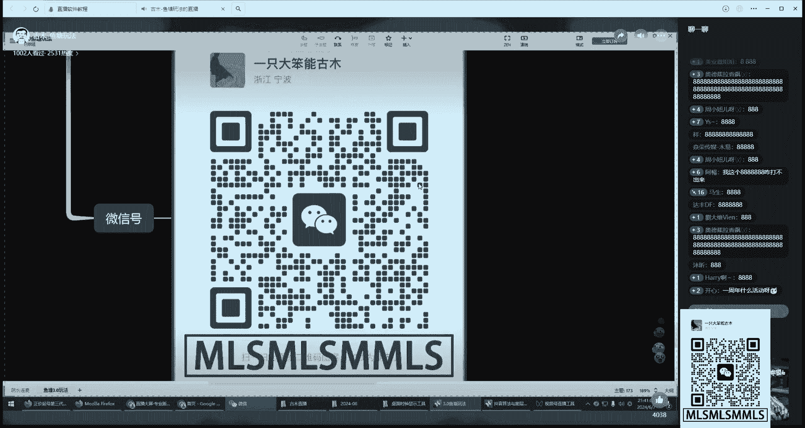

就是我最不喜欢，就是你来了之后，你还问我这个东西还能不能玩，你再问我无人能不能玩，或者问我呃鱼塘能不能玩，那我这个这个点是真的是让我非常不爽的，就是我已经在讲这个东西，然后它有多好做，只要抖音不倒闭。

它的底层逻辑就不会变，它的底层逻辑不会变，鱼塘玩法就不会变，然后OK吧，然后嗯对，我再跟大家讲一下，社群的一个一个入群的一个门槛。

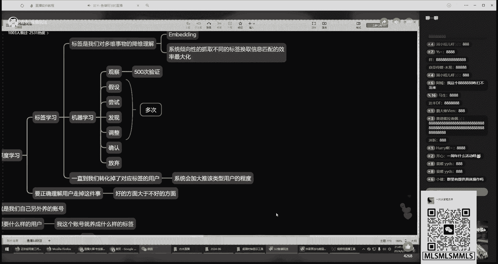

然后是999好不好，如果你们觉得是在割韭菜的。

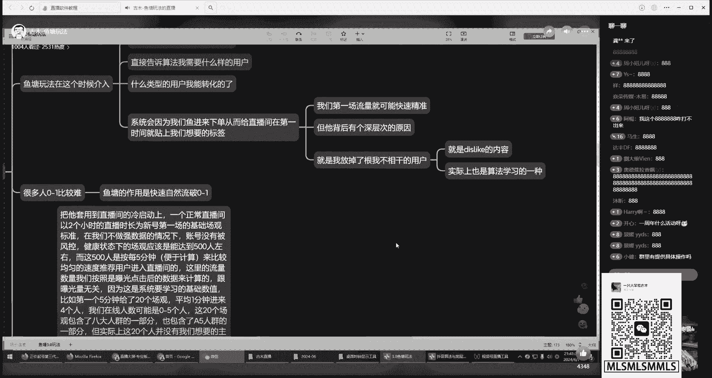

你们不要来，如果你们觉得社群的内容还一直还不错，然后你比较认可我或者认可我们这个社群，然后我们这个社群因为更多的是分享技术嘛，然后是在全国都是一个，在哪怕在杭州都是一个非常高端的一个社群。

如果你是在一个小城市里面，你找不到很好的人，非常牛逼的运营，然后来沟通，然后来了解抖音的实时变化的这些信息，然后你希望有你，你遇到了一些问题，然后没办法解决，我都希望你来到社群里面。

因为我希望社群问问题的人越多越好，然后社群越热闹越好，因为我的性格不是一个特别擅长沟通的人，因为我性格比较直，然后我可能就是说我不会调动很多的氛围，但我只会聊技术。

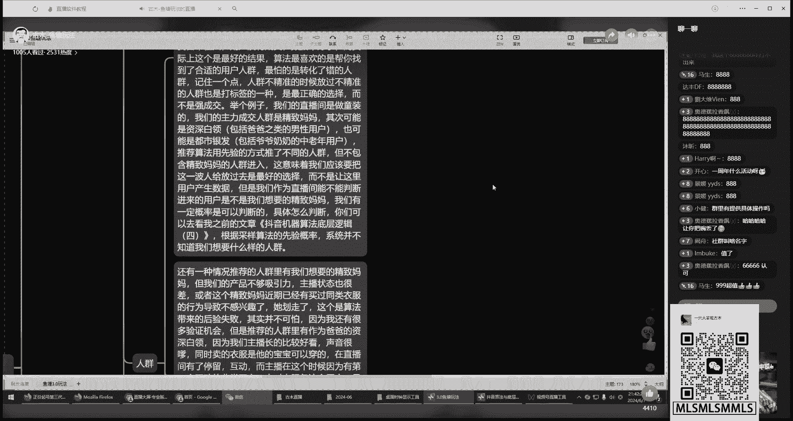

所以在我的社群里面，大部分情况都是一个以聊技术为主的，一个一个内容点啊，所以我也欢迎就说如果说你喜欢技术，喜欢聊技术。

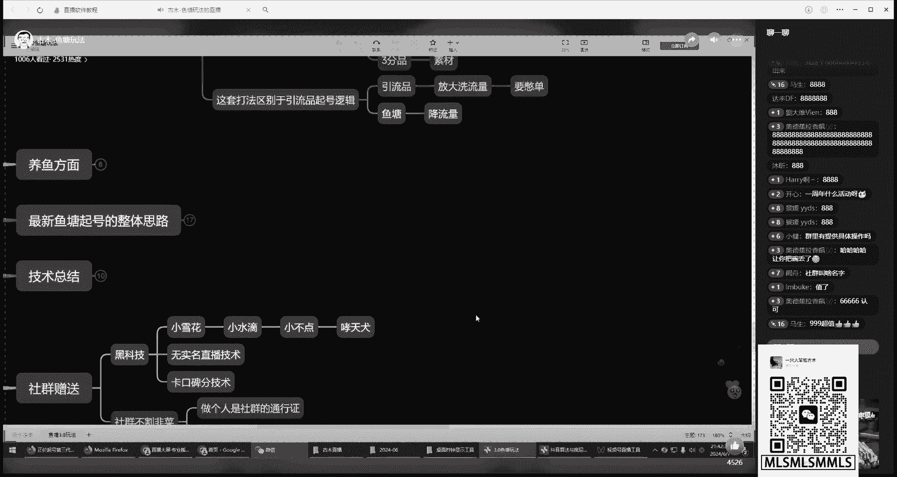

喜欢喜欢运营层面的一些东西，然后非常欢迎大家。

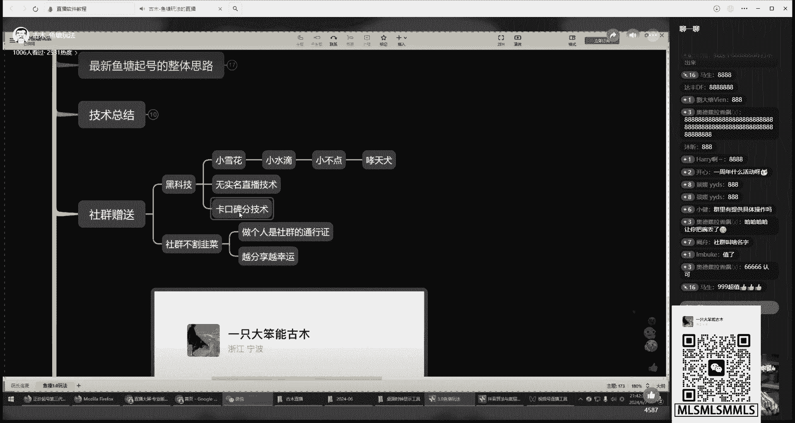