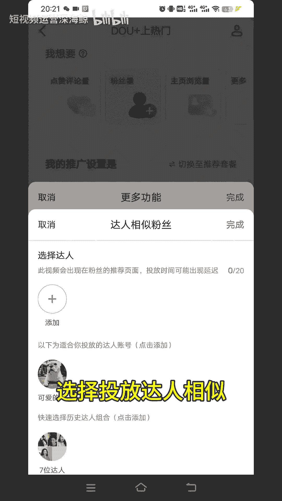

# 只需四步，快速给账号打上标签 - P1 - 账号已注销 - BV1YHhQeBEUE

打上标签真的太香了，我打上标签才不到一周的时间，我的播放量就翻了一倍，今天我就把所有打上标签的方法分享给你们，第一步抖加投放的时候，选择投放答案相似。

选择你十个同行业的对标账号去投放，这样子慢慢的你投久了之后，你的账号就会打上你想要的标签。

第二步，打开抖音创作者中心，在抖音创作者中心里面找到互动管理，然后在互动管理里面找到重点关心，然后添加十个同行业的对标账号就行了，然后第三步，在抖音创作者中心里面找到创作灵感。

然后在创作灵感下面找到关联视频搜索，我们在发布视频的时候，添加几个同行业的关键词，慢慢的这样子你也会被打上标签，然后最重要的是第四步，一定要坚持不断的去发锤子的作品，你不要今天发美妆，后天发美食。

Why，后天又发法律，发咨询什么的，这样子你发的作品太杂太乱了，抖音也不知道你是想要做哪一类的账号，他怎么给你打上标签呢，所以说一定要不断的去发锤子的作品，就是你是做哪个行业的。

