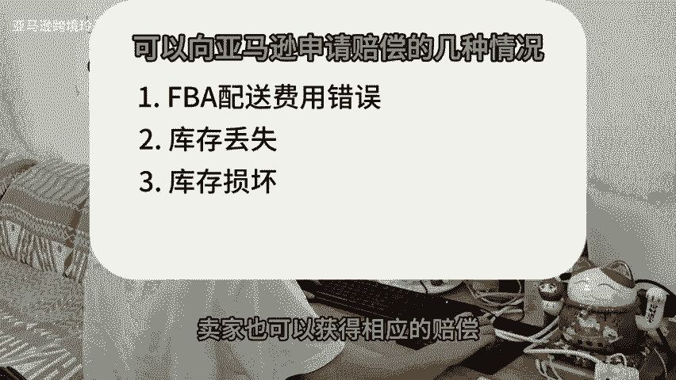

# 可以向亚马逊申请赔偿的几种情况，这些机会千万不要错过。 - P1：studio_video_1728088904282.mp4 - 亚马逊跨境玲子 - BV1bN1XYJE3h

🎼下面这四种情况可以向亚马逊申请赔偿，你都知道吗？一FBA配送费用错误，不少亚马逊卖家会因货物重量或尺寸错误，导致FBA的配送费用超额收取，我们要多留意FBA收取的费用，如果有差异。

就去申请产品的重量尺寸重新测量，不然影响利润状况。2库存丢失，货物在运往亚马逊运营中心进入亚马逊仓库，最终配送至顾客过程中会经历众多流程，因此很容易造成货物丢失的情况，特别注意。

从2024年10月23日起，可追溯的货物详情缩短至两个月，退款时间大大缩短。3、库存损坏，就是亚马逊管理过程中在存储时遇到了损坏的情况，可以向亚马逊申请赔偿。4、买家错误退货，对于FBA卖家来说。

退货无法避免。如果买家退货错误可能会获得亚马逊退款。还有如果买家。🎼申请退货，但是货一直不退回，卖家也可以获得相应的赔偿。你学会了吗？关注我，每天学习一个亚马逊小知识。

Yeah。

