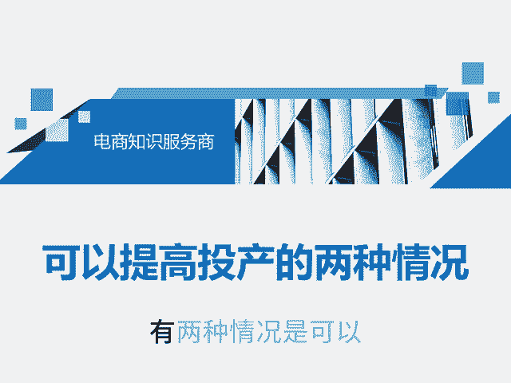
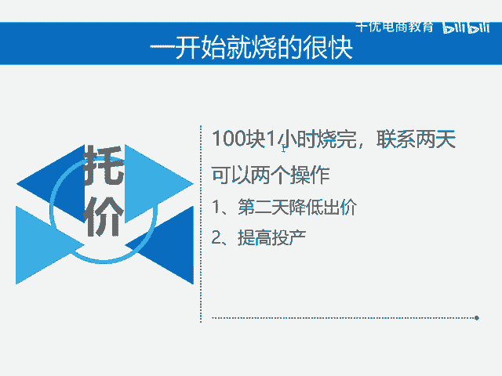

# 可以提高投产的两种情况 - P1 - 千优电商教育 - BV1MZm5Y7EEb

呃，有两种情况是可以提高投产的。所谓提高投产就是托价嘛。我们知道提高投产呢就相当于你降低出价，降低出价就相当于你降低排名。所以在不当的时候，如果你提高了投产，这时候容易断流，有两种情况可以拖。

它不容易断流。哪种情况呢？第一种就是你的曝光一直持续在上涨，你的消耗越来越快，整体曲线涨这样子，涨这样子之后呢，我也建议你在稳定几天，然后再拖脱价的特点就是温水煮青蛙，你少脱。原来比如说出价三的投产比。

第一次你把它涨到3。23。3，就是一次提高出价在5%，在10%中间这一块不要太多，你提高了投产之后呢，观察一天发现曝光不变。这时候你可以再进行下一次托价，也就是脱价整体原则就是要慢，它拖嘛。

脱就是拖拖拉拉的拖。再一个如果你的链接呢一开始就烧的很快，它也可以拖。比如说你上线链接100。1小时烧完。😊。

第二天呢200块呃一个小时多或者2个小时烧完，这么第三天你可以降低出价，需要注意的是，在第三天你可以提高投产，提高了投产之后呢，你需要再提高限额。比如说第一天限额100，第二天200。

那么第三天你要提到300。第四天呢如果你还脱价的话，这时候呢你还要提高限额，就是你整体的思维是给拼多多充值增加不能减少。在增加的情况下呢，那么你的流量就有可能稳定。如果你降低了日限额，那它很难稳定。

我是讲师大牙，欢迎大家扫码添加我的微信，不方便扫码的朋友可以添加我的微信号，80221430。在这里给大家准备到了一套新手运营入门的大礼包，希望能够帮助大家。😊。

