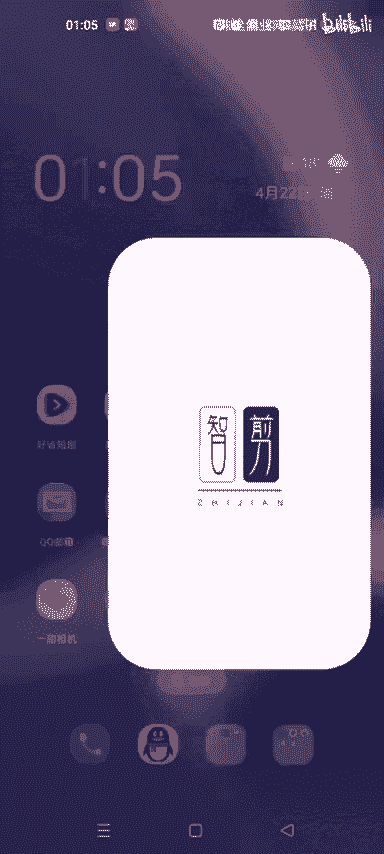
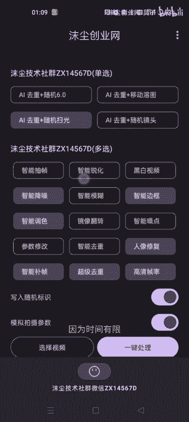
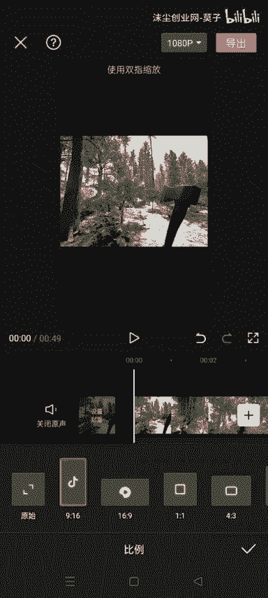
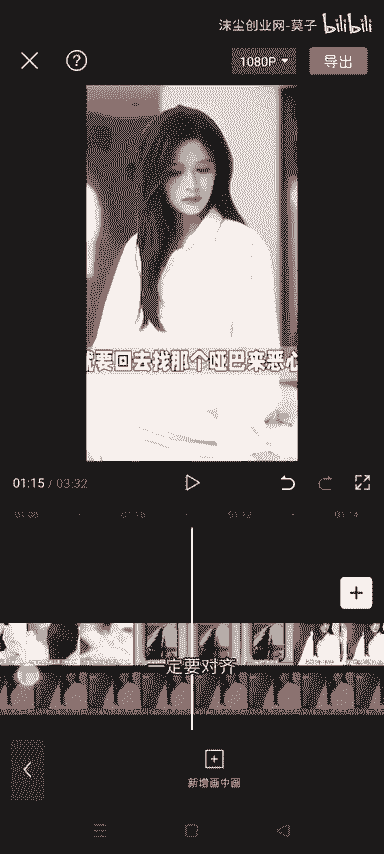
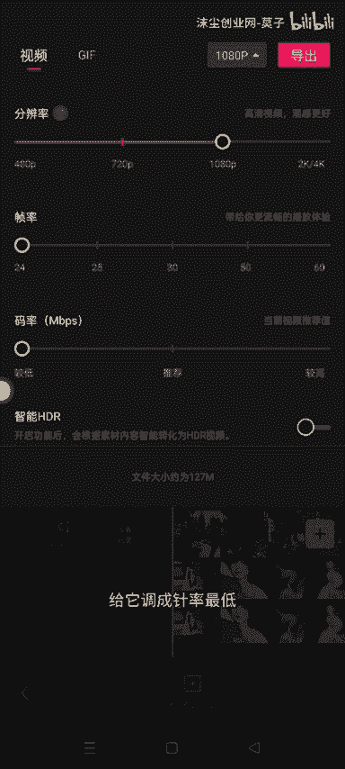
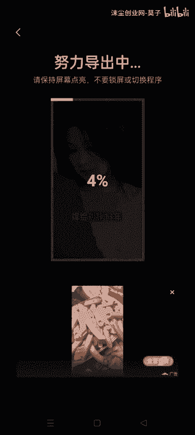
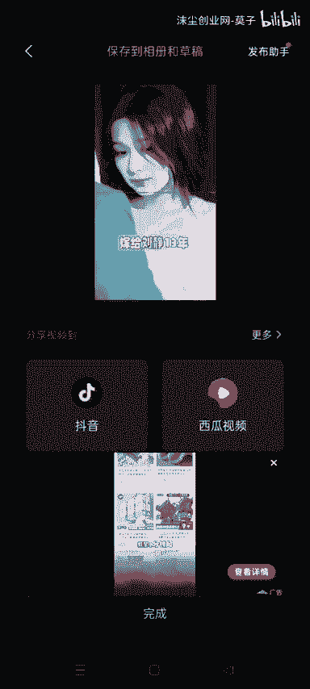
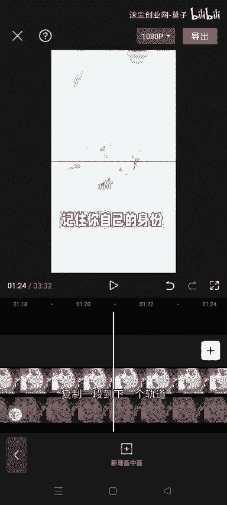

# 各大平台暴力涨粉起号教程、每天怒怼100条，1天长粉2w 轻松剪辑 - P1 - 沫尘创业网-莫子 - BV1Dm411y7di

目前社区的兄弟们，大家中午好啊，今天给大家带来的是一个150万粉丝同款，搬运素材，可以看一下他的他的作品全部都是一样的，我们今天给大家带来的，就是一个比较暴力的方法，就是每日连怼100条。

OK我们废话不多说，直接开始实操，首先我们打开我们的内部工具。

然后导入你们要搬运的素材，然后这个参数的话我们就看着选，你们自个儿自个儿想选哪个选哪个就行了，基本上只要选了这个超超级系统都是可以的，选完之后直接选这个一键处理就行了，等他处理完，因为时间有限。

我这里就不处理了啊，然后我们打开这个剪映，直接点击这个开始创作，然后导入一段我们提前拍好的素材，注意啊，这个素材要跟你所搬运的视频时长是一样的，我们把这段素材的声音给他拉到一，OK给他拉到一。

拉到一之后，把这个素材我们给它调成九比16。

然后给它拉大一点，就覆盖整个屏幕，拉大一点，只好点这个画中画导入我们刚才处理好的书，需要搬运的素材，然后我们给这个素材再添加一段，就是复制一段到下一个轨道，一定要对齐啊。

这个前面，不然两个素材看起来是不一样的，让我们给这个第一段素材添加一个蒙版，线性第二段素材也是同样的，添加蒙版，线性给它翻转一下，然后参数调一下是Y轴，我给他调一下，三左右就OK了。

可以看一下它是有一条黑线在中间的，然后这个封面不要忘记选了，我这里有点没对齐，我给他拉一下，然后我们把这个参数给它调成帧率最低。

马力最低，直接导出就可以。

导入之后我们跟刚才的操作一样，点击开始创作，然后导入一段素材，我们把他声音还是一样的，调到1%，然后添加画中画，导入我们刚才已经处理过一遍的素材，啊我这里忘记给它调成九比16的比例了。

给他调一下九比16，然后把这个画面给他放大一点，背景给他放大一点哦，这段素材也要给他放大一点，放大完之后，我们还是继续刚才的操作复制。

等到下一个轨道，它对齐之后还是一样的，给它添加一个线性的蒙版，添加完之后调一下这个旋转，随便调多少的声音，我这里调60，下一段视频也是一样的，给它添加一个线性模板，注意这个参数要跟你上一段视频是一样的。

就你上面那段视频调到60，你下面去调60，然后点一下反转，然后他就过来了，我们调一下参数，然后他这个黑线看起来大一点，OK调到九左右，调完之后我们给这两段视频添加一个滤镜，这个滤镜看你们自己啊。

随便选两个就行了，但是要注意选两个不同的，OK选完之后基本上就已经好了，让我们给他换一下封面，还是一样的，码率和帧率量拉到最低，然后我们直接给它导出就行了，导出完之后就可以直接去发布了。

然后这个发布也是有讲究的，新手小白的话就尽量不要碰这些，这个方法的话是给那些网络上的老油条玩的。