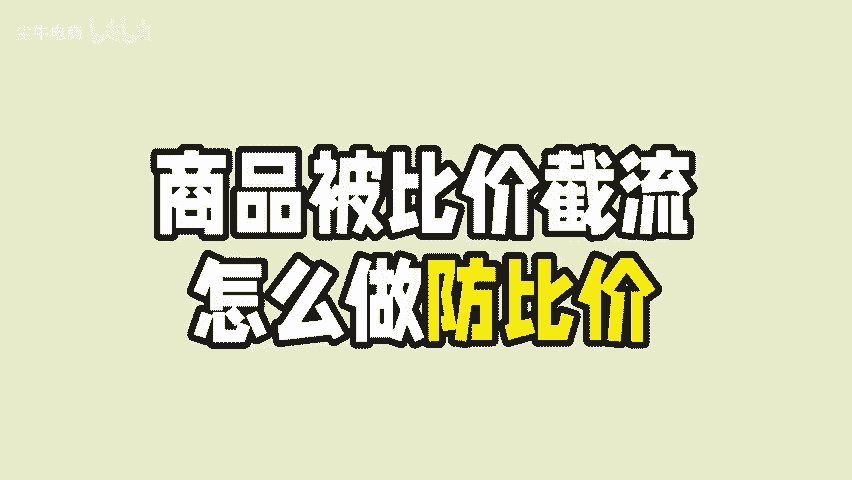
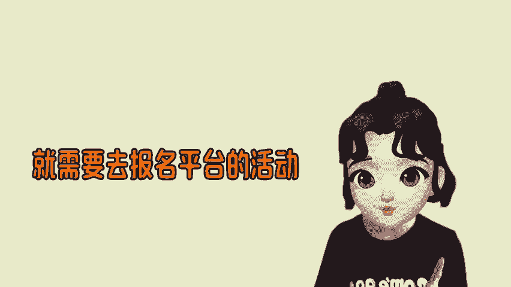
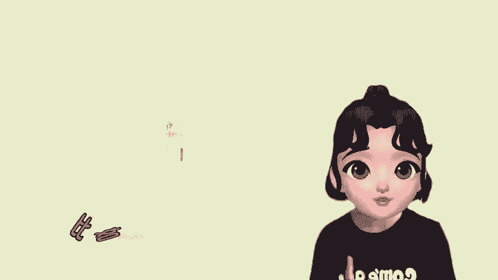
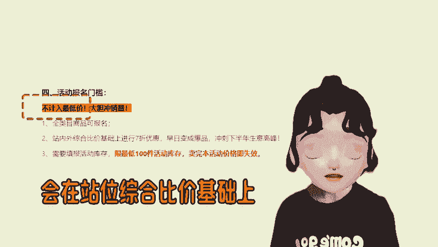
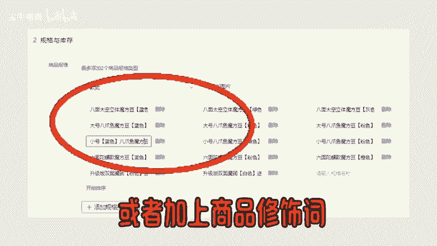
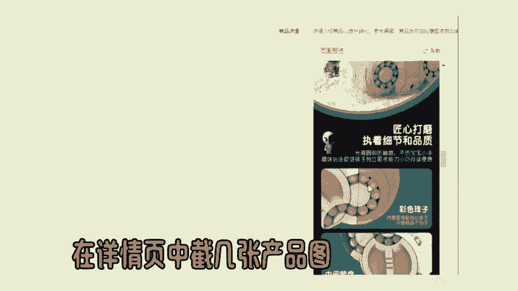

# 商品被比价截流，应该怎么做防比价？ - P1 - 尘牛电商 - BV1CXs8ejEdP

🎼拼多多活动是有额外的流量入口的，商品想要有流量，就需要去报名平台的活动。一开始呢商家可以报名不计录历史最低价的活动。比如这个21365这个活动去打折，这个是不计录历史最低价的。

会在站位综合比价基础上进行7折的优惠。如果不希望在参加活动的时候被比价截流的话，那么就需要去给商品做房比价，常见的就是通过商品SKU布局，比如修改SKU中的字符或者加上商品修饰词。

再把商品的SKU图更换一下，在详情页中截几张产品图，再去换成拼图或者图中图的结构，操作之后再去报名商品活动，这样大概率就会通过了。😊。

