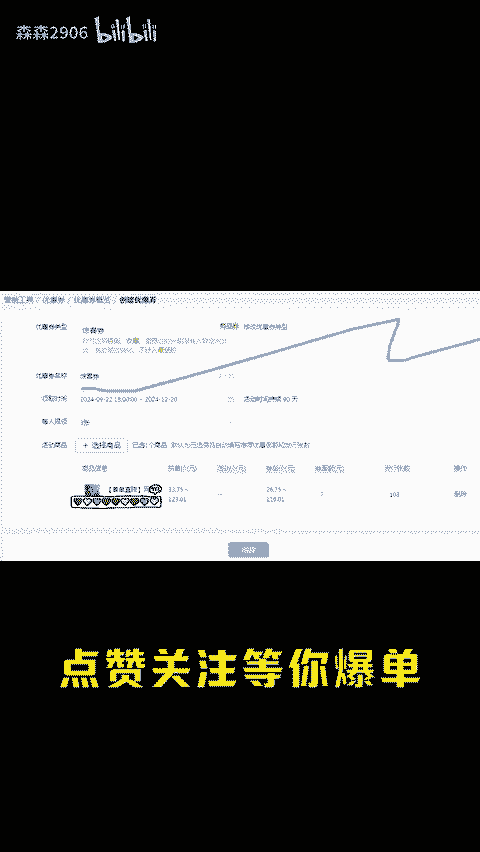

# 四个拼多多转化率翻倍的技巧 - P1 - 森森2906 - BV19Vs6eXEjM

每天一个运营想不想，你拼多多转化率怎么这么高，我都这么低呀。那就要从自然搜索和付费推广这两个方面说起来，要么你的产品不行，店铺不行，要么呢是创意图关理词人群出价的问题。那到底怎么做呢？这些即使搭建。

三言两语可说不清楚，可以找我拿一份运营文档。不过这四个提额转化的小技巧，你一定要听听设置好了转化率也能直接翻倍。第一个就是商品答疑，快速解决买家的顾虑，在商品工具里面点一键配置问答。

选择买家经常问到的问题，答案改成有利于我们自己的话术，不会的，可以参考同行。第二个就是小火苗，解决买家的选择困难症，可以添加老板推荐仅剩多少这种文字，让买家减少这件时长。第三个就是这个倒计时标签。

让买家进来就感受到紧迫感，想要打上这个标签就报名22196，最后就是惊喜券，这是给浏览过商品的潜在客户的专属券，他们是最容易下单的人群，自己看情况设置金额转化非常高。😡。

这四个小技巧你都做好了，转化率直接翻倍。今天的分享就到这里了，点赞关注，等你报单。

