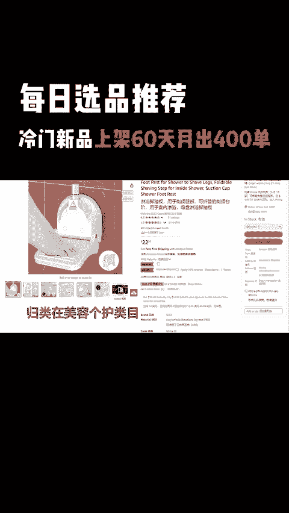
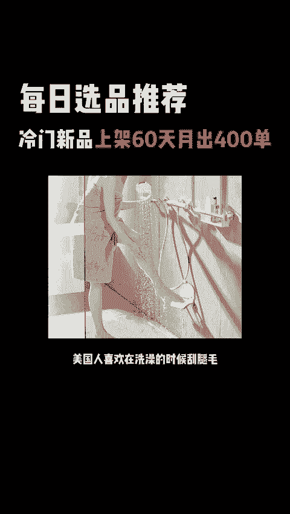
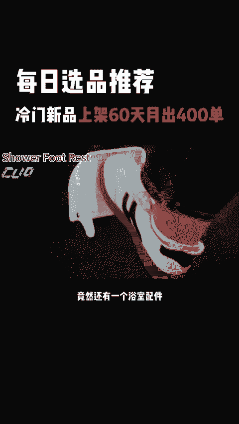
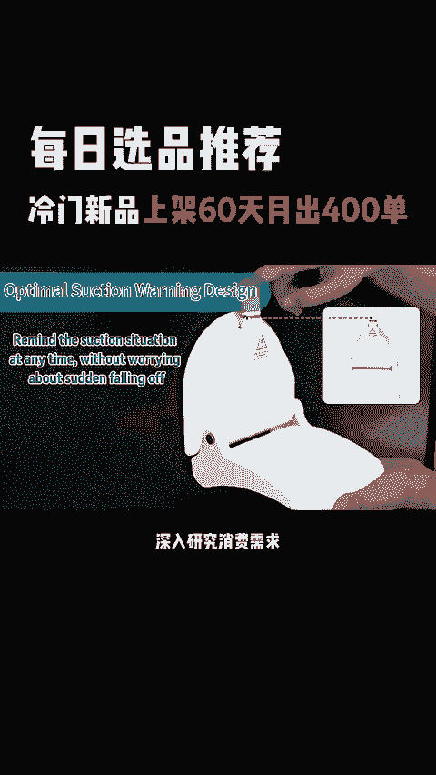
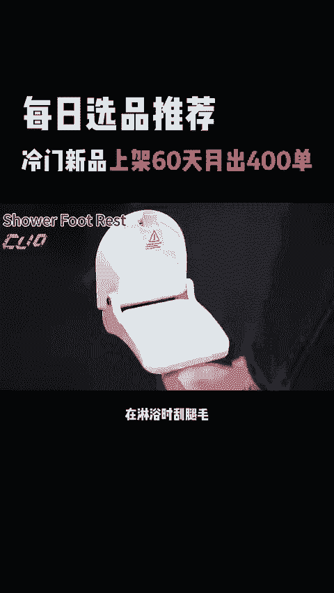
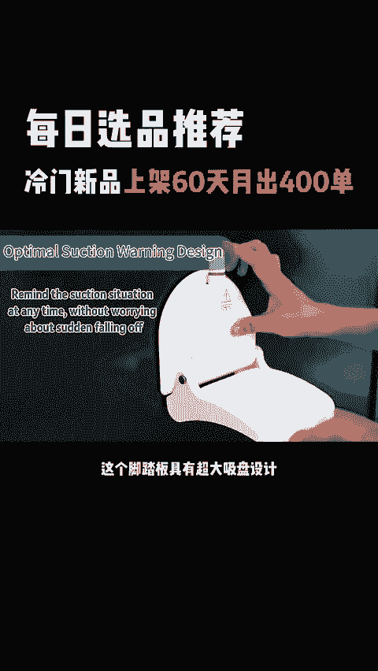
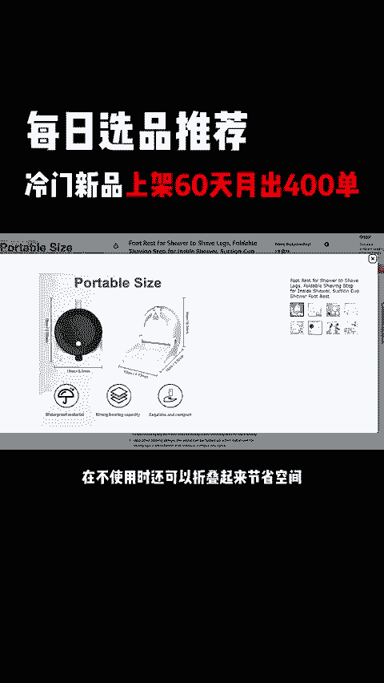
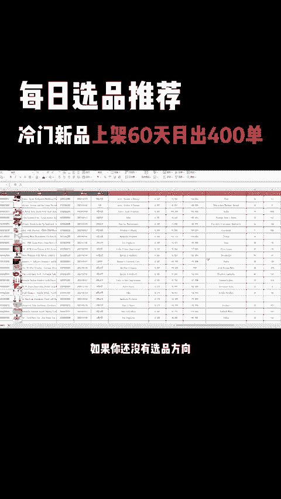
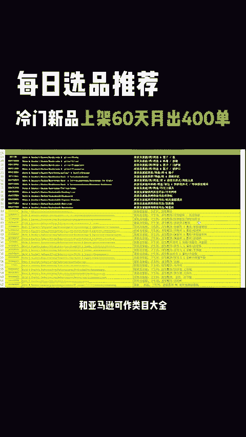
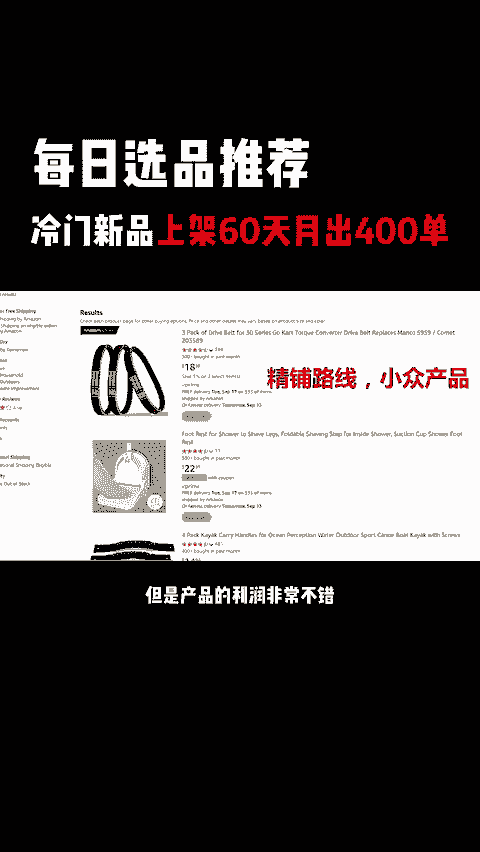

# 国内卖家忽略的冷门品，上架仅60天！月出400单 - P1 - 每日选品推荐 - BV1aJ2AYSEP2

🎼国内卖家忽略的冷门品上架仅60天，月出400单。美国人喜欢在洗澡的时候刮腿毛，所以亚马逊上的美容类目竟然还有一个浴室配件，不同的文化背景下的产品需求差异很大。深入研究消费需求才是高利润选品的破圈窍门。

今天发现一个一上架就表现很不错的产品，淋浴脚踏板，美国人普遍比较注重腿毛的护理。在淋浴时刮腿毛可以利用水流冲洗掉刮下的毛发。这个脚踏板具有超大吸盘设计，可承重达300磅，再不使用时还可以折叠起来。

节省空间，对于浴室面积不大的美国家庭来说，特别实用。这个产品目前在亚马逊上，预计链接销量400左右，销售额约1万美金，产品上架两个月就有不错的利润，不存在明显的季节性。如果你还没有选品方向。

我这里有一份1万个亚马逊创意产品清单，和亚马逊可做类目大全，有需要的朋友评论666。我来发给你通过。😊。

🎼分析亚马逊上的评论，消费者比较在意的是吸力是否稳固，同时能不能满足自家浴室的安装条件。这类产品在浴室面积小的美国家庭属于刚需，在产品的差异化上也比较容易做变体，还可以搭配浴室凳、置物架等搭配销售。

比较适合做金铺类型的卖家，这是一个深圳的卖家店铺店铺有89个链接，走的是金铺的白贸运营路线，选择的产品虽然市场容量并不大，但是产品的利润非常不错，值得中小卖家关注和学习。😊。

