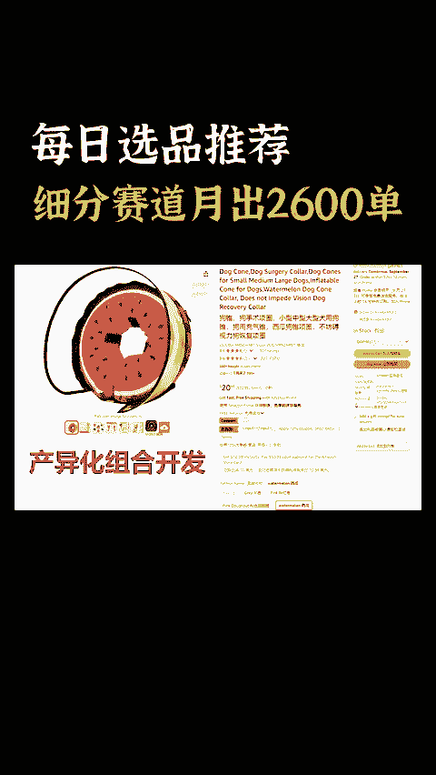
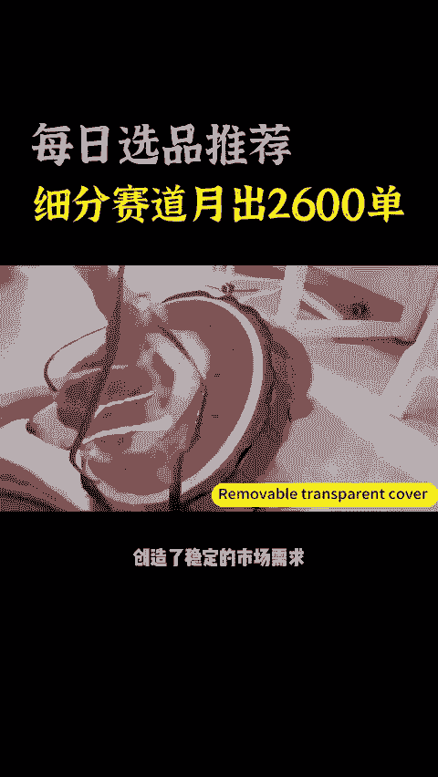
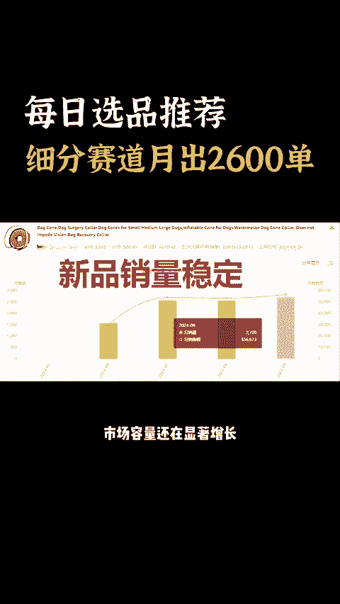
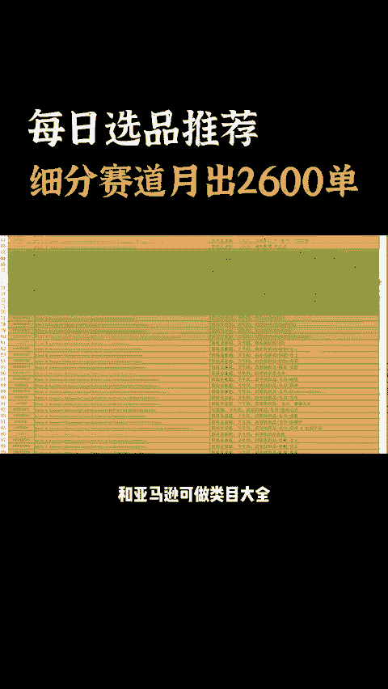
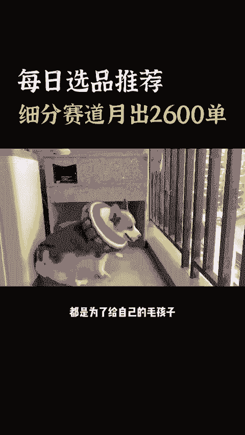
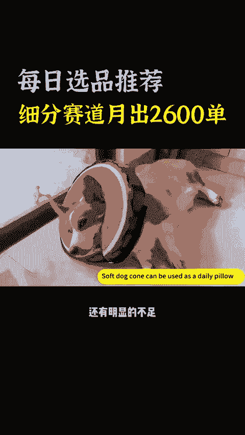
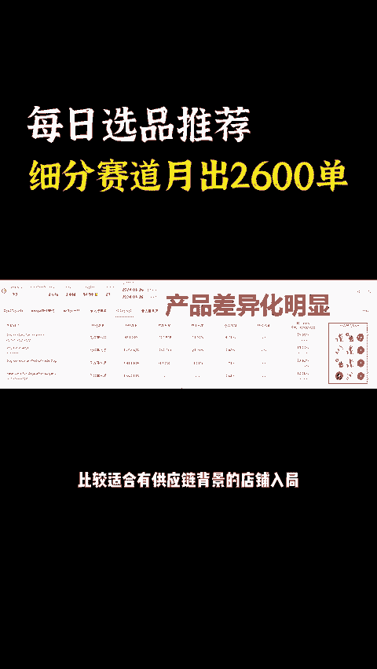
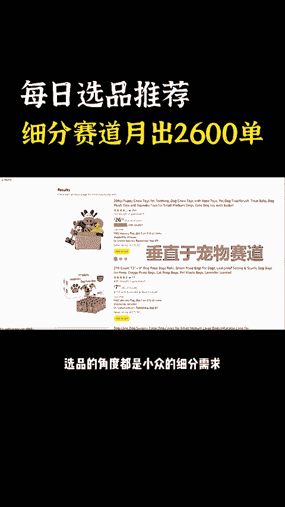
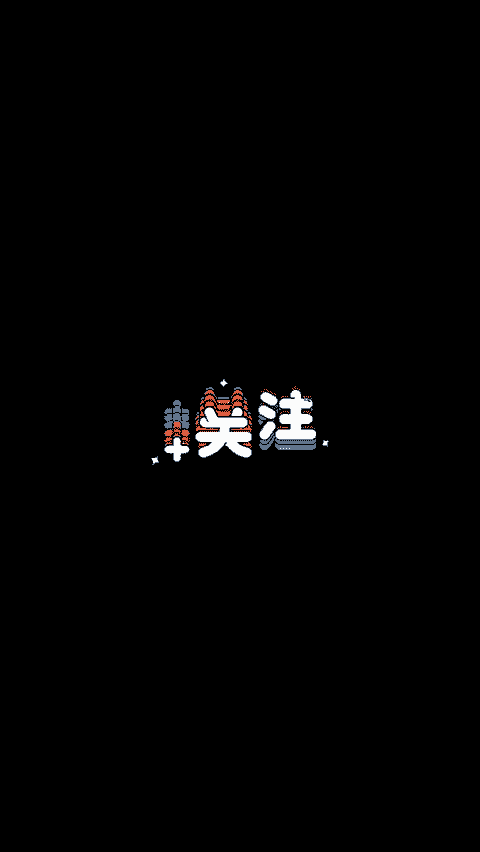

# 国内卖家忽略的冷门品，细分赛道月出2600单！ - P1 - 每日选品推荐 - BV1UvxrenEMW

🎼国内卖家忽略的冷门品细分赛道月出2600单，美国的宠物医疗行业发达，宠物手术的数量相对较多，专业收益都会推荐在术后使用颈圈来防止狗狗舔舐伤口。这位狗狗术后颈圈，创造了稳定的市场需求。

今天发现一个在亚马逊上有迭代趋势的产品术后恢复项圈。美国人将宠物视为重要的家庭成员颈圈是防止狗狗因舔食或抓挠伤口，导致感染，影响愈合的重要工具，充气设计加上透明的加长保护套。

可调节的项圈带适用于不同品种，不同大小的宠物。这个产品目前在亚马逊上预计链接销量2600左右，销售额约6万美金，产品全年可卖，市场容量还在显著增长。新卖家还有明显的机会。如果你还没有选品方向。

我这里有一份1万个亚马逊创意产品清单，和亚马逊可做类目大全，有需要的朋友评论666。我来发给你通过AI工具。

🎼分析亚马逊上的评论，消费者主要是用于宠物的术后恢复试用，都是为了给自己的毛孩子一个舒适的体验。但是在产品的耐用性上还有明显的不足。因为宠物也会不停的撕扯项圈。这类产品在美国宠物家庭很受欢迎。

在产品的差异化上有很多角度可以切入，比较适合有供应链背景的店铺入局，这是一个福建闽侯县的卖家店铺，店铺只有6个链接，走的是纯精品的白猫运营路线，选品的角度都是小众的细分需求，值得中小卖家关注和学习。😊。

