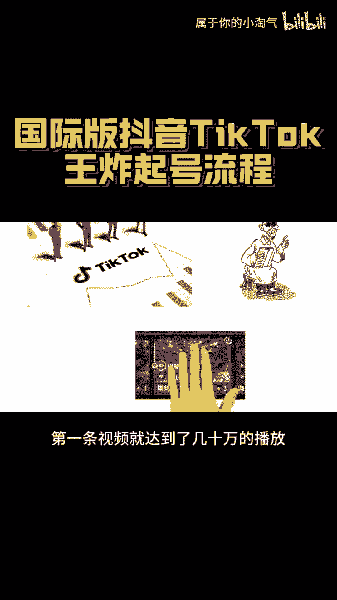
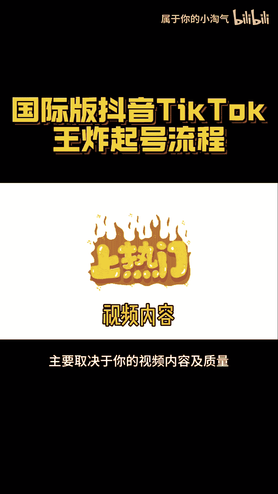
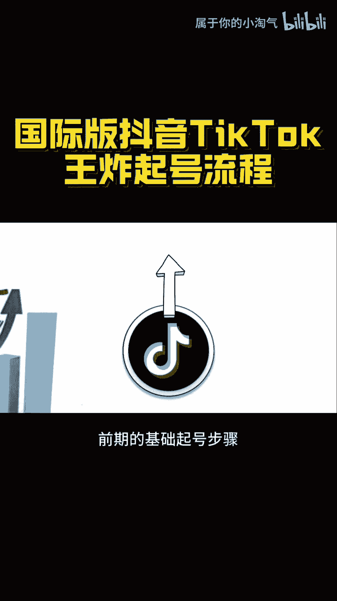
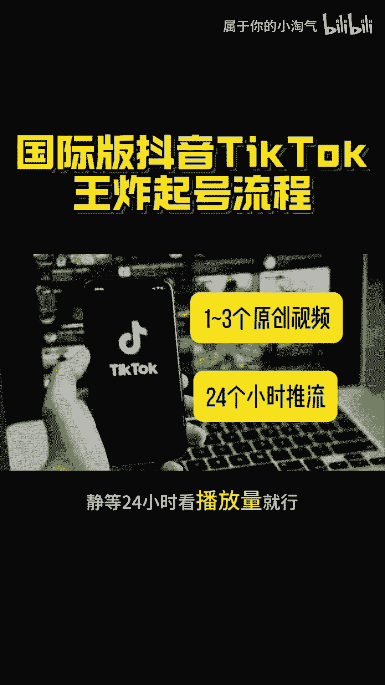
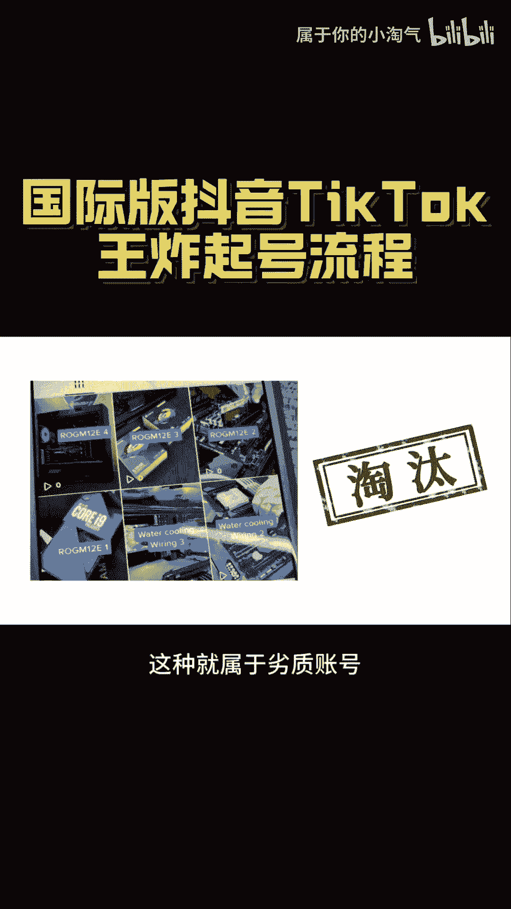
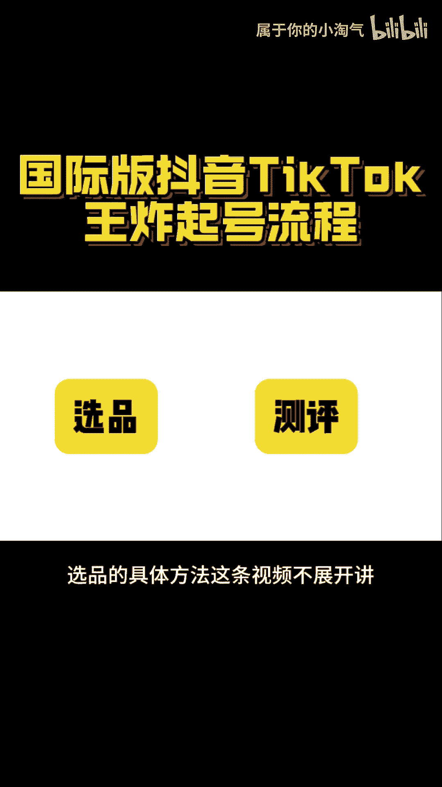
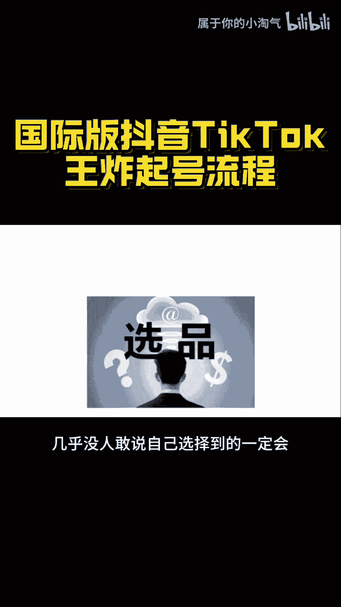
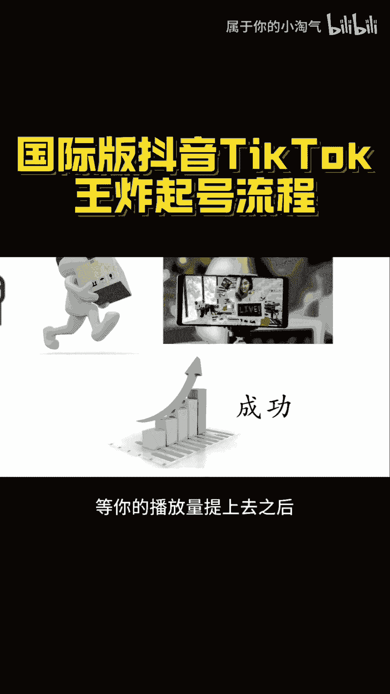
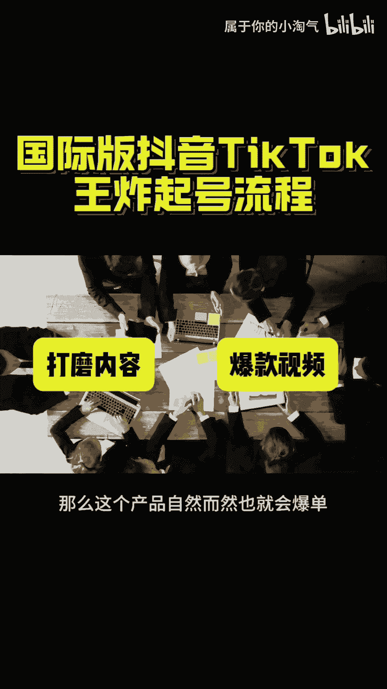
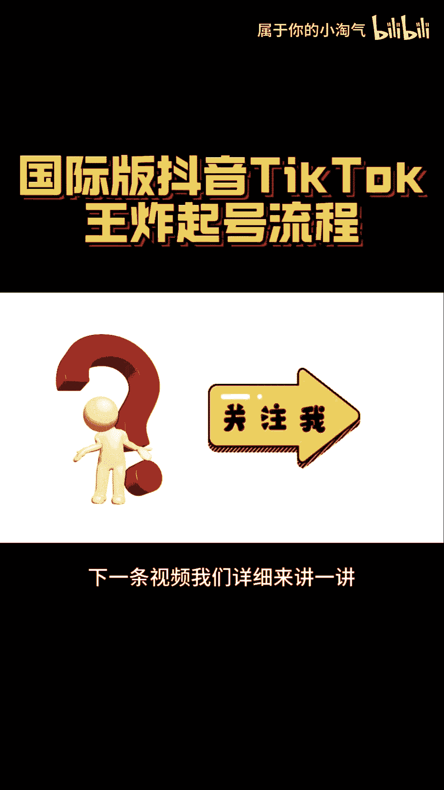

# 国际版抖音TikTok王炸起号流程！！ - P1 - 属于你的小淘气 - BV1zy4pexEtJ

在国际版抖音TTO上，不管你做的是什么类型的账号，其起号的核心方法论都是一样的，因为平台本身对于每个账号的算法都是一样的，在贴头上起了几百个账号之后，我们团队逐渐摸透账号推流算法，数据模型。

底层逻辑总结出来一套王炸起货流程，大家直接按照我们的方法进行，一比一的复制就行，不管做什么样类型的账号，都按照这个步骤策略来做，整个流程里其实就分为两大步骤，首先第一筛选优质账号。

KITTO确实是有账号初始权重的说法，注意这绝对不是玄学，我们就遇到过一些天选账号，第一条视频就达到了几10万的播。

虽然你的短视频是否上热门，主要取决于你的视频内容及质量。

但是账号的高权重，一定会让你的视频受到最大程度上的曝光，前期的基础起号步骤。

建议准备好三个左右的账号，每个账号在第一次发布视频时，发1~3个的原创视频，新号推流很快，静等24小时看播放量就行。

如果说这几个账号的平均播放量都在200以下，这种就属于劣质账号。

不要也罢，直接扔，同时你应该去排查一下你是不是网络有问题，平均播放量在500~800，这种属于正常账号，而平均播放量在1000以上，就算非常不错的高权重账号了，留下播放量最好的账号来运营。

第二选品加特选品的具体方法。

这条视频不展开讲，想要了解清楚的可以看我这条视频，选品，几乎没人敢说自己选择到的一定会成为爆品。

所以说TK运营过程当中，测评就是核心关键点，测评怎么做，每天发三条10~12秒的带货视频，连续发三天，看视频播放量，如果这批视频播放量在几百的情况下，一单都没有出，那这个品果断放弃，重新换品。

而如果这个品在几百几千的低播都可以出单，那么这个品就可以留下来做精细化的运营，就是用这种循环反复的方法去做测评，找到一个几百几千播放，都能出单的高转换率产品，并且根据这个品去剖析自己的视频零购价。

做出更高质量的视频，等你的播放量提上去之后。

就算成功做精细化运营，打磨内容和钩子，直到做出一个爆款视频，那么这个产品自然而然也就会爆单。

至于如何做好精细化的运营细节。

