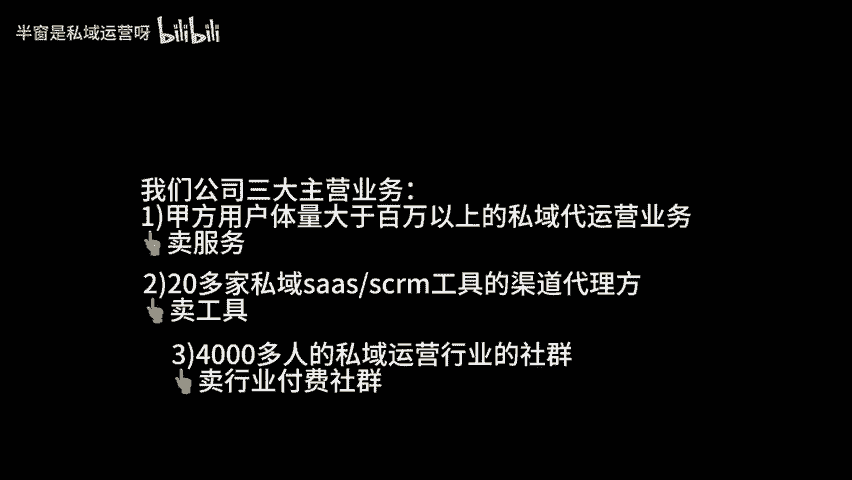
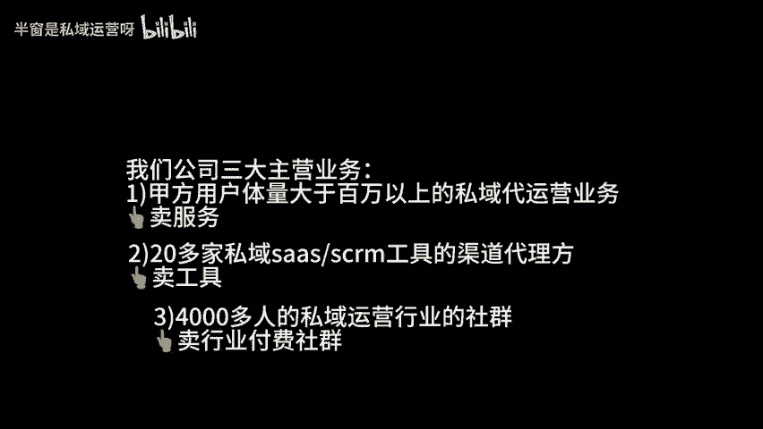

# 在上海，90后互联网行业小创业者的工作日是什么样的？ - P1 - 半窗是私域运营呀 - BV1wHHseHEwd

在上海90后互联网行业的小创业者工作日是什么样子的？今天这期视频主要是一期日常视频，拍的是我们这些通过互联网行业创业的创业者工作日的时候会做一些什么样的事情，一种是做项目交付。

我们可能在甲方公司去做办公。但是因为一些条件限制，我们没有办法拍一些视频。第二种是我们公司合伙人开会，我们一般会选择在咖啡厅一些办公场地，比较熟的朋友过来，我一般都会选择汤泉馆这样的一些地方。

找一个舒适的环境，吃吃喝喝，其实我还是蛮喜欢跟同为创业者的一些朋友，工作日的时候交流沟通，来商谈一些合作机会的。作为一些同在互联网行业创业的创业者来说，我们很多人做的方向都是比较相似的。

因为我们每家体量都比较小，所以很多时候会合作起来做一些项目，比大的公司来说，更具有灵活性。我们也可以用最短的时间来试错。像我们家目前主要的业务来源是诗域代运营这一块。

其实我们是20多家诗域ss和S项M公司的渠道代理方。我们会卖一些下车软件。第三部分才是我们知识付费这一块。目前我们社群里面的付费用户已经有4000多人了。知识金流这块的付费用户也有1000多人了。

不管是代运营交付还是我们卖上rs软件，还是我们做知识付费，其实都是现金流潜置的一些项目。所以我们公司的现金流相对来说是比较稳定的。如果是关注我这个账号比较久的朋友就知道我其实是17年做代运营这一块的。

2021年注册的自媒体账号，21年底开始创业的，主页也是在做会员体量在百万以上的一些品牌方达人的事宜代运营。对于我们这些小创业者来说，我们的获客主要来源，一个是渠道，第二个是通过自媒体互联网来进行获客。

相比于传统的一些公司，我们的获客成本相对来说是比较低的。所以我们这些互联网行业的创业者平时的日常，要么在甲方进行项目的一些交付，要么就是约一些三五成群的朋友去聊一下互相公司，目前的一些进度。看有没有。

互相合作一些机会，更多时候的合作模式更像是律所的合作模式。很多时候项目拿下来以后，不是一家公司在交付，而是很多家公司，我们一起在做交付。看似很多人其实每个人都有自己的工作室，自己的公司。

大家平时都会走的比较近一点。工作日的时候，我们会约了吃吃喝喝聊聊天，在一起去谈一些项目，其实之前有一些比较大的TP公司和代运公司，他们的老板也问过我一个问题。问我为什么在代运营行业待这么久了。

出来还要成立一个代运营公司。众所周知，其实做代运营，只要接到项目都挣钱的。唯一的一个劣势是养人的成本很高。就像我现在的很多的朋友，他们公司养了几百号人，有的养了几千号人，就是项目接下来的时候。

他们都挣钱的。但是一旦是这个项目结束，养人，就是养三个月到半年，这百号人的成本是一个比较大的大头。

所以在我自己创业的时候，我一直在规避这块的一个风险。我的经验也能支撑我把一些项目拿下来。所以我们最开始的时候是通过建运营行业的交流群筛选了200多个比较靠谱的线上兼职。

目前筛选出来的这一批线上兼职的运营同行，有一部分是我们公司自己在使用。另一部分是给到一些TP和代运营公司在使用。这200多个人也没有全部用完。我们现在只用了四十几个人，还有150多个人没有用。

今年以来就是上海有很多TP还有代运营公司都在跟我们家聊合作，就把有一些社群运营的线上能完成的工作，外包给我们在做。我们也不是用的全职的人员，而是用的我们兼职的这一批小朋友。

如果是问我们这种90后在上海创业的小创业者的工作日是什么样子的。除非是有项目交付，可能全天候的在甲方，去某各种线上交付和线下对接的一些内容绝大多数的时候，我们的日子还是过得比。

较随意的就是以吃吃喝喝玩玩，然后在家线上办公为主。今天这个视频呢就到这里了，拜拜。