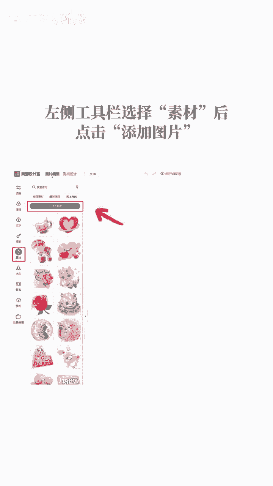
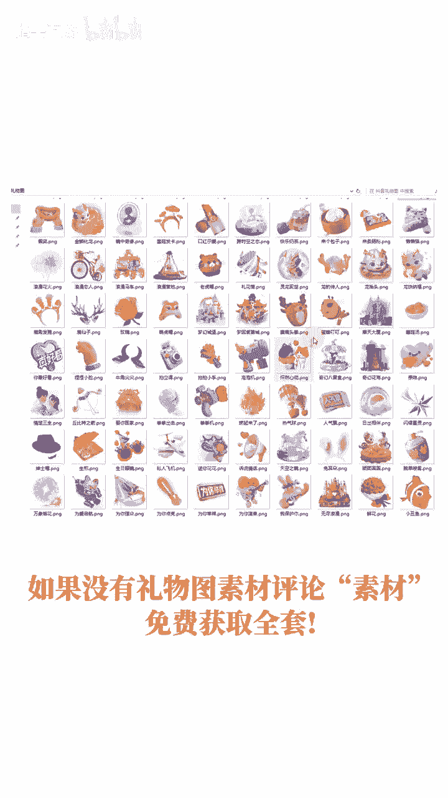
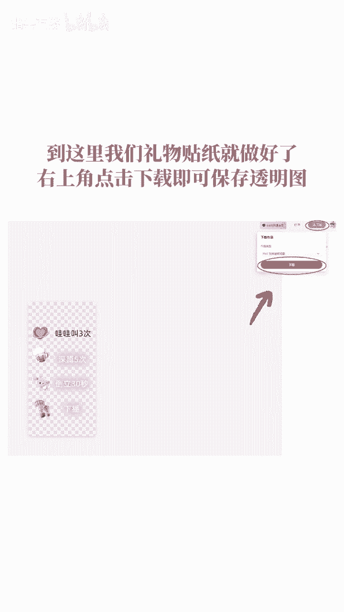

# 在抖音最近很火的弹幕整蛊主播玩法，他们的礼物图该怎么做，本期教你们如何制作透明礼物贴纸，全系列教程！ - P1 - 指尖互游 - BV1pt421u7RN

相信大家都有见过这种带礼物图的直播间，放礼物贴纸，有利于引导观众刷礼物，从而获得更多营收。

今天一个视频教会你如何制作，以免找不到，记得点赞收藏关注。

打开百度搜索美图秀秀，打开美图秀秀官网，点击图片编辑，选择新建画布，设置好画布尺寸，点击确定，登录美图秀秀左侧工具栏，选择素材后。

点击添加图片，选择要添加的礼物图素材，如果没有礼物图素材。

评论素材免费获取全套，依次选择已添加的礼物图到画布，并调整礼物图大小以及位置，左侧工具栏选择文字后，点击添加文字，增加文字内容，选择文字后，调整字体大小以及样式，到这里，我们礼物贴纸就做好了。

