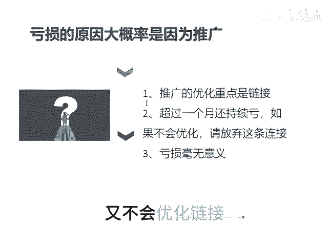

# 坚持不一定会盈利 - P1 - 千优电商教育 - BV1tmtzeHEvy

今天有个粉丝朋友说，他的店一直在坚持坚持亏损，坚持了多久呢？坚持了半年。其实我是很惊讶的，因为在拼多多上，你坚持时间太长是没有意义的。如果你超过一个月，你的链接或者你的店铺还不盈利。

那么一定要想办法优化。如果你不会优化，那么请你放弃，为什么？因为拼多多它的权重周期累积就一个月，超过一个月呢，它不记录权重，所以说如果你的店铺持续在亏，你应该考虑的是优化直通车。

因为亏损大概率是因为你的推广有问题吗？那直通车该怎么优化呢？其实优化直通车最重要的又不是直通车，它是要优化你的链接，而你呢又不会优化链接，那么你就放弃吧。因为亏损它是毫无意义的。我是讲师大牙。

欢迎大家扫码添加我的微信，不方便扫码的朋友可以添加我的微信号，80221430。在这里给大家准备到了一套新手运营入门的大礼包，希望能够帮助大家。😊。

