# 复盘Spencer的 “亚马逊百万美金枕头副业”，我们能学到些什么？ - P1 - NicheSiteRoad - BV1vYxfe2EyN

大家好，我是冰冰。今天这期视频呢，咱们就来聊一下一个作者，然后在这个亚马逊上面创业的一个故事。然后他的这些视频中的话呢，主要是讲述了在亚马逊上面如何去销售这个就是薄枕头这样的一个创业故事。

从这个最开始的一个创业激情。对，然后到最后的话呢就是。如何去实现这个变现退场的一个全路径。那么如果说你之前要是没有这个U驻亚马逊相关的经验呢，然后就是如果说想在这个亚马逊上面去销售产品的话。

那么这个视频的话呢，你还是可以去看一下的。这样的话可以对这个整个环节有一个初步的了解。

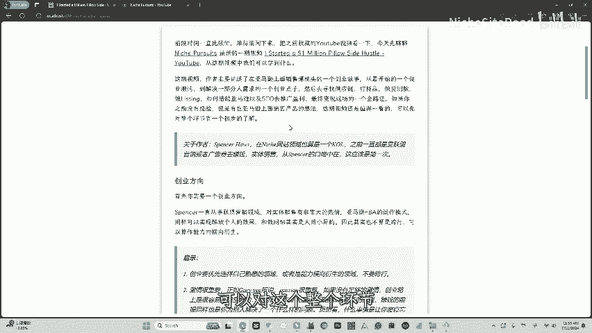

好，那么首先的话呢，我这边是给它分成了三个大点啊。第一呢是这个创业的方向。第二呢是这个创业的点子。那么第三呢就是有了这个创业方向和这个创业点子之后的话呢，最后的话你你就是需要去如何实现这样的一个路径。

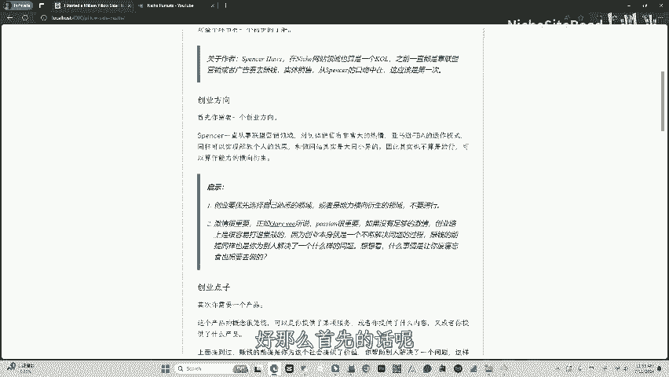

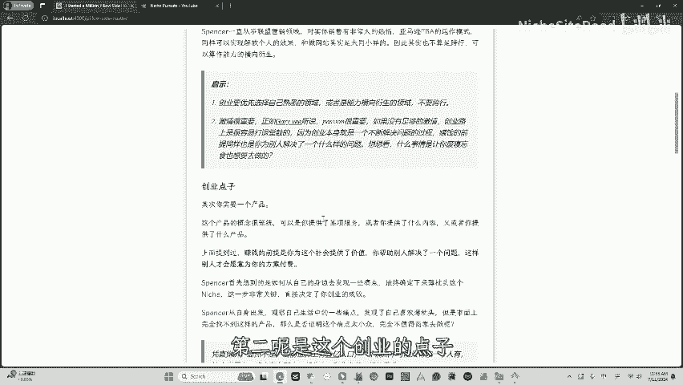

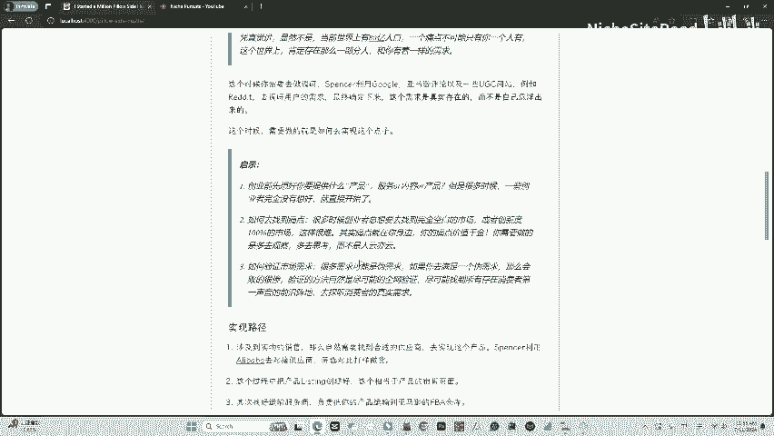

好，那么首先呢就是关于这个作者的话，这个作者呢是叫 Spenceer。如果说你要是在这个in网站领域，就是有这个了解的话呢，可以说对于这个人其实还是比较了解的。那么他这边的话呢。

之前全部是靠这个联盟营销，或者的话就这个广告费，包括一些那个其他的些项目，然后去赚钱。你像这个。实体销售的话，他这个sppenence的话，他之前是完全没有做过的。那么就从从他这个口吻中的话呢。

可以看出来他这个应该是第一次去尝试啊。好，那么首先呢就是这个创业的方向。首先如果说你要是想创业的话呢，你是你是需要有去有一个创业方向的。那么这个spaceencer的话呢。

他之前一直是从事这个联盟营销这个领域啊。但是呢他自己的话对这个实体销售它有这个非常大的一个热情。包括你像这个亚马逊的话，他这个FBA的模式呢，其实也是可以实现这个解放个人的一个效果。

它跟这个做网站的话呢，其实是就是效果是差不多的。因此呢就是说是他从这个做ne网站，然后就是到这个做亚马逊FBA他这个呢其实也不算是跨行，可以说是一个就是能力的一个横向的衍伸。好。

那么就通过这个spenceer选择这个创业方向的话，对于就是我们这边有一些什么启示呢？首先呢就是第一点的话，就是咱们这个创业的话，一定要去先选择自己熟悉的一个领域，或者呢就是这个能力横向衍伸的一个领域。

不要就是那个跨行比较厉害。

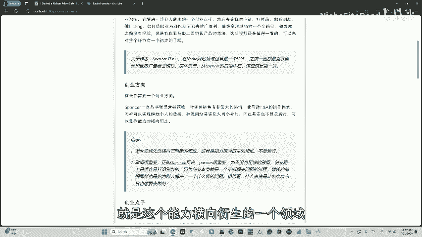

好，那么第二个呢就是啊这个激情很重要啊。其实你像我之前的话，其实也反复说就说过这个ga will的一个就是一个理念嘛。他就是说这个pathon对吧？这个Pthon的话是很重要的。如果说你要是做一件事情。

然后没有这个足够的激情，对吧？那么这个创业路上的话，其实你是很容易就会去打这个退堂鼓的。

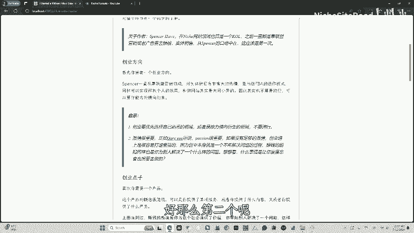

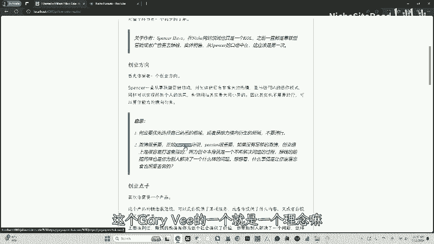

因为你像这个创业本身的话，它其实就是一个不断解决这个问题的过程。包括你像这个就是如果说你要是想赚到钱的话，这个前提呢也是需要去。同样就是说你呃就就是你这边然后给别人去解决了一个什么样的问题，对吧？

所以这个一个的话就是需要去选择自己这个熟悉的领域。第二呢就是这个激情很重要。

好，那么关于这个创业点子的话。

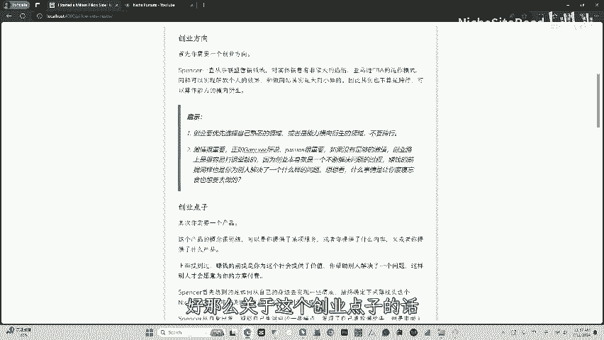

好，这个地方呢，咱们就一起来看一下。好，那么有了这个创业的方向之后的话呢，其次你是需要一个产品。那么这个产品的概念呢其实是很笼统的。因为我之前的话其实也说过这个关于这个产品嘛，对吧？

就是在这个互联网上的互联网上面的话呢，你可以去提供某项服务。或者的话就是你可以去提提供一个内容。包括呢就是说你可以去直接提供一个产品。那么这个里面的话，这个服务内容，还有这个产品。

他们其实全部都可以概括成为这个产品这样的一个就是很笼统的一个概念。好，那么sder这边的话呢，他首先想到的就是如何从自己的这个身边，然后去发现一些痛点。那么最后的话他这边就是确定下来。

然后这个保枕头这个ne领域。那么这一步的话，它其实是非常关键的。因为如果说你要是。这个就是选择这个产品这一块。如果说是没有选择好的话，那么这个创业的话是很难成功的。好，那么你像咱们这个作者的话呢。

他是从这个自身去出发，然后呢去观察这个自己生活中的一些痛点。

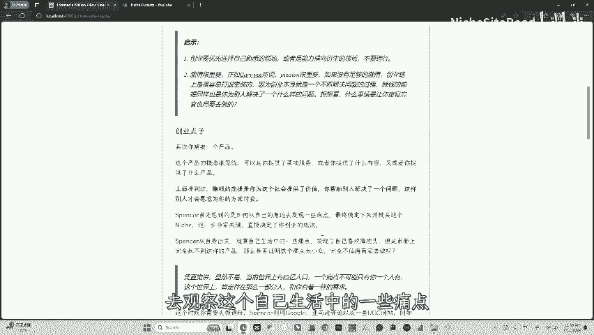

呃，然后呢就发现自己的话其实喜欢就是整这个薄枕头，对吧？然后呢，同时又发现这个市面上是完全找不到这样的产品的。那么这个时候的话呢，做的他就有一个疑惑，就是是不是代表就是说这个产品然后有点过于小众。

就是呃他就不值得那个商家，然后去花这个钱去推广，去卖这个产品呢，就是无利可图。可能。

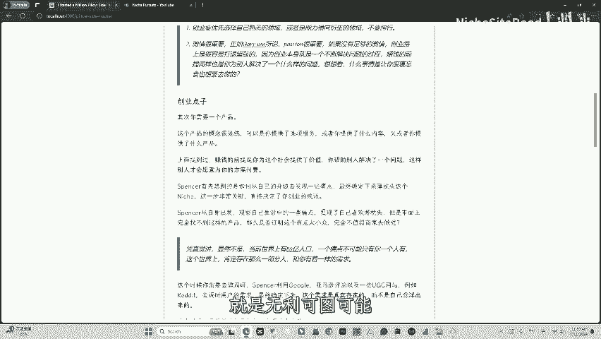

好，那么这个时候的话呢，就是你需要做的是去调研。因为这个你像如果说你要是想去做一个市场的话，这个调研它是非常重要的。

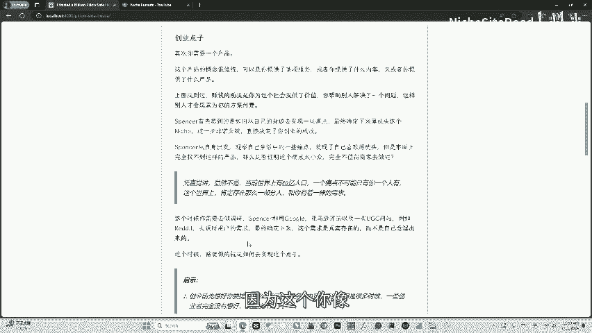

然后这个spaceer的话呢，它是利用这个谷歌，包括这个亚马逊评论，包括一些那个就是UGC网站。比如说你像这个readdit对吧？然后呢去调研这个用户的需求，然后通过去在这些网站上面去搜这个关键词。

去就是发现这个消费者的一个就是呃就是最前沿的这样的一个就是嗯需求吧。然后这样的话就通过这个就是呃多方，然后去调研之后呢，然后这个spec这边的话是确定下来这个需求的话，它是真实存在的对吧？

而不是说只是他自己的一个需求。好，那么就是说到这一点的话呢，其实我上面的话也写了这样一段话嘛，对吧？就是你像嗯因为你像目前的话，这个世界上其实是有很多人的对吧？包括你像全球的话。

目前差不多是有80多亿人啊，所以的话呢就是一个痛点，它肯定不可能是只有你一个人有。因为这个世界上的话，它肯定是存在那么一部分人。😊，就是和你自己呢是有一个就是同样的一个需求。包括你像就是平时的话。

比如说你要遇到一些什么问题的时候，这个时候呢你去那个网上，然后去找答案。其实大部分情况下的话呢，百分之八九十是可以找到的。就是你碰到的问题，别人的话大概率也是碰到过的。

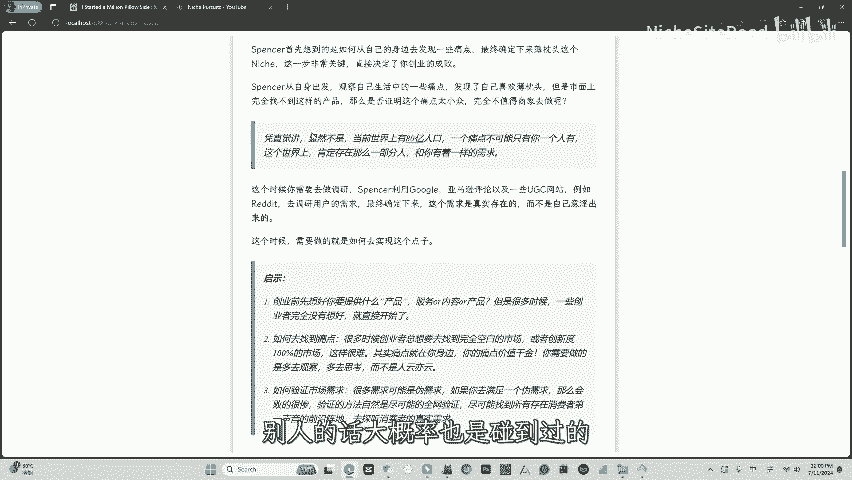

好，那么就是从这个找创业点子这一块的话，也对我们自己来后有什么启发呢？呃，启发的话是我这边是写的三点。首先第一个呢就是。

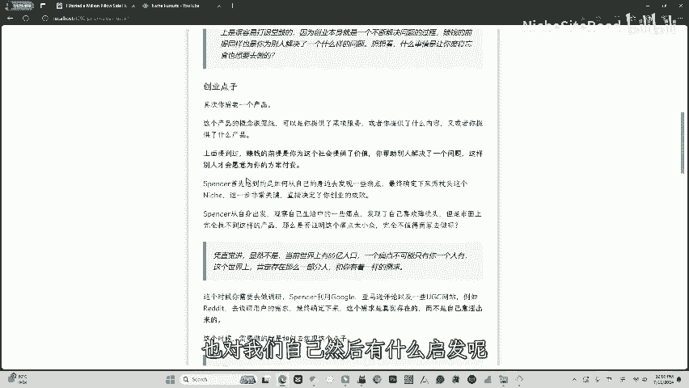

你在做一件事情前的话，就是一定要想好，你是需要去提供什么产品，对吧？就是比如说你是去靠这个提供服务去赚钱呢，还是说去靠提供这个内容，或者的话就是说我是直接去提供这个产品，然后去赚钱的。但很多时候的话呢。

可能就是完全没有想好，对吧？然后就开始了。好，那么第二呢是如何去找到这个痛点。就很多时候的话呢，可能就是说我们全部是想要去找一些那个那种就是说完全空白的一个市场，对吧？就是说根本就没有人做。

然后只有我是第一个去吃这个螃蟹的，或者的话就是说我这个产品的一个创新度，我要去达到百分之百。这样的话就推出一个就是完全就是全新的一个东西。但是这样的话真的很难啊。而且这个时候的话呢。

就是如果说你要做那个第一个吃螃蟹的对吧？可能就是说你也是被那个浪花区第一个拍死的。呃，就很多时候的话，其实你像一些痛点，他其实就在我们自己身边。有一句话呢是叫做你的痛点价值千金，对吧？

包括觉是上面我这个地方嘛，就是说呃但凡这个东西的话可能就是说你用起来觉得比较难，就是比较麻烦。那么其实肯定会有这样一波人，他们就是跟你是有同样的一个想法的。那么这个时候的话呢，你需要做的就是去多观察。

去多思考，而不是就是说别人说什么，就是什么这样的一个嗯就是角色。

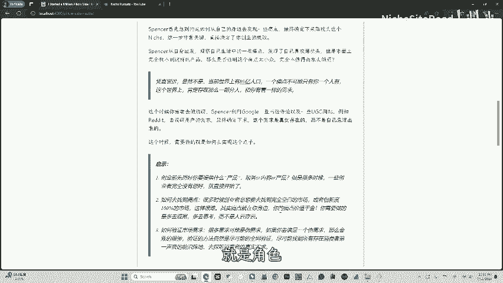

好，那么第三个就是说如果你发现一个市场，对吧？然后他确实是很小众，但是呢就是呃确实是没有人就提供去去提供这样的产品。那么这个时候的话是不是证明就这个产品就完全可以做呢？这个呢也不是啊。

这个时候的话就是你需要做的是去验证这个市场的需求。那么如何去验证呢？因为有时候的话可能很多那个需求的话，他就是伪需求，对吧？或者的话呢，就是说你是你那个自己这边，然后去运营的一个需求。但是他实际上的话。

可能那个用户他们并不是需要这个需求。所以这个时候呢，就是你只能做的就是去那个尽可能的去全网验证。如果说那个是呃网络上的一些声音不够的话呢，你就就你也需要去那个线下对吧？去，然后尽可能去多做这个调研。

比如说你像什么问卷调查啦，对吧？包括那个就是说去看那个顾客的一些真实的反馈啦，这个的话都是非常非常必要的。就是去验证这个市场需求的话，咱们这边就是就是能做的。

就是去尽可能的找到那个就是所有存在这个消费者第一声音的一个前沿阵地，对吧？然后去探听这个消费者的一个真实需求。那么这个前沿阵地的话是哪些地方呢？比如说你像我上面说的这个。

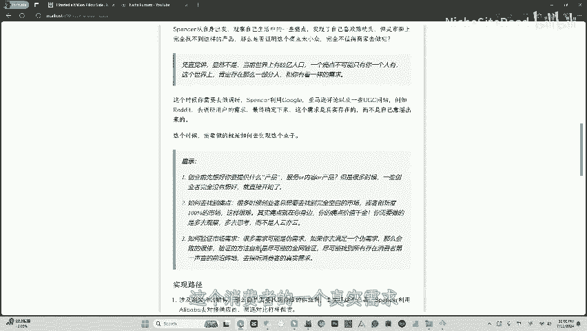

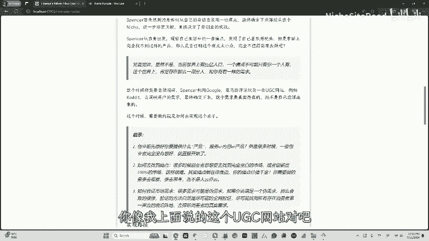

UGC网站对吧？呃，你像那个radit啦，包括什么就是呃知乎啦，就是所有的一些东西，对吧？就是一些那种社交平台。因为它这个上面的话呢，那个消费者的声音它绝对是第一线的。

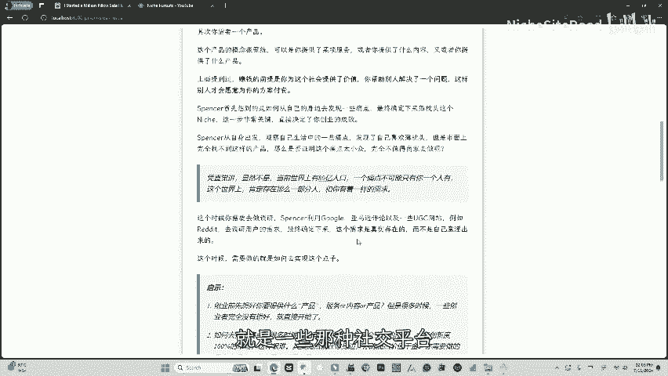

包括你像目前这个抖音tktok对吧？youtube都可以去调研。

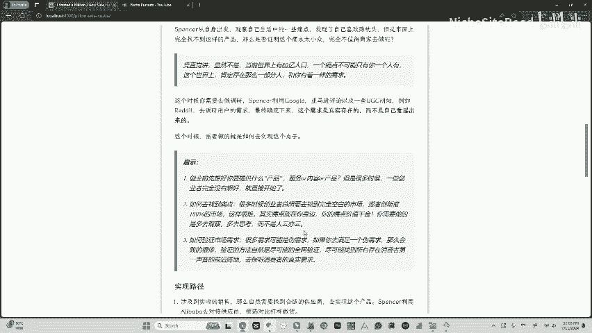

好，那么这个就是呃创业点子啊，然后这个就是确定下来之后呢，那么最后的话是如何去实现。嗯，这个部分呢就是相对来说的话就比较简单了。

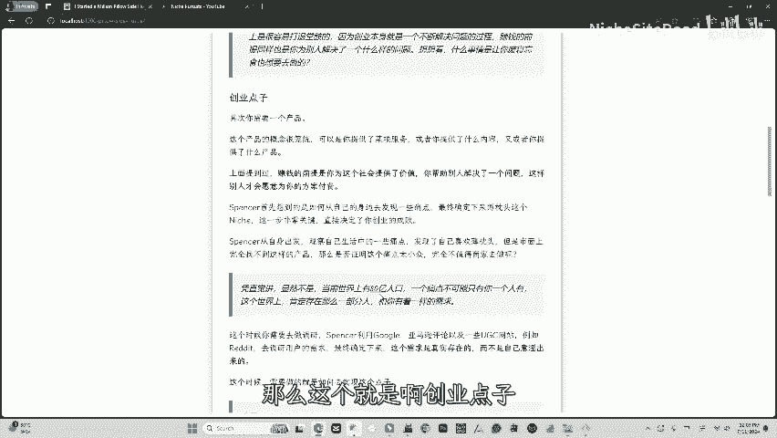

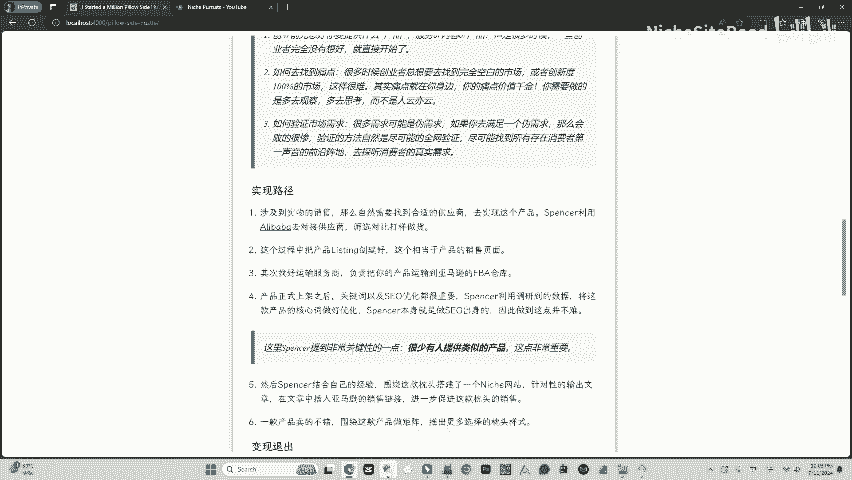

首先第一步的话，就是如果说你要是涉及到想去做一个实物的销售，那么自然就是需要去去找到这个合适的供应商，对吧？那么找这个合适供应商的话呢，你像如果说你要是在就是本身在国外的话。

那么你可以去利用这个呃就是阿里巴巴对吧？它这个上面的话，其实是有很多供应商的。那么如果说你要在国内的话呢，这个1688对吧？它上面的话其实也是可以去。就是非常方便的让你这边然后去对接到一些工厂。

那么这个时候的话，就是说比如说有10家工厂，对吧？然后你就需要去筛选哪个工厂的话，它是比较可靠的，比较靠谱的，然后去对比打药做货。然后第二步的话呢，如果说你那个想在亚马逊上面去卖货的话。

那么它是需要一个销售页面的。就是呃然后就是你需要去把这个销售页面，然后给做好。因为他的话其实相当于你的一个销售员。然后第三步呢是你需要去做好，就是找呃找好这个运输服务商，对吧？就是你需要把这个产品。

然后从你家，然后运到这个亚马逊的1个FBA仓库。当然这个地方的话，就是你也是需要去做一番那个筛选的。然后最后第四呢，就是那个产品，然后正式正式上架之后的话，那么这个时候如果说你要想去推广的话。呃。

关键词的一个埋布，对吧？包括这个SEU的一个优化，这个呢都是非常重要的。然后你像sence的话呢，他其实自己本身的话就是做这个SEU的嘛。所以你像这一点的话，他其实这边做的还是很好的。

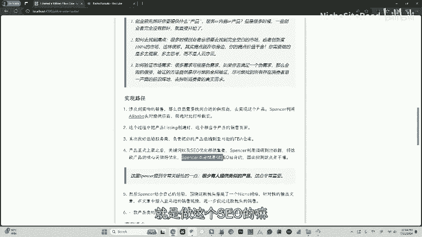

好，然后第五个呢就是那个pener，对吧？然后他结合自己的一个经验，就是围绕这款呃枕头。然后这个枕头的话，它目前是通过这个亚马逊这个平台然后去销售嘛，对吧？但是同时的话它搭建了一个。意网站。

因为你像这个亚马逊上面的话，它目前它是不能去写那个就是说大批量的文字的。比如说我想要在这个亚马逊上面写一篇，这个就是可能两两三千字的一个博客，然后去呃推广我这个产品。但那个目前的话这个亚马逊上面。

他他是做不到这样的一个就是需求的。呃，所以呢就是很多人的话，他们会把这个亚马逊，然后作为一个销售平台，对吧？然后我可以去自己去搭建一个这种呃ne网站。然后在这个上面的话呢，我可能就是作为一个博客。

然后我就去呃那个针对性的去输出跟我这个就是卖的这个产品相关的一些文章，对吧？然后呢在这个文章中去插入这个亚马逊的销售链接。这样呢就可以进一步去促进这款产品的一个销售。呃，然后这个第六步的话呢。

就是当你这个一款产品然后卖的好的时候呢，你可以去围绕这款产品去做矩证，对吧？然后在这个。视频中的话呢，是班色也是推出了更多那个选择的一个枕头样式。

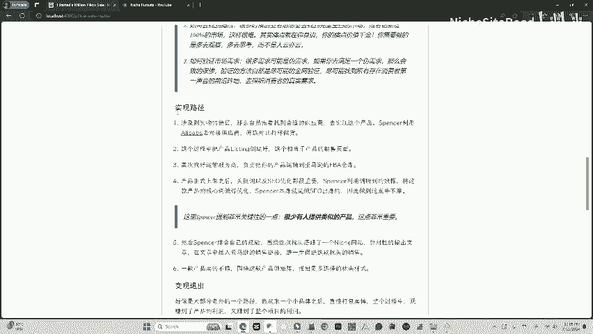

好，那么这6个呢就是一个实现路径。好，最后呢这个也是嗯就是很多那个老外他们喜欢去做的，就是一个变现退出。

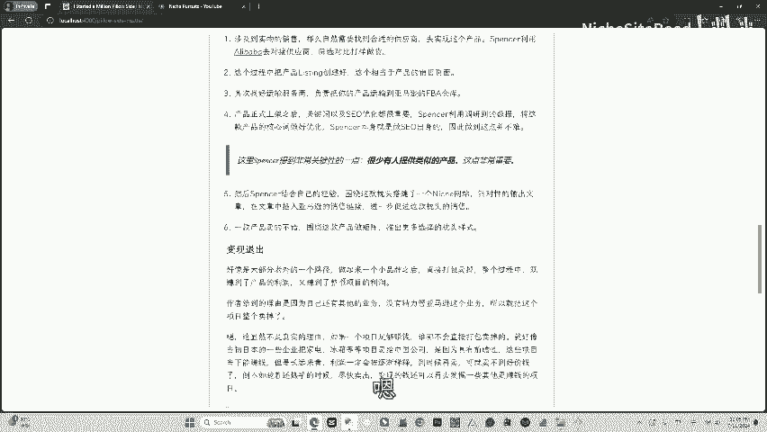

反正就我这边的话，然后观察了很多啊，他们全部是做起来一个小品牌之后呢，然后就把它给直接打包卖掉，对吧？然后整个过程中的话，就是你这边既可以赚到那个产品的一个利润。但同时的话呢。

你又可以去赚到这个整个项目的一个利润。当然这个呢就是看这边然后卖的好不好，对吧？就是你这个项目的话本身挣不挣钱。😊，呃，然后在这个视频中的话呢，这个作者的话，他给到的理由就是说他自己还有那个其他的业务。

对吧？比如说什么科技业务啦，还有什么嗯那个其他的一个就是一个什么写文的那个业务，对吧？😊。

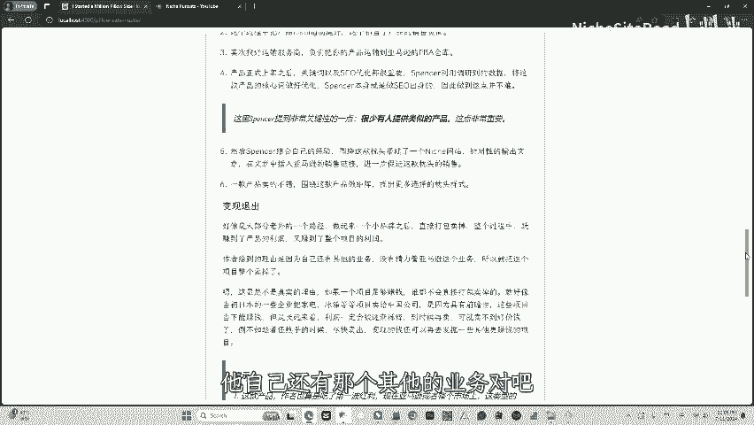

哦，然后说那个就是没有时间，然后去管这个亚马逊这个业务，所以呢就把这个项目整个卖掉了。啊，但其实这个的话呢，就我这边的一个感觉啊，它肯定是一个假话，对吧？它肯定不是一个真实的理由。因为如果说是。😊，呃。

假如是一个项目对吧？足够赚钱，那么你肯定是不会去把它给打包卖掉的。如果说你这边要是就是考虑去把这个项目卖掉，那么那个原因的话，可能就是说这个项目不赚钱，或者的话就是你有那个其他更好的一个就是创业的方向。

创业的点子。

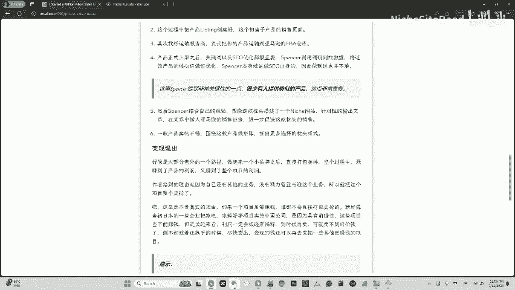

对吧，就是就就嗯就是我这个地方写的嘛，你像那个当初的话日本，对吧？他把一些那个就是那些家电了，什么冰箱那些项目，然后卖给咱们中国这些企业。他这个呢其实也是具有一个前瞻性的一个就是选择。

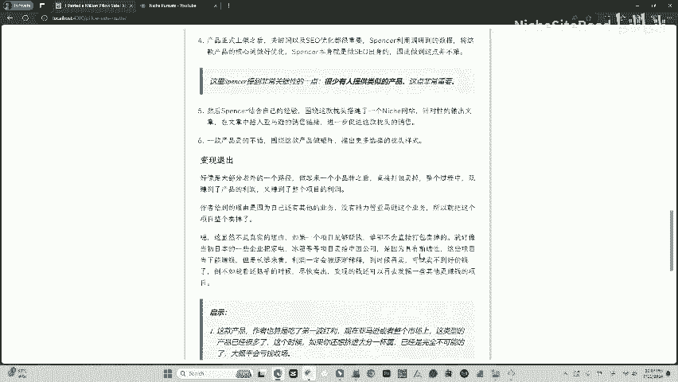

好，那么就是呃关于这个变现退出这个地方的话，就是能给我们一些什么启示呢？嗯，首先的话就是这款产品啊，它其实这个senceer的话，他也是吃了第一波红利。因为你像目前的话就他自己也说过嘛，就是后来的话。

然后你在这个。亚马逊或者就是说整个市场上面，然后去找的话，他其实这类型的产品已经很多了，对吧？那么这个时候如果说假如说一个产品，然后只有一个卖家提供跟一个产品的话，然后啊有那个100个卖家提供。

那么这个时候的话就是你这个。😊，获取到这个利润的话，它肯定是不一样的对吧？如果说你要是还想在这个时候就是看到这个视频，然后想进去分一杯羹的话，那么显然是已经完全不可能的了。呃。

另外的话就是其实也是一个电商的一个通病。就是一款产品的话，哪怕就是一开始这个创意它是你自己的对吧？然后这个产品的话是你设计出来的。但是如果说你要是没有这个足够的护城河，不管是这个专利。嗯。

还是这个推广的手段，或者的话就是说一些其他的一些什么护城河。如果说你没有的话。呃，他是就是就是你不能去抵御这个其他的一个竞争者入局。那么这个时候的话，这个利润它就会被去逐渐稀释掉的。

那么最终呢这个利润的话就会被抹平，对吧？然后大部分这个卖家然后退场，这个时候的话就只能去留下一些那种个别的卖家，然后去赚取这个呃微博的一个利润，对吧？其其实我觉得这个呢应该是这个spener。

然后他这边退出这个电商业务的一个理由啊，反正就是后续的话也可以去关注一下。就senceer这边的话，他会不会就是说还是再去从事这个。电商这个领域。因为你像嗯这个呢其实也是电商的一个通病。

就除非就是你这边一个产品的话，有那个专利。呃，反正就是你像我这边的一些，就是在那个就是在这个网站上面啊，或者就是说平台上面，然后就卖这个产品的话，我这边全部是申请了那个专利的。

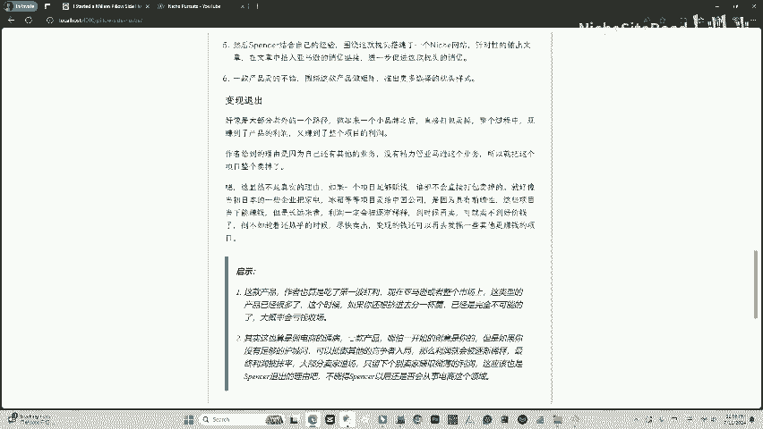

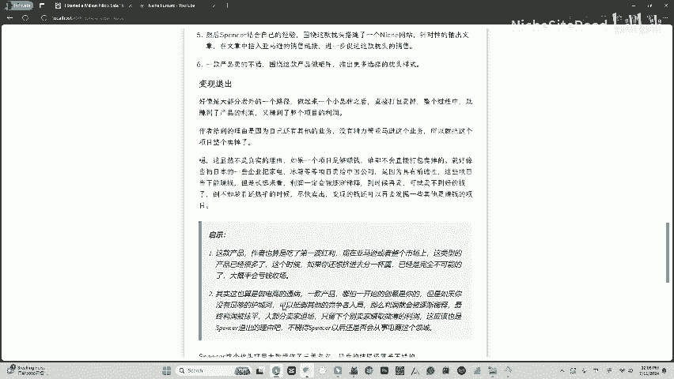

嗯，好，那么最后呢就是这个这个项目的话，它大致是运行了3年左右。最后最后这个结局的话其实还算不错。因为你像这个视频中的话呢，他就他也那个说过嘛，就差不多，然后等到后期的话呢。

每个月是能实现差不多15000的1个15000美金的一个利润嘛，差不多的话可能就是10万左右的一个利润。一款产品呃，其实也还可以了。我感觉。呃，然后就是就是最后的话，咱们再说回这个现在啊。

就就那个亚马逊这个平台啊，他其实现在的话真的是很卷，就很多那个就是一些无脑卖家，这个无脑卖家的话，指就是那种小白，纯小白什么都不懂。呃，然后可能就是说听了一些那种啊，比如说教程对吧？

或者的话就说一些那种抖音上面的一些宣传视频，然后呢就。就那个入场，然后去疯狂的低价去卖。平面内卷呃，内卷对吧？可能就是一个产品的话呢，你卖20美金，但我的话我可以卖10美金，但其实的话根本就不赚钱。

对不对？可能就想就是我前期的话，然后先低价把这个产品去推起来，后续的话我再用那个。等那个就是量，然后全部到了我这边之后，然后这个价格的话，我再给他提起来。但这样的话真的很难啊。

首先的话就是说你前期就是你这个亏本这个时间段，就是你能不能撑过来。其次的话就是当你这个产品，然后被客户。😊，就是在呃打了一个新质标签，就是说这个这个产品的话，它就是这个低价的产品。那么后续的话。

你这个价格能不能提就是提得起来，这还是两缩，对吧？🎼呃，包括那个现在的这个就是tm，对吧？它其实这个内卷程度的话，更是就是非常厉害啊。那么其实这个背后的话呢，它烂掉的是整个这个中国的一个制造业。

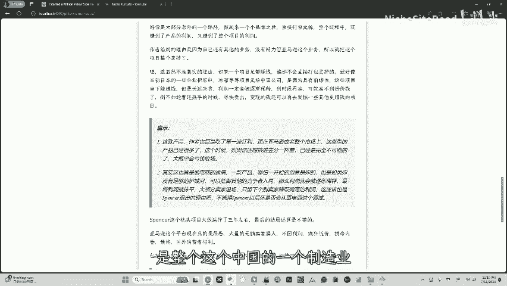

好，那么最后这段话呢，就是我这边的一个嗯就是一个当下的一个想法吧。

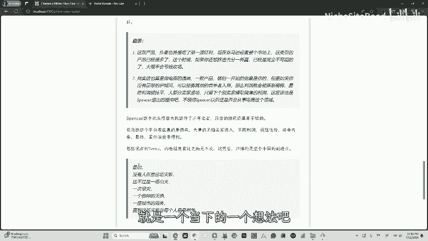

这个呢在就是流浪地球里面的话，其实是很火的嘛，对吧？你咱们大家的话就是也可以去看一下，然后就是一起去嗯警醒一下吧。嗯，好，那么今天这些视频呢就是这些内容了，我们下期视频再见。

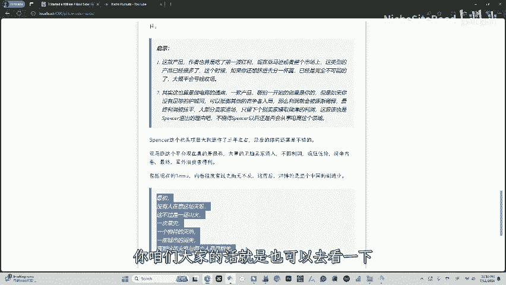

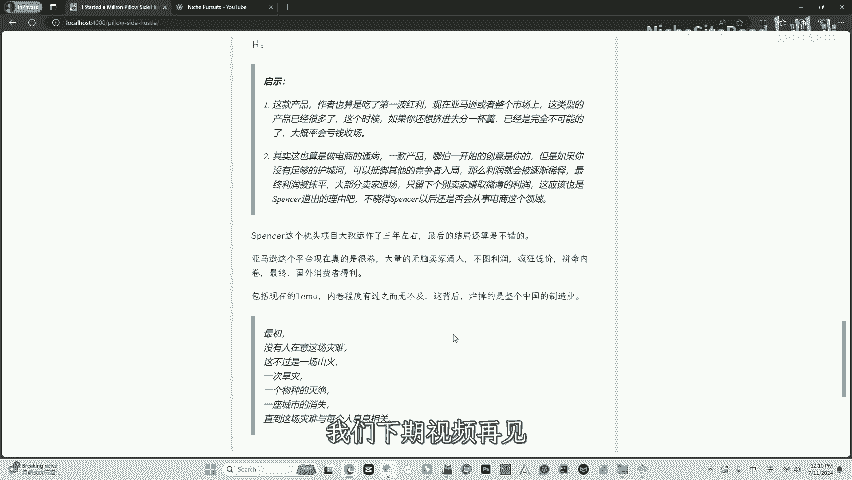