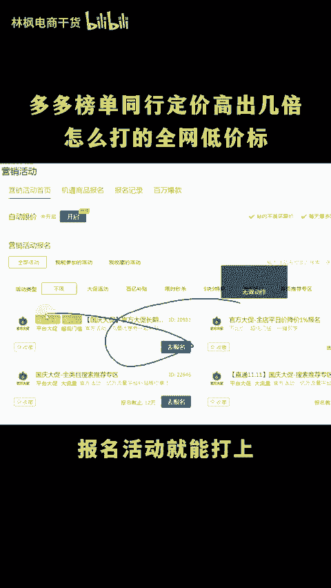
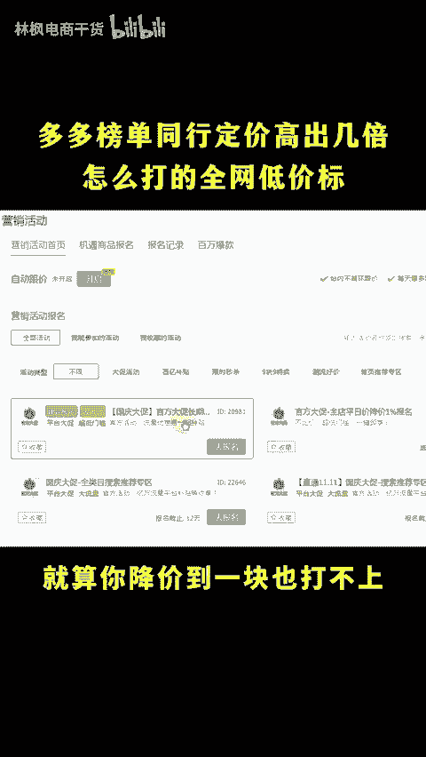
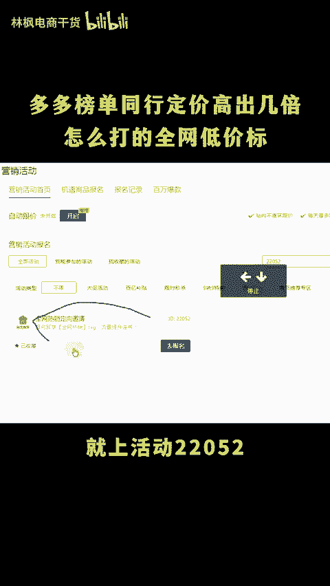
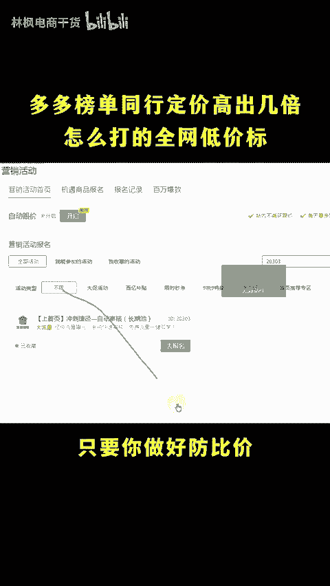
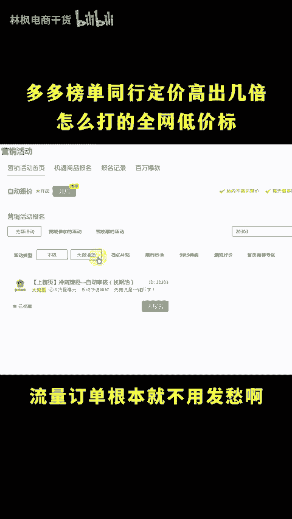
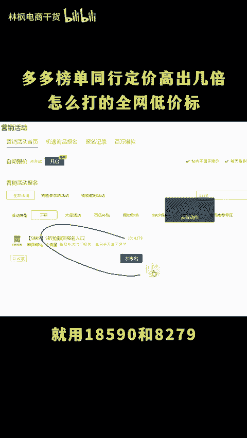
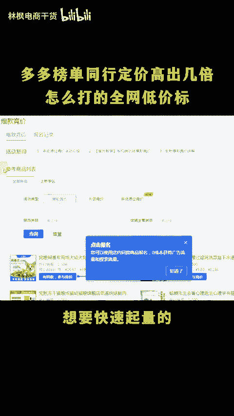

# 多多榜单同行定价高出几倍怎么打上的全网低价标啊！ - P1 - 林枫电商干货 - BV1iB2JYrErR

为什么榜单同行价格高出我几倍，还有全网低价标呀？当然是同行销量高，平台给的福利呗，你脑子进水了，你咋知道呢？全网低价标是必须要做到低价吗？当然不是只需要报名平台的活动就能打上。

花30秒时间认真看认真学直接上实操。除了全网低价标报名活动就能打上。还有那些全网日销多少件几十天低价不上活动就算你降价到一块也打不上全网低价标呢就上活动22084全完日销呢就上活动22052几十天低价就算活动20303。

而且不用你降价，只要你做好反比价就能够差不多原价报名上去，报名成功就能够打出这几个标签流量订单根本就不用发愁啊。除了打标签，还有这几个活动能够帮你节省一大笔话费。

除DS用21365和15591新链接起量就用18590和8279有基础想要加快爆单就用584和4534有价格优势，想要快速起量的，就用爆款进价去截流。不同的价位，不同的产品有不同的玩法。😡。

如果你不知道怎么操作的，看这里。😡。