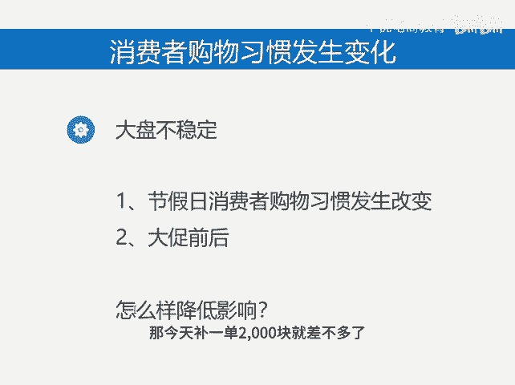

# 大盘下滑怎么办 - P1 - 千优电商教育 - BV1Nv4FePEVd

，这几天你的流量是不是崩盘，其实不用紧张，因为整个大盘都是下滑，就这几天我观察了很多行业都是在呃10月1到来之前的时候，哎，有一波小高峰啊，小高峰过后呢，流量就花就下滑了是吧？这两天其实还在下滑。

等到流量恢复应该在4号或者5号左右，为什么出现这样的情况，其实主要是消费者购物习惯发生变化，就这几天由于放假啊，有其他的安排和平时的工作生活习惯不太一样啊，不再购物，其实呢不仅仅是节假日有这样的情况。

在大促的前后流量也会有波动，那流量波动该怎么办？如果你的店铺波动不是太大，那就这样是吧？不用操作，如果波动比较大呢，你可以补一个大单就一个就可以不要补太多单，补的多了，影响人群标签，一个大的坑产单。

比如说昨天你销售额是1万块，今天8000块是吧？那今天补一单2000块就差不多了，这样呢弥补销量所影响到的权重，不是两大。😊。

欢迎大家扫码添加我的微信，不方便扫码的朋友可以添加我的微信号，80221430。在这里给大家准备到了一套新手运营入门的大礼包，希望能够帮助大家。😊。

