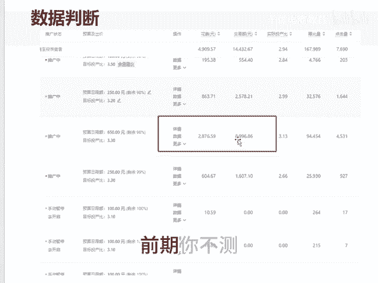
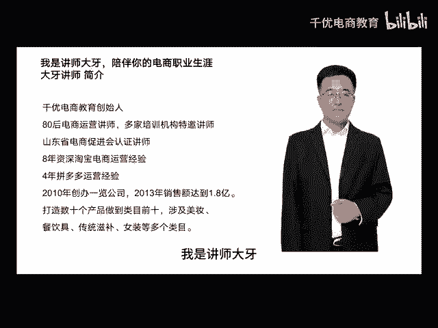

# 大象装冰箱分几步 - P1 - 千优电商教育 - BV1QL2dYAEVp

说把大象装冰箱分几步，一般是三步，第一步打开冰箱，第二步把大象放进去。第三步关上冰箱门。那坐垫也是一样啊，也需要三步。可是很多朋友呢它总是忽略第一步，他直接搞第三步，这事呢，它就有点困难。

坐垫你一定不能忽略第一步。所谓第一步就是测试链接，你千万不能搞错，就很多朋友之所以吃亏就吃在这，那测试链接是什么意思呢？就我们知道非标品一定要测款，因为非标品看款式嘛，标品它是看功能。

测试的目的是能找到一个像途中这样到后期呢你轻轻一推就能走起来的品。如果呢你不测试可能你推的是这样一个品，你即使你用尽权力它也推不动啊。所以说在前期测试呢，花点钱没关系，比后期一直亏要强的多。

那非标品怎么测试多长链接，建议你上5个不同的款式一起测试，你不要测试一个。因为测试一个链接的话，如果这个链接有问题，那你再重新。😡，测试那么时间成本太高。那么我们上5个链接，目的是找到消费者有需求的款。

平台也愿意推的款式，要做到价格段统一，风格统一。那标品该怎么测试很多大标品吗？那么我也建议你上5个链接，做到图片不同。SKU不同，价格段不一样，就相当于测试图片测试SKU测试价格。

那怎么测试其实比较简单，你可以通过活动测试，比如说你有价格优势，那直接提报21365这7折吗？你看表现怎么样，如果活动没效果，你可以考虑活动配车，如果你是高客单没有价格优势，那直接用直通车测试吗？

测试完之后呢，它总有那么几个链接数据不错。你说我测试一组数据都不行，再上不要着急，就是在前期你做的每一个功课，在后期都会用另外一种方式回馈你最怕的是前期你不测直接拉升的时候着急，到后期一直亏一直亏。

我是讲师大牙，欢迎大家扫码添加我的微信，不方便扫码的朋友可以添加我的微信。😡。

280221430在这里给大家准备到了一套新手运营入门的大礼包，希望能够帮助大家。

