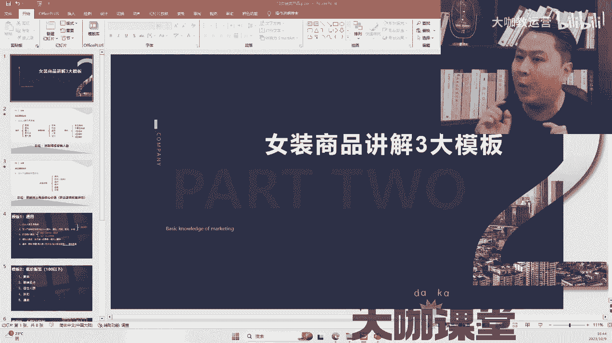
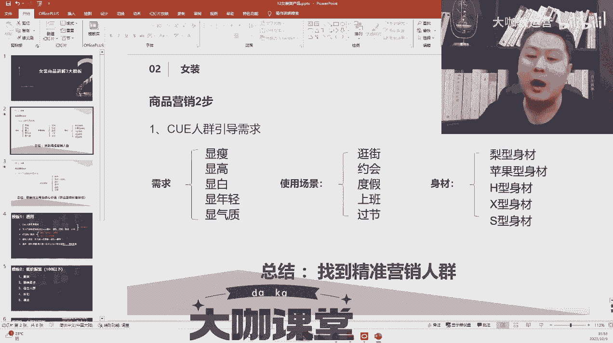

# 女装类目直播带货玩法教学／直播间如何运作？从0到1直播起号全流程／直播运营思路！ - P1 - 大咖教运营 - BV1e1421d78Q

好了，同学们，女装板块一个非常庞大的体系，板块怎么讲呢，因为在抖音上面卖女装的实在太多了，短视频也好，直播也好，那么做女装的很多人都是怎么做的啊，要么展示，要么穿的，要么干，讲最直接的。

我们有一个词叫做什么叫做曝光，进入率之后的承接转化，很简单一点，当别人上下滑的时候，有可能看了一眼你穿的衣服很好看，别人直接划走了，或者别人耐心的听你几句，这个时候我们说眼睛看还是耳朵快。

耳朵跟眼睛差不多快，但是你的视觉不足以让人停留的更久的时候，你应该增加什么呢，增加你的话术，特别运营，跟主播之间谈及到女装板块的时候，你的话需要哪些点。

一定要有Q啊，我始终在强调一个词叫做Q，你如果解决了COEQ人品这个点，你几乎就达到了很高的高端点，什么意思，我们先来说女装是什么需求，比如女装衣服哎，有的时候不就是为了暖和吗，不是为了好看吗，答对了。

衣服需求就分两种，一种是雪中送炭，一种是锦上添花，什么意思，跟大家讲一下，首先呃锦上添花，这类人群基本不在我们考虑范围内，比如说身材特别的好，买衣服就要买那种紧身的，凹造型，凹身材的。

这类人基本不在我们讨论范围，因为这一类人群对买衣服他有他的执念，他有他的偏见，也就是说他买什么样的衣服，他门儿清，他不需要被你洗脑，不需要你来介绍，他可能照着他感觉去买就对了，你是什么样的感觉。

他并不在乎，那么我们在乎是哪类人群，就是那些喜欢雪中送炭的女生买衣服，一大概率概率是怎么样，几个需求我们说需求怎么使用显瘦，没有哪个女生说我一穿起来胖的，当然这个朝代我们不是唐朝，不是以胖为美。

大概率来讲他是一个修长的身材，显得很瘦，凹凸有致，或者说是遮丑或者是遮丑，比如有拜拜肉，蝴蝶袖，有小肚腩，有游泳圈，大象腿，麒麟臂，这个可能都有，而且女生通常来讲的话，也不可能那么自信的那种完美。

你超模，你可能嗯你是超模，你可能就是不满意，那我们第一个需求来了，显瘦，第二个需求是干嘛的，我们说女生的身高正常来讲比男生低，那么女生只要有1米7零，基本就比较高了，而真的1米7的女生好少，哎有的很高。

但是很壮，就没那么瘦，是不是，那我们说一般正常情况下，如果小美眉没那么高的话，我们希望是要显高，这个条子显得很修长，再来肤色，我们作为黄种人来讲的话，皮肤可能没那么白，除非是类似于部分明星要去做美黑。

或者做古铜色，大概太显白，比如你一件什么颜色的衣服，穿起来上身效果显得脸更白肤白，为什么要化妆，想过这个原因，没有化妆也是为了显显气色，好显白不光是白白，是显得气色，那我们衣服的颜色就有讲究了。

并不是一一般来说显白，我这穿白色的衣服，不是的，我也许穿件黑色的衣服，比我穿件白色的衣服更显白，那么这个衣服的颜色也有讲究，需求就显白，什么样肤色配什么样的衣服显白，再来显年轻。

没有哪个会说我一穿穿这衣服老了十岁，那这个很糟糕啊，还有什么显气质，那结合我们这些需求点来讲，我们应该反对，在我们的话术里面添加上什么样的词汇呢，比如穿这件衣服能显瘦，好显瘦，怎么回答。

你不要说穿这件衣服显瘦，完了别人没概念，听着左耳进右耳出了，怎么说，来家人们姐妹们看过来，这件衣服泡泡袖的设计能有效的遮住你这儿的，拜拜肉蝴蝶袖啊是吧，包括他高腰线的设计，能整个提拉你的身形。

显得腿更长，再包括它的糖果色的色系，穿得很显肤白，显得很清爽，在气质方面拿捏的死死的，显得很年轻，很清爽，犹如邻家小姐姐的感觉，你要组合这样的词汇，我们知道人切记的就是，我那会就看到我一个学生怎么说。

来姐妹们看过来，这件衣服不仅显瘦，而且显高，而且显白，特别的显年轻，凸显你的气质，完全跟没说一样啊，什么道理都没有，一定是因为得病，因为这件衣服怎么样的设计，什么样的颜色，什么样的款式。

什么样的版型来符合我们的需求，我们说女生穿衣穿款，男生穿衣穿牌就是大概率是这个样子，那么我们这些需求的点结合起来就打这几个点，显瘦显高，显白，显年轻，显气质，再来我们跳过中间的一会儿讲中间的。

再来讲右边的身材，大概率来讲的话，女性身材分为哪几种类型，身材苹果型身材，H型身材，X和S型身材，那么大概率我们就说了，S型身材和S型身材，这一类不在我们考虑的范围之内，因为这类人买衣服来讲的话。

他既好买也不好买，而且说瘦子女生穿什么都是百搭，而胖子女生呢可能穿的没那么理想，而我们不说胖子女生或者对身材不满意的女生，那么我们国人有一种身形是很糟糕的，这就是为什么，前一段时间掀起了一股女装热是吧。

连衣裙为什么呢，因为大部分的女生很多都有这种什么问题啊，梨形身材，什么叫梨形身材，像个梨带一样的，就是腰腰腰腰臀部会比较宽大，而形成一个类型身材或者苹果型身材，整个一个圆的，那我们在一般做直播的时候。

通过这样的身材，女生心里有数，女生心里有数，你怎么来Q呢，来直播间，家人朋友们有没有梨形身材的，梨形身材的姐妹们看过来来，然后再讲，再结合你的需求，比如显瘦啊，什么包啊，泡泡袖的设计，比如高腰线设计。

比如糖果色的色系，比如小碎印花，比如小香风的外套等等，你一下把这些东西12345的讲到面前，别人就感觉深深的被你吸引住了，他就觉得这件衣服是他所需要的，也许他没有看的那么那么那么的。

那么那么的强烈破解需求，但是你戳到她心眼儿里面去了，就比如说有的小姐姐好，我肚子真的有点小肚腩，穿那种衣服，好多T恤我穿的很那个怎么办，穿我这条连衣裙既有淑女的效果，又能遮到自己的小肚腩，显得很可爱。

很清新，像邻家小姐姐的感觉，让我们再来这件衣服什么时候可以穿呢，比如逛街不能穿，约会能不能穿，度假能不能穿，上班能不能穿，过节能不能穿，你要结合他的使用场景，它不是像男生，男生就是通勤穿就完了是吧。

要么西服就正式场合穿女生不一样，精致的妈妈太太小姐会买很多件衣服，你要说女生最满意的一件衣服是哪一件，她一定是下一件，一定是下一件，那比如说我们结合场景来怎么讲，来姐妹们穿上这件衣服在舞池里面蹦迪。

你就是那最性感的小野猫，家人们穿上这件衣服到海边去走散步，戴一个什么样的帽子，系一个什么样的围裙，哇那感觉真是好浪漫是吧，穿上这件衣服往咖啡厅里面一坐，你就是那女神仙气飘飘，你就是那邻家小姐姐的感觉。

你就是同桌的那个，她就是集所有的美好余生，YYDS人间绝绝子，姐妹们跟闺蜜逛街，再也不知道穿什么衣服，就穿这件衣服，是不是这个道理，你要把场景描述出来，结构描述出来。

感觉描述出来在什么再还有什么颜色款式，面料细节搭配和价格，这里面我只讲几个点的，大家认真听我讲一个点搭配，那好多人说来这件小香风的外套怎么怎么样，怎么怎么样，讲来讲去，始终讲这个外套。

问题是外套我已经看到了，我没有那么强烈的动心感觉，为什么，因为我可能还不知道怎么穿搭，你在你的词汇，你的话术里面，作为一个运营，你要跟你的主播讲你应该怎么搭配你的话术，比如说穿上这样的一件小香风外套。

里面搭一个什么内搭，穿一条什么样的裤子，配一个什么样的鞋子，可以背一个什么样的包，再结合什么样的感觉，就把这东西讲清楚，比如穿一个这样的外套，穿一个包臀裙，穿一条黑色的丝袜，穿一条什么样的高跟鞋。

整个感觉很像office lady的感觉，给人一种很干练的职场的范儿，你要把这东西体现出来，那别人如果是hr呢，你看我买了，我就要买这个是吧，你就把这一点Q到位，Q人群引发需求，面料颜色尺码款式价格。

同时在打校一律点家人们拿回去，七不要说七天无理由退货，你说七天免费试穿，满意你再留下来，在投放仪式上限时限量，限人群，再配合什么话术是吧，家人们很多人说啊，这做服装领域的时候，价值没有打上去。

你买个衣服再便宜，别人觉得也就那么回事，因为价格等于别人的价值，你应该怎么做，送给大家一套话术，你要让别人感觉你的东西值，家人们，我们家的衣服都是手工制作的，每个工人每三天的手工才生产出来这么一件。

工厂接到我的订单，直接退一半，说做不出来，现在就这100组，当然拼拼手速，拼拼网速，你要把这个价值，把这个紧迫感拉出来，什么贵，物以手工为贵，你学会了吗，大概就是这些个点来再回一下啊。

颜色款式面料细节搭配价格，再配合需求场景和身材，这个就是为什么，你的女装直播间卖的要比别人卖的好，这就是根本原因。

