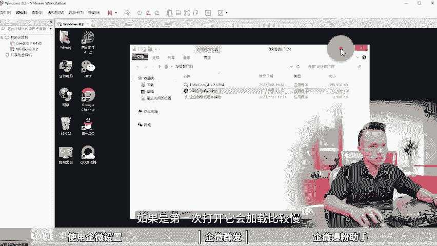
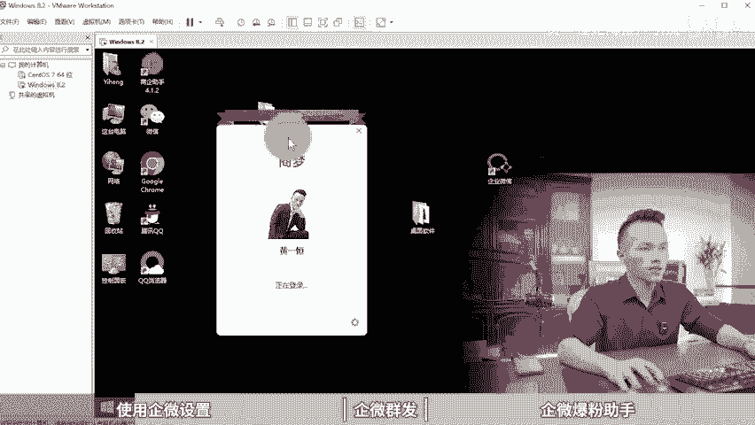
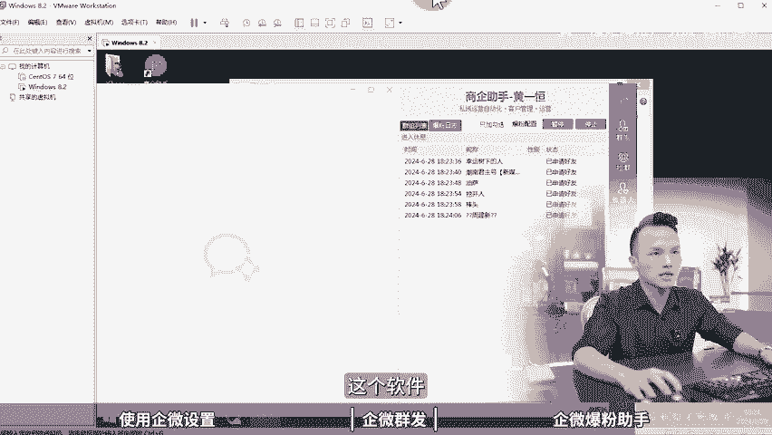

# 如何使用企微获客助手？企业微信获客助手怎么引流，企微私域运营，企微运营工具，企微机器人，企微crm，企业微信营销系统有哪些，企微获客助手使用案例，企业微信获客软 - P1 - 黄一恒矩阵推广引流 - BV1x6421f7Lg

🎼企业微信还在手动加粉，太累了太累了。现在有企微助手配置好软件，点击开始软件就自动保幕霍客，真太爽了。具体该操作节废话，一个视频教会你如何使用企微获客助手。

企业微信获客助手怎么引流详细教程在这里得先收藏起看我告诉你使用企微助手前的设置怎么配合企微群发爆助手来获克。现在看使用企微助手前的设置当我们在使用软件的时候，它的一个安装版本是必要使用4。1。2的版本。

如果是最新版是没办法进行使用的。咱么老到软件之后给大家演示一下。首先我们先安装4。1。2的版本。然后再安装这个商体助手安装完之后，这时候咱们桌面就得到图标。接下来我们双击打开软件。

如果是第一次打开它会加载比较慢，大家也可以稍微等待货，最好是。

安装完之后重启一下电脑，你再打开，这样的话，功能才正常的。打开之后，接下来我们就可以直接进行一个登录账号。如果你需要多开，我们再双击这个图标，这时候呢它就可以什么开两个窗口出来。

你想开多少个就双击多少次图标就可以了。好，这是软件的一个多开方法。那这里作为演示，我就直接开一个。接下来我点击这个登录按钮。好，点击完成之后，我需要在我的手机上面。点一下这个确认操作。好。

我们来打开手机上面。然后呢，在手机上面确认操作。如果你第一次打开的话，它是一个二维码，你需要去扫码之后才可以进行登录。这里面我先把这些不要的窗口给它关闭掉了。打开之后，如果你的群货者字源比较多。

它刚开始加载的时候来告诉大家是非常非常慢的。我们需要耐心的等待一段时间。好，接下来我们还是要做几个比较重要的操作，什么操作呢。

首先我们需要取消这个自动更新。如果你的软件它定期会自动更新到新版本，到时候你又得安装，比较麻烦。给他演示一下。我们打开软件找到更多点击啊点击头像，在这里面点击设置，在设置里面点击通用。然后呢往下方滑动。

把这个自动更新给它取消掉。这第一个第二个呢，我们需要设置消息，免打扰。因为我们加了几万个群之后啊，这个群消息来，会把你的绘报窗口全部占满掉，根本没办法正常操作，那怎么办？

我们需要合并这个免打扰的聊天窗口。好，咱们打开之后还是一样，我们滑动找到上方有一个合并免打扰的聊天勾选上这里你会发现。你看这里面的消息，它自动会跑到一个窗口里面，一些不是很重要的。

你就给它合并到这里面哎，就可以了。好，这第二个这两个设置完之后，我们就给擦掉了。接下来第三个就是定期清理文件，特别是的伙伴加了几万个群。这个电脑的硬盘直接就干满了。哪怕你的电脑是一个T，两个T三个T。

它都能给你干满，那怎么办？这时候我们需要定期的最好是隔三差五的，每周去清理一下文件，我们打开我的电脑，然后呢找到文档，在文档里面你可以对照这个路径，有个WXwork的一个路径。好，我们来打开一下。

打开这个路径，然后找到这个机开头的文件，再进入到S的目录和打开之后，这里面有一个S开头的目录。啊，这里面的文件呢，现在用我刚登录过来，没什么大文件。如果你用了一个页。

你打开看这里面文件显示500个G800个G，赶紧把它删除掉。这个删除记住，它是不影响我们的一个啊聊天记录，这些的，它仅仅只是一个缓存的临时文件。好，这是使用前的设置。接下来。

我们怎么去使用这个群趣微的群发助手？首先这里面的软件，最主要的功能呢是两个。虽然这个软件右侧啊它是有很多很多的一个功能，但是我们用的最多的就是这个群发和这个真粉功能。那群发的话，它可以帮助我们发好友。

发外部联系人发群主可以发文本链接小程序名片，各种各样的都是可以接进行发送的，给大演示一下。比如说我们要发外部联系人好，直接勾选之后，然后呢点击这个群发内容，在这里面添加上我们的内容。

添加上表情就可以进行发送。如果你要发群勾选上之后，然后呢在这里面就可以进行一个什么啊发送。这里给大家演示啊，我们特技登的一个数据比较少的。因为太多的有些名称啊，容易违规。好，这是第一个功能。

那么第二个功能呢，也就是我们用的比较多的一个叫做报粉功能去整粉。首先如果你想做报粉，你要先去找群，就是加群的群从哪里来呢？一般我们是换群的。先买种咨群，通过种咨群换群，500个为单位，换一次有500个。

那么换群的话是需要单独配合另外一个软件。所以做起为需要两个软件，一个就是我们刚才这个软件，另外一个是单独的一个换群软件。那么这个软件虽然它上面也会有一个叫做啊那么拉群的功能，但这个拉群的功能呢。

它是会有一定的这个啊限制在里面的什么，就是拉不了多少个啊。如果你一天想拉500个，它必须要搞单独的接口，单独软件啊才可以实现。然后来，每个账号每天能够发送100到300个好友请求。

那么这里面呢必须要是我们正常活跃的账号，就是养猪常用IP，并且养猪常用设备。如果你的号已经养出了IP和设备还发不了300个，就是因为刚开始发的太多了。我们要循序渐定。比如说我们前期第一天发10个。

第二天发20个，第三天发30个，第五天发50个，第十天发100个，第二0天发200个，第三天发什么300个，它的这个请求是可以不断的叠加，是可以扩容的。但扩容就是你要循序渐进。如果你一下干300个。

说实话是干不了的。那怎么操作给大家演示一下啊，我们打开软件找到我们这个叫做真粉功能，比如说我们需要增这个群的人，然后呢我们勾选这个群，然后选择爆粉配置，这里面可以设置啊，相在间隔。如果没有要求。

那我们啊勾选上不加起飞，然后点击确认。接下来我们点击开始按钮，它就会自动的帮助我们去发送这个请求，整个过程呢都自动的啊，不需要管理，你只要隔几个小时切换第二个账号。你也可以两三个账号，同时进行什么操作。

毕竟它是可以进行什么进多开的啊给伙伴好了，刚才我们给大家讲的是这个软件的使用。那么这个软件呢其实还有很多其他功能。但这些功能说实话，我们用的都非常少。最主要的就是这个群发和成本功能。

所以其他功能呢在这里面我也不占用大家时间，不给大家详细演示，感兴趣的伙伴可以自己去研究一下这个软件如果你需要的，你可以找我们，我们可以可以把这个软件分享给你。只不过这个软件呢它是有偿的啊。

并没有免费的提供，这个大家需要注意。另外如果咱们想玩好企微。关于这个软件也不行，你得学会一些企微的核心打法以及策略，这里面我给大家准备的免费的系统的企微集成课程，教大家如何做企微体战流量属性推广流程。

养号流程，软件配置以及如何做企页变。这个课程呢通过主页找我，我就可以把它分享给你进行学习课程大概有2到3个小时。如果你把企微做好了，想学习更高的策略，我们也有付费课程。

想在免费课程，先让你搞到客户付费课程呢可以帮助大家把一些细节做的更到位，学会一些高级打法，有打卡人物老师指导，还有视频以及实战演示，最主要的是有配套资眼和工具给大家进行提供。好。

这些呢都可以通过主页来领取进行学习。好了，各位同学，我是黄一涵只做落地推广方法。刚才给大家分享的企微助手的使用。有的企微助手，他只是一个工具。如果我们想做好思意，玩好企业微信，还得去扩展流量渠道。

这里面我给大家准备了是8个平台的详细打法，教大家如何布局多流量管道，这些呢都是我原创的，可以通过主页来领取进行学习。如果觉得今天视频比较不错的，请大家一键三连，感谢大家支持。咱们下个视频呢再会。

