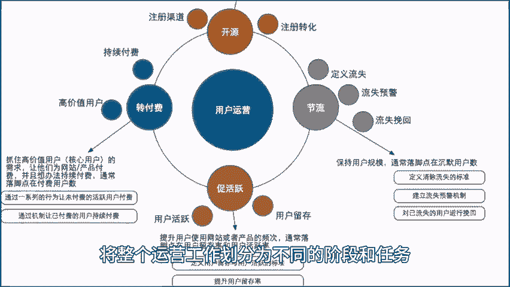
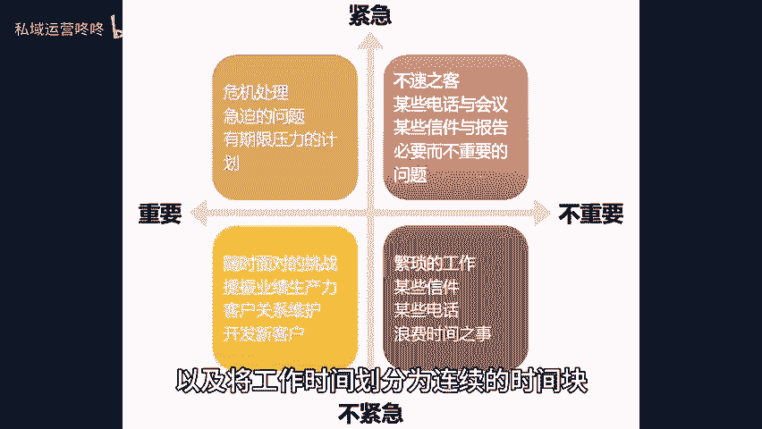

# 如何做好运营工作？四个步骤提升工作效率！ - P1 - 私域运营咚咚 - BV13m421G7DX

🎼你知道怎样高效的进行运营工作，提高工作效率吗？今天就分享4个高效工作的步骤给大家一工作化将整个运营工作划分为不同的阶段和任务，形成完整的工作流程图，并将每个环节的操作步骤。

注意事项、常见问题等详细记录下来，方便后续查阅和执行，通过制定明确的工作流程和标准操作规范，可以帮助我们更好的与团队协同合作，减少重复工作，降低错误率。2、固定90%的工作时间。

合理安排工作时间集中精力进行任务处理，可以提高工作效率，并减少凭频繁切换任务而导致的时间浪费，可以根据任务重要性和紧急程度，对工作进行排序优先处理重要且紧急的任务，以及将工作时间划分为连续的时间化。

每块时间专注处理一下任务提高效率。310%的时间思考工作内容，每周或每月安排一段专门用于思考的时间，不被其他工作打断。思考当前工作中存在的问题和可以改。😊。

🎼改进的机会，寻找可行的解决方案，并将思考得到的想法和思路记录下来，并进行总结，方便后续追溯和分享。通过深入思考和反思，可以挖掘问题根源，找到优化和改进的空间，因次定期复盘。

根据实际情况设定合适的复盘周期，如每周每月或每季度并收集相关数据和资料，包括工作成果效果、数据用户反馈等，为复盘提供依据，通过对过去工作的回顾和总结，发现问题，找到改进方向，进而提升工作质量和效率。

以上就是提升运营工作的四个步骤。当然，也可以用于其他的工作内容。今天的分享就到这里了。咱们下期再见。😊。

