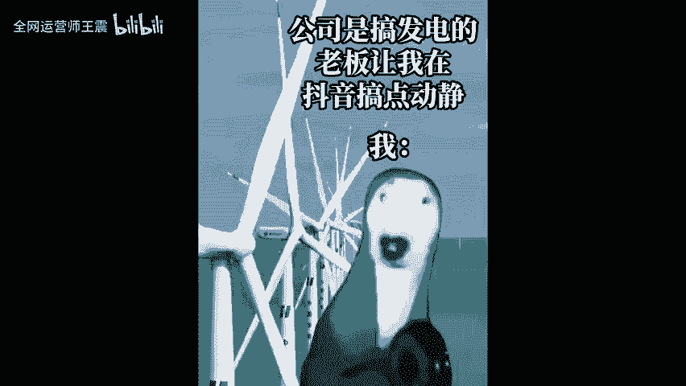

# 如何利用顺势思维改造短视频内容，月增粉十万+ - P1 - 全网运营师王震 - BV1tKvreCESc

🎼现在做自媒体2秒5秒互动，还是粉丝，哪个更重要呢？给你3秒钟的思考时间。🎼是不是都去猜了，如果去猜了，那就已经被我套住了。因为你在我的设置的顺势思维中思考，这是我们现实中啊经常会遇到的。举个例子啊。

就像本山和范伟老师的经典小品卖拐，我给你调调，信不信？🎼你的腿随着我的手往高抬，能抬多高抬多高，往下使劲落，好不好？信不信？口非指将有病，右腿短来。😡，🎼起来。🎼好。🎼妈烦麻了，哎，他干嘛？😡。

🎼你对孽妈。😡，🎼我们看这个小品的时候就觉得非常的搞笑有趣，这就是利用了顺势思维来创作的。所以数据本身和播放量有关系吗？其实没有当你觉得视频好不好啊，或者说会不会继续看下去时，这就是更感性的东西。

而这个种感性的东西中有思维的关系。如果我们转发一下深份比观众的视角来看视频。我们明知道顺势思维有认知的局限性，但为什么会跳不出瞬势的思维呢？很简单，你再看一下刚才那个问题啊，两秒5秒点赞评论哪个更重要。

如果你能跳出瞬势思维，那肯定是播放量，但如果再跳一层跳出这个图，那就是变现了。遗憾的是我们看视频的时候很难跳出瞬势思维进行习惯性的思考。这在几万年的进化中像我们害怕黑暗，看到下一句会避雨。这是人的本能。

所以说跳出瞬势思维啊，其实很困难的。既然大部分人啊都很难跳出瞬势思维。那作为。🎼创作者更不应该去当范围，而是应该去当本山老师，需要考虑的是如何设置顺势思维，让观众顺利的进入顺势思维。

当我们把目光聚集在2秒5秒军播、晚播等数据的时候，就会发现这些数据有顺势思维的因素，两秒5秒重要嘛？很重要。因为它决定了观众是否进入创作者设置的顺势思维中，沉浸式的底层逻辑是什么？顺势推舟。

为什么会顺势推动，因为有顺势思维的存在。当观众看沉浸式视频时，你不知道什么时候看完了就已经看完了，这里面还有音乐等因素。短视频可以分为两类，一类是利用顺势思维的。另一位是反向利用顺势思维的。

利用顺势思维的视频，比如说沉浸式撸猫，沉浸式多彩。这些视频给人感觉就像是一切限制，没有任何的障碍。🎼反向利用顺时思维的视频，比如说反向思维惯系，还有小杨哥的视频。🎼几点钟再玩断电了啊，来蛋。な。来吧。

🎼Yeah。🎼当你看到某个节点时，你会觉得对方要倒霉了，但的确但结果啊却会出乎意料，给人一种，你不看到最后永远猜不出结局的感觉。说了这么多，你发现规律了吗？大家经常说啊打破常规本质上就是顺势思维。

所以在。🎼创作和某件事情的时候，比如说记录今天的生活。今天主要工作是上班给员工发工资，按照正常的顺序思维来讲呢，无非就是老板拿着钱给员工。但如果反向利用顺序思维，老板跟员工要工资。

当然是在现实中很难出现啊。如果说直接利用这个题材呢，代入感不是很强，我们可以优化一下设置为三方关系，老板财务和普通员工，老板要给普通员工发工资，但要经过财务财务不同意，老板和财务爆发了基本的冲突。

如果视频是员工的视角，那结果肯定是老板和员工获胜了。但如果是客户的视角呢，结果应该是财务获胜了。🎼多了吗。🎼哎洗澡的朋友，这房案可好的行了这类视频应该有不少的同学看过吧。

你类似还有什么00后整顿职场这样的话题，为什么年年都有？如果踏入正常的顺势思维，整顿职场就应该是那些职场混迹多年的老油条或者是稳重成熟的老板。但如果反向利用顺势思维，对立的就是刚入职的00后。

就像前职大火的那个老板让我搞点动静。

🎼当然利用这种方法呢，也需要考虑到的因素啊，别整出1个10后整顿班主任的这种主题啊。所以说很多视频都在使用顺时思维，用好它对数据是非常重要的。

