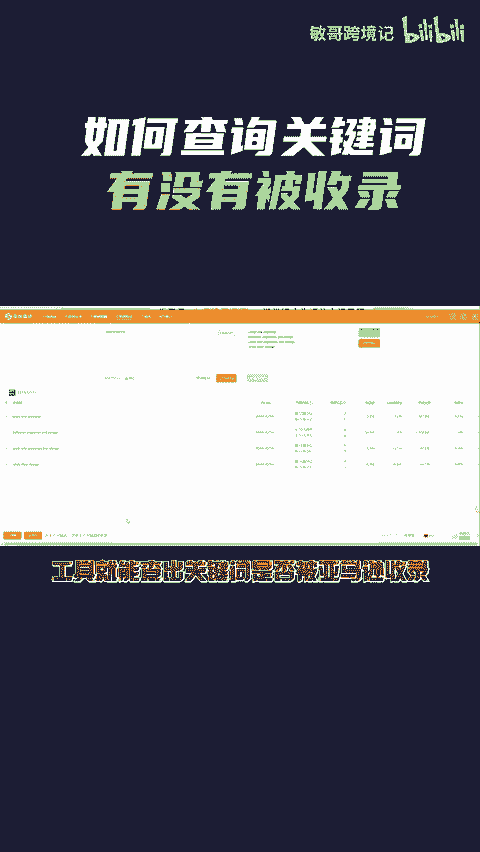
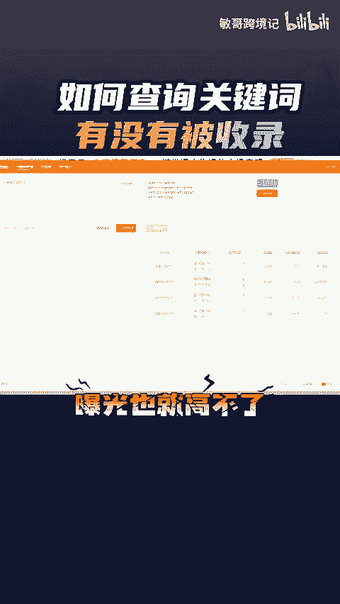
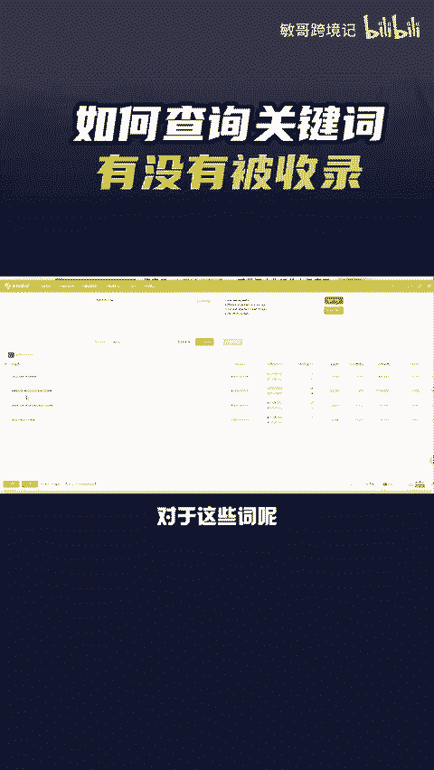
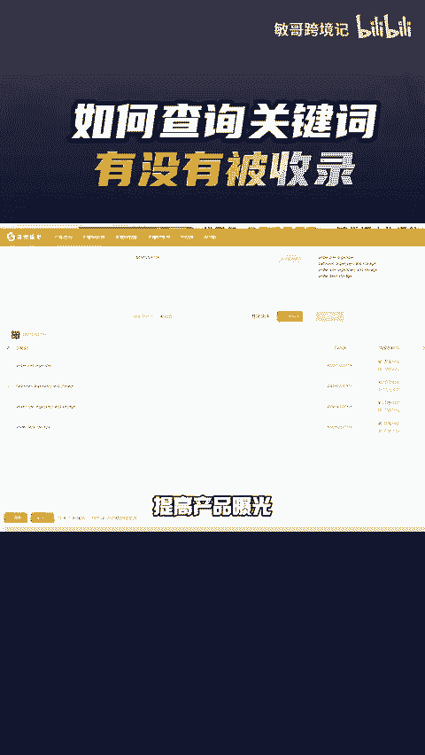
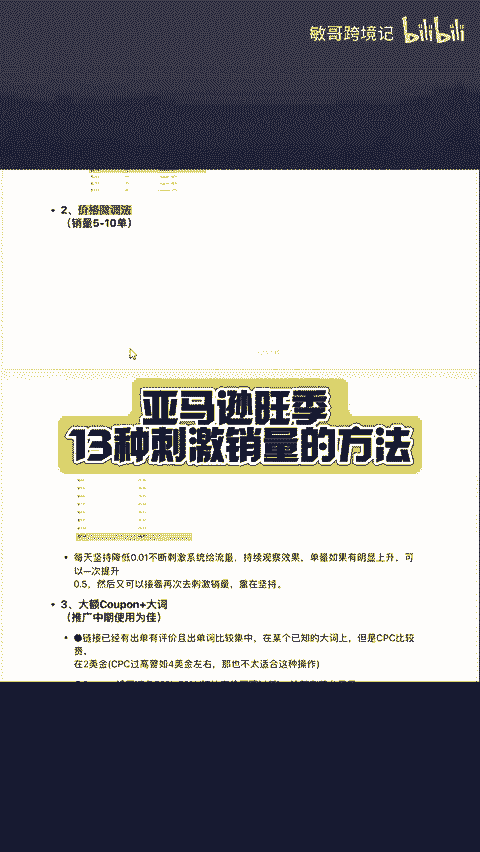

# 如何反查关键词的收录情况以及该关键词的排名情况？从而提高产品曝光 - P1 - 敏哥跨境记 - BV12CmKY9EzT

🎼产品为什么没有曝光，不妨先反查一下关键词有没有被亚马逊收录，打开卖家经营的关键词收录功能，输入产品的s不要查询的关键词，点击检索工具就能查出关键词是否被亚马逊收入，并且还能直接反查出产品。

在该关键词下的自然排名广告排名，当自然排名很靠后的时候，曝光也就高不了。大部分用户也只会在前三页选择下单。对于这些词呢，卖家不妨去增加广告的预算和竞价，提高产品曝光。

🎼最后我这里有一份亚马逊旺记13种刺激销量的方法，有需要的卖家点赞、评论666，给你安排。

