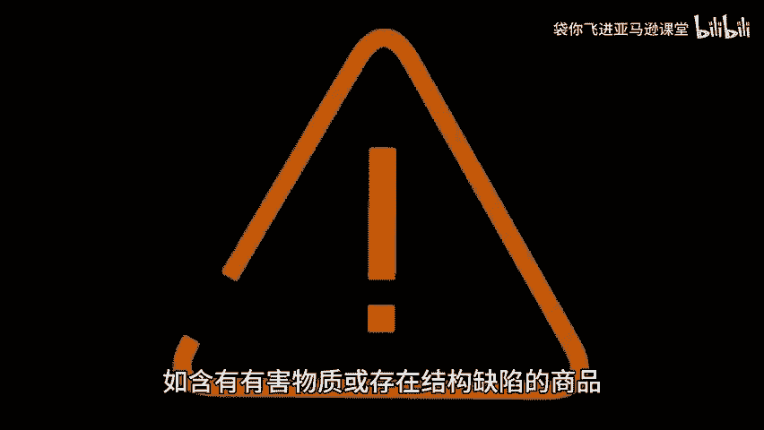

# 如何处理退回商品 - P1 - 袋你飞进亚马逊课堂 - BV1MLsoe4EMY

🎼Yeah。

🎼欢迎收看带你飞电商小课堂。今天我们来了解一下如何处理退回商品。亚马逊仓库再处理退回商品，并判定其是否可再售时，遵循一系列严格的标准和流程。当商品被退回至亚马逊仓库后，仓库人员会首先进行外观检查。

确认商品是否完好无损，包装是否完整标签是否齐全等，接着会检查商品是否存在，缺陷残损开封或缺少标配件等情况。这些检查旨在确保商品符合再次销售的标准，对于可能构成健康或安全风险的商品。

如含有有害物质或存在结构缺陷的商品。亚马逊会立即将其归类为不可售商品，经过检查后，商品会被分为可售和不可售两类可售商品将重新上架销售，而不可售商品则需要进行进一步处理。

对于归类为存在缺陷或买家损坏的库存商品，亚马逊会通知卖家，并要求卖家在30天内提交移处订单。卖家可以选择。😊。

🎼还弃质或进行其他处理。亚马逊的退货政策通常允许买家在收到商品后的30天内提出退货请求。然而，亚马逊也会根据具体情况考虑例外情况，如特殊商品或特殊促销活动可能会延长退货期限，如果买家在提出退货请求后。

未能在规定时间内将商品退回仓库，亚马逊会根据其政策进行处理。在大多数情况下，如果商品未在45天内抵达仓库。亚马逊会向买家收取费用，并将款项存入卖家账户，如果买家选择换货而非退货。

亚马逊会负责处理换货流程。在此过程中，卖家无需支付额外费用，同时也不会收到换货订单的付款，卖家应密切关注亚马逊的政策更新，以便及时调整自己的运营策略，点关注不迷路带你非好服务。点赞关注。

带你了解更多跨境资讯。😊。

