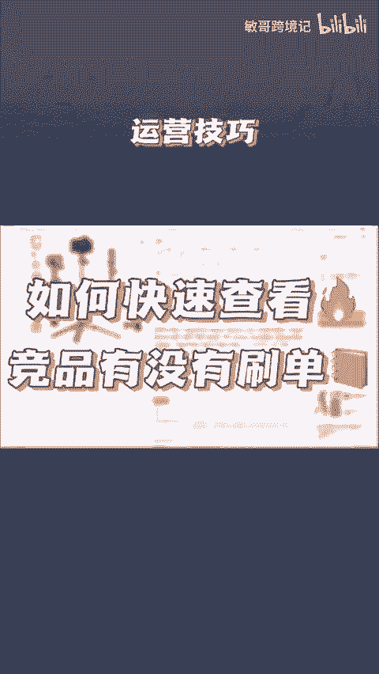
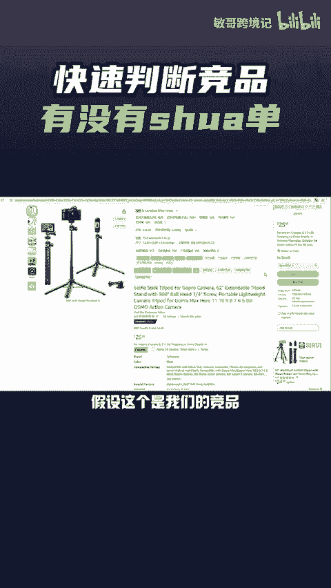
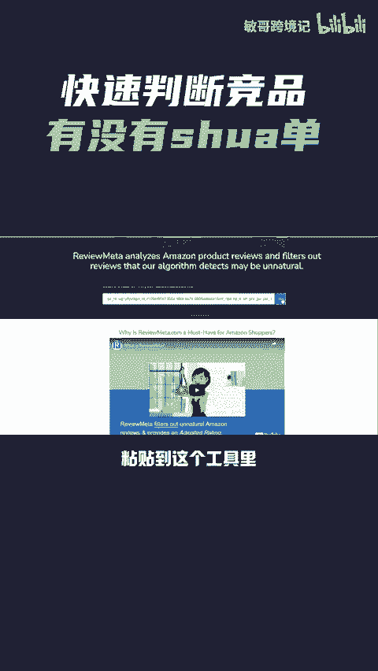
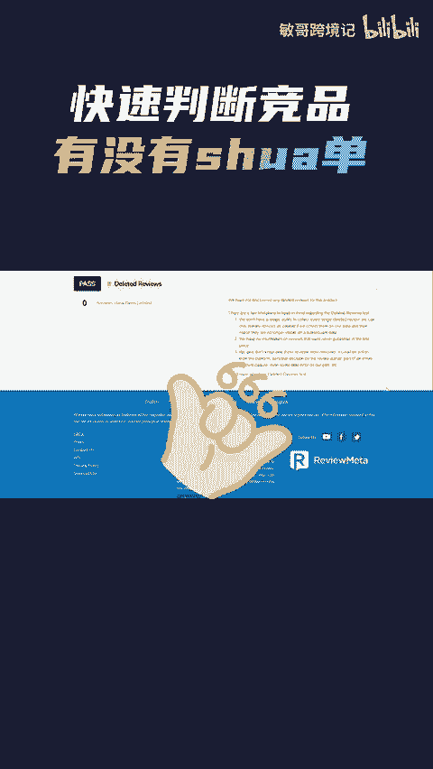

# 如何快速分析出竞品有没有刷单？一个工具搞定 - P1 - 敏哥跨境记 - BV1NTsre2E2H

🎼快速分析出竞品有没有进行刷单，分享一个免费的查询工具。假设这个是我们的竞品，复制这个产品的链接，粘贴到这个工具里，点击查询之后，可以看到两个评分数值。

如果亚马逊星级和评论数跟检测出来的实际星级和评论数相差很大。那就说明这个产品很有可能就是刷单了，反之则比较真实，往下拉，还有对评论的分析，包括可信的评论和不可信的评论等等。

那有需要这个工具详细地址的卖家，点赞评论666给你安排。

