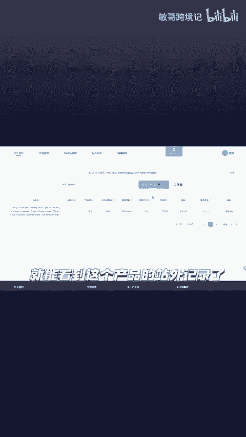
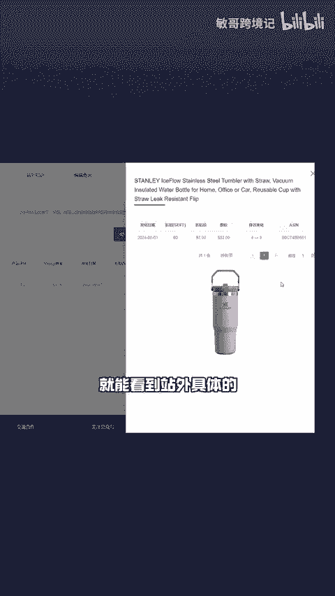
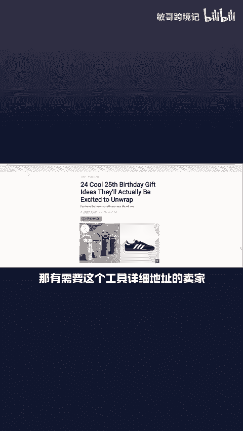

# 如何快速反查出竞品做了哪些站外渠道，并分析站外推广结果呢？ - P1 - 敏哥跨境记 - BV1HrxjegEMW

🎼如何一键反查竞品在站外做了哪些推广？分享一个免费查询工具，复制竞品的send，打开这个工具，将s粘贴到这里，接着选择对应的站点，点击折扣查询，就能看到这个产品的站外记录了。

🎼点击查看详情就能看到站外具体的折扣力度、发帖日期、排名变化等信息。

🎼在外链查询这里输入产品的s就能看到该产品所有的帖子地址了。点击链接，还能直接跳转到产品的站外推广页面。那有需要这个工具详细地址的卖家点赞评论666，给你安排。

