# 如何快速正确入局跨境电商  五大平台选品实操 - P1 - 做跨境的Helen - BV1vdxDeZE7S

好嘞，恭喜咱们的吉东啊，吉东的话呢也中奖了。我们uni联名的小风扇特别特别的棒。我接下来什么呢？一定是什么？不能浪费时间，我们要什么呢？继续抽奖，边开播边抽奖啊，确保说是雨露均沾。

今天来听课程的朋友们啊，不光说是能够免费听课还能够干嘛呢？拿到我们的小风扇。听说好多城市已经降温了吧。

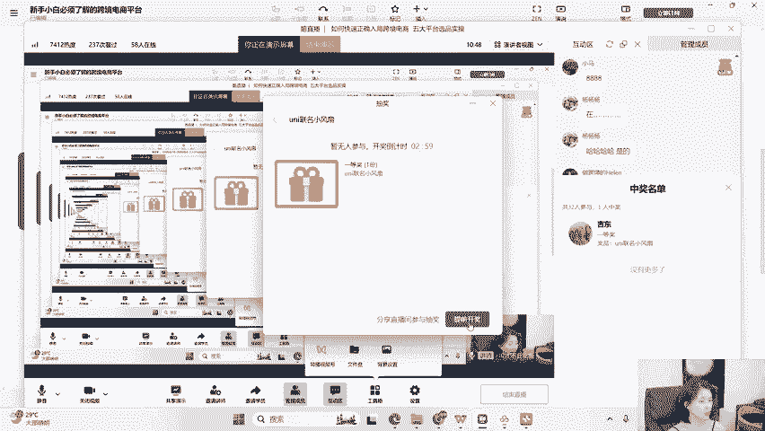

是不是好多城市已经降温了，就是说现在啊感受到什么呢？降温了，这个风扇还能不能用啊，有没有这个担心的朋友有这个担心的朋友的话呢，还能提醒一下大家啊，风扇的话，明天明年咱们也可以用。

不一定说是要用今年的好不好啊？所以这是我们讲到的跨境电商是什么？我们先进入到下面一个话题。欧纵用啥回款啊，GEP电子钱包再加上我们的这个什么。连连拼通啊，是不是当你绑定了这个呃连连拼空以后的话。

其实啊你随便绑一个连连或者拼通以后，它就会什么呢？后续要你去进行1个GEP电子钱包的绑定。好吧，欧纵本土的利润率是多少啊？宝宝，你这个问到点子上了。今天len就会带着大家手把手的进行什么呢？选品上架。

适合新手小白做的平台，我经常在直播间讲的啊，欧纵TK虾皮我会带着大家一一对一的什么呢？实操完成我们今天的这个课程啊，而且我今天是什么？把我们本土店的备货表都给你们拉出来了。

所以今天想做本土的朋友们今天就可以看得到本土到底能够挣多少钱，跨境又能挣多少钱钱shop皮的跨境又能挣多少钱。好吧，我们今天的课程是非常非常丰富的，希望大家一定不要错过。你手边有再多的事情。

请你先放下来。或者说你旁边边刷抖音边听我直播的，也请你不要再刷。拿出你的小本子，拿出你的电脑是吧？咱能做个笔记，咱们最好是做个笔记。你不做笔记的话，我就跟你讲，听了等于白听，天天在我直播间里面听公开课。

听什么呢？听的很嗨，结果一做啊全都废的，不做嘛，没有运营嘛，没有说是开始操作嘛？那你有啥结果啊，雪老兄，对吧？何必呢？那你都讲真的，如果你今天听课不认真的话呢，我真心提醒你们，还不如别听了，就干嘛呢？

去呃刷刷抖音去什么呢？找点消遣娱乐，吃个烧烤啊，或者说陪陪家人朋友，何必来这边听我直播，搞钱呢。那你既然搞钱想搞钱的话，你搞钱态度一定要端正，好吧，所以提醒一下各位啊，搞钱态度一定要端正。

如果态度不端正的话，宁愿什么呢？就不要开始。啊，好的，那我们看一下今天的课程内容里面，hellen跟大家讲的跨境电商是什么？啊，跨境电商是什么？来了，宝宝们，我们讲的跨境电商是什么？其实就是什么呢？

把中国货中国产品。把中国的产品什么呢？销往海外。啊，这就是跨境电商。还有另外一种跨境电商的模式是什么呢？把海外产品往中国往内销。我们但是我们一般做的什么呢？往外销。那很多朋友就说了。

那这种的话呢不是有什么呢？有我们讲到的好几种模式吗？啊？好嘞，恭喜唐震获取了咱们的小风扇啊，唐振也算是我们的这个老老同学了啊，你们现在能看得见韩伦的视频吗？是因为这个画面太热了，还是怎么回事？

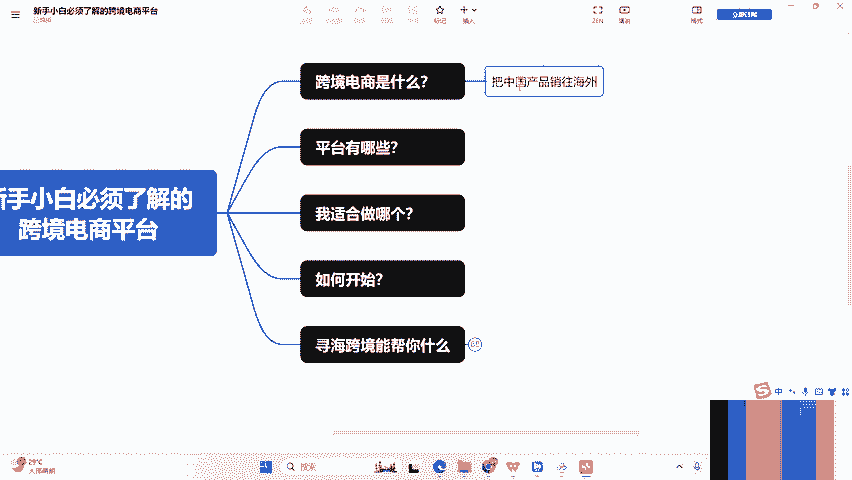

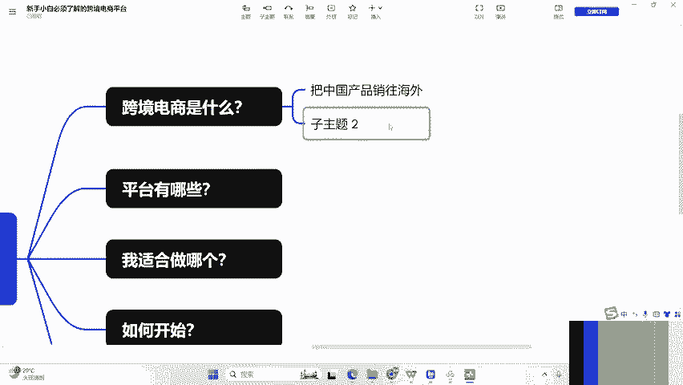

稍等我一下啊，我我要把这个视频给你们，哎，放亮一些。等一下啊。哎，为啥？稍等我片刻。能够看见画面吗？咱们直播间的宝宝们。

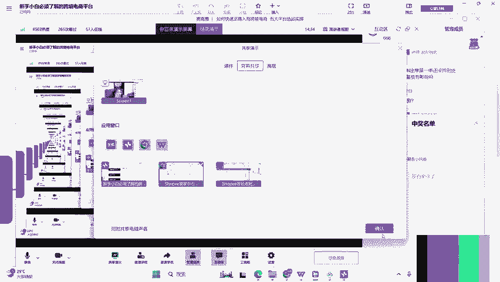

能看见画面的朋友，公屏上扣个一啊，我看到了我看到了。来，我稍微把这个镜头。放大一点，好吧。OK好的，恭喜唐正啊中了咱们的小风扇，这评论区的占比太大了，能不能调节，啥意思？宝。

你是可以点那个右下角点一下画面，点一下右下角那个地方有一个平行过来的，知道吗？你可以把这个屏幕直接横向转动一下。宝不是说只能竖着看，你可以横着看啊，咱们看一下，点一下屏幕的中间，然后点一下右下角。

点一下右下角就能够什么来解决这个问题了，好不好？啊。然后咱们记住了，我们自己在直播间的朋友们啊，乖乖们。等一下。稍等我一下啊。好嘞，就是什么呢？我们讲到说是今天在直播间的话呢。

我会给你们讲的东西讲的比较细，而且我专门就是讲给小白听的。我不是讲给大麦啊。大麦如果说今天想听的话呢，可能说咱们等到下一次啊，因为确实hellen的时间有限。我知道我的粉丝体量里面比较多是小白。

所以咱们今天就是把小白的问题解决清楚就好了。好不好？下次如果说是你的进阶进入到进阶课程的话呢，我们会小助理会提醒到hellen说咱们有一堆朋友已经出过单了，要进阶了，要什么呢？到下一个部分。

hellen在什么呢？再去跟大家讲到进阶课程，好不好？好，接下来的话呢，我们先向像什么呢？我们的变现或者说什么呢？他主要的呃，我们讲到的跨境电商的是什么呢？变现模式是什么？嗯。

其实就是我们讲的这个把中国产品销往海外赚外汇。啊，对吧还有什么呢？还有哪几种形式。先是变现，然后是形式，有些人就会什么呢？搞不清楚外贸外贸和跨境电商的区别。这两个是天差地别啊。

朋友们外貌是B to B啊，然后是什么呢？然后电商是B to C啊，你要做外贸的话呢，它其实是由外贸和跨境电商是很大区别的。它不是一个东西。我们电商主要是做的是B to C。所以我们做零售的话呢。

利润啊，单个订单的利润是比较高。但是整体来看啊，就利润率比较高，但是赚的那个总共的钱的话是没有说做批发做的多的。知道了没？宝宝们啊，所以形式的话呢，我们要记住外贸和跨境电商是很大区别的。

再来看到跨境电商的红利是哪些。来，宝宝们，你们知道红利是啥意思吗？就说我们到底选的这个行业选的对不对啊？我今天来听浪费我这个两个小时的时间，在黑en的直播间听挂进面商，会不会浪费我时间呢？还真有可能。

如果你不搞清楚跨境电商的红利是什么，真有可能浪费时间。我们看到什么呢？有我们讲到的国家商务部。要培养10万名的跨境电商人才。这个是我们。讲的大方向的政策，国家在干嘛，我们就干嘛，对吧？再来看到是什么呢？

一带一路。一带一路的政策特别像是俄罗斯跟东南亚两个国家，真的是太强了，都跟咱们接着嚷的，对吧？而且说一带一路的政策就是要把这些国家什么的拉拢关系进了的话，我不光跟他卖货，我还帮助他啊。

就像我们讲到的缅甸啊，老挝的那一块的中缅铁路啊，中老铁路啊，中老铁路那边都是咱们中国人帮他们修的，对不对？你要帮助这些小的国家，你才能什么呢？把他们拉拢过来，然后什么呢一起做大，包括像中俄之间的关系。

我也是一直都非常坚定的去投资的，所以我们看到红利里面，国家商务部培养10万名跨境电商人才，好多人就说海len啊，你这个东西什么呢？怎么听上去这么虚啊，是真的还是假的呀，对不对？来，我们来看一下啊。

宝宝们。是真的还是假的？你不要听我说，你要干什么呢？你要看hellen给你看到的一个结果是什么？哎呀，我点不出来那个小额童。稍等一下啊，大家。哎。我还是开我的整个投屏吧，虽然所以说会很乱啊。来。

我们看一下国家商务部培养10万名跨境电商人才，是我说我说的吗？

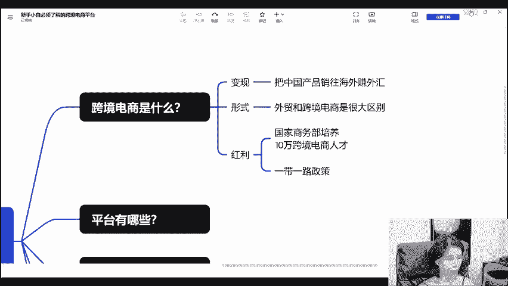

不是吧，福建省商务厅2024年1月30号搜狐网，还有什么呢？还有这个青岛跨境电子商务协会，再有什么呢？新浪财经是不是全部都是写的是商务部发文，今年将培训跨境电商人次10万名。对。这这不是我说的。

我只是把国家的政策给你什么呢？再讲一遍这件事情你在所有的百度还是官网里面都看得见。所以这是我们讲到的国家方向是怎么走的，咱们就怎么走。你也要看的说是为什么会有这件事情存在，是因为什么呢？

我们再看一个非常明确的一个一个咱们讲的说国家现在遇到的困难啊，就什么呢？外贸的订单在骤减。外贸订单骤减。那你告诉我我的外汇还挣不正了，不要忘了，咱们的变现形式是把中国产品销往海外赚外汇，那还是要销啊。

现在外贸订单是什么？B to C批发的订单骤检，我们现在是什么呢？我们要拿电电商来救嘛，是不是跨境电商？这个是B to B。这是什么B to C。来拯救啊。对吧。当然这是我们讲的这边订单在减。

这边电商订单就要增啊，朋友怎么把课件变成全屏，点开我们中间屏幕右下角啊，在那个按钮的什么呢？旁边有一个横屏符号，麻烦你点一下那个横屏符号。好吧，我实在是。咋跟你们说呀，给我急死了。

小助理这边的话也没办法说是在这个屏幕里面给大家进行一个。啊。给我急疯了。宝们啊，这里。这样的话，再不知道的话，我真的是没有办法了。这个地方看到了没有？这个按钮这个按钮把它变成全屏啊。

所以为什么说我说我要开直播课，我不讲不让你看视频课。如果要是我开的是什么呢？视频课的话，你来问的话，没人理你啊。这个按钮是啊点一下屏幕中间随便点哪里。

然后点这个下面马上就把它变成一个我们讲到的什么横屏的模式了。啊。然后这边还有个朋友说。抖音跟这里我都是用电脑全屏看的课程也可以啊，你们自己找小助理拿了链接以后，自己在什么呢？

电脑里面用那个用那个看也行啊，用电脑的话就肯定是横屏了，链接都是小助理那边的，好不好？好，宝宝们，我接下来继续跟你们讲红利我们要用知道说国家的焦虑在哪里。就是说的现在国家也是面临着什么呢？挣不到外汇。

那为什么就像我们讲的今年重点发展跨境电商，这个是一个大方向的问题。因为外贸订单骤减，外汇减少了，外汇储备减少了，那就要靠什么呢？电商来什么呢？增加外汇储备啊，朋友们。啊，来拯救增加我们的什么呢外汇储备。

要有外汇在手上才是真正的有钱，好不好？所以这是我们想到的跨境电商，现在还有没有什么问题？来有没有说还不理解跨境电商是什么的？还不理解的朋友，公屏上面给hel伦扣个一。有没有？应该都很清楚了啊。

那我们再来讲什么跨境电商什么呢变现。哦，不是变现，是什么呢？周期。或者说是适用的人人群，就我经常跟你们讲的是跨境电商，他一定什么比国内电商要好，没那么卷，对不对？但是你要想的说一个人。

他肯定会想说他到底多久能盈利。我就跟你讲啊，刚刚前面有个兄弟说，他说上架了一段时间什么呢？上了7天，洪亮说的有70个品都还是不推流，对不对？还是不推流，你知道为什么吗？洪亮。因为你上品的方向上错了。

我不晓得你上的是什么品，但是他一定是错的。如果你上的品的方向是对的话，你不可能不开单。知道吗？方向是错的话，真的是努力是白费的啊。我提醒一下各位。所以这个时候我们讲到周期的板块。到底多久能够赚钱啊。

就这么简单，我们先看的是第一路是什么呢？先是什么来？开店。啊，然后是什么呢？出单大周期再到什么呢？订单。稳定订单数量稳定。然后再到什么呢盈利。朋友，我都是一个非常现实的人。

你们在抖音里面肯定也听过海冷的课，对不对？你告诉我是不是你不开店，你怎么出单？😡，而且你开店其实后面还有一个部分叫做什么选品上架。2。很多人喜欢问我说，做快递电商到底多久能赚钱啊。

到底多久能够把这个钱赚回在手上啊。我就问你说你多久开店嘛，多久什么呢？选品上架嘛，你选品上架的量要够大了，你才能有机会出单嘛。你有了第一轮出单，你才能订单稳利，你才能够到什么呢？实现稳步的盈利啊。

而且很多人以为说出单就等于挣钱了，出单不等于挣钱。朋友们出单只是出单。而且这一个订单还有可能会是亏的。但是好歹你出了，你会有一个感觉是什么呢？做电商比任何的行业什么呢，来的速度都要快。

没有哪个行业能够说让你努力就会有结果，但是电商就是什么呢？让你努力就会有结果的行业。所以我们讲的说你经常问说是开店，我建议大家是什么呢？今天真的听的好了，为什么呢？今天当天就去开店。啊。

当天就要去把店给我开下来，而且我今天会给你们发什么呢开店的教程资料。今天看完课程的朋友们找我来领开店的教程资料，全部是免费的。好吧，当天进行完成开店。然后接下来是什么呢？你要有营业执照。

你才能开你没有营业执照，你是开不动跨境电商的。啊，一天就能够完成开店嘛，但是营业执照呢可能是要等个什么？3到7天各工作日才能下来。真的。啊，这个地方是是对的。所以你如果要是有一个营业执照的朋友们。

你当天开店什么呢？基本上都是当天下店或者两天以内下店。全品上架就是看努不努力的问题。我感觉我第一单就得亏，物流不会选，现在很慌，怕什么，只要你不发货，你就没有亏。悠呦啊，不要怕不要怕。只要你不发货。

你就没有亏啊。就是出单以后，咱们是要合利润的，后面我一步一步带着你去解压选品上架是什么呢？数量越多。机会越大。或者说什么呢数量越多，实操越熟练。所以有些人喜欢跟海伦讲一句话。海冷啊，那个什么呢？

我在这边呃上架，我上架了好多天了，怎么还不出单？你要知道你做的是什么，平台，它的上架规律是不一样的。TK1天至少上架50到100个，虾皮，至少一天上100个欧众一天上架10到15个。有些人一天上了两个。

说我天天都在上架，我怎么还不出单，数量越多，你的实操越熟练，而且用量来赌概率，你的机会出单概率才越大。就像有些人说，hello啊，那个我能不能干嘛呢？我能不能够出单速度再快一点，再快一点。

我经常跟你们说的是，你可能做跨境电商一天花两个小时也够，对不对？宝爸。一天两个小时也够，叫做什么呀？一天两个小时也够叫做什么，你们告诉我。叫做你是在干兼职。如果你今天是干全职，你一天干了8个小时。

你等于别人的4天。那你告诉我谁的成功概率大。那肯定是干8小时了呀，确实是可以干2小时，但是一定是什么呢？量越大。量用量来赌概率，明白了没有？所以选品上架的这个部分的话呢。

就是我怎么样能够让我的单位时间里面产生的选品上架数量越多，我觉什么呢越快。那出单的话是什么呢？一个是运气，真的对很多小白来说都是运气导致的。还有一个什么呢？啊，我们讲到的量大出奇迹了嘛。

至少说我我作为一个非常努力的店铺平台一定会分我流量吗？量大出奇迹，就算是什么怎么样都出了一单，订单数量稳定，这个不是很容易的。这个叫什么？坚持选品上架采购发货？你要坚持，你不坚持，你不可能稳定。

再到盈利是干嘛呢？也是坚持。选品上架采购发货还有什么呢？筛供应链。这个地方有没有发现盈利的时候开始什么呢？跟供应链开始什么呢挂钩，你会比较知道说这个供应链需要的是什么样的品啊，订单数量的稳定是什么呢？

坚持选品上架采购发货就可以了。因为你一个店铺不是一天做起来的，是靠什么呢？你日积月累这么去做你的订单才能做起来哦，宝宝们。知道吗？如果你今天啊三天打鱼，两天晒网，就比如我们讲的选品上架。

前面一个星期天天都上，天天都出单，或者说经常在出单，一下子忙起来了，公司工单位工作很忙，然后干嘛呢？我我我忙去了，我没有在搞选品上架了，订单没有及时发货了，那你觉得你会有后面吗？你会有后面这个两项吗？

其实前三步啊，我真的是非常大胆的跟大家说，前三步。就非常非常什么呢？非常自信的跟大家说。啊，就这三步的话，正常来说是几天了。开店加选品上架10天以内搞定。你告诉我，你去哪个地方找一个生意。

做10天以内你能做出一个结果的。而且这个结果不是不是赚钱啊，不是盈利，而是什么出个单而已。其实你做很多事情都不一定做得到。而且我们讲你去送外卖是很好。什么兼职送外卖或者说兼职什么呢？去当快递小哥啊。

他们确确实也挣得多，但是我真心觉得有点辛苦啊，希望大家还是选稍微舒服一点的行业，至少说做电商，咱们可以说在这个办公室啊，或者在自己家里面吹着空调，对不对？或者什么呢？对着电脑，咱们就能把这钱挣了。

不要去做体力劳动，尽量做脑力劳动，而且你去送外卖啊，或者做那些工作，其实挺危险的，老走在路上，对不对？所以我们讲的说开店，甚至说我讲我讲真的，加上你开营业执照。如果你真的是一个真心想搞钱的人。

10天以内你不出结果，真的有问题。不停的选品上架，会不会把550个SQU占满。宝宝今天还能给你准备了课的，我们是会今天给到大家什么呢？给到大家有到炮灰店的什么呢？炮灰店的这么一个。选择啊炮灰店这里面。

你们正常来说每一家炮灰店里面都会有一定的广告费，还真不是广告费的问题。是什么？这家炮灰店我可以拿来大量的练手上架，拿炮灰店上架上出结果，上出数量的产品，我干嘛呢？

就是说在抛柜店里面跑出来有数据积累的产品，我再往自己的店铺里面放啊，红红应该也是我的陪保学员，我没记错的话，是不是？啊，欧众一个店不够吗？宝宝一个店不够的话，咱就什么呢？多搞几家炮灰店。

也没必要再买新的营业执照了啊，因为一家炮灰店的话，hellen今天在直播间不是给你们讲了吗？61家对吧？本土3001家，看到了没有？建议3到10家测，这种3到10家测的策法的话是做本土啊。

现在你们做跨境的话，不需要3到10家的，等一下我再跟你们讲好不好？你们有问题就评论去提问，为什么上公开课啊，然后唐振说我这个500个SKU就剩下100个空间了，当然可以啊，我会给你匹配炮炮灰店嘛。

对不对？匹配个炮灰店咱们就搞定了吗？宝宝是吧？唐正不用担心啊，所以10天以内你正常来说都能出单的，你告诉我你做哪个行业有结果，没有不可能的那你再看啊，订单数量再到什么呢？盈利稳定这件事情到底要花多久。

来吧，我跟你们说，这个地方就久了啊，你要变成什么呢？盈利要看你盈利多少钱的问题，你盈利个2三00块钱，可能三个月内搞得定。如果你想要盈利什么呢？盈利月入过万。啊，我们讲的什么呢？盈利是月入过万是什么？

3个月以上。你要做这件事情能坚持到什么呢？3个月以上的朋友们，咱们讲的说盈利月入过万还可以吧，我觉得应该是有点机会的，但是也会定向的筛某些平台啊，不是说所有的平台都可以。而且我觉得3个月还是有点什么呢？

有点太短了，3到6个月，因为确实一个生意啊，没那么简单。啊，你要去筛供应链，你知道吗？今天我才跟我们的什么呢本土陪跑学员给你们看一下hellen今天的腾讯会议的记录。好吧，所有的东西都是公开透明的啊。

你会看到的是什么呢？我的腾讯会议的记录里面，我今天跟多少个本土陪跑学员沟通，你们看一下，就是今天9月25号的话，对吧？我的录制的过程，你看我都有多少分钟，28分钟一个小时50分钟，什么？

66分钟再到这边一个小时，然后昨天晚上又又又跟我们的本土陪跑学员是一个半小时，李乐又是一个小时20分钟，这里又是一个小时。你知道我们在干嘛吗？我们就是为了把这个订单什么的，数量稳定。

还有各方面在快速的拿我们的时间在跑，就是为了堵这个目标，叫做3到6个月以上盈利过万。因为只有做本土的人，可能说可以压缩这个时间。压缩到多久？3到6个月，看我能不能压缩到两个月到4个月。啊。

做本土的话确实会快一点点了，是不是就像你们刚刚看到的hellen这个什么呢？我的这个腾讯会议的记录都摆在这边的，时间都看得见吧。右下角这个地方都是时间嘛，是不是就这个意思，你如果想要什么呢？

你想要更快的速度越盈利过万，那我告诉你投资的钱会变多，60亿家去哪里买，宝宝。啊，61加的话呢，咱们干嘛呢？找小助理啊，哪个小助理邀请你进来的，就找他去买601家的炮灰店啊。

还有包括我们刚刚这边红红说不是陪跑学员啊，我还以为你是呢，我看到你好几次直播了，宝宝啊。我这个欧众店开了3个月没去管，当然能用啊。你在后台建一下工单。好多人说不知道后台怎么建工单的，我给你们看一下。

好吧，就是今天的话呢，我们小助理说啊，hellen啊，这边有个同学什么呢？不知道怎么去建工单，不知道怎么去解决那个呃，我们讲的说也不是叫建工单嘛，就是说怎么解决这个后台的处理问题啊。

怎么去确定我的店铺能用不能用，对吗？我们右下角这个地方啊，你们看一下，你看到没？咱们在直播间的宝宝，你看听直播就比听视频课的效率高啊，你买了59。9块的视频课，不是说你不对，你可以买，但是你要什么呢？

真的花时间来看才行。

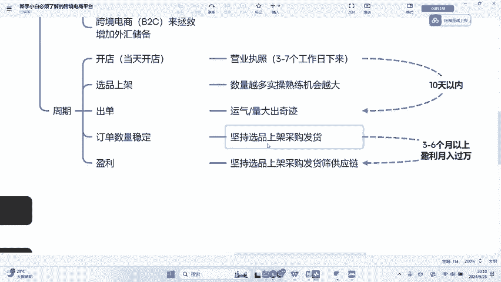

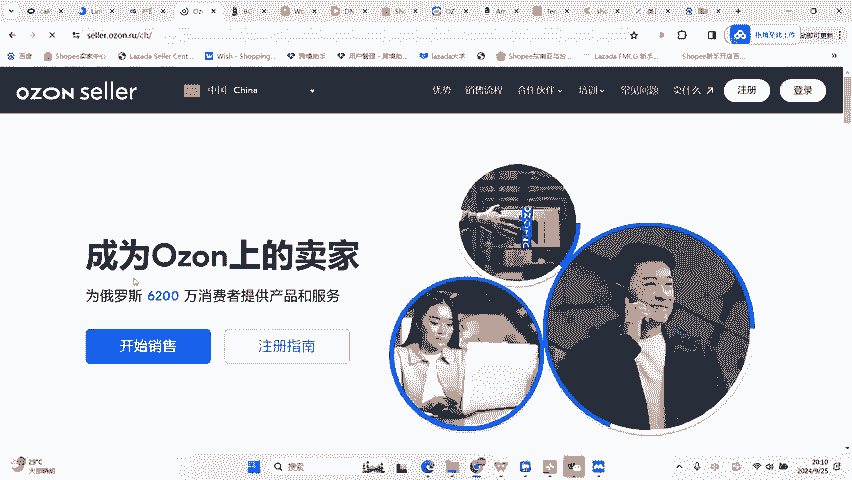

我的妈呀，太卡了，一到晚上欧纵这边就贼卡。哦在这看到没有？宝宝们这个地方这个地方是可以什么呢？创建什么申请，去问客服，去跟客服沟通，问清楚你想要了解的所有的事情的。好吗？所以你们看一下盈利难不难啊。

显你好冷哦。是吧。当然，天底下面什么呢？没有什么呢？没有好好做的生意啦，没有什么呢？没有轻松挣钱的生意啦。不要做着白日梦，所以我们真正达到盈利，或者说达到你的盈利月入过万这个目标3到6个月左右。

如果说真的说运气好，你看像这个地方出单，运气好的对吧？运气再好一点，有可能你两个月也能月入过万，但这个是真的很赌运气的问题。好吧，我们至少说靠努力能够有结果的，是10天以内的这个努力。

这个是3到6个月的努力干嘛呢？盈利月入过万，我这边给你们看一个我们的什么呢？我们的一个案例啊，我们的一个案例特别特别的不错的。我们的一个学员，昨天不是昨天我那天才跟他沟通交流，8月1号。

你们猜是什么时候的，8月1号。给你们看一下啊，我们这个学员是什么呢？是在我们整个。2023年的8月1号报名的同学，他是8月份报名的吧。你看当时所有的注册的记录，我现在是直接给你们看陪跑群的消息啊。

我们就看一下这个学员是怎么做起来的。我打开他的一个表单，你们看一下，就是说我们所有的学员的那个数据都会靠什么呢？表格记录下来他的这个成长过程。你们看一下，他在12月份的时候，最新最后一次发给我们的表格。

你看啊我们后续都会一直不断的邀请他什么呢来听课什么呢？1月份8月份的陪跑是不是正常来说十11月份就结束了，但是后面我们只要有什么通知啊，有什么活动啊，有什么聚会啊，我们都会通知到他。

你们看一下这个同学的情况，因为我是希望大家明白说做电商没有这么难，知道没有？你刚开始不出结果是很正常的事情的。

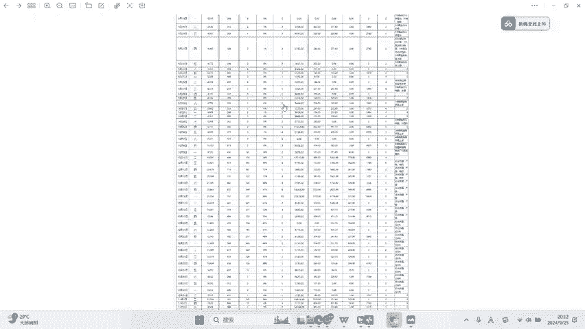

你不出结果太正常了。你看这个同学是不是跟你们一样，都没有结果。我是不我为什么敢跟你说十天，是因为我们手上有大量的案例，一天不出单，两天、三天、4天、5天、6天、7天、8天、9天，第十天干嘛出了一单嘛？

看到了没有？是不是第九天第十天出了一单了，结果后面什么呢，又好几天不出单，三天不出单，又出一单，后面什么又又又开始连续两天不出单。

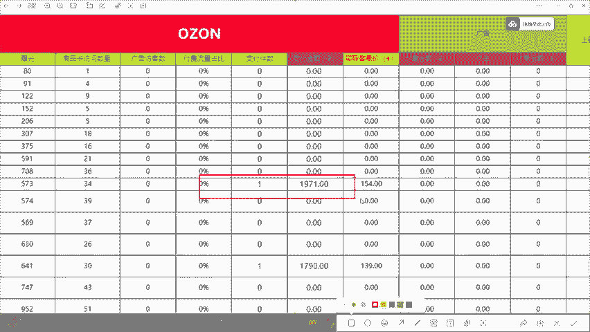

对吧不出单以后呢，你看他最近那个是8月份的数据啊，我们再看他12月份的数据。12月份的数据这边都是日期。最左边是日期，然后最后边是什么呢？这里是日期，这边是出单量，你告诉我还有没有说哪天不出单的。

没有了吧，只是说出单多少，销售额高低的问题。但你不得不说，这个同学真的非常坚持，他从8月份陪跑到今天12月份，他都是什么呢？一直都在做哟。包括他到今年啊给你们看一下，我跟这个同学的什么呢聊天记录。

他最近开始什么呢？考虑想要什么呢？做这个我们讲到的。这个服务商我们也是有在聊天啊，他也是什么呢？我就问跟他说，我当时是跟他聊天，我说是你应该什么呢？考虑说怎么去做本土的问题了。他的意思就是说什么？

他就说做本土的话呢，感觉单还什么胆子太小了嘛，不太敢做。他说管跨境店太累了，单单店铺搞不大，多店铺忙不过来，我就说我建议还是什么呢？做本土的单品就够了，但是他这个同学确实是什么呢？投资成本有限。

他不太改啊，你们也可以看得到什么呢？这个同学的头像是不是在匹配着len直播间我刚刚给你们看的一个也是他的名字嘛，DDUP我们在这个群里面很多我们今天直播的陪保学员都知道的，瑶瑶老师对不对？

然后在匹配着什么呢？匹配着我们的聊天，你看像那天晚上我们是9月18号的晚上，我还跟我们所有的陪跑学员上了一个课，讲的是下半年的选品大促会议，确保说每个人大促的时候有有这个有这个通知。

你看发我们隔了一年我们。依然是在服务配保学员的，为什么？因为hellen我开个直播而已喽，对吧？谁来不是来，反正大家一起听就好了。只有我们的付费学员才能够拿得到的嘛。但是你看他就是只要坚持做生意的人。

他后面一直都会挣钱。你如果不坚持的话，你告诉我你怎么月入过万。你不可能月入过万啊，不要把赚钱这件事情想的这么轻松，这么简单。我今天现在到现在为止只是跟大家讲了一个事情，我们用跨境电商是怎么变现的？

跨境电商的形式是跟外贸也有很大区别的。第三个，跨境电商是一个红利的风口的行业。也不叫风口吧，只是红利啊。因为毕竟说国家要推国家为什么要推，因为国家挣不到外贸的外汇了，被漂亮国那啥了啊，这个话懂得都懂。

看看新闻联播都知道发生了什么，对不对？所以为什么要推跨境电商，要增加外汇储备，再到最后什么呢？我们做跨境电商到底多久能挣钱，10天内出单，3到6个月什么呢？3到6个月坚持啊，坚持啊，坚持才是胜利。

朋友们才能够盈利到月入过万。好，第一个部分还有没有问题的？有问题的朋友们公屏上面问一下hellenhellen来帮大家怎么能一一解决掉。啊，还有没有问题的？有问题的朋友们，什么呢？一一解决掉。来。

宝宝们，我问一下啊。我再给大家发一个福袋吧，好不好？再给大家抽奖发一个福袋，我们在一分钟以后开奖，一分钟以内没有问题的话，我们就直接继继续往下走了。有没有问题？好，没有问题的话，我们继续往下啊。宝宝们。

😊，好，那我们继续什么平台有哪些？好不好？没关系啊，平台的话呢有很多。我们今天重点给大家讲的是哪些平台？我知道今天有很多朋友说是因为欧众来的嘛，但是我今天不只讲欧众。

我讲什么呢欧众TK还有什么呢shop品，包括我今天会给你们带你们什么亚马逊选品。啊，亚马逊选米这个地方的话呢，hellen再跟大家简单的讲一下te目，我们把te姆跟亚马逊对比一下，看一下。

就是为什么说讲亚马逊的生意现在这么难做。te姆的价格为什么对他冲击那么大，好不好？你们还有什么平台想听的，hellen直接敲在公屏上。有没有想听的啦，宝宝们。你们想听什么，hellen就给大家讲什么啊。

说卖通啊，宝宝。好，行，那我讲个速卖通。还有吗？7K在的在这里第二个啊美克多。好，我们讲个美克多，还有没有？没有了吧。还有没有？EMAG是什么呀？小白没有雄厚资金，从哪个平台开始？宝宝从无货员开始啊。

等一下我会跟你讲到第三个板块的部分，我适合做哪个？就是说是今天的，我指的是咱们直播间的粉丝宝宝。就我适合做哪个，先讲平台有哪些告诉你我适合做哪个如何开始。哦，有太好了太好了。

有个朋友讲了脸书facebook太棒了。Yeah。还有没有？可否比较一下平台，现在不就是在比较吗？宝。现在就是在比较啊。还有吗？吸音哎，太棒了。咱们直播间的朋友们认知普遍还是偏高的。

不愧是听我抖音直播过来的。罗马尼亚的电商啊，那我我不我不知道，因为我我一般只做大平台，我不会考虑做小平台的，浪费我时间。小平台的流量有限，有可能利润很高，但是干嘛的？流量有限。哎呀，太棒了。

有个朋友讲了阿里国际。太棒了太棒了，你们真的都太棒了。我的朋友说，他认识一个人，在亚马逊赚了1000万美元，也是做跨境电商的。有可能啊，可能说是前几年挣的。如果说是今年挣的话，那确实他牛逼。

1000万美元的话，7000万人民币吧。啊，确实牛逼啊。但是我提醒一下你侠客，我感觉不是今年挣的。因为今年的话亚马逊的行情没那么好，可能是以前挣的吧，你问一下好不好？ETSY啊ETSY其实我不是很想讲。

你们想听的话，我给你们简单讲一句。波兰的那个平台我不讲了，太小了，比ETSY还小。ETSY为什么讲？它毕竟还是对应到是美国市场，美国市场依然是我们讲的很大的市场。朱米尔不讲非洲平台。啊，好。

我们先从第一个平台开始讲来俄罗斯的电商平台啊，俄罗斯什么呢？综合类目。top one，而且它有一个非常好的点，什么呢？零成也不是零成本吧，就说是呃无保证金。无店铺费。就可开店。开店成本极低，知道没？啊？

好，恭喜咱们的李露驰宝宝啊，恭喜咱们的李露驰宝宝中奖了。我们优i联名的小风扇，你们今天有中中奖的朋友们一定要干嘛呢？一定要等一下什么呢？多跟hellen沟通交流。然后呃在直播间里面啊。

到时候下播了以后都是可以什么呢？安排给大家什么送我们的小风扇呢，记得把地址发过来，好不好啊。

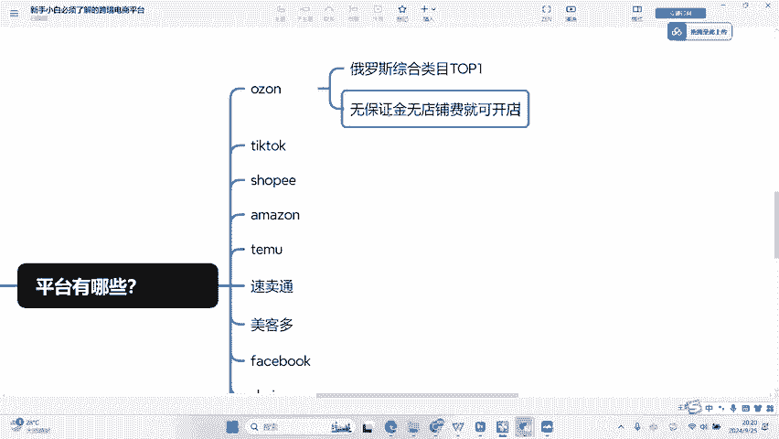

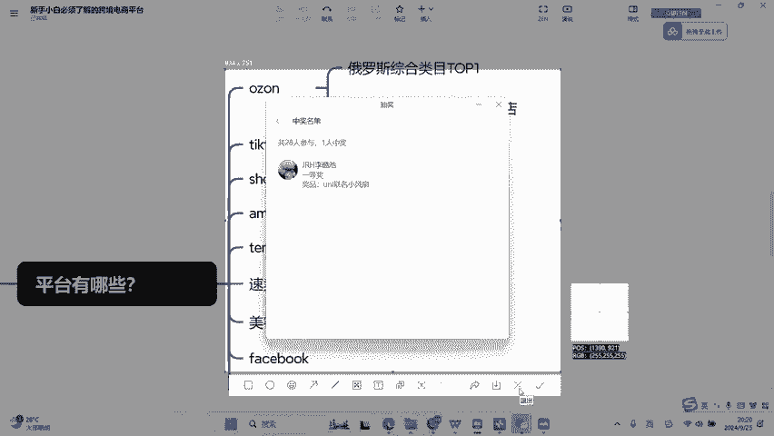

好多朋友说，不知道这个风扇长啥样，别着急啊，我给你们看一下。啊，我的这个镜头老是什么呢？没有很尴尬。能看得见我吗？能看得见还冷啊。放大一丢丢啊，毕竟还是做个人IP的，对不对？来看一下啊，欧众的话呢。

我们讲到是俄罗斯综合类目的top one。啊，然后再来什么呢？无保证金，无店铺费就可开店。啊，五河地铁站这里有个公司，一天20个人打包还得加班，那你以为人家加班加的很很悲痛吗？我跟你讲，有钱的时候。

大家加班加的浑身都是劲啊，有钱的时候大家加班的加班的可开心了，知道没？来欧众的朋友们注意了啊，无保证金，无店铺费就可开店，所以这是他的一个很大的优势。再来什么呢？俄罗斯市场的一个什么？空白。

俄罗斯市场不卷。啊，还有什么呢？中国人不敢做，或者说刚开始现在什么不敢做，他都是他的优势。啊，市场不卷，中国人大部分中国人不敢做。经常之前不是听了吗？好多人说什么呢？好多人听说了，不是那个叫什么呃呃。

中国人不敢做，然后都是因为什么担心俄罗斯人毛子把钱卷跑了，担心什么的，哎呀，不回款了，什么都担心了，是不是啊？哎，我知道的，确实是有这种情况存在啊。宝宝们，但你记住了。大家都不敢做的时候。

你只要坚定的是中俄关系。这个地方有一个大大的一个点是什么呢？你是否坚信中俄关系。如果你对中俄关系是不坚信的，你直接今天这一趴你就不要听，就不要做欧纵。知道吗？如果你要是今天想做欧众的话。

你一定是什么呢相信中俄关系能够什么呢挣到钱的啊。对周姐讲的很对啊，俄罗斯市场的缺点什么？回款慢？还有一个缺点啊，回款慢了的话是什么呢？现金流积压比较多。对，这是他的缺点。他的回款慢大概是多少天。

60天到90天。我们做电商就这样的，今天如果说出单了的话，我今天就必须得买货嘛。比如说这把梳子出单了的话，我今天要买一把，今天出了100单，我就要买100把，100把的这个梳子全部走在路上。

他一直走在路上的时候，那我怎么办？我的钱不就压在路上嘛？所以这个地方的60天到90天，不是因为俄罗斯的回款有问题，而是因为俄罗斯的物流时效就比较久，对吧？

我现在给你们的是一个非常非常差的一个时效是60天到90天。像现在我们用到uni的物流的话呢，你只要能够及时到货的话，确实30天是什么呢？30天确实是能够到货，或者说回款的朋友们啊，回款慢。

积压的现金流多，再到我们最后讲到的一个最大最大的核心亮点，俄罗斯利润高。真心讲利润高啊，等一下我会一个个平台，可能说重点给你们讲前三个平台吧，怎么去进行选品上架。好不好？宝宝们啊。

我到时候会给你们讲一下怎么进去啊，讲来不及讲上架了，我们讲个选品对吧？利润高，然后一单的利润是什么呢？30。人民币。30到什么呢？100人民币一单。所以你觉得你做欧众，你需要说单子很多吗？不需要。

而且欧众的单子其实也不多啊，欧众单子真不多。我等一下带你们去看那些前端的一些销量了，你一看你就懂真的是非常非常少的。欧众单量不大，但是欧众不影响他单量不大，不影响他挣钱，因为一单利润高啊，你算一下。

如果说我的目标月利润是什么呢？一个月挣个5000块钱，一天出几单就够了呀，对吧？5000块钱除以30天，一天挣个多少呢？我们来数数看啊，5000块钱除以30天，一天挣个166块钱人民币。那我出个1。

6单，1。7单，或者出个两单，我就能够达到我的目标盈利了。对吧所以我们讲的说利润高是这个问题啊，利润高的话就不需要什么呢？不需要卷单量。或者说卷供应链。所以你人如果说你是一个小白，你也什么呢？

你比较佛系。适合小白。然后什么呢？佛系还有什么呢？年龄比较大啊，年龄长。年龄长的人为什么符合年龄长的人？因为你年龄长证明你有钱啦。你有点积蓄，你不会为了这个回款的60天到90天焦虑嘛，是不是？

你的积蓄比较充足，那你为什么呢？你垫这个钱进去，你是为了什么呢？奔这个高利润的。你不是为了其他的，懂了吧？所以我们讲的说适合小白佛系一点的，年龄长一点什么呢？追求利润的人。不是追求单量的人。知道了吧。

回款慢60天到90天，现金流积压确实多一点点啊，多一点点。这就是欧总。啊，然后这欧众他还有一个很大的优势是什么呢？市场优势。他市场不卷，大部分的中国人。不敢做，还有个市场优势是什么呢？

俄罗斯是没有制造业的。市场优势，俄罗斯没有制造业所有的产品产品纯靠进口中国。中国货。注意一下，这里是一个很重要的知识点。欧美制裁俄罗斯。不给供货。所以什么LVcci Prada都是什么呢？都是离开了的。

包括说欧俄罗斯人非常喜欢的是我们讲到的日产车、韩系车，什么现代本田啊，尼桑这些都是日产车嘛，他们觉得性价比比较高。但是因为这些地方啊同时制裁着俄罗斯不给他们供应任何的品牌货。

所以他的产品只能靠进口中国货。反向思考。天上掉钱了啊，因为只有中国人，全世界只有中国人做俄罗斯人的生意，而且俄罗斯人什么呢？1。4亿的人口。好多人就说啊，东南亚不是6个亿吗？你要记住了。

东南亚的6个亿是来自于6个市场。马来西亚、泰国、越南、菲律宾、新加坡。什么呢？印度尼西亚6个国家6个亿，一个国家最多的国家的那个国家是印尼，印度尼西亚将近3个亿。所以说除了印尼以外。

其他市场都没有俄罗斯大啊，而且俄罗斯还有一个特别大的优势是什么呢？俄罗斯的消费力强。啊，人均GDP高。就他花钱花的什么的，花的多，为什么？因为人家当国家福利政策好。无养老或者说无医疗教育。卖房。压力。

他他们的教育是免费的，他们看病也是免费的，他们的房价啊，最贵的房价可能就跟咱们的这个呃怎么说呢？跟咱们这个广州的这个价格，广州的房价差不多。所以其实人均的GDP的话，他们的那个工资的话呢。

像是莫斯科跟圣彼得堡的人，工资差不多8000到2万之间。当然我指的是俄罗斯比较高素质的人，8000块钱以上啊，所以他是买得起房子的，他没有这些压力，他不是就花钱嘛，所以他们的什么呢消费力是真的强。

他们指为什么呢？未喜欢买单。很多人就说是不理解俄罗斯为什么这么好，再来看到什么呢？这个是国际关系变化带来的机会。开伦的判断是至少5年。反正我做完5年的俄罗斯的生意，后面我做不做了。

我真跟大家提前把话落撂在这啊，不一定就看咱们讲的说两个国家的关系能不能够一直好。毕竟我们做跨境电商的还是挺吃国家关系的。就像至少我现在相信的是咱们的大大啊跟普老板那关系就可好了，是不是至少5年嘛。

至少因为为什么呢啊，这个这个不不多讲，反正就是国际关系变化带来的机会。对吧今年起五年吗？宝宝其实是从去年开始的。所以说还剩三年了。今年什么呢？今年是第二年了，还剩3年。着不着急啊，为什么说从去年起？

你们想一下，为什么从去年起。2。哎，有些话不好讲，讲了就什么呢？有点敏感，是从去年开始算的，而且也是去年欧纵才进入俄罗才进入中国，大力招商的，对不对？去年欧纵进入中国大力招商。

一开始就是喊出来口号要招10万名的中国卖家，就像跟商务部发文一样，是什么呢？要招10万名的跨境电商人才。欧纵的客户经理说要招10万名的中国跨境卖家。就很搞笑，对不对？😊，啊，所以这就是我们讲的国际变现。

现在是今年2024年是第二年了。所以这是我们讲的一个很大的市场优势。而且说市场是什么？非常的不卷，很多中国人是什么不敢做，是因为担心回款。但其实我们知道GEP的电子钱包这个地方先讲清楚啊。

欧众呃跨境店吧。跨境店GEP电子钱包的问题已经解决了。好吧，已经是解决了。回款问题是解决了的。好不好？哇，一缕阳光，你怎么那么机智，你还说要来深圳找我，恭喜一缕阳光中奖了。咱们的什么呢优你联名的小风扇。

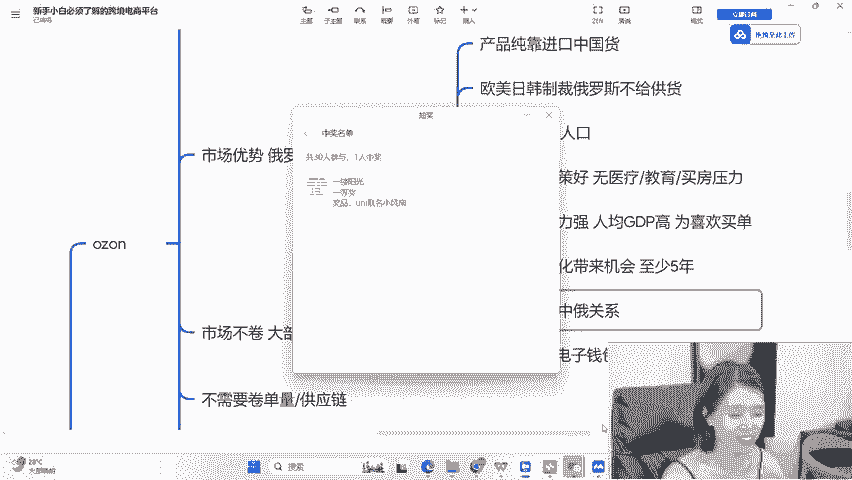

好吗？恭喜一缕阳光啊，好嘞好嘞，恭喜恭喜我的老粉了，真的好久了。他几乎每一次的公开课都会来听啊，已经说是我感觉你至少来听我公开课听了不会低于什么呢？不会低于5次吧啊，一缕阳光。好，咱们继续什么呢？

送咱们的优你的小风扇好不好？

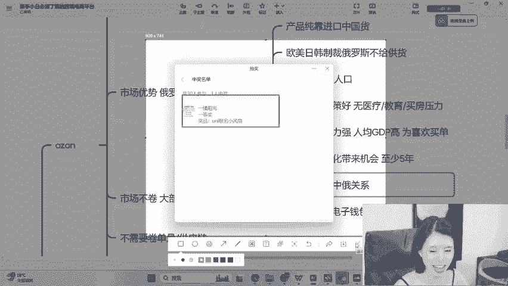

好，我继续看你们。对中俄现在就是一条绳子上的蚂蚱啊。所以别怕，只要你相信俄罗斯的关系，你什么东西都什么呢？坚定一点，不要动来动去的。好吧，那你看这是欧众的一个综合实力，大家看到了吗？

har伦全部什么的给你们写的非常清晰啊。你们如果干嘛呢？宝宝们，如果你们今天想要拿到今天的整个直播间的这张脑图的朋友们哈，一定要什么呢？到时候下播以后找你们邀请你们来的小助理，问他去要。等一下。

我会把这个整个脑图一起安排给大家的啊，安排给哪个小助理拉你进来直播间的，你就找谁要就好了。对吧这是老天爷安排跟你混是吧？是的啊，好，来，宝宝，我跟你们讲到第二个部分了，TK。

国际版抖音tktok有什么的国际机会呢？来，我们讲到兴趣电商的红利。太可怕了啊，咱的同学已经报名成功了，真的啊，唐震中奖了，买个什么呢，买个陪跑，真的假的，中了个小风扇，买买了个陪跑啊。好嘞。

因为之前有朋友说问到说hellen，今天的话呢是什么呢？有有没有什么活动给到大家的。我先提醒一下大家，有些朋友是知道我们是有一些付费学习的板块的，我只是简单的给大家说一下，我们公司是会有什么呢？

线上课跟什么呢？线下课线上课的话呢，可能说是有陪跑。然后有什么呢？还有我们讲到的视频课，看你的需求，线上陪跑跟线上的这个视频课的话呢，你们都可以找小助理去咨询啊。然后我这边再提醒一下大家。

我们的这个呃线下课的开课时间的话呢，你们如果说是在深圳的朋友们可以稍微截个图，因为后续的话呢，欧纵开课时间是在我们的10月26号再到什么呢？这三期啊，都还有三次的机会的，看你们什么时候来。

因为我们的单次课程的体验价是2180嘛。那如果说像是今天的这个直播间的活动。跟大家讲一下啊，直播间的活动的话呢是我们的巡海的专属福利。第一名的朋友们报名我们的欧纵TK线下课的。

刚刚那一位朋友已经已经报了的啊，送一下唐振一次线下课，一次hellen的店铺诊断。好吧，那第二名是什么呢？报了陪跑的朋友们赠送我们的299的六大视频课，加上茶叶礼包，再加上什么的京东卡。啊。

第二名到第5名，第六名到第10名，第10名的话是赠送一张营业执照，加上AI做图软件跟上架软件。你如果需要的朋友们干嘛呢？找hellen的小助理，就是谁邀请你进来的，找他去进行到一个沟通。然后一样的。

咱们可以看到右下角的这个呃我们的购物车里面会有一个定金，如果说想要说拿到今天的这个福利的。

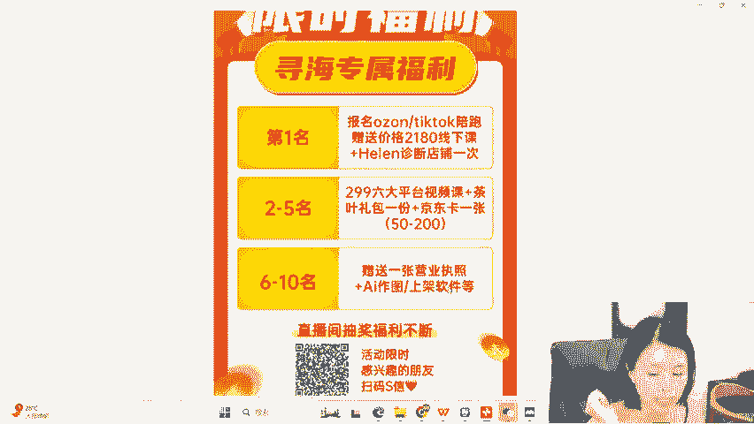

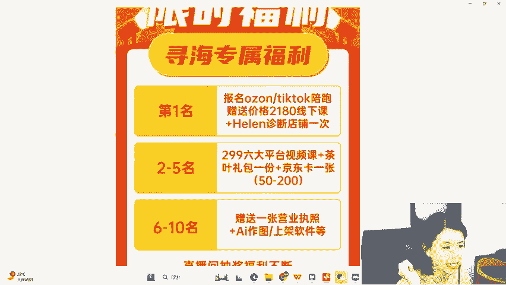

拿到今天的什么呢？福利的朋友们啊，我们什么呢？进行到一个定金的下单，然后什么呢会直接给你赠送这个299的六大平台的视频课。然后你后面再补差价就行了。啊，提醒一下大家，我们的上的这个定金的500的话呢。

不是说报其中的一个产品，只是说你的一个意向，只是你的一个意向的什么呢？意向金，你要确定的话呢，这个定金的话呢，你就可以安排一下。然后我会马上把这个299的这个六大视频课给你进行到开通了，好吧。

这个今天的现时福利先提醒一下大家。因为刚刚我看到小助理这边说，唐振的这个第一名的这个已经没了是吧？只有唐正拿到了啊，其他朋友后面的话就从第二名开始算了，好不好？因为今天是今天公开课的这个福利。

大家看需求来后续讲到的这些东西我都会跟大家讲解啊，我们就简单的给大家讲一下，先。

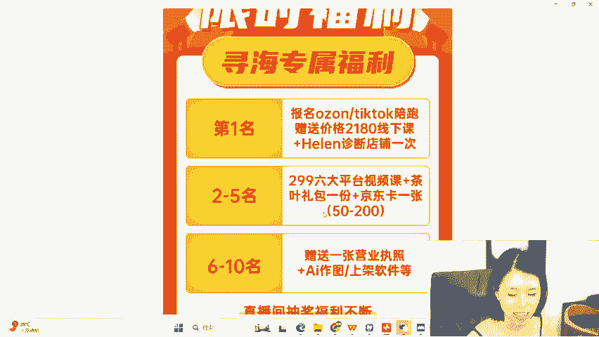

好，接再到我们什么呢？TK这一个板块。TK的话呢是我们讲到兴趣电商的红利。所以说后来都知道兴趣电商什么呢？抖音比拼多多。卖的贵吧。所以卖的贵的那部分就是我们的空间，就是我们的利润，明白了吗？

兴趣电商的红利就是来自于倍率会高。再来一个什么呢？美区市场。美区市场的红利。赚美金。很香。然后什么呢？市场大。赚美金的同时又什么呢？市场大再来看到有些朋友说，那我可不可以干东南亚可以的。

东南亚稳定什么呢？跑单品报。接供应链。迅猛迅速就是因为你做TK的话呢，很难说是报很多个产品的，都是报单品嘛。那你比如说把某一家工厂的货跑报了以后，你做东南亚市场很容易什么呢？就是你的货送到东南亚。

很快的，很快就能够过去，知道没？很快就能够过去。啊，很快就能够到我们的这个东南亚这这边，然后你就只需要把这一个单品跑好什么呢？就一直跑这个单品的利润就可以了。这样对大家来说都轻松。

是不是再来看到TK是什么呢？变现形式多。适合多种人群。他不是说只适合小白，或者说只适合什么呢？只适合我们的年轻人的啊。如果说你年龄稍稍微大一点，我也会给你一个方向。比如说我们讲到说年龄大的或者什么呢。

不太会玩短视频的，咱们就玩商品卡。商品商品卡的话是坚持选品上架。这个新平台是什么呢？很快出单，然后月利润。大概是能够达到什么呢？超过3000。我讲的这个很快出单啊，然后这个月利润超过3000。

是提醒一下各位，并不是跟你们讲到的这个月利润很快就能够达到3000，大概是坚持。3呃两个月左右。两个月左右。大致的利润会大于3000，你要坚持选品上架，每天都要选。啊，每天都要解决，知道没？

这是商品卡的变现形式。第二种短视频带货。短视频带货的话呢，我们讲的说年龄比较偏大的，或者说不太会自己做短视频的，咱们就选择什么达人联盟邀约。不要自己去做短视频啊，然后如果说达人联盟邀约搞完了什么呢。

再自制短视频。不要想着说，今天你都还没有走这一步，你马上到自制短视频了。其实我还是觉得说请达人带货会更快一点点，知道吧？再到我们下一步是啥，你们说。我告诉你们啊，不是直播带货，是头流。要会学会什么呢？

头流放大。放大现有出单结果，然后什么呢？攒好评。攒权重展商品卡权重。明白了吧？头流开始投流了，我们带完会以，我们就要开始投广告了，再到后面是什么呢？备货。你要把这一整个完整的脉络跑通了以后才是什么呢？

备货到本土。做海外仓。或者叫做本土店。明白吧。一定是这个逻辑。有些朋友就说啊，hel冷啊，那这一步的话呢。这一步啊投流到这个大概说花多少时间？60天。完成。啊，你前面的60天做完这种模式了以后干嘛呢？

建议你赶紧在后面的时间去做本土了。如果说实在是你的时间比较多的，你干嘛呢？用30天跑完前面的三个步骤，什么呢？被货到本土了，啊，还想着9月28号去深圳呢？9月28号啊，28号。

为什么我们是9月21号刚上完刚上完线下课呢，是吧？我们9月21号才才上完的线下课，好多朋友是不是这次我们线下课的话，有多少朋友来啦？我们今天有没有线下课的朋友在直播间呢？我看一下。在我们直播间的啊。

在我们线下的直播间的朋友们公屏上面扣个一。就是有没有说线下课上次来的，这次还在直播间里面听的，我看一下。没有啊。给你们看一下我们上次我们上次什么呢？线下课的一个过程，好不好？

给你们看一下我们现下课来了多少人。所以我们上次上次没来得及，那我9月28号，我不可能天天搞线下课啊，我是做电商的，我又不是搞教培的了。我主要是电商为主，教培是为了辅助我个人想做个人IP。

然后这一次的话呢，尤你的娜娜也非常给力，直接来参加了咱们这个线下课，对不对？然后你看咱们什么呢？这么多的同学都来我们这边学习欧纵了，是不是啊？啊，所以我们看到什么备货到本土店。

还有说海外仓的宝宝们记住了。我们在备货，我们是在跨境跑通了这个桐乳才做的备货。有些朋友就上来说了，今天小助理跟我说，hellen啊，有人是什么呢？我在海外有货盘，对不对？我在海外有货盘，有亲戚。

然后什么我在海外留学，有没有什么优势，对不对？我告诉你有很大优势的，有很大优势的。首先你可能上来就不用走这个路径，你直接上来就是本土店，对吧？海外有货盘的朋友们，本土店的权重或者说海外的海外仓的权重。

你一开始肯定是做本土店嘛，本土店的流量高。转化膏啊，你在海外有氢气，后面做大了以后什么呢？氢气。海外货盘。开本土店对应到的一个流量转化高啊，小马，我知道你好像是说是在海外是不是有货盘呢？哇，洋洋洋。

恭喜你中奖了啊宝。

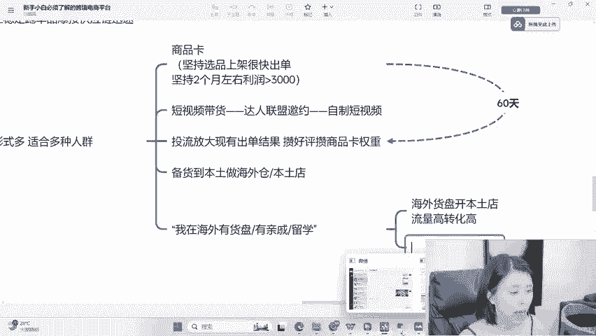

哎呀，妈给我整不会了。杨洋洋，咱们的这个啊宝妈这位朋友中奖了是吧？啊，杨洋洋记得什么呢？找咱们的小助理领取你的小风扇好不好？来，我们看一下什么呢？海外货盘开本土店流量高转化高，有亲气是什么？

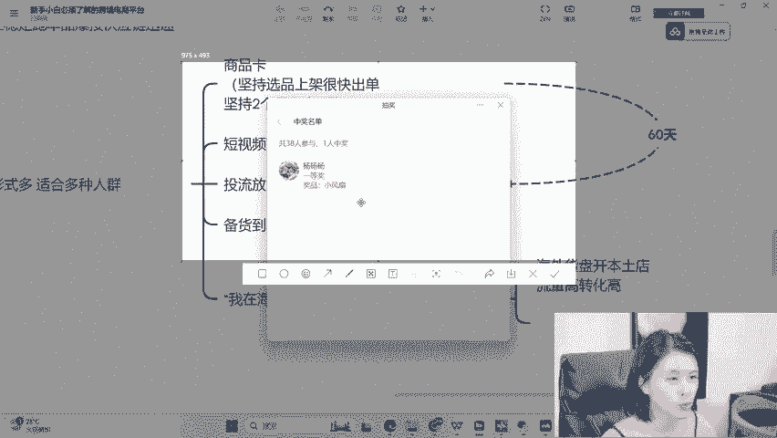

能够说是我们讲的说辅助海外仓发货，还有什么呢？开公司啊，对不对？很重要，因为你的亲戚可能是什么呢？本地人身份的话就可以拿来让他辅助你开公司。当然咱们中国人也可以用中国人的身份开公司的，我先提醒一下。

好不好？然后再到什么呢？留学更牛逼了。我跟你讲，留学生是最牛逼的。啊，刚刚我们我不晓得我们在白俄罗斯的那位朋友在不在直播间，你是留学生，你记住一件事儿。留学的话呢，你有当地的。丰富的当地选品经验。

而且可能会有什么呢？很大的语言优势。就像我合伙人任总，就是在莫斯科国立大学留学的，人家的语言讲俄语，那六的啊，我就搞不来，对吧？像我们在泰国的合伙人谭总啊，语言的话呢，讲英语也是六的不行，知道吗？

就语言优势这个东西的话是留学生才具备的，我们还真不具备。有些人就跟我说啊，那你不是讲过吗？做电商不需要外语。你要是本身会的话，那肯定是有点帮助的嘛。他不是硬性要求。但是他你如果有的话，那肯定是更好呀。

对不对？英国留学的在干什么呀？英国有留学的。干什么呢？那你就有英语的优势啊，对不对啊？你就有英语的优势。然后所以说你是有这个丰富的这个当地的选品经验的。就比如说唐振，你在这边欧纵做好了以后，你做什么呢？

做英国的亚马逊，你就会有当地的选品经验跟语言优势出来了。明白了吗？啊，这是我们讲到的变现形式多，适合多种人群。你看你。是不是这些都能做，然后再到什么呢？小白。小白的话呢特别重要。跨境先跨境无货源。

先做尝试。然后什么呢？在本土赚钱。真的说是尝试有结果了。在本土赚钱，明白没有？啊，一定是这样的。你如果说在这边都没结果的话，我估计你也不会做。是不是？好，我们再来看到TK这边的话还有没有什么问题？

我现在是讲TK，我一点都没有跟你们讲直播哟。因为在hellen的认知里面说，咱直播间里面没有一个人有资格做直播啊。直播太难了，宝宝们实在是太难了。直播这件事情的话呢，我们也是投了直播间啊。

你们也知道我们直播间的话呢，流量流量也好，什么啊，转化也好，给你们看一下我们的这个什么呢。给你们看一下我们的泰国主播吧啊，我们这个手机里面都还有很多。好像还有很多泰国主播的这个痕迹啊，有一些。

给你们看一下，我们泰国直播间可有意思了。好多人没见过hellen的。泰国直播间吧。

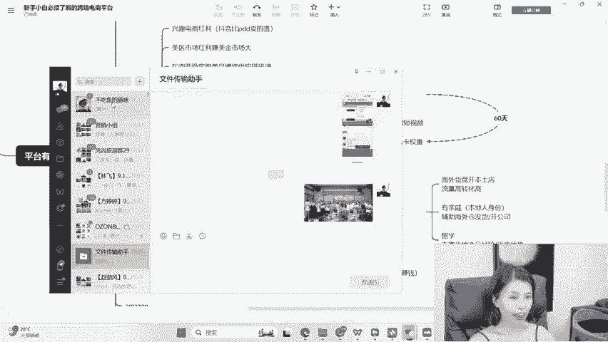

看到没？这就是我们泰国的直播间，我们是卖情趣内衣嘛，你们看一下右上角是多少人在线。2200人啊，再给你们看一下。就我们自己我们自己在手机上的那个记录啊，我们最高峰在线人数的数是多少人，5000人。

全是我们泰国直播间的记录。5100人在线啊，我们当时小助理都傻眼了，就说哇，我们的主播真的是非常的好，能够说吸引住所有人的停留。但是你知道在泰国搭一个直播间的人力成本综合成本多高吗？其实真挺高的啊。

而且管理成本的话也会有，大家还是建议什么呢？先做短视频跟做这个商品卡就行了。直播的话是作为辅助的，真有一天你做到海外仓了以后，朋友们啊，真做到海外仓以后想开什么呢？

才开始做直播，而且是为了什么呢？为了本土库存动销。变快，你才要开始做直播，不然的话呢，你都没做到海外仓，是没有必要做直播的。就像人家非常实心的是什么呢？做仓播就是背后就是一个仓库。

我直接对着这个仓库直播。知道了吗？宝宝们啊，这就是我们讲到的TK这一块啊，TK这一块的话，还有什么问题没有？啊，TK这边的话呢，然后我再提醒一下大家，做TK的话呢啊非常什么呢？非常建议年轻人做。

然后年轻人是多少岁的人，小于20525岁，28岁的。小于28岁的人做。为什么？做得起来当老板。赞美金。做不起来干嘛呢？去打工，高工资。因为年轻人是具备一个就业的一个机会的。年纪稍微大一点的朋友们的话。

可能你要做的话，就只能做商品卡跟这个这一块啊，年龄稍微偏大一点的话呢，你就做这3块就行了。你也不要说哎，自制短视频，我还是给你们往后面放放吧。我感觉这个还是稍微难一点啊，自己做短视频的话。

没有多少人有这个优势。对吧自制短视频，你直接什么呢？这60天的话呢是适合。适合中年人坐。或者说不懂。不懂拍短视频的人做的。理解了吧，你如果说是中年不懂拍短视频，你只想什么呢？卖货上链接。哎。

那你搞这三个就够了，不需要搞其他的，你不要搞短视频，没有要搞30岁大吗？30岁就只做这三种就好了啊，我这边还是重点强调一下。啊，适合中年人。但是你如果说是年轻人小于28岁，做得起来当老板赚美金啊。

做不起来去打工高工资。因为TK是什么呢？tickt这边这边针是什么呢？行业人才稀缺。真的是稀缺到一个你们无法想象的程程度，所以工资普遍偏高。懂了吧？非常建议年轻人做，反正怎么赌都是赢。这句话听过吧。

很多人很多人会跟你说怎么赌都是输。但是年轻人如果你做TK的话，就是怎么赌你都赢啊。😡，特别是像我们以前开TK的课的时候，就有蛮多的啊年轻小孩来我们TK的课上，他来跟我说什么呢？hellen。

我就是来你这边上课的。我说是那你上课，你想要就说是出多少单呢？他说不是的，我上完课以后，我就去找一个公司公司面试了。知道吧？啊，真的是的，你看他都还没有开始做，他只是来上了一个班，他就希望的说啊。

那我上完这个班以后的话，我去找一份TK的工作，我的工资都能够高一点。有没有听过TK的投手，或者说是各个平台的投手工资都很高的那你如果说做运营的话，做TK的运营工资也很高。但是你要首先懂。

你要能过了面试那一关，然后什么呢？再配合着在这个工作岗位上面去产生你的结果，你就拿到高工资，那是没没问题的。因为我们之前就有同学来上。来我们这边报了线下课啊，两天一夜的线下课就是为了什么呢？

简单的培训一下，赶紧什么呢？上岗啊，自己去那个去公司就上岗上班了啊，有这种的。所以非常建议年轻人做啊，小于28岁的。好，来再来看到什么呢？我们讲到的shopyshop的话呢啊确实什么呢？成本低。

成本低啊TK这边的成本我还是跟你们讲一下吧。嗯，成本是什么呢？成本大概是。3000左右。开始而已。店铺的保证金。是90美金。然后对应到什么呢？下面我们讲到的这个呃如果你要做短视频的话呢，要买手机的话呢。

二手机对吧？正常来说810部你自己算，然后再加上一个网络的话呢，可能说一个月什么呢？150到200。一个月的网费。就单独针对到手机的网费啊，然后再加上什么呢货款。少量的货款。就是检验。是否能盈利？

是否能对盈利？就可以了，少量的货款并不是说是你现在投资个3000块钱左右干嘛呢？你这个货款。怎么说呢？就是不投了吗？不可能啊，你3000块钱投进去以后，你要去算一下账。如果能挣钱，咱们继续投，不能挣钱。

咱们再不投。对吧说做起来的话要提前干嘛呢？做起来要提前准备资金。或者供应链。就像工厂那边就叫做供应链，知道吧？所以它的成本的话呢，其实也不是很高，3000左右。这边的成本的话呢。

就相当于也是个货款的成本吧。但这边的货款成本啊提醒一下大家，货款成本可能得准备什么呢？1万块钱，因为它是什么呢？你要做好准备90天回款。就是90天在路上压着1万块钱，真不算多。好吧，然后再来看到虾皮。

宝宝们虾皮的话成本是很低吧。是的，成本很低啊，3000的保证金都不用交了。现在前三个月，但是虾皮有一个问题啊，成本低，简单上手快，对吧？还有一个很重要的点是什么？消费者相似，东南亚人跟中国人很相似。

所以说选品很一致，但他的唯一的缺点白了是什么？利润低。啊，内卷。仅次于可能说我们讲到的国内电商。还有亚马逊。虾皮是卷的，虾皮不是不卷的，它是卷的啊，利润低，相对中国人比较多了嘛，就拥挤了嘛。

那你看削皮的话呢，成本低简单，上手快，消费相消费者相似，它选品就就比较一致了，是吧？那我们再来看到虾皮的话呢，它其实选品这块，很多节日啊都相似，就像中国有春节，东南亚也有春节，咱也可以做，对吧？

那亚马逊的话拿着那这个就什么成本高了。成本极高。啊，1比1的什么呢？广告费。1比2吧。货款10万。广告费20万。然后什么呢？上来一定要做的是什么呢？FBA。但是确实什么呢？优缺点利利润高，市场大。

单量大。啊，就是说什么呢？最香的市场。确实是我们讲到的。这个什么呢？亚马逊啊，积姆的话是适合什么呢？工厂。工厂型小白叫。供货价格极低，不会被别人卷。如果你的价格不低啊，朋友们啊，如果你是什么呢？

你不是工厂型的小白，你只是。纯小白。不建议做。你卖起来工厂就进来了。工厂进来了，他把给你的价格供给拼多多了，那你就完蛋了是吧？而且做team的话呢，一定要。懂规则。一定要懂规则。而且什么呢？提前。

知道有很多坑。提前要知道啊，你你肯定说是这些坑，我只是让你提前知道，我没让你避踩坑，你该踩还是要踩的。因为有些东西你控制不了，知道没？虾皮讲讲虾皮嘛，等一下会给你们讲虾皮怎么选品啊。

速卖通的话呢来成本就来了，保证金1万。这个是交给平台的保证金1万，然后再加上什么呢？现流量倾斜在半托管。半托管平台半托管和全托管模式。然后你如果做无货源。一件。代发的POP。流量匮乏。没有流量。

更不要谈出单了，是不是？当然那美克多呢美克多是什么呢？辐射的是南美洲市场。很香的。量大。利润高就是什么呢？缺点压款酒。一般过去一个货柜。卖你要先压一个货柜。知道吧？而且他的呃成本的话呢，其实压款酒。

整体成本都是高的。包括说你现在需要一个美克多的资质啊，在网上这些都挺贵的，知道没啊，再来看到facebook。也是属于兴趣电商啊。兴区电商。利润超高的。利润比TK还高。就是有个问题。要会做素材。

要会头流。你做facebook，你不会做素材，不会投流，你还不如别做利润是很高。而且你做会素材会做头流什么呢？要会聊单。就像很多人他卖那个假的包包啊，仿牌嘛。都是用facebook在搞的呀。

做素材投流什么呢，然后把客户什么呢。就是头流要会，就是在whats app里面聊单，就像是外国的微信，知道吧？啊，要会在whatsapp里面聊单，这是facebook。再到我们讲到的新音。吸很好的啊。

吸还是我们讲到的。呃，相对来说的话呢，要有工厂资质。才可以开店。资金要求非常充足。因为他一旦出单了以后，你一下子订单报了，你没有钱，你根本做不到，知道没？而且他什么呢不坑卖家。15天回款时间。

你的货今天入的是西阴的仓库，15天以后回来中回回到你的账户里面，整批货入多少，就什么呢？给你多少钱。阿里国字国际49800的年费。三年起头。因为他非常什么呢吃店铺权种。店铺的时间越久，他的就什么越好。

知道吗？广告费极高。然后再到我们讲到的需要导时差疗单。再到什么呢？阿里国际。利润高。批发单。整单的利润是高的。在到什么？朋友们。批发单整单的利润是高的吧，是不是？阿里国际乖乖们，记住了。

批发单整单的利润高。同时。坐起来躺平吧。就是有一些有几些外国的大客户固定的批发单就够了。所以说你看他的其实前面都是很多的啊，就可能说是5万到10万不等。啊，但是投的多是什么呢？哎，确实也是结果也是好的。

再看ETSY。手工艺品为主。高利润。注意规则。不然会封电很严重。高利润的订单，手工艺品为主，然后是那种。POD定制品。啊。然后他的高利润大概多高啊，1比10都可能。1比10。都是有可能的。

因为你东西是非标品嘛。非标品的话，那你就1比10都很正常了。ETSY而且美国市场。面对的是美国市场，其实还是利空间比较大的。权重是什么意思？就是产品的排名啊，这个是我们线下课的这么一个课程。

我可以给你们看一下权重的部分在哪里。

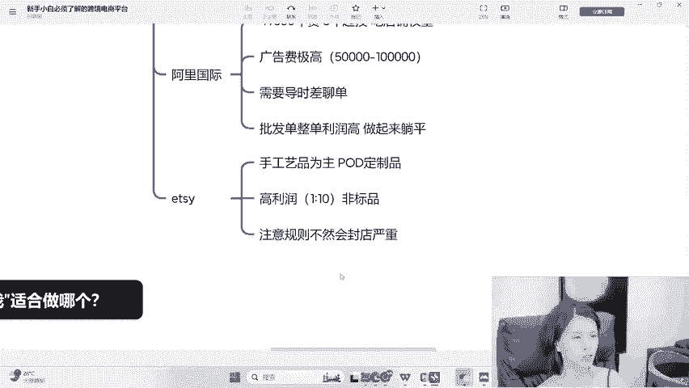

嗯，在哪里？来权重的组成要素看到没有？就是什么叫权重？权重是什么东西？我们今天的话呢，这个权重就是叫做排名，这是我们上上周上周日啊，上周六日9月21号跟22号的线下课商品的权重其实就是我们的搜索排名。

换句话说啊，如果今天咱们什么呢？咱们做电商。

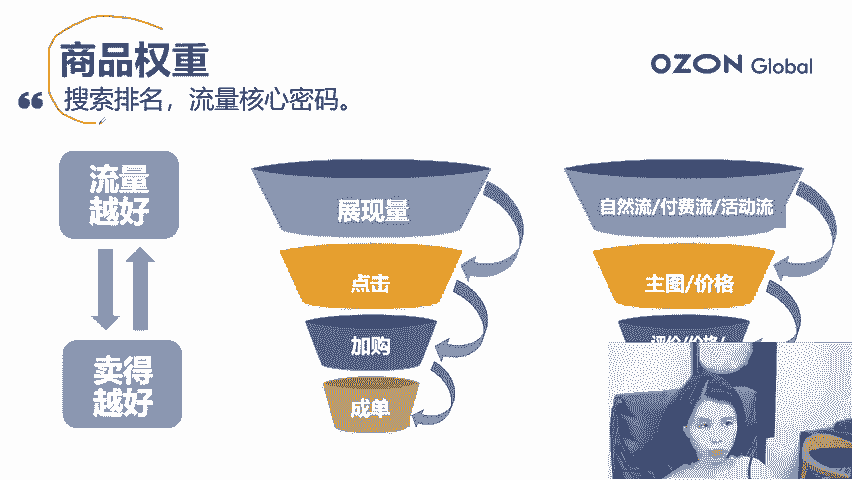

我现在搜索一个关键词，比如说在欧众这边搜一个词。我随便搜，你们想卖什么？😡，我搜连衣裙吧。对吧这个词把它丢做欧中的官方词，谁排第一个连衣裙啊？谁的权重就高？懂了没有？阿喵喵。啊。

我相信你们不可能在任何一个直播间里面能够听到这么全面的多平台选品，并且说helen还能够给大家干嘛呢？直接实操给你看我的后台，给你看我的前台，带着你什么呢，带着表格去算，你应该找不到另外的直播间。啊。

我为什么敢有这个底气？也是因为说我自己想要什么呢？把IP做好。我只要在直播间里面对你们产生帮助啊。你如果说今天听了我的直播觉得有用。后续你一直听这个直播回放，我相信对你的帮助是很大的。知道没？

所以权重其实就是我们讲到的搜索排名，你的东西卖的越多，它是不是自然而然，权重越高，当但是你注意了啊，权重里面有个非常核心的关键点，你的产品是不是一个热门商品，它的占比的权重占了29%。

就像现在马上进入到秋天，秋天大家要秋游，秋游要卖什么呢？野餐店。或者说秋游这个场景里面我要买什么呢？买露营灯。那露营灯它的这个时间点，它的热门度就会很高。对吧尽管说我这个东西从来没有被卖过。

但是我买了一个是最近很火的东西。比如说川普的T恤产品的热门度高了，它的搜索权重自然是什么？在上面，然后第二个被卖买的越多，排名越靠前啊，再来看到什么呢？

总的热门度点击数什么的加购数都会解决我们的排名跟权重流量的问题，包括说评价好不好？价格低不低，产品数量上的多不多，对吧？你的配送的方式到底是FBO还是什么呢？还是我们讲到的海外仓，还是说国内的中国。

中国一件代发，就是你发货地是在中国，你的配送的方式，你的模式导致了你没有流量，没有权重。就像今天我们看一下咱直播间的朋友们。看一下什么呢？现在我们看第一个链接啊，它是按照美金进行标注的。

第一个链接是本土店还是跨境店啊，怎么看啊？右下角这是线下课吗？对的，刚刚那个是线下课的PPT啊，然后这个是什么呢？你们看一下这个右下角的这个地方看到了没？宝。这个地方就是我们讲到的，他是哪里发货的？

在我们的界面，所有的人都看得见哦。啊，莫斯科欧纵官方仓朋友们啊，我今天是简单的给大家释放了一些线下课的内容，希望大家要明白今天你在海冷直播间拿的是什么价值的东西，免费的直播公开课。

我都希望大家能够说真的说学到点东西啊，包括我等下会带大家手把手的去进行到选品，对吧？啊，你看到没有？这是欧众官方仓库，所以它就是一个本土店嘛，而且还是海外仓就是官方的仓库，再来看到什么呢？第二个链接。

第一个卖了56个，第二个是什么呢？是不是也是本土店啊，咱不知道咱们看一眼好不好？啊，看一眼还是看一样的位置，还是欧众官方仓嘛，文字没变，对吧？再看到下面呢，你随便再点一些。

你会发现一整个界面里面80%的链接全是本土链接，找不到跨境的链接。

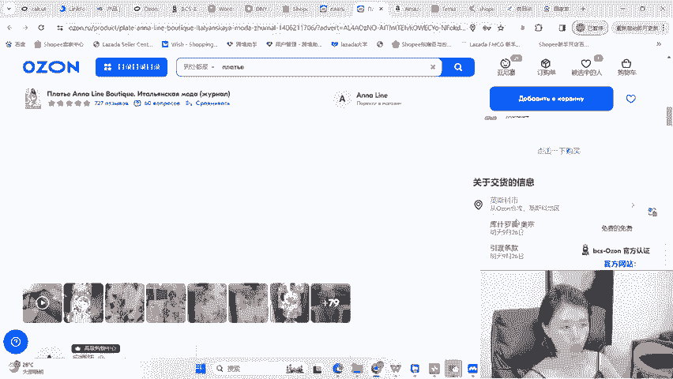

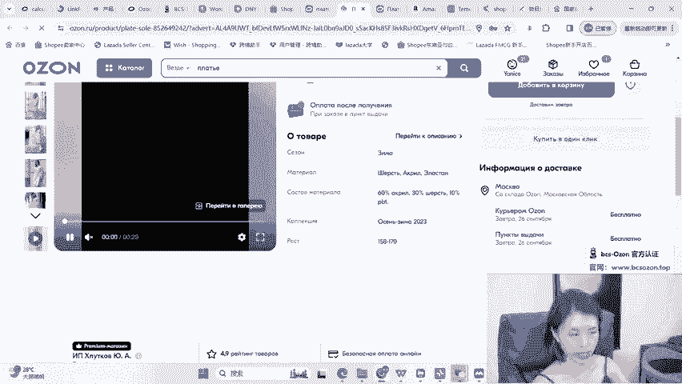

哎，所以为什么我们讲做跨境电商的终点是干本土吗？宝宝。有道理的。跨境电商的终点是本土的话呢，终点是本土是因为本土的产品。这个货放在当地。我们的消费者，他今天买东西，他3天以内就能收到。对于平台来说。

他赚佣金也更快了。对于消费对于消费者来说，他拿到产品也更快了，大家都满意。你想一下是不是这个道理。所以咱们讲的时候，刚开始小白就算是做跨境无会员一件代发，脑子里面也一定要有个意识。

我如果跨境无会员件代发做的好的话，我一定要去做本土的。那跨境还能做吗？为什么不能做呢？如果所有人都去做本土了，谁去开新品啊，都是拿跨境店开新品的呀。那你直接干本土箱，你知不知道开本土是要什么呢？

很多钱的，做本土至少10万打底啊。没有10万的话，你今天不要跟我说，你要做本土，浪费时间啊，就像我们今天是什么呢？我们之前有一个学员叫做candy啊，有些老学员可能说是知道的，他的1。8万美金的对赌啊。

1。8万美金的对赌给大家可以看一下简单的。啊，一个金额吧。就我们之前的陪跑是带队赌的时候，你看他的对赌是2万美金，他的对赌的。达成率已经超过了多少呢？116。84了。我们当时因为他算是我们的比较基础的。

就是第前面第一批的学员，本身对赌的时间周期是在12月底。才9月中旬啊，9月底他就已经完成了这个目标。所以下一轮的目标我是要帮他解决利润提升的问题。我今天才帮他进行过店铺诊断啊。

他现在大概一个星期吧也不多啊，也就是挣个2000多块钱，因为做的是本土，所以他的链接非常安心的在那边起链接就一个星期大概是挣2000来块钱啊，是一个星期不是一个月，他就是因为把这个链接做起来了。

因为当时我们收学员的时候，我们也是挑客户的，我们并不是所有的客户都挑都要都就是你要报len的本土配跑，我都我都接一定是你的综合素质也是高的。你什么呢？你也是听得懂。

可能说我们讲的什么听得懂len在讲的电商相关的内容的，我才敢收，现在我不做对赌了。因为就是我们讲的你晚选择了len，那你就可能说拿到拿到好的，拿到福利的东西就少了，先选择信任，先什么呢？先入局的。

一定都会有的福利是会到更多的，后选择或者说后发现的。朋友也不要紧，等到后期吧，有什么活动啊，什么东西啊，我都会跟大家讲，对不对？就是本土有人说要100万才能做俄罗斯，那你直接把它什么呢？

把它拉到我面前来。我想问问看他到底是为什么会要到100万。他要投100万的时候，人家可能说目标一个月的利润是赚什么呢？赚10万20万，但是紫烟清飞啊，你已经是我的老粉了，我非常清醒的跟你讲。

我估计对于你自己个人说啊，对于你自己个人说，你应该都没想过说你这辈子一个月要挣10万吧。你是不是这辈子都没有想过说自己一个月能够挣10万？每一个人其实见过的大钱真不一样。你如果见过更大的钱。

你就会有更大的目标。但是因为纸紫燕清飞，你可能见到的钱是什么呢？我就只见过几十万，或者说我身边挣钱最多的人，你就一个月挣个2万多块钱吧。所以你永远不敢去想说一个月挣10万是什么意思？而且一样的什么呢？

早投资，早回报，早决定什么呢？早有结果，早抽身。就包括我跟你们讲的，不是说做生意一定能够起来，或者说做生意一定能够成，没有一定的事情。做生意本身就有风险。但是人家敢投100万。

人家就是为了搏那个一个月能不能挣10万20万，人家敢博，人家敢投，那后面人家就该挣，你不敢投，你不敢搏，你就先从跨境无货源一件代发代发开始嘛？我的天哪，干嘛非要想着说上来就要月入过10万呢？

干嘛就跟人家想着说要投100万呢？你又紫燕清费，我已经听你讲了说什么呢？你做俄罗斯要上来投100万，这个事情讲了很多次了，人家怎么投，跟你是没有关系的。你有多少，你就投多少，你要怎么做，是你的事情。

别人想这么投，是因为别人有更大的目标，知道没？你要挣5万块钱，我也跟你讲，至少要投到什么呢？至少要投30万了，投不投嘛？5万块钱的利润，你大概滚在里面的库存什么呢？很多结果什么呢？30万啊。

大概说在俄罗斯30万在美区的话可能是什么呢？每区的话可能还反而要40万。为什么？因为前期起链接的干嘛呢？起链接的时候，大家提记住了，前期起链接的时候是需要很多广告费的。但并不是说是我做做起来以后。

我还是要投这么多吗？不是的，就当你的这个利润比啊，等一下我会给你们去怎么进行到本土的选品，你看一眼就懂本土是什么意思了，好吧。来，我们来看一下这个点，很多朋友就不知道说是什么呢。我到底应该什么呢？

做哪个。我适合做哪个？来。😊，我们看一下你想赚是多少钱，过什么样的人生。这种就是跨境店。啊，5000块钱一个月，或者说是什么呢？我们更低一点，2000到5000个月，好吧。无会员一件代发可以实现的。

要坚持看到没有？我这边写的非常简单，上架持续验证，千万别停，预估两个月到6个月就能达到了。做的就是这个模式，我适合做哪个，是不是？然后对应到适合做的平台是哪些？跨境店无会员一件代发。来。

我们看一下欧纵什么呢？shopy。tktok都能做上述的平台，这些都是支持这件事情的。看到没？我适合做哪个？第二个1万块钱一个月，少量的进行到囤货了，为什么？因为你已经干嘛呢？量起来了，出单也稳定了。

你就囤一点点货，干嘛呢？接上一个大促，不要断货，不是说就能够说更稳一点了吗？而且要继续坚持，大概说是第几个月呀，第四个月到第什么呢？第8个月能够实现1万块钱一个月再到2万块钱。

这个地方啊1万的基础上面加供应链。有可能是跨境店，也有可能是什么呢？海外仓。也有人说是做海海外仓的，就一个月挣1万块钱的，反正就开成功了一个品嘛，其他品都不开了，清货了，就靠那个品吃一辈子。

他指望的就是靠这个产品吃一辈子了，对吧？2万块钱的话呢，一定是什么呢？我们讲的本土店海外仓。啊，本土店海外仓了。知道为什么吗？因为现在跨境店真的很难挣2万块钱一个月。你什么东西卖起来了以后。

就比如说今天咱们看一个链接啊。比如说这里吧。看一下在这个链接里面，我们看到有这个东西在跨境店都卖的很好了。啊，这个东西在跨境店卖的可好了，那本土的人干嘛不买到本土去卖呀？明明说我我拿到本土去卖。

我的量会更什么呢？更好，我直接就超过去了就好了呀。我有啥好纠结的呢？是不是谁在跨境卖的好，我就逮着谁抄，我盯死这个人，他只要卖的好的东西，我全抄到本土去，你们看一个东西啊，我给你们验证一下，好不好？

好多人不相信。好多人什么呢？觉得hellen啊，这个什么呢？咱们这个什么呢？哎呀，这个你讲的这个东西我不相信这件事情，为什么我给你们算笔账，好不好？给你们算笔账，你们就懂了。为什么说有些产品。在跨境店。

什么呢？反而什么的，利润低到本土了以后，反而利润高。这个是还算是牌子的吧。你们想看还能选哪个品，这些都是跨境店的品啊，专门的专区。比如说这个吧。好不好？这个护手霜。这东西可便宜了啊，我跟你们说。

他在这边卖什么价格？1129卢布看到了吗？就这么一个护手霜，然后卖出去了8个好评，一个月可能卖54个1000多萝布快100块钱一支哦。宝宝们啊，人家75毫升的这么一个护手霜，快100块钱一支。

我们干嘛呢？把它保存下来？啊，它的成本一定是同样的成本。咱们看一下什么呢？打开1688的链接。啊，智能手表也可以，你那么以图搜款啊。咱们今天讲的说选品的话呢，一定把这个实操干货给大家上了。

我而且我今天不止讲跨境选品，我还跟你们讲本土选品啊，这么一个护手霜，75毫升多少钱啊，我，这东西挺贵的啊，是牌子货，我本来还以为说是什么？一个很便宜的东西，人家便宜的要卖多少？19块钱一只。

我看有没有更便宜的。2018。5块。我看一下是不是能卖到这么便宜啊。红色85毫升，我们要的是这个紫色75毫升。还记得吧。哎，怎么找不到那个他的目标产品，好像是秘境玫瑰。对，是这个。它是牙膏啊，你看一下。

75的玫瑰42人民币。啊，或者说你再看看这边。我还以为是手霜，结果人家是什么是牙膏。泡澡浴缸泡澡浴缸肯定是要干本土的，干不了跨境啊，朋友。啊，这个红色紫色。玫瑰75毫升43看到没有？这里是43。

这边75的也是43，基本上全网现价嘛。你没有这个任何价格优势的话，你就按照43算就行了了。那我么如果说做跨境啊，跨境的话呢，咱们这个东西的话呢，算是一个极的呃，我们把它当成这一个步骤吧。

这个吧100克的这个好不好？4天到9天就到货了。这个物流时效。啊。第四张表格打开。然后干嘛呢？成本填进去45块钱人民币，重量大概是100克左右。我写150吧，都写150前端卢布的价格是多少钱？

看一下右边1129，看到了吗？1129算一下挣多少钱啊，朋友们。不挣钱了，挣22。32块。看一下。同样的东西什么呢？在跨境店，跨境店无货源一件代发这个成本15块150克，我就把这个东西算重一点。

因为它还带盒子啊，带包材啊，总共的这个毛利率2。967。那我们再来看本土。这同样的产品成本43块钱，重量150克。然后干嘛呢？前端的这个售价是多少？来，咱一起写啊，1129。多少钱啊，利润。

来咱直播间的乖乖们看到利润没有？刚刚是2块钱吧，现在的利润呢？成本。运费呃，数量重量一样的嘛，这边算出来的到手利润12。45。啊，其实我告诉你们这个利润并不是很好，还会有更好的产品做本土。

做本土我们现在基本上都是要求什么呢？利润达到1比1。而且很多朋友可能说灰心了，说hel伦啊，那这个东西是不是不能做跨境啊，完蛋了完蛋了，不是的。不是说他不能做跨境，当然能做跨境。

就像我们也可以看到什么呢？跨境是有些产品什么的有优势的。比如像这个投影仪啊，4078卖300多块钱人民币，我们讲真的，这种东西咱如果说真卖的好，咱们干嘛呢？就卖个几单，我们就回款啦。

我们不需要说卖很多单，因为很多人就说啊欧众这个平台好坑啊，他这个回款的话要卡6500块钱人民币，对不对？卡6500块钱人民币的回款门槛太累了，我觉得不想做，是不是啊我们来看一下这个品。

丢到这边看一下在中国的人民币采购价的成本。165的先点开，因为价格低嘛啊还有175的，还有215的，你都可以看一下。哪个符合咱们的点175的。确实啊人家还有什么呢英龟欧龟的，咱们就是找欧龟的。

因为卖俄罗斯是欧龟为主，你看还有165的。

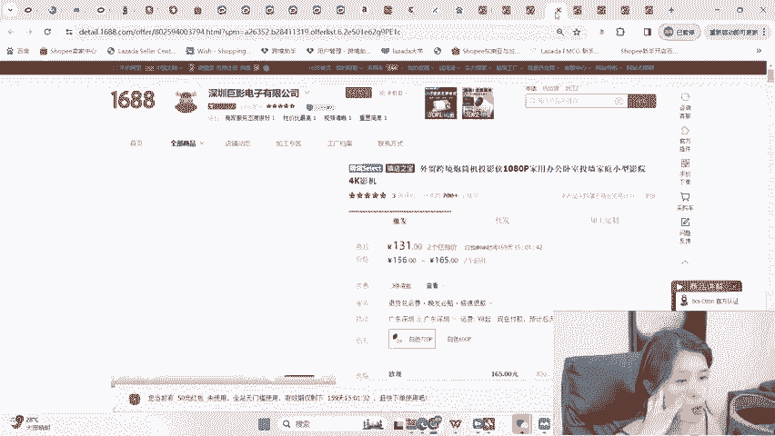

咱们就一模一样的这个货干嘛呢？给他算一遍跨境，跟他算一遍本土，行吧。这个地方就不能选第四张表了。宝宝们第四张表的话呢，选择是不可带电池的，这个地方是个叉叉哟。我们要找可以带电池的，选择什么呢？第五张表。

第五张表点开成本是多少？165重量来看1688啊，人家会有写的。好，这边我们没有看到重量怎么办？咨询客服，或者说换一个链接去看看说有没有哪个链接是把这个重量明确的写在上面的。

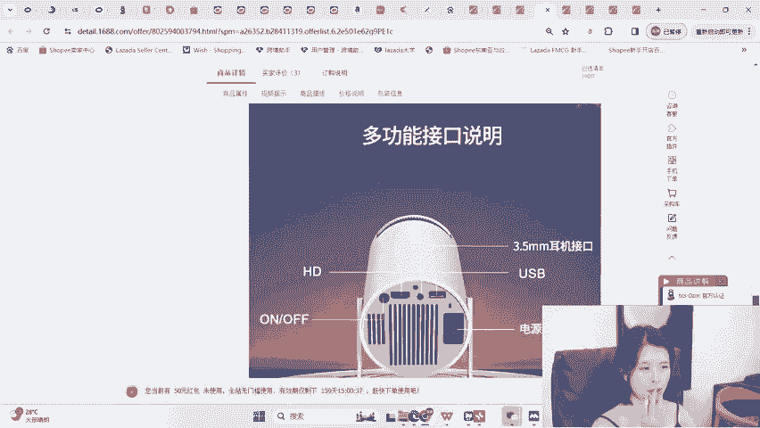

在这里看到没？规格来啦。产品净重0。5公斤。看到了吧？香龟是11台20台，0。5公斤500克。前端的卢布价格人家卖多少？4230亿。看一下赚多少钱。做跨境走这种4到9天的物流时效很快到货的。

165块钱挣65块钱，是不是刚刚符合海伦跟你们说的，做欧纵这块确实是是能够做到什么呢？一单的利润啊，一单的利润大概是在50块钱，30到100人民币之间。对吧利润确实高，确实很不错呀。对吧。那你看什么呢？

看咱们在表格里面在这边跨境店，我们卖4231是64的利润。我们换成本土店的表，165500克。165，然后什么呢？500克的重量，再加上前端的这个售价4231。你看在这种3C的产品，它在这个地方的。

利润。53。对，165是不是反而没有什么呢？跨境店的利润高。16564。发现了没？为什么会出现这件事情？因为做本土会有一个很高的成本，叫做什么呢？回款手续费。这个地方太高了，这个地方是15个点。都知道。

现在很多人讲说俄罗斯回款困难嘛，是不是？那回款困难的话，嗯，那就是给钱就能回了呀。就是说中间有物流商啊，各方面的人帮咱们做回款的话呢，大概回款的比例扣掉15%个点，相当于你回来的钱只有85%了。

你都还能挣一单挣50块钱。能理解我的意思吗？这是一个做本土跟做跨境很大的差别，做跨境是没有回款手续费的，但是做本土是有的。汇损的话呢，咱们全部是按照13个13的汇率再算啊，但不代表着说做跨境什么呢？

一定比本土挣钱少。单品而言，跨境有可能挣的比本土多。但是如果说你看总量的话，那肯定说跨境就没办法跟本土比了。因为这个链接如果说咱们本土店去卖的话，你看他一个月卖53个啊，我本土店怎么样都翻他一倍啊。

因为我的到货时效更快，我就算跟他卖一样的价格，你说俄罗斯人啊，我照样卖4231。如果我的这个货是在莫斯科当地的，俄罗斯人怎么买，他还会买他的4231的货吗？不会了。所以说跨境只是我们讲到的一个过渡。

但并不代表着告诉你们说做跨境不挣钱。明白了没有？做跨境是挣钱的，只是说挣挣多挣少。而且说你前期上来不可能说马上有一个我们讲到的5000的什么呢？五哦，不对，10万的这个成本嘛。

你不可能说上来我做我做生意，我就直接掏10万了。你先做着跨境无货源一件代发，对吧？先做着这种模式，先验证说我能不能挣到钱。先验证一下。如果说在这个地方快速的什么呢？挣到钱了以后。

咱们可以说什么快速的走向这个的嘛。我只要达到一个月能够挣多少，挣个2000到5000我就马上什么呢？跨境有结果。立马冲本土。啊，立马冲本土一定要冲本土。你如果不冲本土的话呢，你就浪费时间。

因为跨境的话呢，卖的好的都会被本土跟卖嘛，都知道的，是不是？所以这就是我们讲到的结果。你如果说不想过渡中间这个流程。一个月能挣到2000块钱的，或者说能挣到一点小钱的时候，通路跑通了以后。

立马给我充5000到10万啊，5万1个月10万1个月的本土。啊，包括我们周末的这么一个俄罗斯掘金俄罗斯的线下课，我们也讲了什么呢？也讲了一节课，讲的非常的重要的。跟大家讲的主要是什么呢？

我们是怎么样通过本土快速盈利起店，做到月盈利的10万，以及说降本增效的方案的啊，今天选择报名我们的这个陪跑的朋友们，我们到时候线下课的这个整体的文件都可以打包发给大家，好吧。

就是今天确认报名我们的欧众陪跑的朋友们，现在你们看到这个这个里面的所有的文件马上都能够拿到我们这一次课程的三位老师，都是我的电商运营团队的小伙伴啊，他们做的相关的课件资料都能拿到。

就今天确认报名的朋友们啊，提醒一下大家，因为这个就是我们讲的月做本土的话，你肯定是目标希望的是盈利更高嘛。你如果说只是希望一个月挣个千把块钱的话，没必要做本土做跨境就够了啊。

如果说现在还是对本土不是很了解的朋友们就选择做跨境也没有关系的。好吧。好，来，我们来看一下如何开始，非常重要。开始。一套营业执照就可以开始了。啊，一套营业执照就可以开始了。宝宝们啊。

正常一套营业执照的成本是什么呢？300或者说0元到300。一套，然后大概要等什么呢？要等个7天的时间，3到7个工作日。下执照开店，对不对？就你刚刚已经看了前面这么多的平台，你自己适合做哪个？

是不是看完了这个以后，你会发现如何开始一套营业执照就可以开始了。因为我们是开店，是需要。开店必须需要营业执照的嘛，对吧？下来了以后什么呢？开店。啊、一天内完成。1到3天吧。然后接下来什么呢？选品上架。

第三天开始算3到7天完成。理论。出单。采购发货是在10天到15天左右完成。再到后面什么呢？订单稳定。是在什么呢？45到60天完成。跟我们前面一样。懂吗宝宝蚊。啊，冲过去就是把店铺里的东西的货送过去吗？

不是的，我们是有一套选品的方法的。宝宝啊，我们的本土陪跑里面是会带着大家手把手选品的。选品陪跑的方法特别重要啊，提醒一下各位，就像我们今天直播间里面，你看我们现在在直播着的。

我的我的这个聊天记录是不是一直有全是咱们本土的陪跑学员。你看像陈涛还有陈泽峰都是我们这一轮的本土陪跑学员，所以他们就是一直都是什么呢？不断的在选品开发选品开发。现在就因为来不及了。

马上就到什么呢黑色星期五跟什么呢？跟我们讲到的这个双十一了。现在我们这个星期就要安排做本土的学员，这个星期把货发出去，在10月底的时候到货，提前7到10天把链接做好以后。

就直接迎接双十一跟黑色星期五了这两个大促。明白吧？所以说为什么我们现在本土培保学员跟着我们走的话非常的快节奏。包括我现在用的运营团队是什么呢？是我们自己的电商运营总监来带学员。

就是因为要给大家做的是极致交付。因为做本土的人不容易啊，做本土的人他上来是投资的是10万，不是不是说没成本了。提醒一下大家，然后提前是什么呢？这些叫做我们什么呢？所有的流程，对不对？然后说是稳定盈利。

是在我们讲到的90天到180天内完成的。好，有些朋友说是什么呢？前期什么呢？一定要搭建创业者的心态，你没有搭建好一个创业者的心态，就什么呢？一定要给够成本。给够时间或者金钱。

你如果说今天不给我时间来听这一场公开课，你不会听到那么多完整的适合小白的内容。如果你今天什么呢？不掏钱做生意，你信不信你一定做不起来？因为不出钱，你不会疼，你不疼，你就什么呢？不认真不认真。

那不就没结果吗？是不是要搭建的创业者心态在这里。

我们如何搭搭去搭搭一个正确的创业者心态，你一定要有成本观念，金钱成本，有钱咱们就什么呢？投钱少花点时间。比如说像我们的陪跑服务，你们可以说有需要的朋友去选择。如果说你今天没有钱，那你是不是应该什么呢？

多花点时间去选品上架。就算是拿着我的免费课，包括我刚刚讲到的那些表格，你都可以去选。对吧第二个执行力是第一要义。你没有一点执行力，你不把这个创业的这个什么呢？心理提前搭建了，你不去执行。

你告诉我谁能让你挣钱，谁能够保证你挣钱，没有人能保证你挣钱，你是在做生意，而且做的是你自己的生意，我希望你明白啊，而且不要指望着什么呢？无货源一件代发，实现财富自由，实现财富自由的人，就像你刚刚说的。

那位有个朋友说，我有个朋友做亚马逊挣了1000万美金。那你知不知道人家曾经的心理压力有多大，上下游供应链压了多少钱，压了多少人的信任，至少几百万的库存的做生意没那么简单。

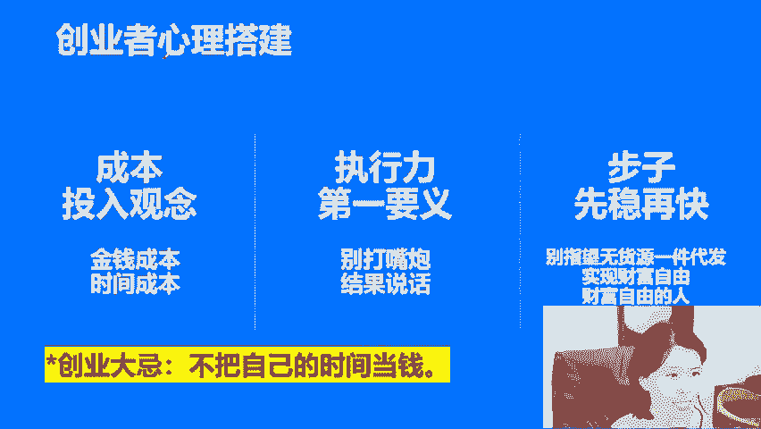

啊，但是你如果说今天真的说是搭建好了这个心理的什么呢？心理搭建以后，你真的说是一个正确的创业者。我相信你在后期创业，就算遇到困难，你也比较容易什么呢？拿到结果。而且创业的大忌就是什么呢？

前期创业者不把自己的时间当前。就像有些朋友啊，蒙着圈什么呢？自己在那边做电商，自己在那边选品上架，我都跟你讲啊，你选品上架的方向错了错了。那你努力有用吗？你没有用。所以跟着有经验的人学习，一定会有结果。

明白没有？给够时间、金钱还有什么呢？正确的创业态度。而且是什么呢？别不把自己的时间当前，因为你。因为你今天在创业。你就是没有去打工，没有去上班，对吧？那你正常打工一个小时是多少钱？

你今天做电商这个时间没有把这个钱赚回去，那你是不是浪费时间？或者有些朋友说我不想投广告，那广告也就是个20块钱的奶茶钱，二三十块钱投个广告，你就测出来这张图好不好了，有什么舍不得的？不要再浪费时间了。

现在已经到了9月25号了，已经到面临到什么呢？下半年大促的旺季了，刚刚99大促才过，你们也看到什么呢？hellen，我们自己的什么呢？虾皮店铺，今天昨天是总共是400多单，今天是到现在为止已经是什么呢？

今天现在应该已经是500多单了啊。

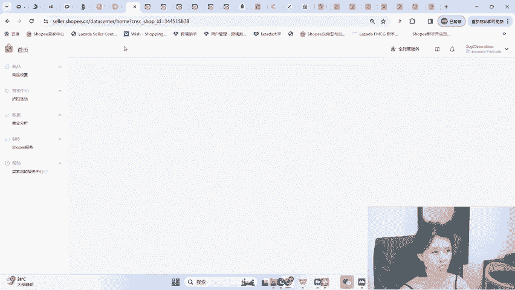

就是给到大家强调的这个事情是什么？就是我们讲的，你如果说不把自己的时间当前，你真的会。徒劳无功。

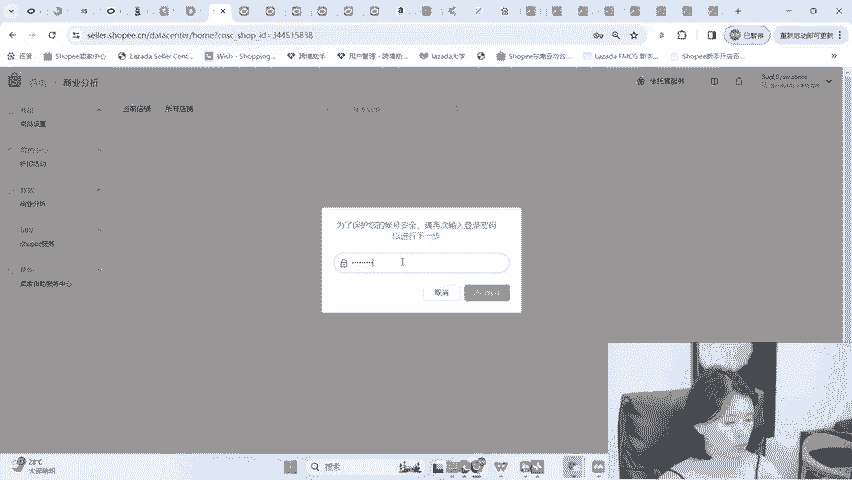

现在是什么？昨天是423单，今天已经是450了，还没有结束，今天还没结束呢。看到没有？就你每你每一个促销你都在浪费。因为我们知道说电商没有多久的时间，如果你今天想要把电商做好，你想要把电商做起来。

你是不是要在大促的时间节点去做，比较容易有结果呀？啊，大促是不等人的朋友们。而且我们讲句不好听的，你在这个什么呢？9月25号现在开始决定说做电商。然后我们讲的说马上是不是有一个国庆节。

你在这个周期里面去把电商什么呢？在国庆节去把它验证，我到底能做还是不能做。就像hellen给你们讲的这个规划方案，能出单还是不能出单，选品上下这些搞不搞得明白，搞得明白，咱们什么呢？明年开年了回来。

我是不是什么呢？决定说我是把老板炒了，还是说。我要乖乖的回去上班，因为我好像不太适合创业，我拿下半年的大促我都做不起来，要不然我不做了吧。是不是还是要做好最坏的打算的。但是我们都知道。

你一定是在这个最大的流量点，最大的机会点去做这个生意，他才成功的概率才高。你如果等到说上半年才来做电商，上半年才开始来搞钱，我就跟你家搞不到。因为整个市场不好的时候，经济大萧条的时候。

大家都不消费的时候，你自己在上半年你也不花钱吧。你自己双十一，你也要买个几千块钱的东西吧。那说我们讲的说为什么现在要做电商，就是因为大促不等呢？而且我们同时还知道是我们做的是什么呢？具备到国家红利啊。

外贸政策啊，不对，一带一路政策啊，有着外贸减量，跨境电商来什么呢？来做这个外贸订单，赚外汇拯救项目的这么一个红利机会。你如果不再做这个事情，或者说不去验证一下，你觉得亏不亏？那肯定是亏的呀，对吧？

大促不等人，尽量说是在今年大促就把这个问题解决掉，是吧？所以说对应到我们讲到的在我们的。寻海跨境，如果你担心说出现到盲目乱冲，没有正确的方向啊，没有方法，相关的行业资源匮乏，不知道怎么盈利的宝宝们啊。

你实在是没有办法坚持了。我真心建议你什么呢？找有结果的人深度学习。啊，你如果说已经看抖音的直播，看了很久，你现在就想说什么呢？冲的话呢？刚好趁着这个大促的时间点，趁着下半年的这个旺季的时间点来冲。

比较容易能够成功。如果实在是什么呢？想要免费学习的朋友们，咱们也会有个免费的相关资料，你们下播了以后干嘛呢？可以找hellen领一下，这个地方也提醒一下大家，hellen不会存在什么呢？不交付的情况。

因为我自己全网粉丝20万，我还是比较爱洗我的羽毛的，是不是啊，其次是什么呢？

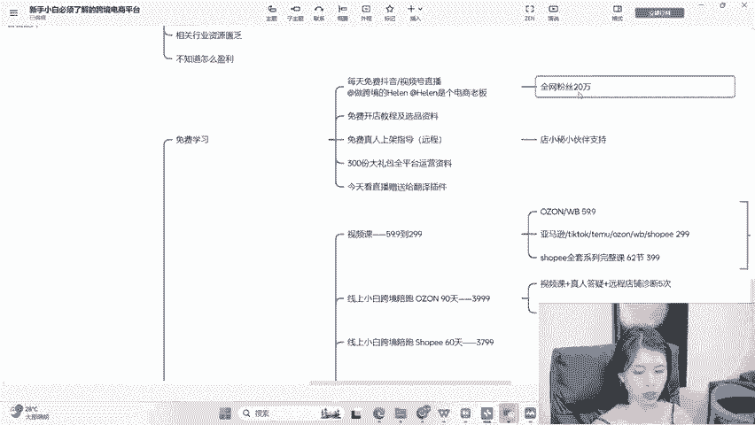