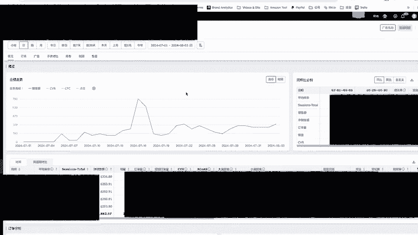
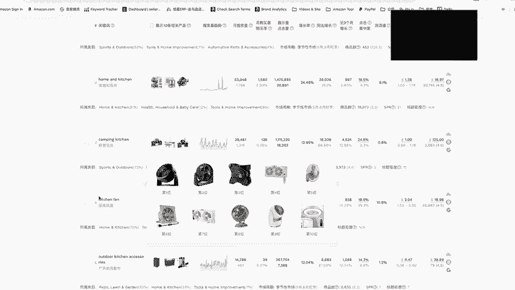
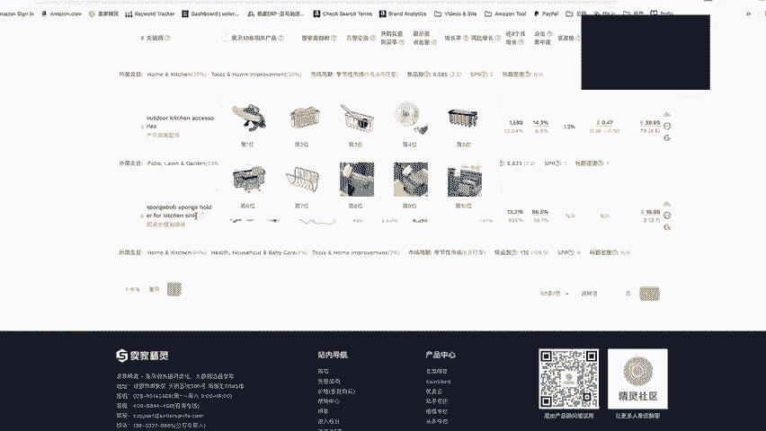
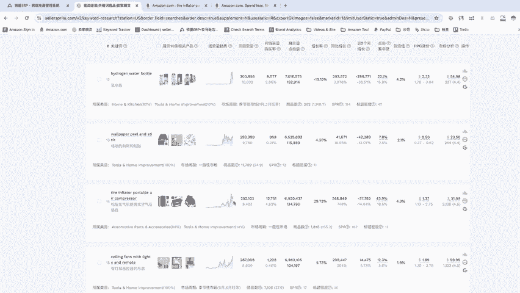
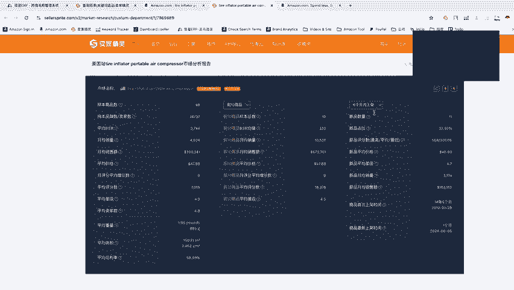
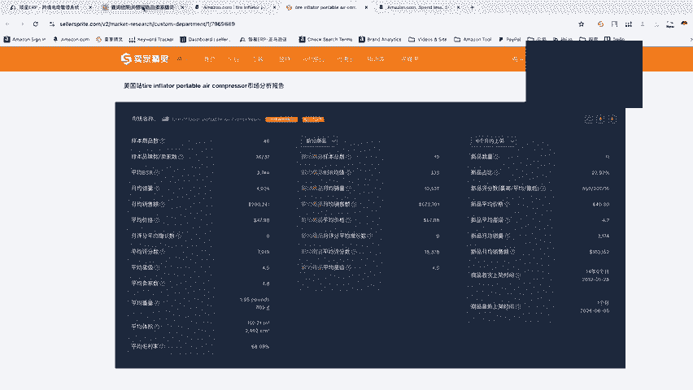
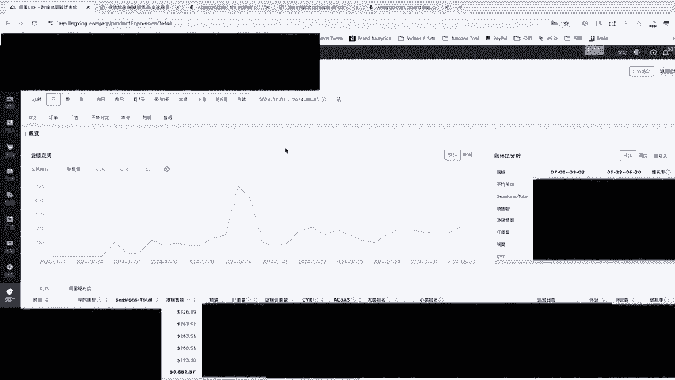

# 如何成为百万卖家 - P1 - 亚马逊运营的日常 - BV1bNtXetE22

hello，大家好，今天来跟大家分享一下我。我这든在做些什么？那我也很久没更新了嘛，那反正前一阵子多了一些新的客人，我们自己也在做一些职物上面的测试嘛。所以我前一阵子都是在全品到工厂发货推广新品嘛。

那今天来跟大家分享一个这个新的产品。我们是在7月7月初的时候上架的。这不是一个不是一个爆款，什么的，但是它算是一个还算稳定小众市场啊。

每天就是两三百美金这样子赚那一个月一个月我估计大概也可以有1万1万美金的销售额，反正利润大概是15到28了，所以一个月也就大概2000美金，2000美金的净力，哎，不算什么爆款也不是什么大卖家。

但是反正就对吧稳定稳定销售这样子。所以我我比较喜欢这种啊。不然如果你去卖那些什么大爆款，可会变成给供给的，所以反正我就找这种比较低调的一些产品。那我需要资资金也不用像那个爆款那么多。

那先跟大家分享一下这个东西怎么来的。

基本上也是使用卖家精灵里面有一个我非常喜欢的工具，是这个关键词选品。那相较于这关键词选品对比几个其他大竞品啊，选产品不选市场。我最喜欢这个的原因是因为其实每一个关键词它代表的都是一个小的细分市场。

小的细分市场。那我透过者就可以找到有没有一些潜在的更新的一些细分市场嘛。那如果你你你用这个大竞品或选产品，这些你当然都可以找到个别很不错的商品。但是你还需要再进一步去研究它的这个市场。

但是你当你用关键词选品的时候，你就可以直接查到这个细分市场的。我用这个来。这便举个例吧，假是我卖的东西主要是在to and home improvement里面，我想要找一些有一定搜索量。

每个月有万1万以上的搜索量的这个产品，它月搜索量增长率是不可以不可以有在成长的，不是往后跌的。它的同比的增长率也是在成长的。全部都是在成长，我这边可以进一步做一个一个筛选嘛，也可以进一步做关键词筛选。

也可以不筛选。但如果我卖的是特定的东西，那我这边就可以在关键词的地方输入它的关键字，然后进一步做到筛选的动作。假设我卖的是一些厨房用品，我在这边就打入，比如说kitchen。好。

你可以看到我这每一个每一个关键词它代表都是一个。一个小众的市场嘛，譬如说这个是。防火的一个毯子，这个是一个露营用的一个，可以把你。你这个厨房可以随身带去露营使用啊，那简单说就是像这种啊架子嘛。

可以让你变成像像厨房一样，在录音的时候也可以像厨房一样的这样的一个功能。这代表是一个小的细分市场，或者是厨房的竞算。你可以看到这每一个都是一个小的细分市场。那你透过这关键词选品。

你就可以找到还不错还不错的这个细分市场。我像我刚刚我刚搜索条件太严格了，所以它跑出来就只有4个，重新做个筛选吧。譬如说我现在约搜索量一样是1万，但是这增长率我就不限制了，价格我不希望太低。

假设是20块好了，必须大于20块。

单词个数我希望它多一点，因为如果太少字数代表说它可能是一个很广泛的一个市场。所以我需要把它变得长尾一点。我想看一下长尾的关键词，这边我不限制，再是这个点击集中度的部分，点击集中度是什么意思呢？

就是你前三的这个产品，它占据了这个关键词多少比重啊。如果越越高，代表说可能被前三个a给垄断了。所以我不希望这集中度太高。假设它是最高不超过50。

就是前三个a加起来的点击按的50per不可以超过50per，代表说后面的卖家，后面的a也可以分到啊点击可以分到流量这样子好直进行一个筛选，那这边就可以看很快就可以看到一些不同的细分市场啊。

比如说户外的啊太阳能的人户星解较一个季节性的吧，先不看天花板的电扇，但是是有带带灯的这个电扇或是悬浮式的价值降噪的耳机，这边你就可以看到很多不同的细分市场。那好，你找到这个市场之后，下一步要做什么了。

这个产品，它的这个月搜索量啊，它你可以看到它的增长率嘛。比如说它是在成长的还是在下降的。好，还有这个货流值也可以参考一下货流值是你帮它引流所需要的这个成本，它怎么算。

它是用你的啊CBC建议的CBC呢去除。这个产品的。产品的中位数好吧，这种可以看个解释，就是关键词的引流成本，你这个成本越高，你要帮它带来流量的这个成本就越高。所以这也可以作为你选品的一个参考。

那比如说这看起来就是一个还不错。这趋势看起来是挺好的一个上的一个细分市场嘛，所以可以点进去再做进一步的分析。麦亚精灵这个工具呢是初步帮你筛选出预势好的有潜力的一个细分市场。

那最后呢你还要再进一步去分析它哪一个款式是卖的比较好，哪一个款式，哪一个种类卖的比较好。譬如说你到了这边，你你直接点开好吧，你加载了更多的产品，原本它这边只有出现第一页的吧。那你你加载更多。

它就把后面几页的商品也给给计算进来，你可以看到这个市场的总销售额是很可观的，一个月有呃10001200万嘛。好，那你这边可以把你可以把皮广告先给去去除掉，看到它的自然排名的这些产品。

右上角啊市场分析就就不深入了。你如果还不清楚的小伙伴可以去翻我前面的视频，那我这边先快速讲一下，你这边你在这边选完细分市场，找到一个有潜力趋势是持续向上的这个细分市场之后，你可以做进一步的分析。

你分析什么样的什么样的款式或什么样的型号。

什么样功能的或什么样外观的这个产品是比较好的。你做完筛选之后，你用这个市场分析，你可以再进一步看到他对它新品的表现怎么样，是不是新品友善。你一个新卖家没有什么评论，能不能够卖的好，你可以看这边。

那前十的这个表现呢，代表说你计分市场的一个天花板，可以参考一下这个数字啊，是不是符合你预期会不会太少，还是会不会太多什么之类的。你可以看一下它天花板，还有这个新品友善程度。

那你往下可以看到这个这个类目里面的趋势嘛，这个是搜索量的趋势，这个是销量的趋势啊再来这边你可以看到商品的集中度，代表说这个产品是不是被个别卖家或个别产品给垄断了？那大家可以看到不同价位。

不同价位这个产品，它占据的销量比例。你可以看到你的产品是不是能够落在这个里面，能不能够落在这个这个范围里面，是不是符合一个大众需求的一个一个售价，能不能够满足这大众的需求。

那如果说你特别贵，你超过这个，你就要看一下你自己确实是不是有地方是比别人更更优势的独特点。不要说你品质好啊，在电商上面你是很难反映出你品质比别人好。

别人一个10块钱的东西就可以把它的是图片做的上漂上看起来质感超级好。所以你别说你产品质量好，你也卖的比较贵。你一定要一些独特的地方，别人没办法取代的地方才卖的贵嘛。或者是说你像苹果一样。

你你光苹果两个字打出来，就代表就高大上，你就可以卖的贵。那那另当别论。但是如果你品牌的知名度没什么知名度。那你产品也没什么独特的地方，你就说你你质量好，你要卖的比别人贵，那那肯定是不行的。是吧。

所以你这边可以看一下竞品大概是什么价位卖的比较好。你能不能够落在那个地方这样子，那反正我们透过计分市场。这关键是选品呢是找到了这个产品，那它不是一个爆款。但是它算是很小众。

而且稳定有点低调的一个的一个一个产品。那反正天就大概两三百美金吧，一个月大概也也能够目前他还在推广阶段嘛，那反正之后推估应该是能够一个月是稳稳的可以1万块美金的。那你有一个产品，一个月是1万美金。

你只要有9个10个这样子的产品，你就是7位数的7位数美金的这家了吧，一年就是7位数美金的卖家，一个1万，你10个产10个这样的产品，一个月就10万嘛，10万你一年也120万美120万美金了。

好吧，所以这样子产品找10个。你就7位数卖家了。

