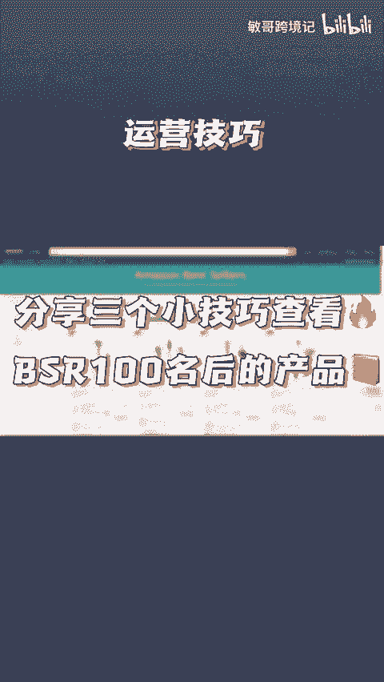
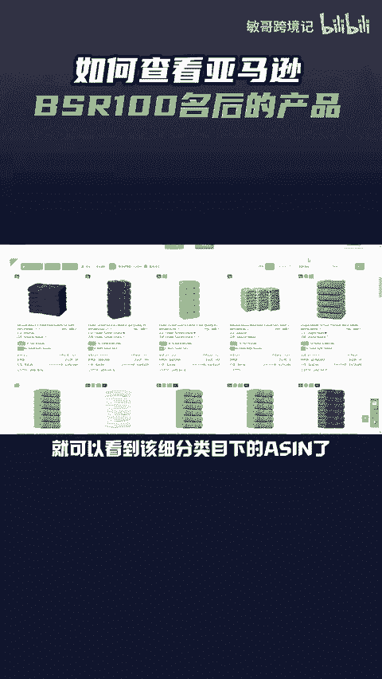
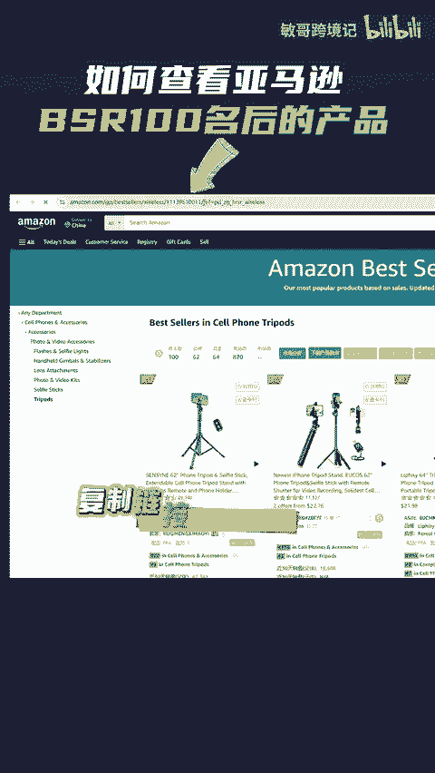
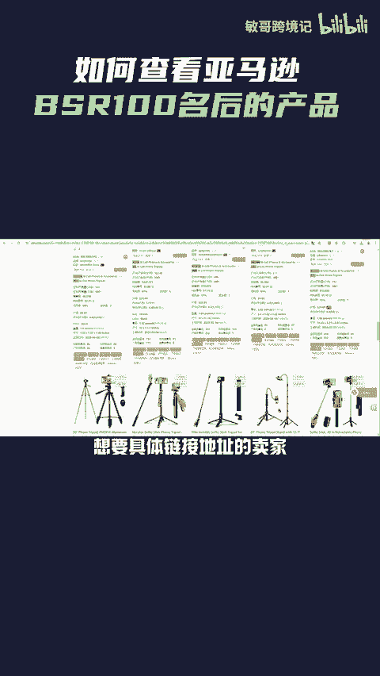

# 如何查看亚马逊BSR榜单100名之后的产品呢？分享三个方法 - P1 - 敏哥跨境记 - BV1AtsSeNEtk

🎼今天敏哥教你三个查BS2100名之后的产品的方法。第一个方法是借助卖家精灵，进入到想要查询的产品类目的BS2榜单页面，点击卖家精灵插件里的查看top400名产品，接着就跳转到该类目。

前400名的搜索页面，基本都是按照排名进行展示的。打开插件，卖家精灵就会抓取产品数据，点击加载更多，就可以看到更多的产品数据了，也可以将数据导出来，再按照小类排名的顺序进行排序，就可以了。第二个。

打开卖家精灵的选产品功能，选择产品的细分类目，点击搜索，选择BS2排名声序进行排列，就可以看到该细分类目下的4人了。

🎼第三个，进入产品细分类目之后，复制链接里的这串数字，接着粘贴到以下这串链接里，将这里替换成数字，再在一个新页面打开这个链接，点击这里按照b server排列，就能看到这个细分类目下的s了。

想要具体链接地址的卖家，点赞评论666给你安排。

