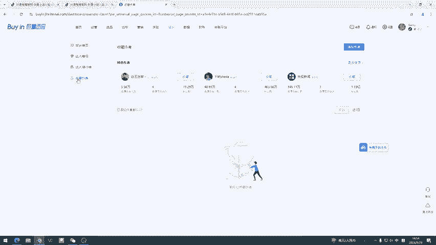
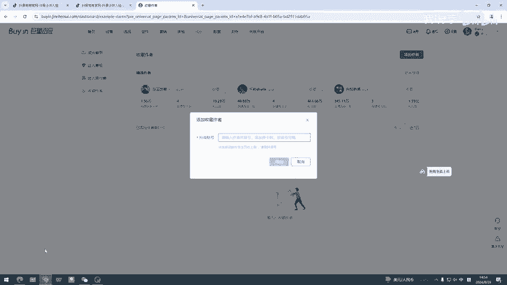
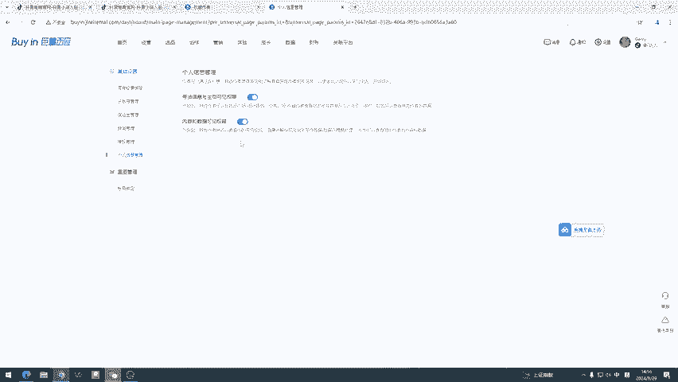

# 如何查看别人抖音号视频播放量 - P1 - 我i分享 - BV179HNeZEoo

怎么看别人账号视频的播放量，我给大家说一下方法啊。首先呢打开咱们的聚量白应，随便一个账号都可以，只要能登上就可以。一般是需要开通电商权限的。然后这儿有一个成长啊，咱们点开这个成长。

成长最下次的有一个收藏作者。

然后咱们添加作者。这呢输入抖音账号，我在那儿随便找个抖音账号啊，比如说巧悄好五的，大家一定要注意啊，不是抖音名儿，是抖音号，把这个抖音号复制下来。

然后咱回到质量反应，然后粘贴上去点击添加。添加完之后呢，咱们点开啊，点开完之后会看到它的数据。大家可以看一下，这可以看到播放量。但是在这儿看的话，它这个视频呢它是有限的，最多只是4页，每页的话只有5个。

也就是20个视频吧，这有点少啊。咱们看一下这个最上它有个视频详情，点开视频详情。视频详情的话，就可以看到近30天的视频详情往下翻，会看到它的播放量、点赞数、评论以及分享。30天的话，这个数据足够用了。

非常简单。有些朋友呢会遇到一个问题啊，就是在添加的时候会提示没有权限。我给大家说一下这个应该怎么去解决啊，咱们右上角呢有一个设置啊，比如咱聚量版右上角有一个设置，点开点开之后呢，这有个个人信息管理。

然后咱们可以看一下，总共有三个选项，对吧？咱们把下边两个选项给打开啊，大概意思是什么呢？也就是我们想看别人的数据，同时我们也需要把我们自己的数据公开供别人查询，也就是这个数据呢是相互的。

如果你想隐藏自己的数据呢，那别人呃隐藏自己的数据的，别人是看不到你的数据，同样也不允许你看别人的数据，这个数据是相互的，大概是个这个意思。所以说的话大家需要把这两个选项打开才可以。不过大部分的作者的话。

这个选项呢都是开的。如果真遇到呃咱们没有权限查看啊，并且咱们这个地方的开关已经开了。那可能是对方不允许呃查看他自己的数据。大概是这样的一个情况，不过大部分的账号都是可以看的。

