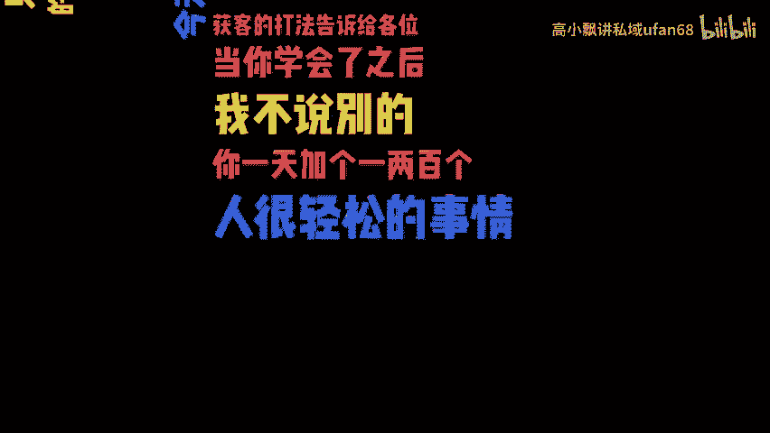
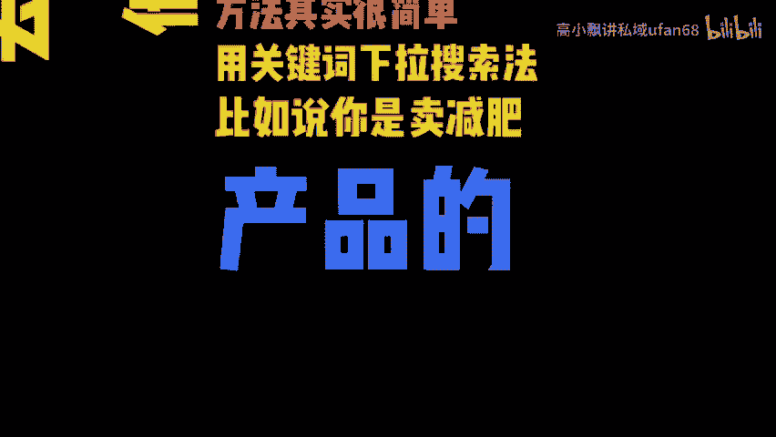
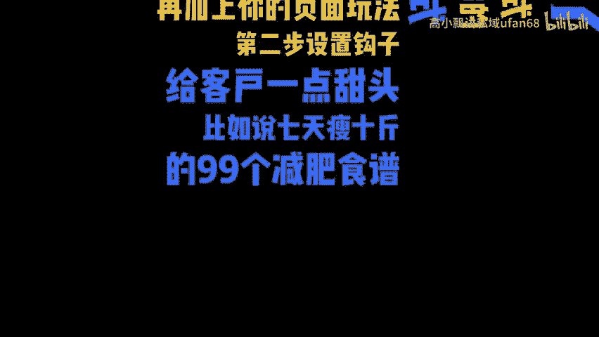

# 如何每日被动引流200加客户到微信？ - P1 - 高小飘讲私域ufan68 - BV1j1s7eYEGf

🎼如果每天让200个目标客户主动的去添加你，注意啊，是让客户主动添加你，而不是让你天天打电话发传单，舔狗式的去宣传，只有主动添加我们的，才算是你的精准用户成交率才会高。那么如何去做到呢？

今天我就把精准旅游获客的打法告诉我各位。当你学会了之后，我不说别的，你一天加一两百个人很轻松的事情。首先我们得思考一个问题，客户他为什么要主动去加你呢？那是因为你能解决他的问题，方法其实很简单。

用关键词下拉搜索法，比如说你是卖减肥产品的，你就去搜减肥这个词，然后鼠标别动，那你下拉出来的问题啊，就是想减肥的人一直在关心的问题。你把它整理出来啊，就是客户想要的话题有了，再加上一个公式。

你的服务加上你的内容呈现形式，再加上你的裂变玩法。第二步，是置钩子给客户一点甜头。比如说期间瘦1斤的99个减肥食谱，扫码进行免费领。接下来开始进行裂面，邀请两个朋友入群的送明星减肥操教程。

邀请10个朋友的，送减肥秤，邀请10个朋友的就。

🎼7天减肥训练营到店核销，到店后啊，再通过系统有效的引导话术去进行你的正价产品的一个转化。这样呢大家就会抢着去给你交钱。我们有个学员啊，就是用这套流程打下来，转化186个正价客户，收款28万多。

怎么做到呢？其实很简单，这个流程和话术啊，适合所有的行业卖什么都卖得出去。需要这套成交流程的分享给你。

