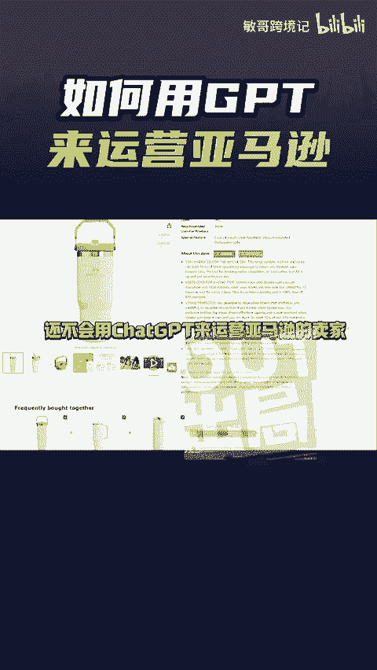
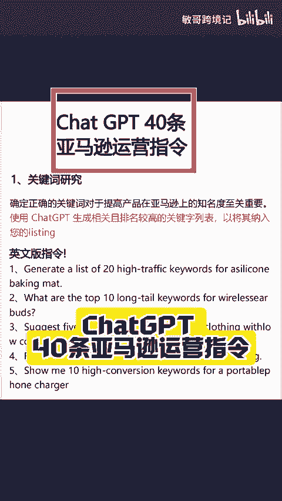
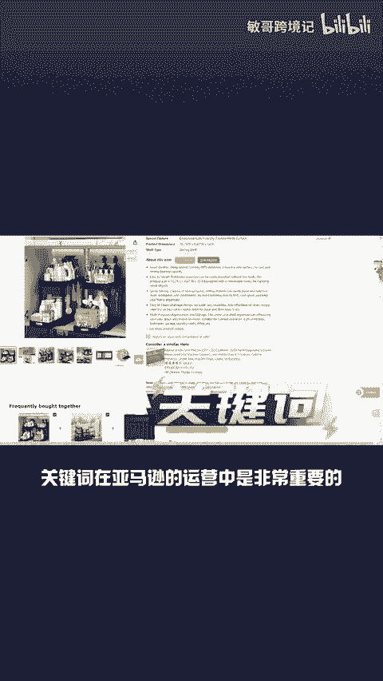
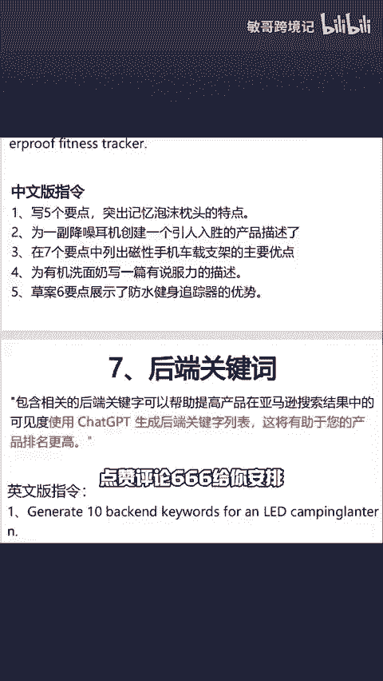

# 如何用GPT来运营亚马逊？分享40条运营指令 - P1 - 敏哥跨境记 - BV1gMm5YDEZh

🎼现阶段还不会用叉GPT来运营亚马逊的卖家，就out了。不然你的效率根本比不过其他的卖家。那亚马逊上的大卖是如何用叉GPT来运营的呢？今天敏哥分享一份叉GPT40条亚马逊运营指令，包含了关键词研究。

要知道，无论是listing的埋词还是打广告。关键词，在亚马逊的运营中是非常重要的。第二个就是竞争对手分析，能更快的帮卖家了解竞品的优势和劣势。第3个，利用GPT来满足客户需求和独特的产品功能。第4个。

识别当下市场中的流行趋势。第五个，优化产品listing需要完整版的卖家点赞评论666给你安排。

