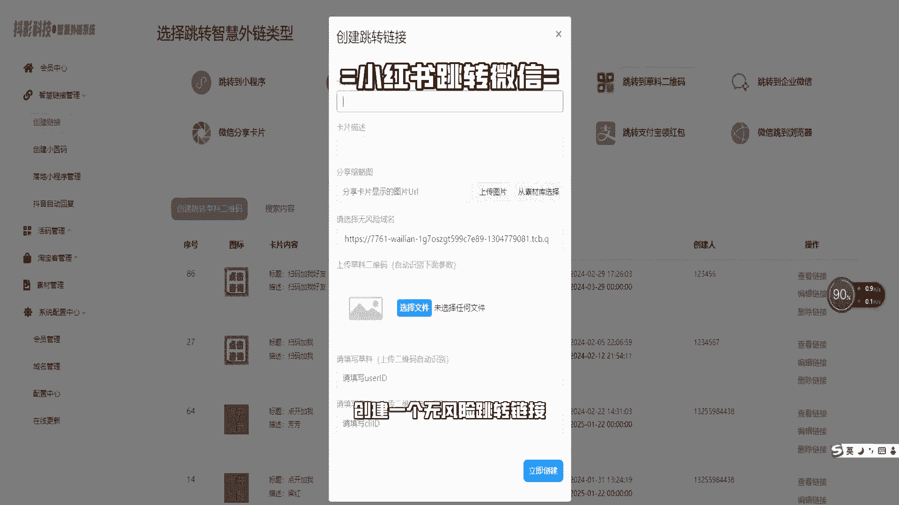
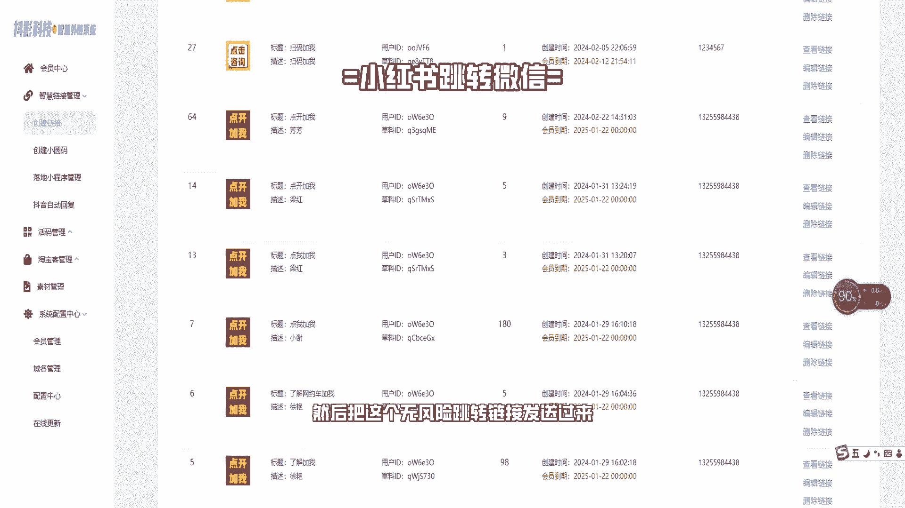
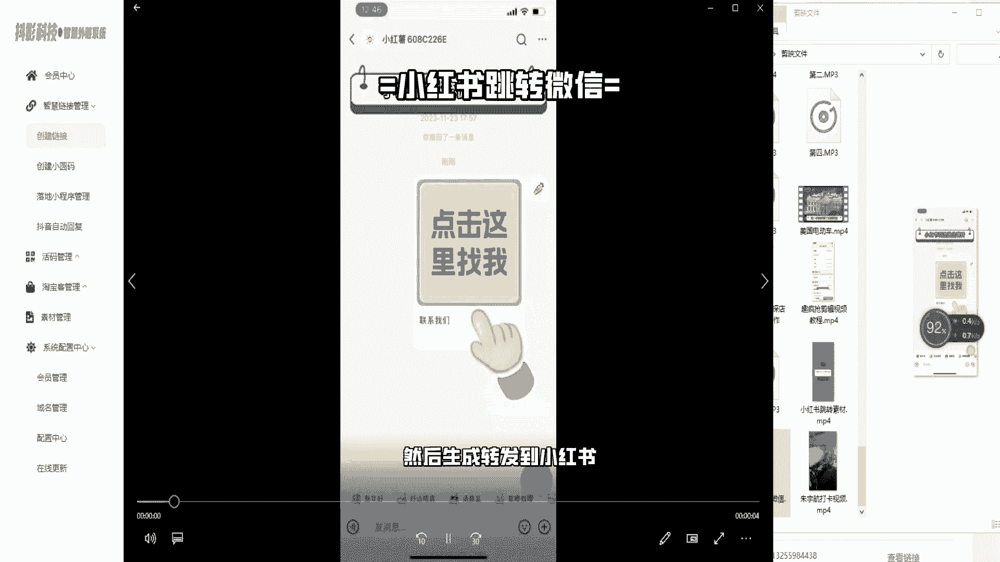
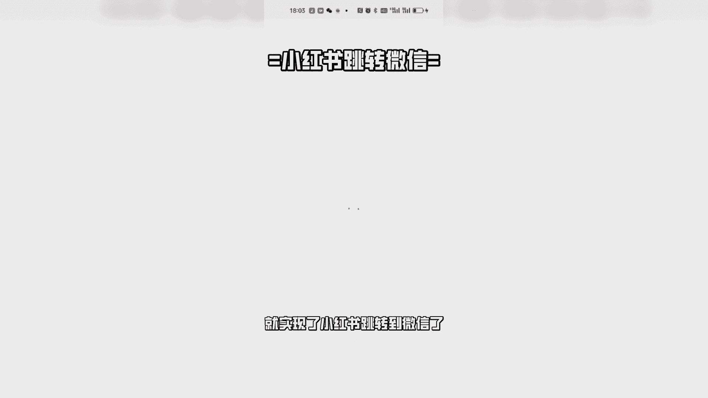
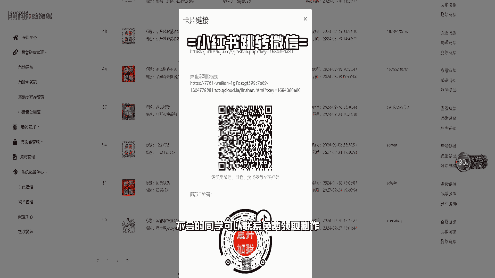

# 如何设置小红书抖音跳转微信卡片，小红书跳转微信教程，小红书私域运营到微信教程 - P1 - 铲子软件工作室 - BV1Ex4y1S7No

这种小红书跳转微信私域是如何实现的，今天我就给大家分享一下。

首先要在在这个平台注册一个账号，创建一个无风险跳转链接。

然后把这个无风险跳转链接发送过来。

准备一张图片和一个标题，然后生成转发到小红书。

就实现了小红书跳转到微信了。

是不是很简单呀。

