# 如何设置小红书抖音跳转微信卡片，小红书跳转微信教程，小红书私域运营到微信教程，小红书自动回复跳转卡片设置教程 - P1 - 铲子软件工作室 - BV1pj421975J

我们先看一下这个小红书的这个效果展示，当有人的话，当有客户的话，给我们发发信息到小屋书小红书上以后，我们的话会自动的话回复一个笔记，客户点击这个笔记的话，会自动显示出来到我们的微信二维码。

这样的话会达到一个自动引流的一个目的，那么这种的话嗯自动回复，自动回复，微信二维码的这种引流方式是怎么实现的，今天的话我给大家录一个教程。

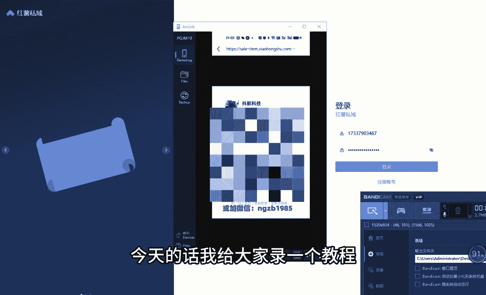

首先要登录我们的红书词语网站，登录自己的账号和密码，这个账号和密码的话，可以找我们的代理直接进行购买。

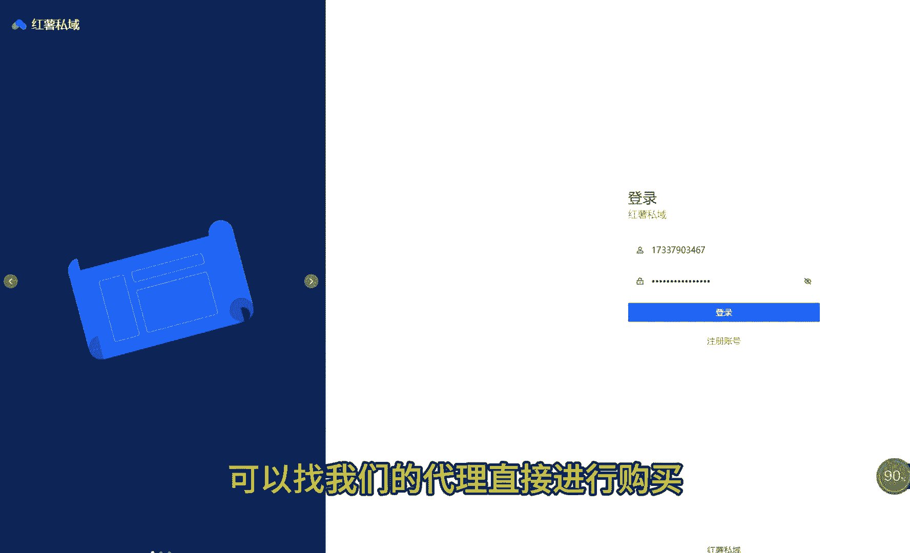

我们登录到后台以后，可以看见左边的话有一个账号管理，点击账号管理，点击账号列表，在这里的话，我们可以把自己的小红书账号绑定到后台，从而实现一个自动回复卡片的一个目的。

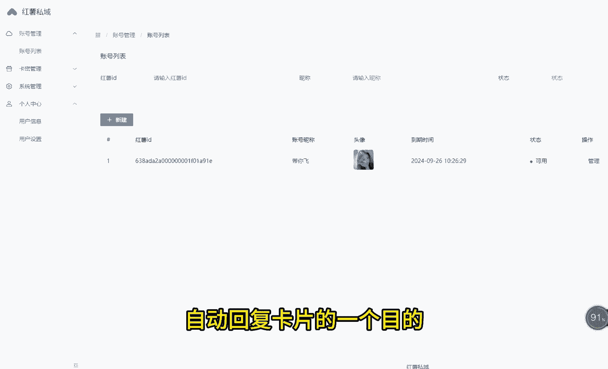

我们点击添加小红书账号，这个账号的话是需要小红书专业号的邮箱号。

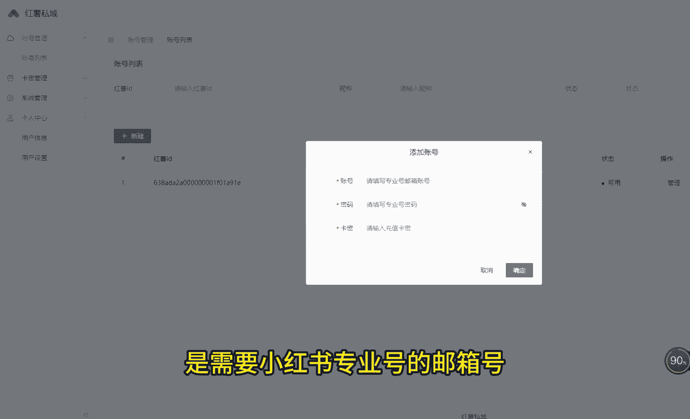

进行登录，这个邮箱号怎么来的，这个这个邮箱号的话，其实是我们在小红书的专业号后台去创建的，我们只需要登录自己的小红书专业号后台，在这个专业号的后台的话，点账号管理，点运营账号，在这里点击新建子账号。

账号的名字的话，随便填一个就可以了，绑定方式，我们一定要选择邮箱绑定这个邮箱的话，任何平台的邮箱都可以使用QQ邮箱就可以了，我们点击发送验证码，这时候验证码已经发到了我们QQ邮箱里面。

我们打开自己的QQ邮箱，我们在QQ邮箱里可以发现有一有两份邮件，第一封邮件的话是这个邮箱验证码，我们把这个验证码复制到，我们刚才创建的验证码的输入窗口，我们把验证码输入到邮箱验证码里面，直接点递交。

创建成功以后的话，我们会收到第二份的邮件，我们点开收件箱，第二封邮件的话会提示我们，让我们给这个小红书专业号的子账号，设置一下它的密码，我们点击设置密码在这里吧，把这个密码的话给他设置一下就可以了。

我们设置好密码以后，再点开我们的小红书。

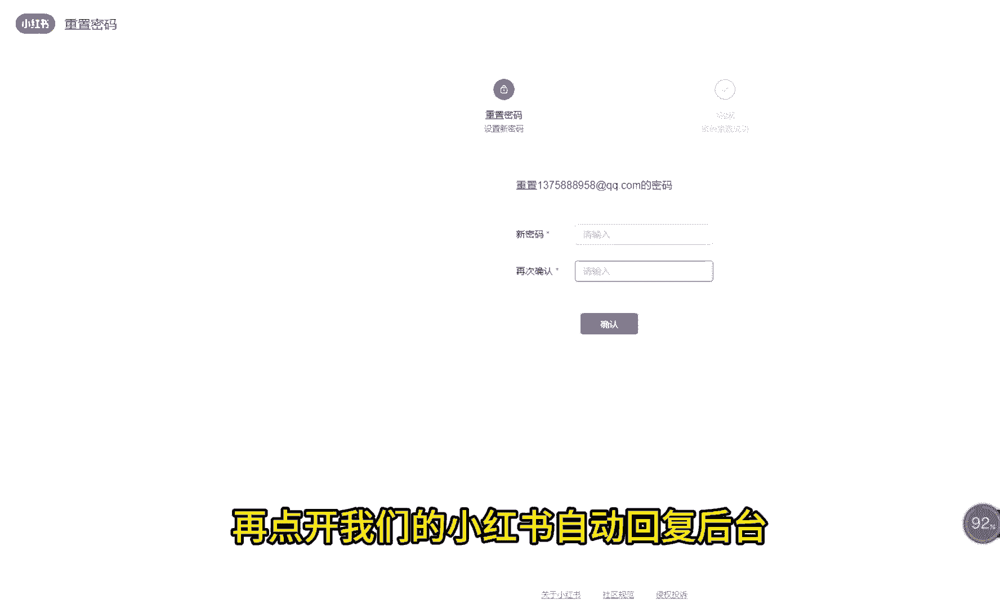

自动回复后台保定账号，我们把刚才创建的邮箱账号密码输进去，还要从你们，还要从那个你的上级购买的这个卡密，输入卡密以后直接点确定。

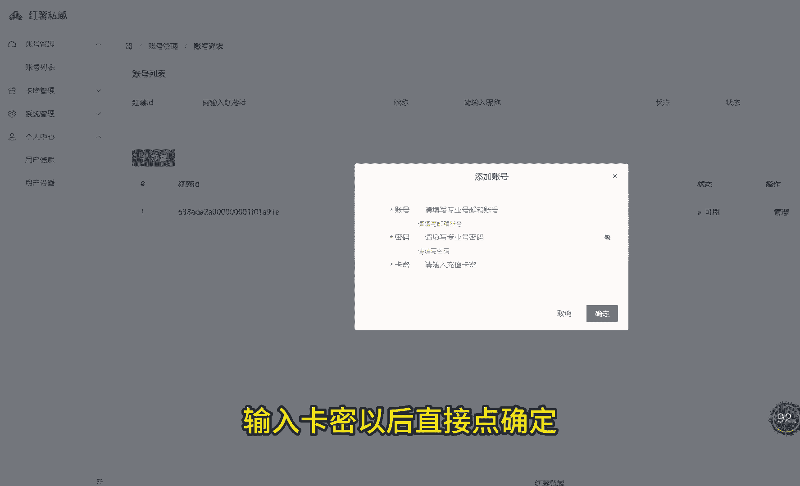

那么我们的账号就绑定到后台了，绑定到后台以后的话。

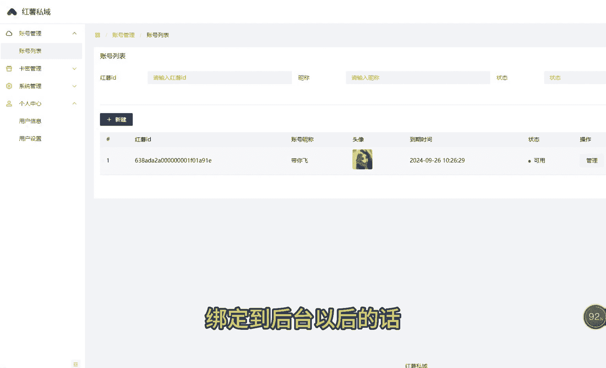

我们现在开始设置自动回复的内容，点击管理，我们看到这地方需要一个笔记的id，这个笔记的id怎么来，其实的话我们只需要的话。

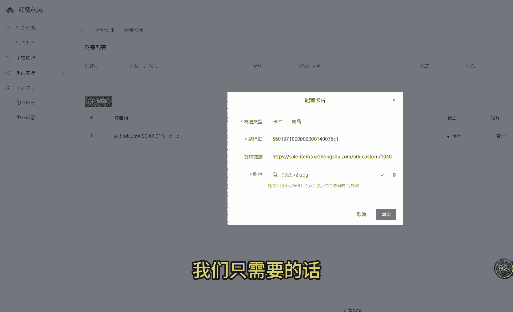

带自己的小红书后台创建一个笔记就行了，因为这个比例的封面设计非常重要，直接影响了你的转化率，我们创建完这个卡片以后，复制这个复制这个笔记的链接，这个笔记的链接里面就有，我们的话这个笔记的id。

我们把这个笔记的id的话填写。

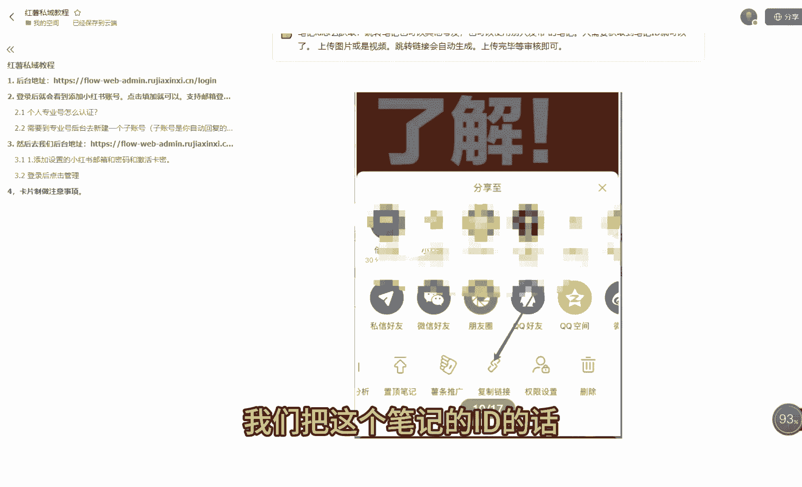

进入我们这个后台，这个跳转链接的话可以不用填，这个会自动进行生成，我们只需要把自己的微信二维码。

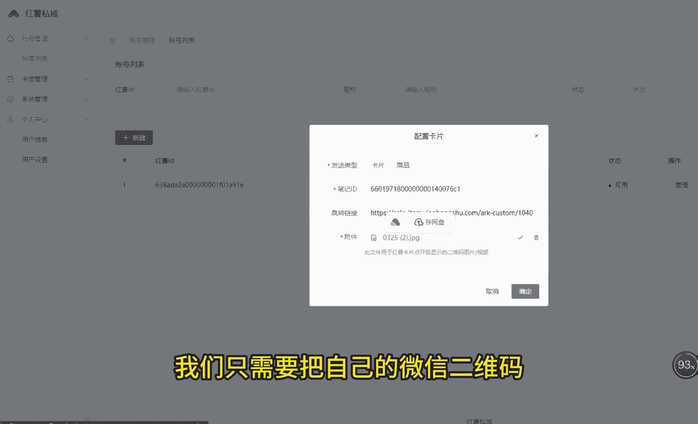

上传到后台节点，确定就可以了，我们就可以实现的话，抖音小红书自动回复微信二维码引流的目的了，这个就是整个小红书自动回复设置的教程，大家有什么不懂的话。

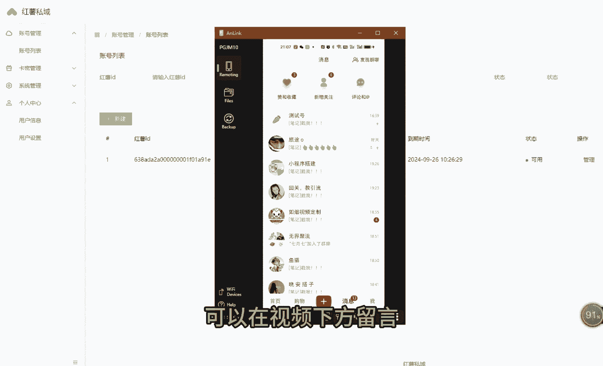